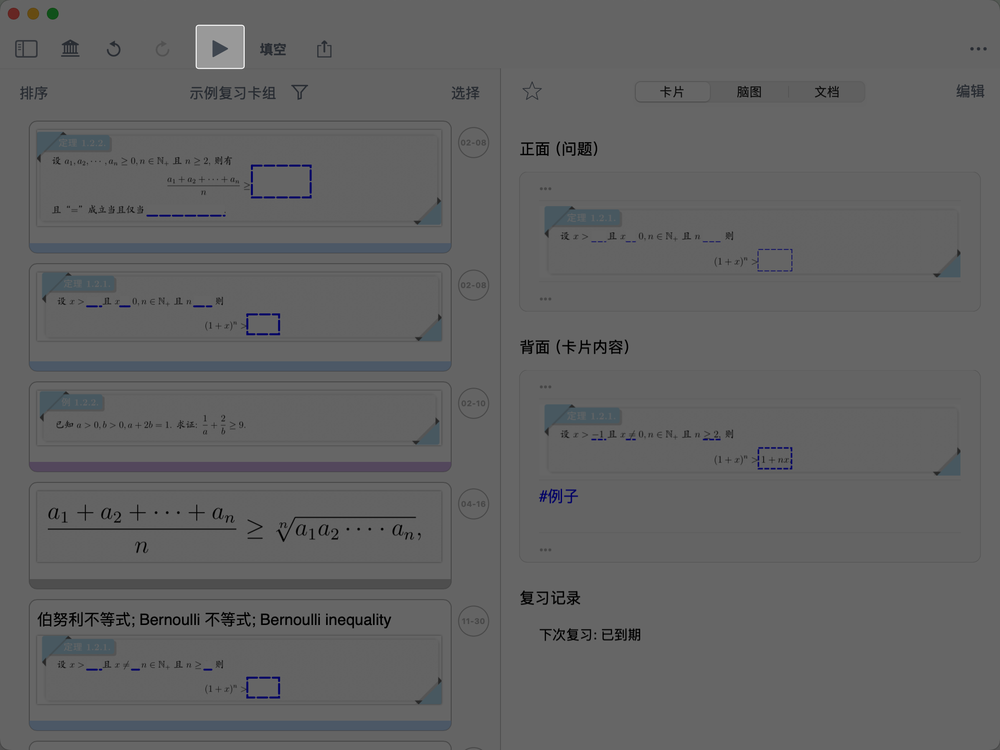
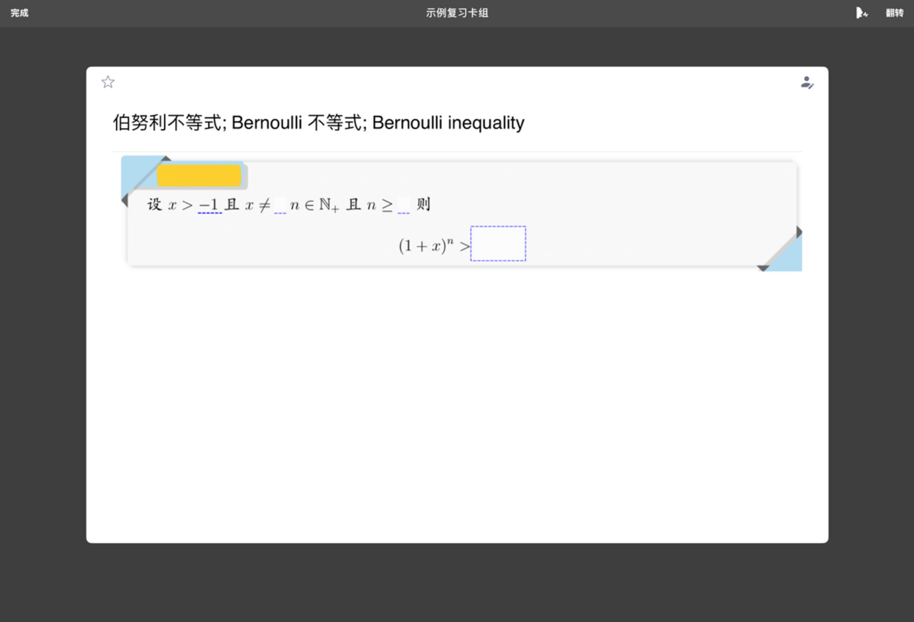
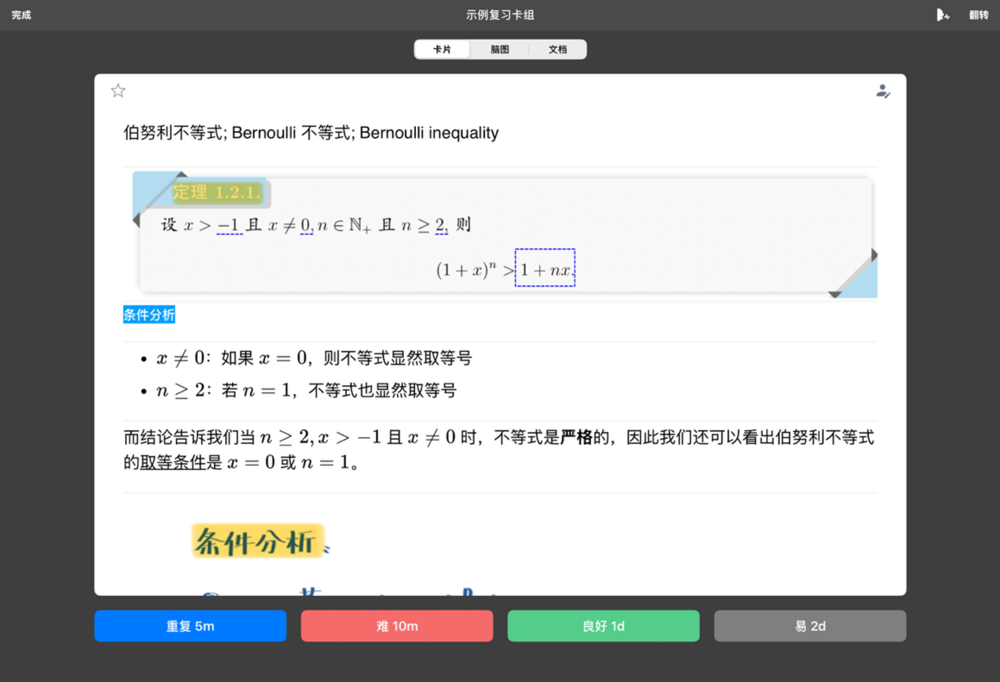
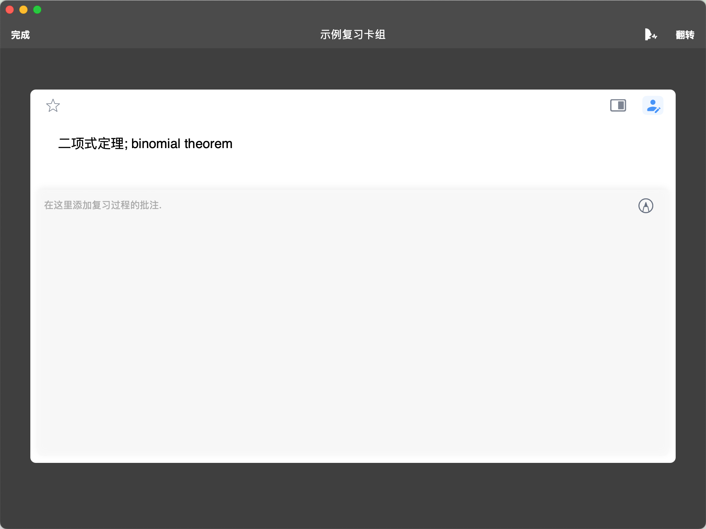
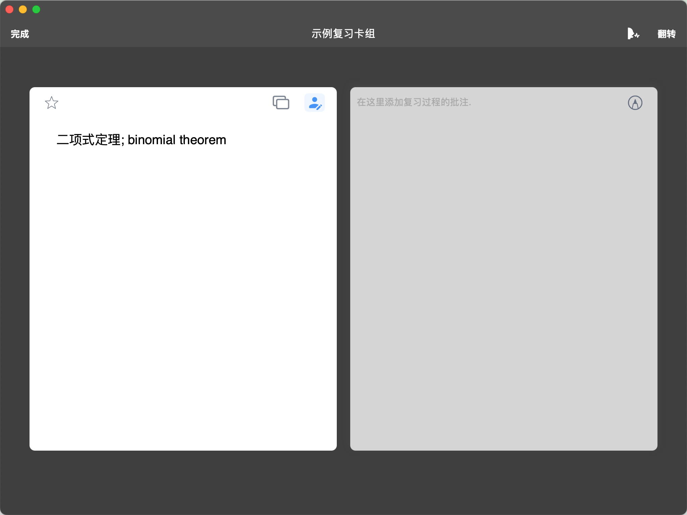
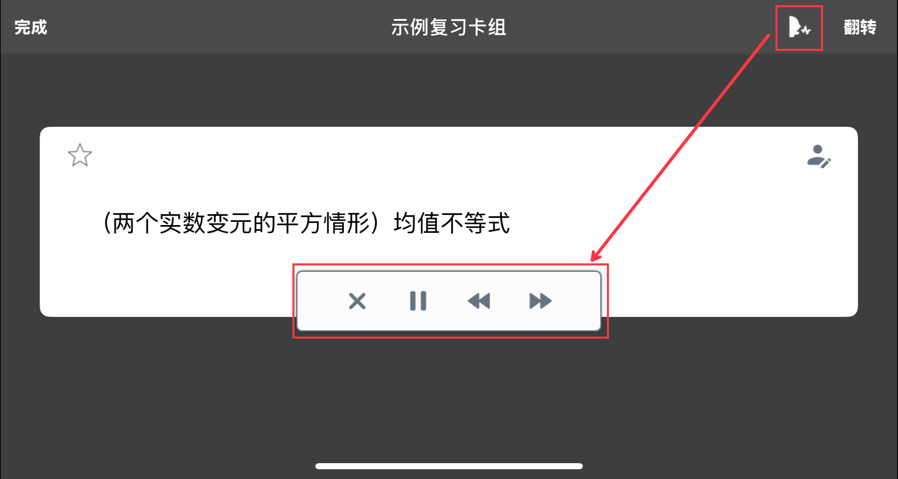
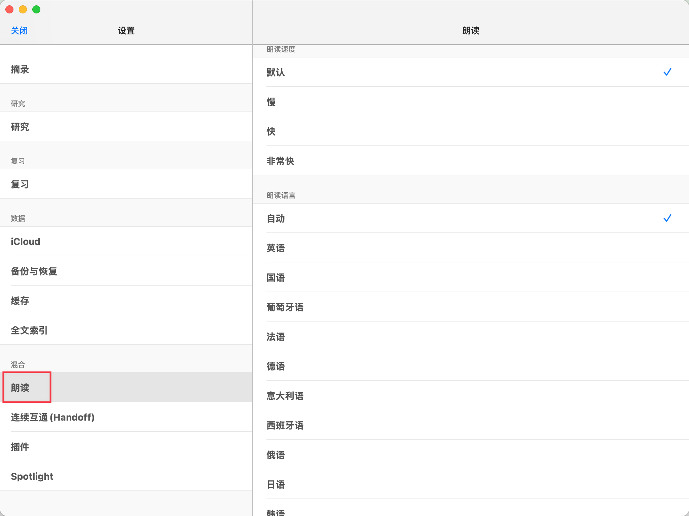
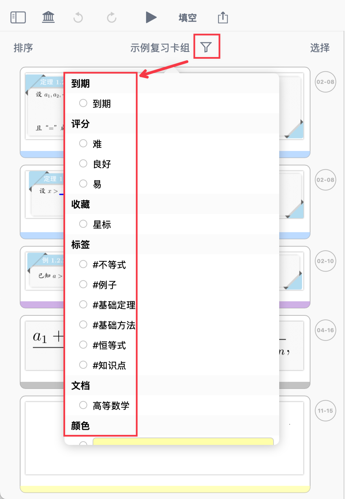
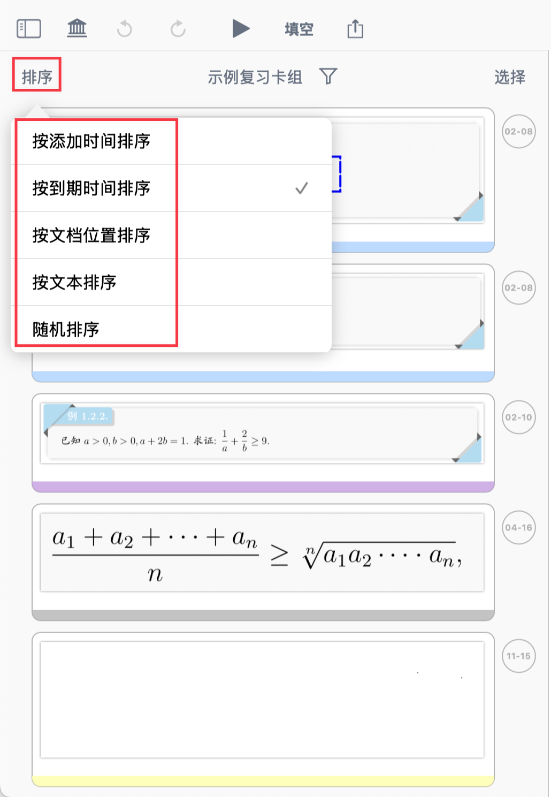
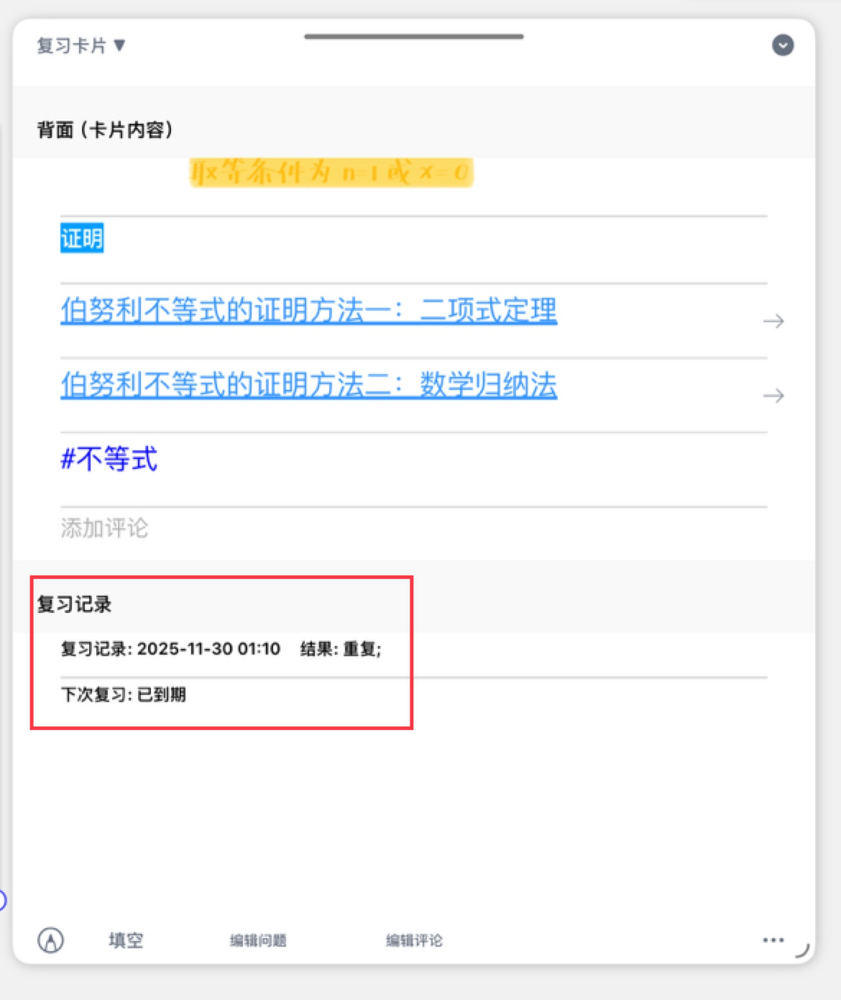

# 闪卡复习①：基于FSRS抗遗忘算法的科学复习

> 💡📖 **闪卡系列导航**
> 本系列帮助你掌握 MN4 的闪卡制作和科学复习。
>
> - 制作闪卡：
>   - 新手必读：
>     ① 认识闪卡和复习卡片组
>     ② 添加卡片到复习卡组
>   - 进阶：
>     ③ 设置闪卡正反面
> - 科学复习：
>   - 新手必读：
>     ① 基于FSRS抗遗忘算法的科学复习（本页）
>   - 进阶：
>     ② 溯源上下文

> 💡**本页内容**
>
> 你已经制作了闪卡，现在开始科学复习。本页将教你：
>
> - 如何使用全屏复习模式
> - 如何根据记忆情况选择复习间隔
> - 如何筛选和排序需要复习的卡片

⚠️**前置条件：** 需要先阅读闪卡制作系列①②篇，并已经有卡片添加到复习卡组

# 1 FSRS 算法与MarginNote4复习功能

## **什么是 FSRS 算法？**

FSRS（Free Spaced Repetition Scheduler）是一种科学的间隔复习算法，会根据你的记忆反馈自动计算下次复习时间，帮助你在遗忘前及时复习，提高记忆效率。MarginNote 4 采用这一算法，让你无需手动安排复习计划，系统会智能安排最佳复习时机。

## **MN4 的复习优势**

区别于 MN3 需要在学习模式和复习模式之间切换，MN4 实现了**文档、脑图、复习卡组的无缝流动**：你可以在复习时**随时查看卡片在脑图中的位置和文档中的上下文**，无需切换功能分区即可编辑笔记和复习卡片。

# 2 开始复习

## 2.1 进入全屏复习模式

在复习卡片组中点击视图顶部▶，进入 Anki式的全屏卡片复习模式。

## 2.2 快速复习流程（新手必读）

第一次复习？按以下步骤操作：

1. 看到卡片正面（问题），尝试回忆答案
2. 点击屏幕或点击`翻转`，查看卡片背面（答案）
3. 根据记忆程度选择：**重复、难、良好、易**
4. 自动跳转到下一张卡片

✅  重复以上步骤，完成所有到期卡片的复习

> 💡**第一次使用建议：**
>
> - 不确定时选择"难"或"良好"
> - 复习 10-20 张卡片后，你会逐渐熟悉节奏
> - 后续可以尝试筛选、排序、朗读等高级功能

# 3 复习操作详解

## 3.1 选择卡片记忆情况和下次复习时间

复习时，根据闪卡正面，自行回忆闪卡背面或被遮挡内容，翻转后可查看卡片原文，并根据记忆情况选择间隔复习时间。

**四个记忆程度选项：**

- `重复 5m`：5分钟后到达下次复习时间，适合几乎没有印象的闪卡
- `难 10m`：10分钟后到达下次复习时间，适合记忆程度不佳的闪卡
- `良好 1d`：1天后到达下次复习时间，适合记忆程度较好的闪卡
- `易 2d`：2天后到达下次复习时间，适合已经牢固记忆的闪卡

> 💡**FSRS 如何工作？**
>
> 系统会根据你的选择，自动计算最佳复习时间。选择"难"的次数越多，间隔会缩短；选择"易"的次数越多，间隔会延长。这样既不会过度复习浪费时间，也不会遗忘后才复习。
>
> ⚠️ 建议： 诚实反馈你的记忆程度，不要为了减少复习次数而选择"易"，这会降低记忆效果。

**开启复习提醒：**

若开启了`复习提醒`，则到达下次复习时间时会通过App消息弹窗提醒您复习（[查看如何开启复习提醒](https://www.wolai.com/auMvW4AbuCoxDmYipisYoS#rWBoe4whD7Utfe5XA7F3w9 "查看如何开启复习提醒")）

## 3.2 收藏（添加星标）

点击卡片左上角★标志，可收藏卡片。后续复习时，可筛选收藏卡片进行专项复习。

> 💡**使用场景：**
>
> - 标记重点卡片，考前集中复习
> - 标记难记的卡片，反复强化
> - 标记易错卡片，重点关注

## 3.3 批注

[批注](https://www.wolai.com/7vxicFnQFuWnSrPVJD64ZQ "批注")

点击卡片右上角批注按钮（如上方图标所示），可进行批注，常用于默写古诗文/单词、总结助记口诀、回忆梳理关键要点、推导计算过程等辅助复习场景。

**批注功能：**

- 提供2种批注模式：[🖼️ 图片](image/image_tXUcO1g2Ei.png "🖼️ 图片")、[🖼️ 图片](image/image_AC1UEzaWpJ.png "🖼️ 图片")；
- 可选择手写或打字进行批注。
- 批注不会保存在卡片里，仅在复习批注模式中可见。

> 💡**为什么批注不保存在卡片中？**
>
> 批注是你在复习过程中的临时思考和演算，不会污染原卡片内容。每次复习时，你可以重新进行批注，检验自己是否真正掌握。

## 3.4 朗读

[朗读](https://www.wolai.com/m9otTYiGuLUW3YkwewfuWM "朗读")

点击右上角`朗读`（如上方图标所示），进入朗读复习模式，屏幕底部将显示朗读控制条。

**朗读功能：**

- 系统将自动朗读卡片正面的文字及图片 OCR 文字层；
- 正面朗读结束后，将自动翻转到背面并继续朗读背面；
- 点击\*\*⏪、⏩\*\*，可切换到上一张、下一张卡片并自动朗读。

> 💡**结合朗读复习的优势**
>
> 根据记忆理论，多感官刺激能显著提高记忆效果：
>
> - **听觉+视觉双通道记忆**：比单纯阅读的记忆效果提升 30-50%
> - **解放双手**：适合通勤、运动等场景的碎片化复习
> - **强化语言学习**：对外语单词、古诗文等内容尤其有效
> - **避免视觉疲劳**：长时间复习时，听觉刺激可以缓解眼部疲劳
>
> 💡**使用建议：** 第一遍复习建议视觉为主，第二轮巩固复习时可以使用朗读模式，在通勤路上或睡前进行听觉复习。

**修改朗读设置：**

MarginNote4支持朗读文本，并可调整朗读速度及语言。

- `朗读速度`：可选默认、慢、快、非常快
- `朗读语言`：支持自动、英语、国语、葡萄牙语、法语、德语、意大利语、西班牙语、俄语、日语、韩语

## 3.5 翻转

点击右上角`翻转`，可将当前卡片界面进行1次强制翻转。

> 💡**翻转按钮的作用**
>
> 虽然点击屏幕也可以翻转卡片，但翻转按钮在以下场景中更方便：
>
> - **朗读模式中**：在自动朗读时，点击屏幕可能触发其他操作，使用翻转按钮更精确
> - **批注模式中**：在批注时，点击屏幕可能被识别为批注操作，使用翻转按钮避免误操作

## 3.6 切换到上一张/下一张卡片

**操作方式：**

- 用手指左滑右滑
- 若开启朗读模式，[可在朗读控制条上切换](https://www.wolai.com/31KwWufHLt8MUbyxQahbP3#tvogc8aXsM7S9uKZiW7Y9N "可在朗读控制条上切换")

# 4 个性化复习需求

复习模式中，你可以决定哪些卡片复习、以及复习的先后顺序。

> 💡**个性化复习的优势**
>
> - **针对性复习**：集中攻克薄弱环节，比平均分配时间的效率高 2-3 倍
> - **灵活调整顺序**：按教材顺序复习有助于建立知识体系，随机顺序复习有助于避免位置记忆
> - **分类管理**：按标签、颜色、文档分类复习，符合人脑的分类记忆特性
> - **减少认知负荷**：每次只复习特定类型的卡片，降低认知切换成本

## 4.1 筛选部分卡片进行复习

点击复习视图顶部漏斗图标，可按卡片到期与否、记忆程度评分、是否收藏、所含标签、源文档、颜色等筛选部分卡片，进行更针对性的专项复习。

**筛选选项：**

- `到期`：筛选已到期的卡片
- `评分`：按评分“难、中、易”筛选
- `收藏`：筛选已收藏的卡片
- `标签`：筛选含有某些标签的卡片
- `文档`：筛选来自特定源文档的卡片
- `颜色`：筛选特定颜色的卡片

**多条件组合筛选**：

多种筛选条件可同时选择，取交集。例如：

- 筛选"已到期 + 标签为 #重点 + 评分为难"→ 找出最需要复习的重点难点
- 筛选"文档为《高等数学》+ 颜色为红色"→ 复习高数中标记为红色的卡片
- 筛选"收藏 + 到期"→ 优先复习收藏的重要卡片

> 💡**常用筛选场景：**
>
> - **日常复习：** 仅筛选"到期"，只复习需要复习的卡片
> - **考前冲刺：** 筛选"到期 + 收藏"，重点复习收藏的重要卡片
> - **专项攻克：** 筛选"评分为难"，集中攻克难记的卡片
> - **分类复习：** 筛选特定标签（如 #公式 或 #易错点），按主题复习
> - **按章节复习：** 筛选特定文档或颜色，按教材章节系统复习
>
> ⚠️**新手建议：** 第一次使用时，只筛选"到期"即可，无需过度筛选。熟悉后再尝试组合筛选。

## 4.2 卡片重新排序

点击复习视图左上角`排序`，可按卡片添加时间、到期时间、文档位置、文本顺序或随机对卡片进行重排，以适应个性化复习需求。

**排序选项：**

- `按添加时间排序`：按卡片添加到复习卡片组的时间排序
- `按到期时间排序`：按卡片下次复习时间排序
- `按文档位置排序`：按卡片在源文档中的位置排序
- `按文本排序`：按卡片正面文本排序
- `随机排序`：随机排序

> 💡 **排序方式选择指南：**
>
> | 排序方式         | 适用场景         | 优点                     |
> | ------------ | ------------ | ---------------------- |
> | **按到期时间排序**​ | 日常复习         | 最快到期的优先复习，符合 FSRS 算法推荐 |
> | **按添加时间排序**​ | 集中添加卡片后的首次复习 | 先复习新卡片，趁热打铁巩固印象        |
> | **按文档位置排序**​ | 系统复习某本书或某个章节 | 按教材顺序复习，有助于建立知识体系      |
> | **按文本排序**​   | 按字母或拼音顺序复习   | 适合复习词汇表、术语表等           |
> | **随机排序**​    | 避免记忆顺序而非内容   | 打乱顺序，测试真实记忆效果          |
>
> ⚠️ 新手建议： 使用默认排序（按到期时间）即可，这是最符合记忆规律的排序方式。

# 5 查看复习记录

## 5.1 在卡片上查看复习记录

复习结束后，可在复习卡片中查看`复习记录`和`下次复习`时间。

点击任意闪卡，在卡片编辑器中可以看到：

- **复习记录：** 每次复习的时间和选择（重复/难/良好/易）
- **下次复习：** 预计的下次复习时间

_WpBzwzMDvd.gif> "动图演示：复习过程示例 动图演示：复习过程示例 ")

> 💡**复习记录的作用：**
>
> - 了解自己的复习频率和记忆曲线
> - 判断某张卡片是否需要调整内容或问题设置
> - 识别哪些卡片是你的薄弱环节，需要重点关注

# 6 常见问题

**Q1：一天要复习多少张卡片？**

A：FSRS 算法会自动安排。通常每天复习到期卡片即可，新手建议每天 10-30 张。随着卡片数量增加，每天到期的卡片会逐渐稳定在一个合理范围。

**Q2：错过了复习时间怎么办？**

A：没关系，FSRS 会自动调整。下次复习时，过期的卡片会优先显示，系统会根据你的实际表现重新计算间隔。

**Q3：可以跳过某张卡片吗？**

A：可以。左滑或右滑切换到下一张。但建议不要经常跳过，否则影响记忆效果。跳过的卡片仍会在到期时出现。

**Q4：复习中途可以退出吗？**

A：可以。你的选择会自动保存。下次进入时，会从未复习的卡片开始。

**Q5：如何暂停某张卡片的复习？**

A：从复习中移除该卡片（详见[闪卡制作③：设置闪卡正反面](https://www.notion.so/2c31f3d8ed1f8097a6c7e089c2053a96?pvs=21 "闪卡制作③：设置闪卡正反面")）。移除后不会删除卡片内容，只是取消复习安排。

**Q6：为什么有些卡片的复习间隔很短，有些很长？**

A：FSRS 算法会根据你的记忆反馈动态调整。选择"难"或"重复"的卡片间隔会缩短，选择"易"或"良好"的卡片间隔会延长。这是个性化的智能调整。

***

# 7 📌 下一步

恭喜你掌握了闪卡的科学复习方法！

现在你可以：

- ✅ 使用全屏复习模式高效复习
- ✅ 根据记忆情况选择复习间隔
- ✅ 筛选和排序需要复习的卡片
- ✅ 使用批注、朗读等辅助功能

**接下来，你可以：**

如果你想在复习时查看卡片的上下文，帮助理解和记忆：

→**进阶学习：**[闪卡复习②：溯源上下文](https://www.wolai.com/ozYBXbvi3AkqiBShA7X7Co "闪卡复习②：溯源上下文")
