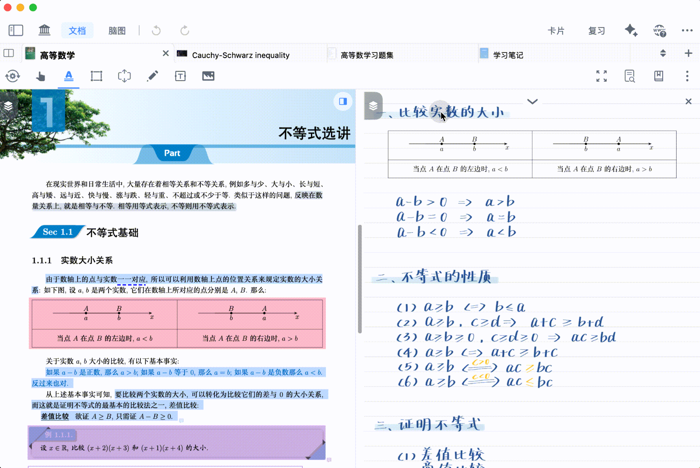
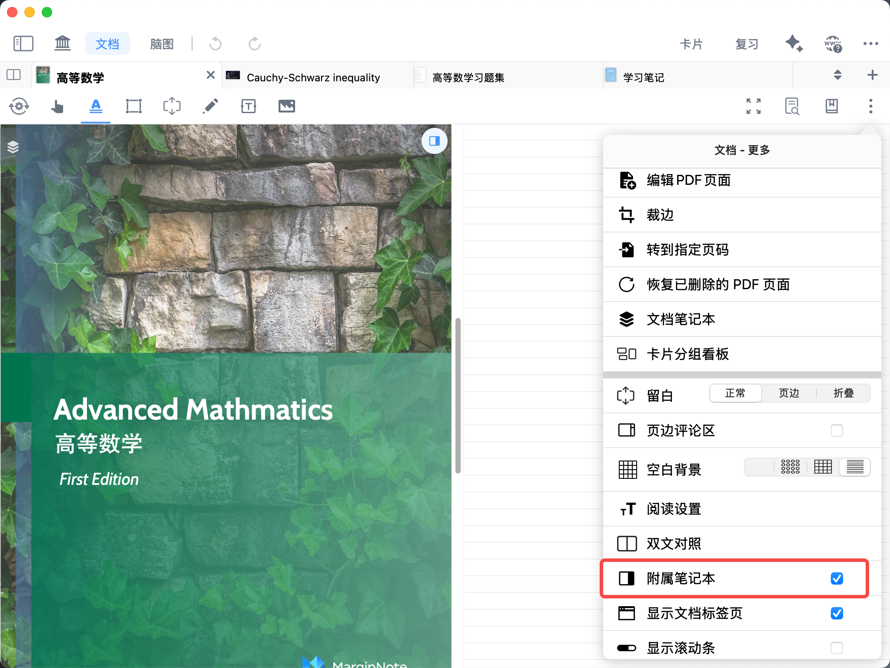
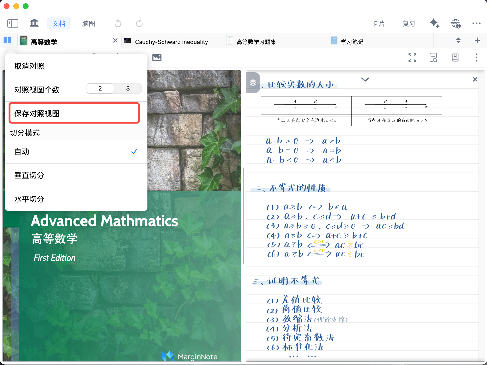
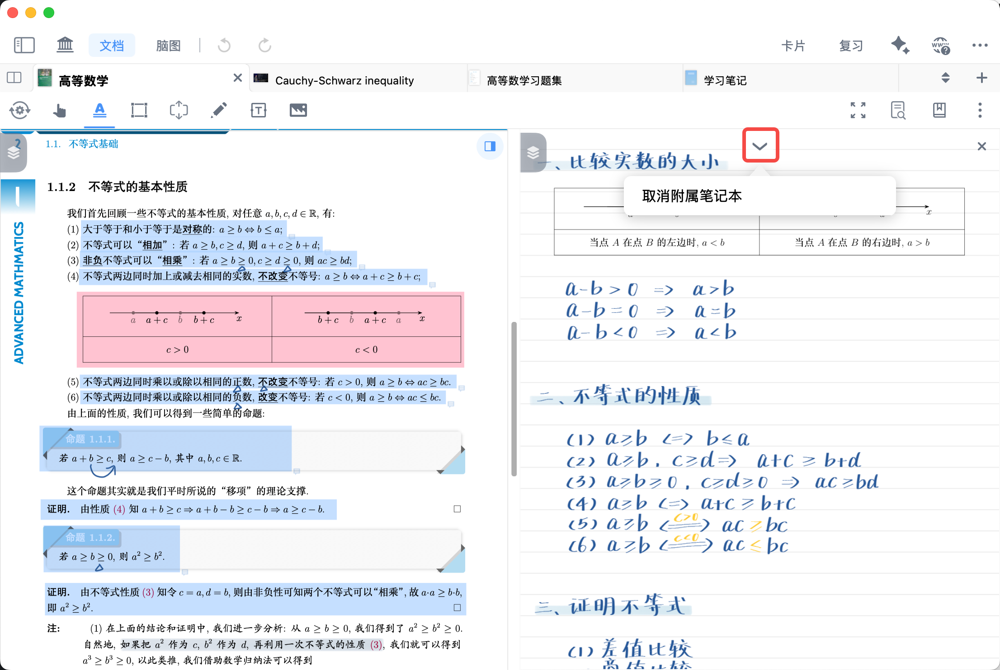
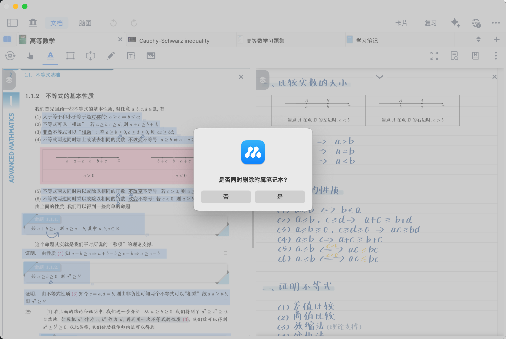
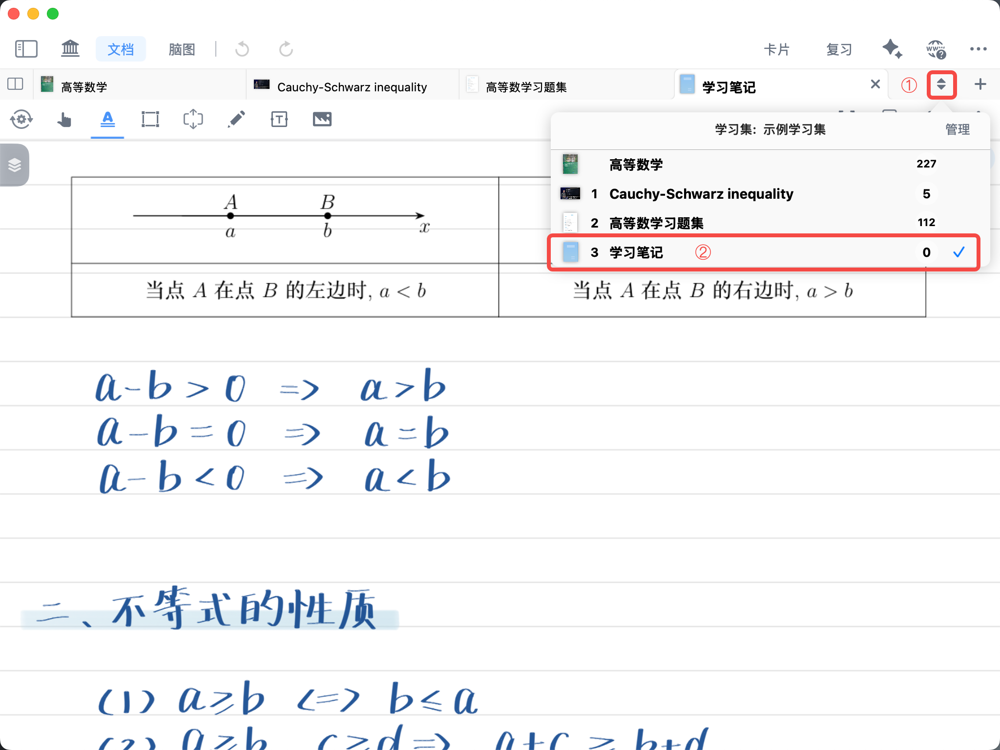
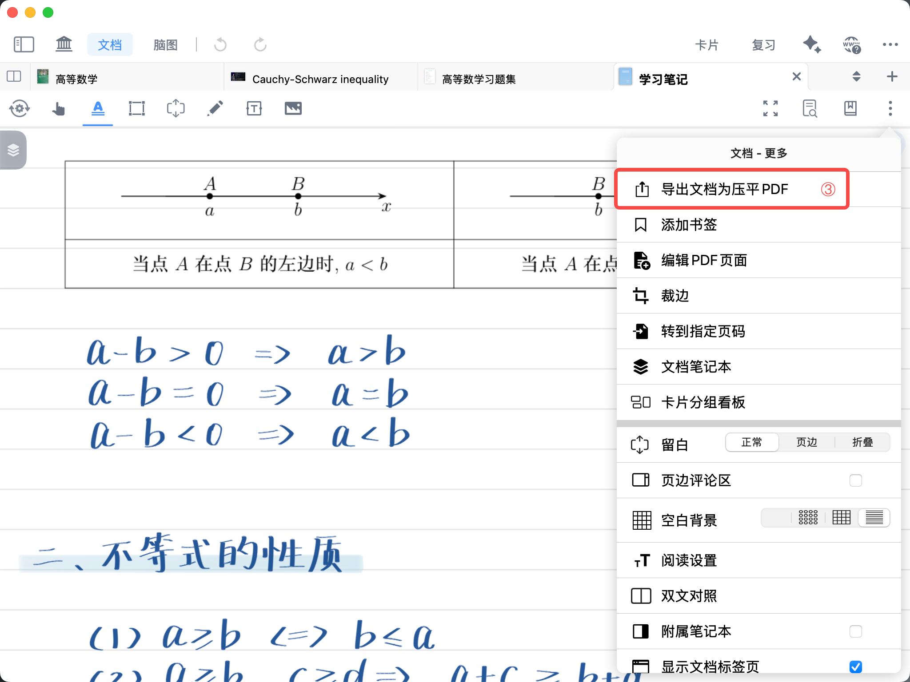

# 对照③：附属笔记本

> 💡对照系列导航
>
> 本系列帮助你完成从“并排阅读”到“跨文档引证”再到“长期回源笔记”的完整流程。
>
> - 新手必读：[对照①：双文对照窗口](https://www.wolai.com/n8VMVG5yoZj8WRatAPzJkm "对照①：双文对照窗口")，解决“同时看两份资料”问题
> - 进阶：[对照②：文档间引证回源](https://www.wolai.com/2dQ7P1XFEV2UyqCLWyU7dU "对照②：文档间引证回源")，解决“把A文档内容引用到B文档”问题
> - 进阶：[对照③：附属笔记本](https://www.wolai.com/3RP4xfuiFKc6SAF8r1BHfK "对照③：附属笔记本")，解决“把笔记长期绑定到原文位置并可随时回源”问题

> 💡附属笔记本是 MarginNote 中为学习集内导入的文档提供的专用笔记载体，做题批注、课堂记录、二次整理都能回到 PDF 原位置，减少“笔记和原文脱节”。其核心能实现**笔迹回源功能**。
>
> **笔迹回源功能**：在附属笔记本上书写的笔迹、批注、笔记内容，会与原 PDF 文档的对应页码、对应位置自动绑定关联。点击附属笔记本中的任意笔记/笔迹，即可一键定位、跳转回原 PDF 的原始位置，实现笔记与原文的精准溯源对照。
>
> 

> 💡**附属笔记本适用场景：**
>
> 1. 精读教材时，想把推导/理解写在独立笔记本，但又能随时回原文。
> 2. 做题复盘时，想从错题笔记一键跳回题干出处。
> 3. 项目制学习时，想长期维护“资料-笔记”双向关联。

# 1 如何创建附属笔记本？

首先打开目标 PDF 文档，它将作为附属笔记本的**主文档**。

## 1.1 快捷创建附属笔记本（推荐）

[附属笔记本](https://www.wolai.com/gDBmB1kidw2jikmARbGJMZ "附属笔记本")

点击界面右上角`文档-更多`按钮，选择`附属笔记本`，系统将自动新建与当前文档绑定、支持笔迹回源的附属笔记本。

## 1.2 通过保存对照视图创建附属笔记本

1. 首先，新建一个空白笔记本（步骤详见：[新建空白笔记本](https://www.wolai.com/9RzcqeeMfTifmGxNdmqzAi "新建空白笔记本")），

1. 其次，将新建的笔记本与目标回源文档（主文档）组成`双文对照`，点击`保存为对照视图`，即可建立附属关系。

1. 后续可从附属笔记本笔迹一键回源到原文。

# 2 如何快速打开附属笔记本？

[附属笔记本](https://www.wolai.com/gDBmB1kidw2jikmARbGJMZ "附属笔记本")

在已创建附属笔记本的情况下，点击文档界面，右上的`附属笔记本`图标，即可快速开启 / 关闭附属笔记本。入口更短、绑定更直接，适合单文档精读场景。

# 3 如何取消绑定附属笔记本？

点击附属笔记本视图中的箭头图标，选择`取消附属笔记本`：

根据弹窗可选择：

- 是：取消绑定并删除该附属笔记本；
- 否：仅取消绑定，保留笔记本文件。

> ❗操作前请确认：取消附属笔记本可能涉及删除笔记本文件，建议先导出备份再操作。

# 4 如何导出附属笔记本？

1. 点击文档标签页栏的列表图标，找到并打开目标附属笔记本

1. 点击右上角`文档-更多`按钮，选择`导出文档为压平PDF`，即可完成当前附属笔记本的导出。

