# 书页折叠

> 💡\*\* 什么是书页折叠？\*\*
>
> 与[留白①|基础操作：字里行间自由开辟笔记空间](https://www.wolai.com/vYi6Yu4oCudNCr2zDuNQkj "留白①|基础操作：字里行间自由开辟笔记空间")这类用于"补充"文档的功能相对，`书页折叠`是用于"隐藏"文档的功能
>
> 书页折叠的特点：
>
> - 根据目录折页：可以按章节折叠整个部分 &#x20;
> - 手动折页：可以只折叠某页的一小块区域 ，增加阅读和摘录的连贯性。
> - 灵活可逆：随时展开，不像页面删除和[增删页面、裁剪纸张](https://www.wolai.com/akPnCSBmGv2BXCzkTBrFTB "增删页面、裁剪纸张")，可以随时展开隐藏的内容，更加灵活，方便随时对照。

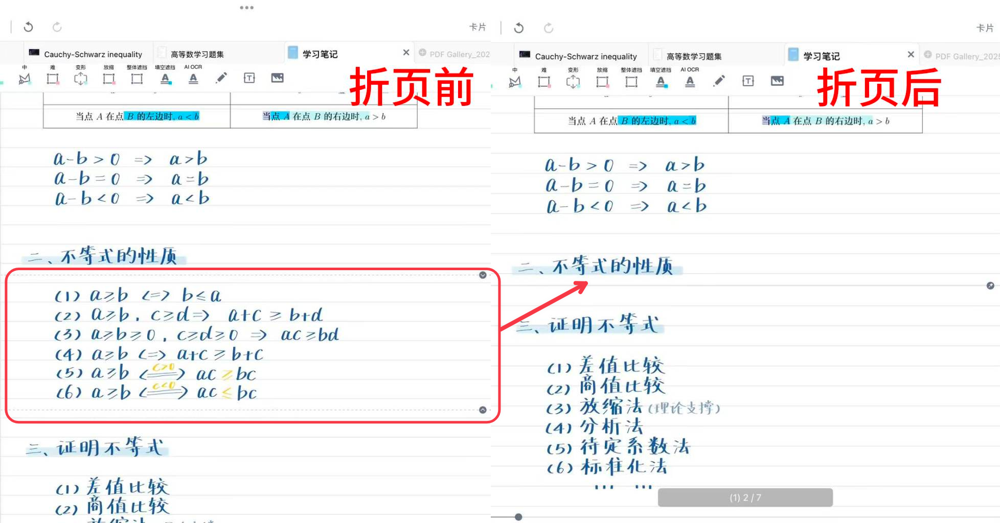

> 💡折页后，折去的内容不参与摘录，例如折去书籍的页眉、页脚后，可以顺畅地跨页摘录正文内容
>
> 折页前的摘录，折页后仍然保留

# 1 根据目录折页

> 💡**使用场景示例：**
>
> 划重点时，可以将不重要的章节隐藏，从而快速完成考点的区分
>
> 刷题时，可以将答案章节隐藏，避免浏览时看到解析，需要时再展开

[书页查找](https://www.wolai.com/bQ3HELpfPdH8QZ4sadPLpu "书页查找")

[目录](https://www.wolai.com/jaxFYszwK9eiofzRPxzA1J "目录")

[目录-更多](https://www.wolai.com/h9DiiX2755tCTreBciw5kY "目录-更多")

- 点击`书页查找`图标 → 选择`目录`图标 &#x20;
  - 点击左下角"`更多"` → 开启"`折页`"  开关
  - 点击章节后面的开关即可折叠/显示
  > 💡当折叠上级目录时，所有下级目录自动折叠
  >
  > 例如：折叠"第3章"时，所有"3.1""3.2"等子章节也会被折叠。

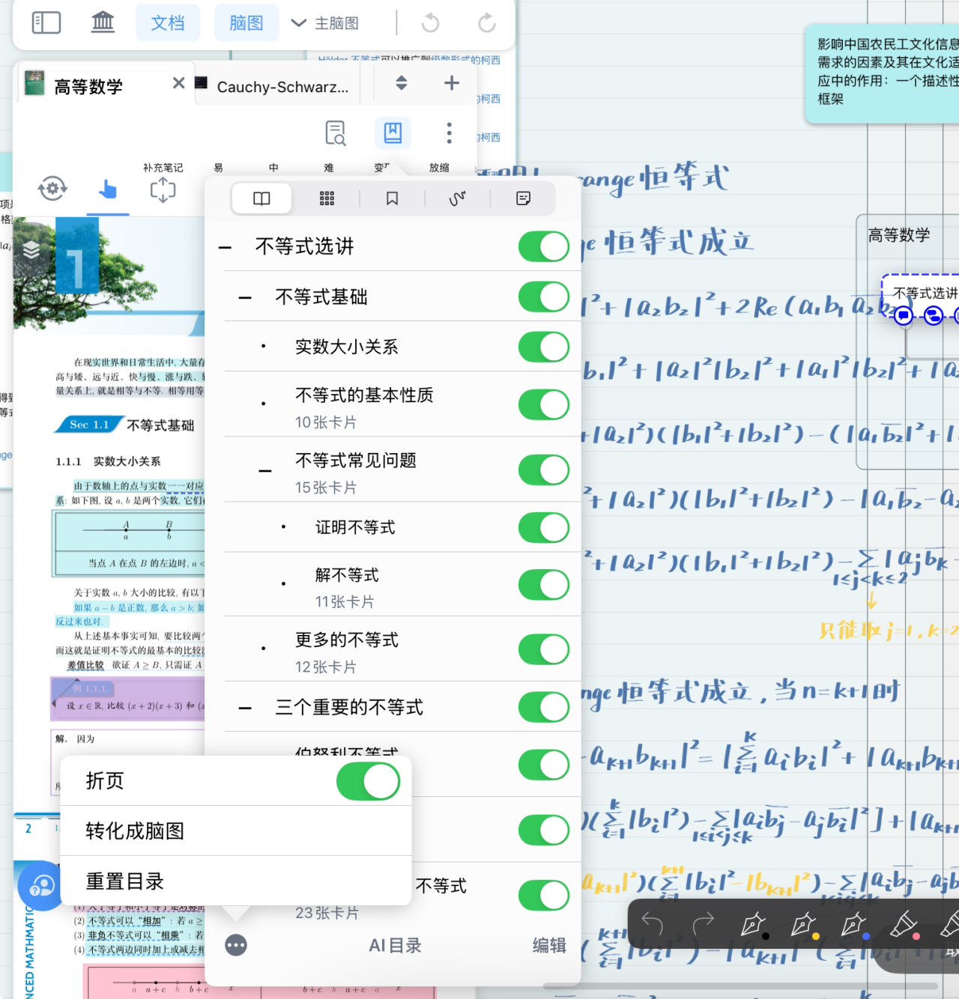

# 2 手动折页

## 2.1 选区折页

> 💡**使用场景示例**：
>
> 希望连续摘录某段文字，中间有其他文字阻隔（如页眉页脚、论文引用标注等）时，可手动折去该内容。
>
> 折叠翻译部分、公式推导过程、知识点详解，需要时再展开。

在文档中使用手型工具选取想要折叠的区域，唤起手型工具弹出菜单栏在其中选择折页，即可手动分割折叠文档。

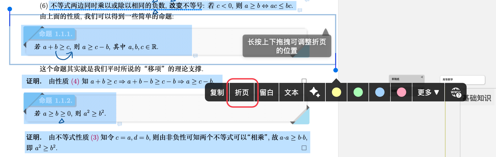

## 2.2 分割折页

> 💡**使用场景示例：**
>
> 快速调动折页功能
>
> 想批量折叠自某处后所有文档内容，但按页删除工作量大，可以选择折去下方所有内容
>
> 分割处上方和下方产生对照关系，希望保持上方不动、下方滑动的阅读方式

1. 长按文档页面任意的位置至出现`蓝色圆点`，在[手形工具弹出菜单栏及其自定义](https://www.wolai.com/iLGrRDRMEQepittcNY4Bun "手形工具弹出菜单栏及其自定义")在中选择"`分割折页`"

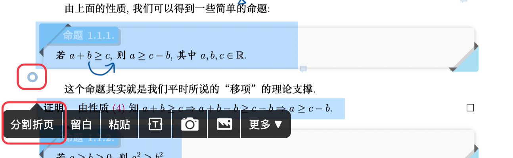

1. 蓝色圆圈位置出现\*\*`基准线`\*\*（图中标1处），基准线上弹窗中有折去上面、折去中间、折去下面选项

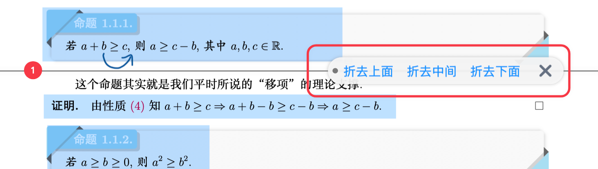

| 名称   | 操作                                         | 效果                                                                              |
| ---- | ------------------------------------------ | ------------------------------------------------------------------------------- |
| 折去上面 | 可以上下滑动调整折页范围， 选好后点击“\`折去上面\`”              | 该文档基准线上方的所有页面都被折叠  如：\[🖼️ 图片]\(image/20251211202323\_gKwSH1oqrY.gif "🖼️ 图片")  |
| 折去中间 | 必须通过滑动来设置折叠范围的上下边界 \&#x20; 选好后点击“\`折去中间\`” | 滑动时，被折叠区域不再显示 如：\[🖼️ 图片]\(image/我的项目\_NH6ePDsXFk.gif "🖼️ 图片")                 |
| 折去下面 | 可以上下滑动调整折页范围， 选好后点击“\`折去下面\`”              | 该文档基准线下方的所有页面都被折叠  如：\[🖼️ 图片]\(image/20251211202411\_fnXB\_FcYcs.gif "🖼️ 图片") |
| ×    | 点击图标                                       | 取消本次折页操作                                                                        |

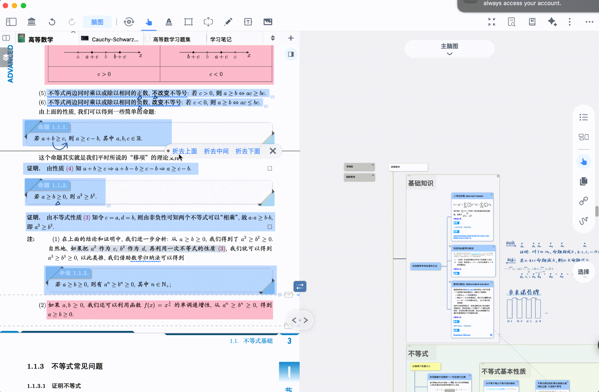

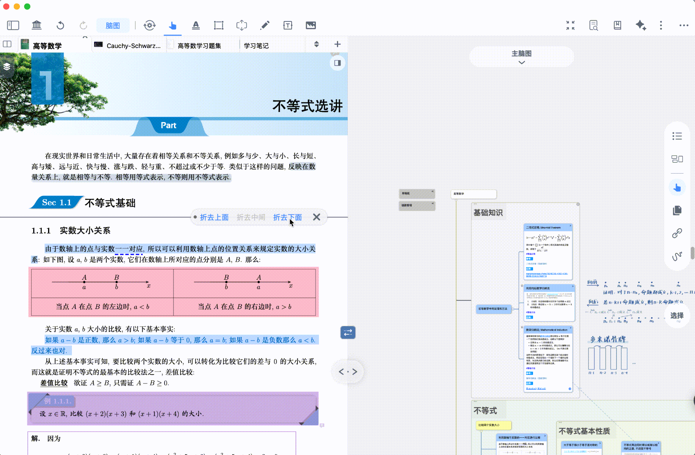

## 2.3 折叠界面的操作

### 2.3.1 查看已折叠内容

[折叠](https://www.wolai.com/gRzkKr7hHFBYyYV3LftM6Z "折叠")

- 折叠后的内容收缩为一条直线，点击折叠线最右端的`图钉状图标`（如上图所示）即可预览`折叠界面`。
- 点击`折叠界面`的`x`图标或折叠区域外，从折叠文档页的显示退出。
- 折叠内容较长时，显示区域有限，上下滑动，可查看展开的折叠的文档页

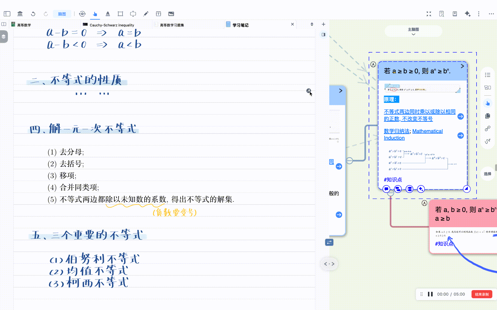

> 💡在预览折叠的文档页面时，也可以进行摘录、插入文本框和图片等操作，但不能进行分割折页、留白操作

### 2.3.2 调整折叠

[展开折页](https://www.wolai.com/s7Z4girMxahqJkNjzRDF6t "展开折页")

- 在`折页界面`点击`展开折页图标`，显示折叠内容
- 长按上边缘或下边缘的`调整图标`，直到虚线变蓝
- 上下拖动，调整折叠范围
- 选择"`折叠`"重新折叠文档，或点击"`撤销折叠`"撤销折叠

  点击展开图标，显示折叠内容 &#x20;

[调整折页-下方](https://www.wolai.com/xdm35K9XX4pi5dic6Psvp4 "调整折页-下方")

[调整折页-上方](https://www.wolai.com/mudcZBMf3Ziwg4viJYrHS7 "调整折页-上方")

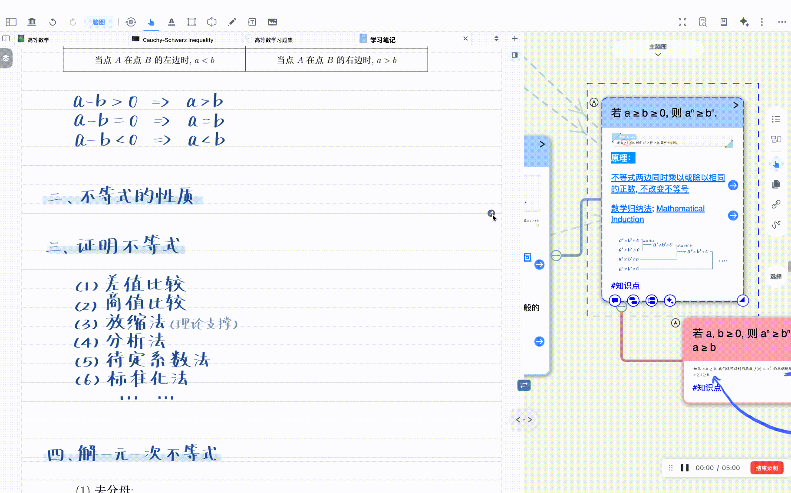

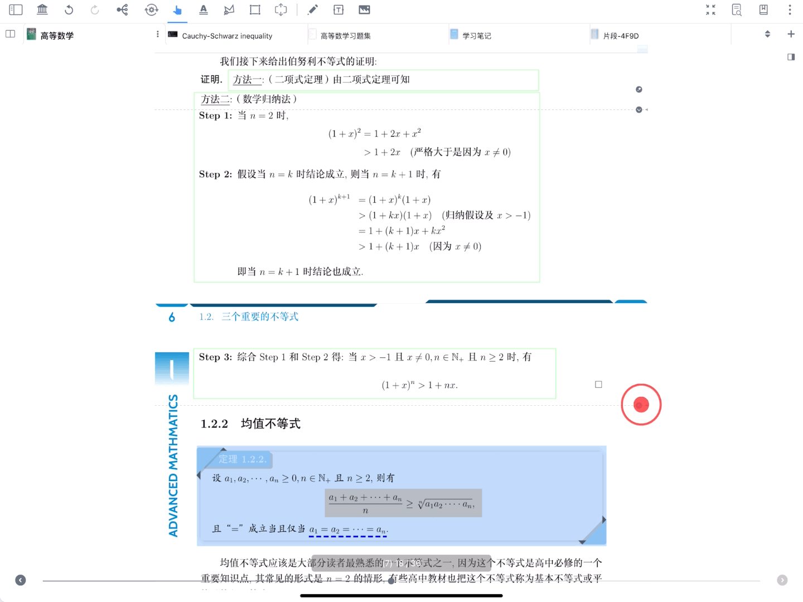

### 2.3.3 撤销折叠

完全展开已折叠的内容，恢复原始页面。

[撤销折页](https://www.wolai.com/3b6e6K64vJ8DuWWWYCU8S6 "撤销折页")

点击`更多`图标，出现弹窗后点击`撤销图标`（如上图所示），撤销对文档页的折叠。

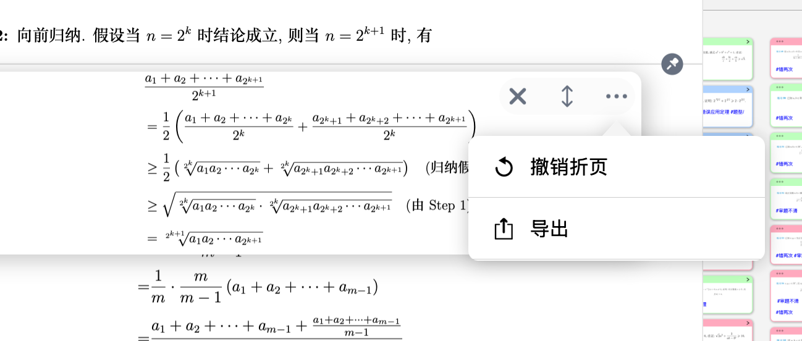

### 2.3.4 导出折叠

[导出折页](https://www.wolai.com/me5ymeyBZnxPJU5qmSrTvS "导出折页")

点击更多 → 导出图标 → 选择格式，

可以将折页以**PDF、长图**的形式导出，便分享或打印
