# 新建文本框/图片/拍照

> 💡`文本框` - **就地标注**：在原文旁边写补充、重点、疑问，避免把想法散落在别处。
>
> `图片`\*\* **-**讲解流程 \*\*：插入截图/示意图并可改大小、复制、剪切、删除，信息更清晰。
>
> `拍照`-**课堂、会议、图书学习的即刻记录**：把纸页、白板等现场拍下，直接存为文档图片或脑图卡片。
>
> 在同一页把自己的想法、图像和实时内容连在一起，阅读效率更高、复习更快、分享更清晰。

# 1 在文档中添加文本框

[文本框](https://www.wolai.com/t9CEniwgb5gqBLSBJnBxUX "文本框")

有三种方式可以添加`文本框`：

- 操作一：点击文档顶部导航栏中的`文本框`图标，在需要的插入`文本框`的位置单击，在弹出`文本框`内输入文字。

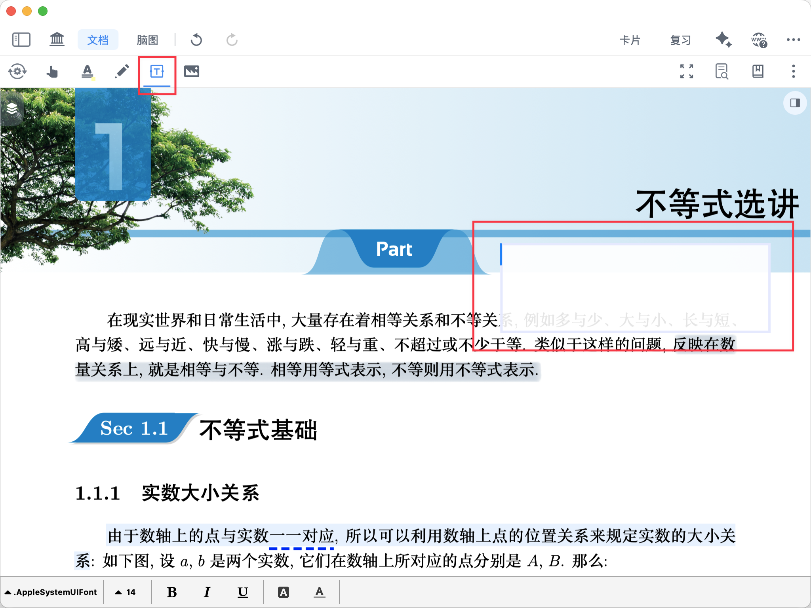

- 操作二：在文档空白处长按/右键呼出弹出菜单栏，点击`文本框`图标。

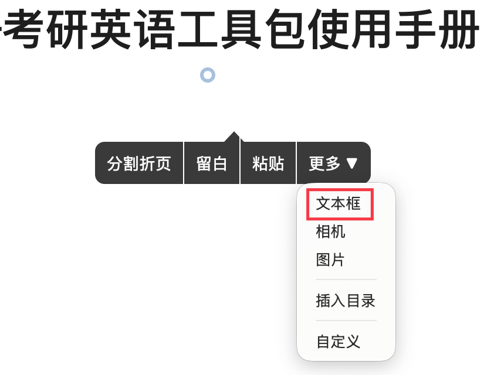

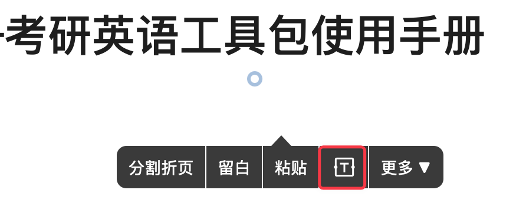

- 操作三：从外部 APP直接拖入。iPad 分屏/Mac 端多窗口情况下，可直接将其他软件内的文字直接拖入 MarginNote文档，自动创建`文本框`。

# 2 在文档和脑图中添加图片

## 2.1 在文档中添加图片

[图片](https://www.wolai.com/sujPUshdvjce3pNeqVsyYf "图片")

有三种方式可以添加图片：

- 操作一：**最简便** - 从外部 APP直接拖入：iPad 分屏/Mac 端多窗口情况下，可直接将其他软件内的图片直接拖入 MarginNote文档。
- 操作二：点击文档顶部导航栏中的`图片`按钮（如上方图标所示），在需要的位置单击，然后选择本地相册里的图片，即可插入。

- 操作三：在文档空白处长按/右键呼出弹出菜单栏，点击`图片`按钮。

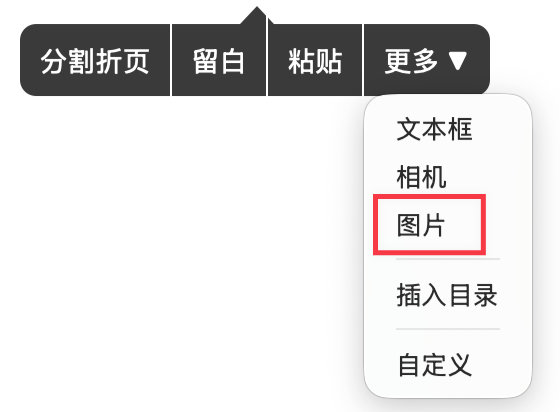

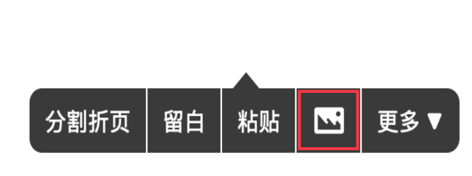

> 💡iPad版本中，添加图片后需要取消选择[图片](https://www.wolai.com/sujPUshdvjce3pNeqVsyYf "图片")图标，切换成[手形工具-文档](https://www.wolai.com/9ZgrQpKfNxW3HUkKiH6jfS "手形工具-文档")或其他`文档顶部导航栏`内的功能后才能继续长按呼出弹出菜单栏；
> Mac 版本不影响右键呼出弹出菜单栏。

### 2.1.1 对图片的操作

单击插入的图片，可对图片进行调整图片大小、复制、剪切和删除。

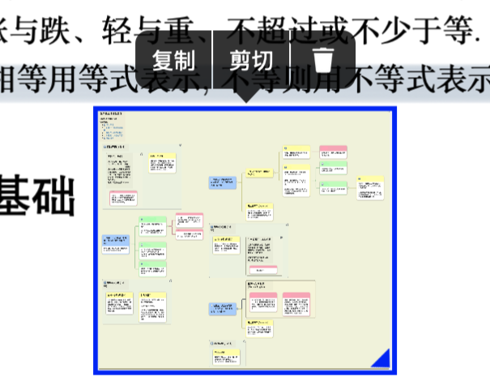

#### 2.1.1.1 调整图片大小

拖动图片右下角蓝色三角，即可改变图片尺寸。

#### 2.1.1.2 复制

复制图片，可在其他位置粘贴。

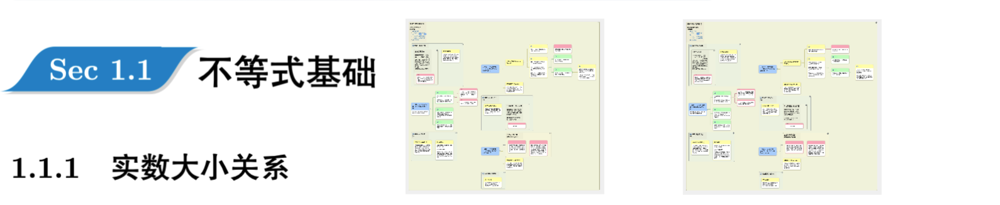

#### 2.1.1.3 剪切

剪切图片后，再次粘贴在文档，原位置图片移到新位置；若在脑图中添加，则会保存为新卡片。

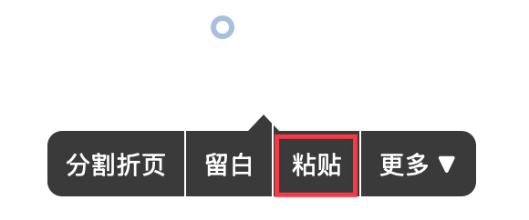

#### 2.1.1.4 删除

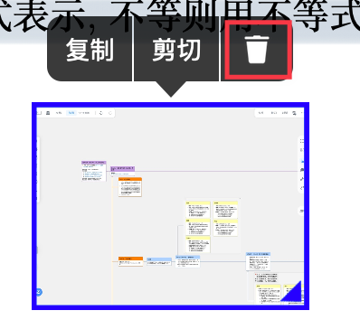

## 2.2 在脑图中添加图片为卡片

有两种方式可以在脑图中添加`图片`：

- 操作一：**最简便** - 从外部 APP直接拖入：iPad 分屏/Mac 端多窗口情况下，可直接将其他软件内的图片直接拖入 MarginNote脑图。
- 操作二：直接粘贴系统粘贴板内的图片到脑图（Command+V），即可在脑图中创建为带图片的新卡片。

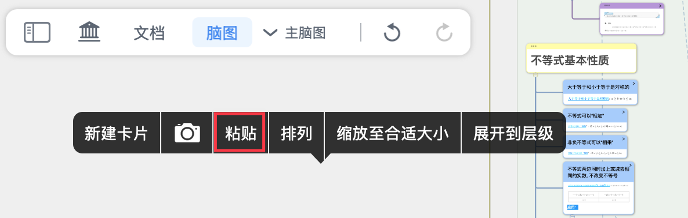

# 3 在文档和脑图中拍照

> 💡MarginNote 中的相机会自动使用**连续扫描仪**选取视野中有用的内容进行拍照；学习者也可以自己点击拍照按钮进行拍照。

## 3.1 在文档中拍照，插入为图片

[相机](https://www.wolai.com/tN9K5fiLSVpNBGMY8GV6La "相机")

在文档空白处长按/右键呼出弹出菜单栏，点击`相机`按钮（如上方图标所示），即可拍照；对照片的操作与上述文档里`图片`一致。

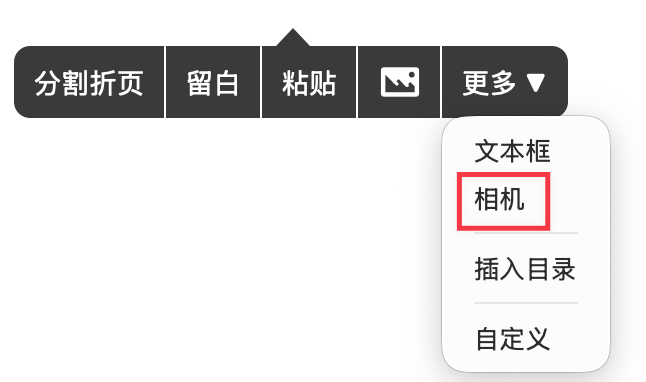

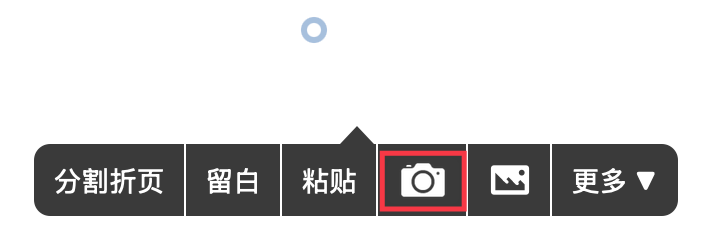

## 3.2 在脑图中拍照，保存为卡片

1. 在脑图空白处点击呼出弹出菜单栏，点击`相机`图标，即可拍照。

1. 拍照后单张照片/多张照片会保存为一张卡片。

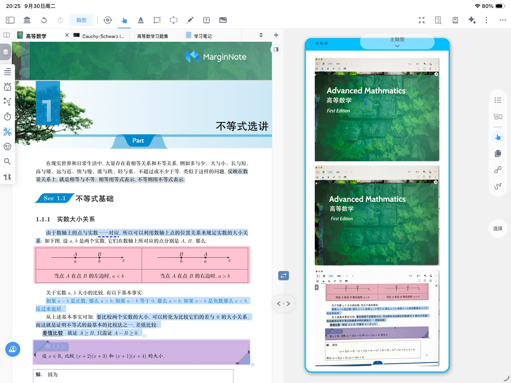

1. 每张照片为一条评论，可在卡片编辑器中调整照片顺序。

   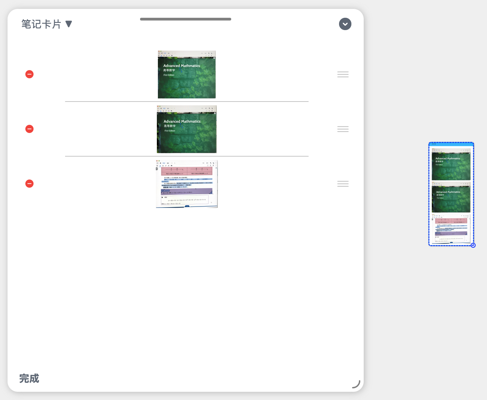
