# 新建文本框/图片/拍照

  💡
  

    
<code>文本框</code> - <strong>就地标注</strong>：在原文旁边写补充、重点、疑问，避免把想法散落在别处。

    
<code>图片</code><strong> </strong>-<strong> 讲解流程</strong>：插入截图/示意图并可改大小、复制、剪切、删除，信息更清晰。

    
<code>拍照</code><strong> </strong>- <strong>课堂、会议、图书学习的即刻记录</strong>：把纸页、白板等现场拍下，直接存为文档图片或脑图卡片。

    
在同一页把自己的想法、图像和实时内容连在一起，阅读效率更高、复习更快、分享更清晰。

  

# 1 在文档中添加文本框

## 1.1 普通文本框

<a class="mn-preview-link" data-preview="文本框" href="https://www.wolai.com/t9CEniwgb5gqBLSBJnBxUX" title="文本框">文本框</a>

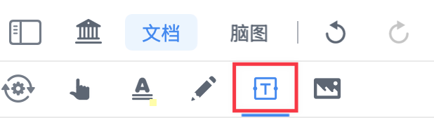

文本框图标

有三种方式可以添加`文本框`：

- 操作一：点击文档顶部导航栏中的`文本框`图标，在需要的插入`文本框`的位置单击，在弹出`文本框`内输入文字。
    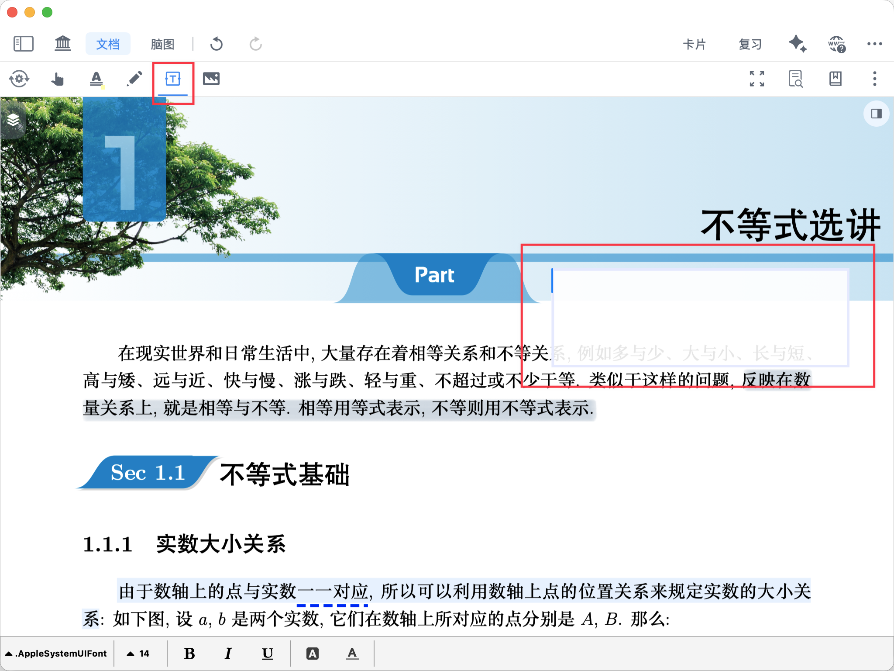
    点击文档顶部导航栏中的文本框图标，在需要的插入文本框的位置单击，在弹出的文本框内输入文字。
- 操作二：在文档空白处长按/右键呼出弹出菜单栏，点击`文本框`图标。
    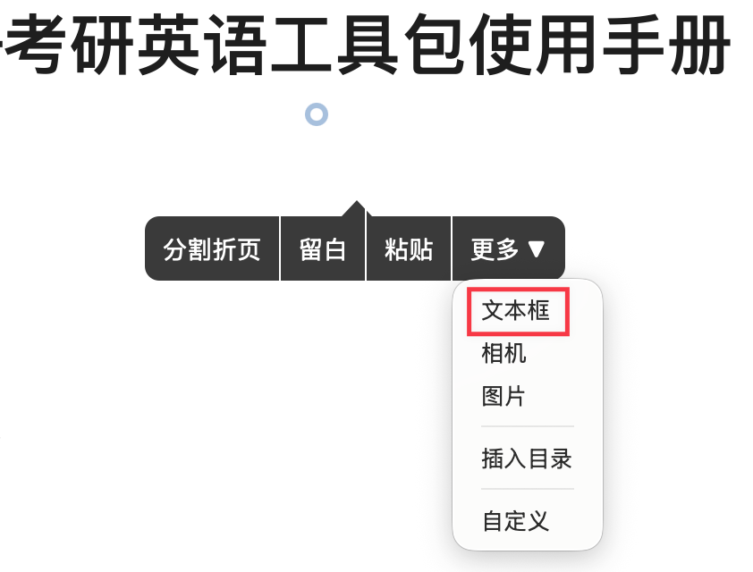
    操作二：在文档空白处长按/右键呼出弹出菜单栏，点击文本框图标。
    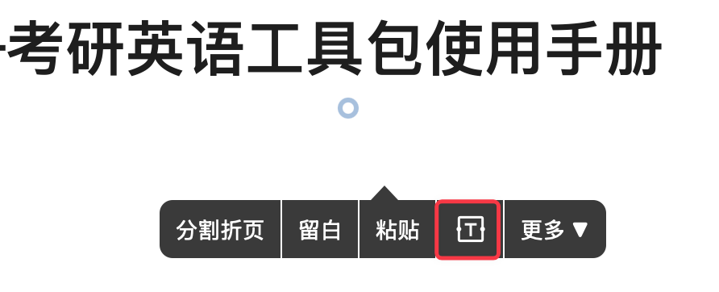
    可在更多-自定义中选择需要的图标加入一级菜单。
- 操作三：从外部 APP直接拖入。iPad 分屏/Mac 端多窗口情况下，可直接将其他软件内的文字直接拖入 MarginNote文档，自动创建`文本框`。

## 1.2 Markdown 文本框（4.4.5 及以上版本）

  💡
  

Markdown 文本框支持 URL ，点击框中的链接可直接打开。Markdown 文本框支持文档关键词搜索和标注笔记浏览，搜索结果缩略图可正确显示 Markdown 内容。

有两种方案可以插入 Markdown 文本框

- 在文档空白处长按/右键呼出弹出菜单栏，点击`Markdown`。
    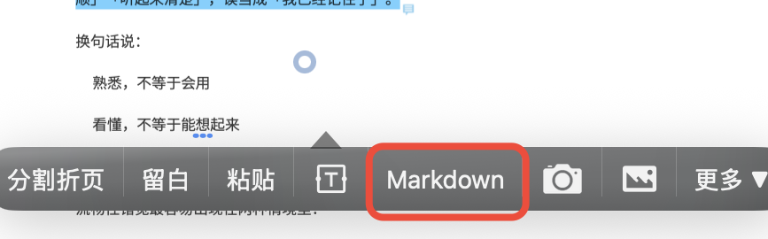
    如图所示
- 点击文档顶部导航栏中的`文本框`工具，切换成 Markdown，在需要的插入的位置单击。
    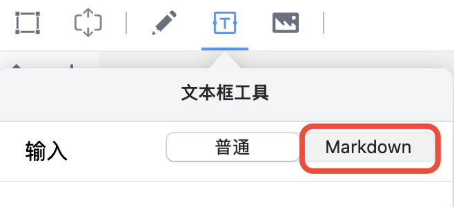
    如图所示

# 2 在文档和脑图中添加图片

## 2.1 在文档中添加图片

<a class="mn-preview-link" data-preview="图片" href="https://www.wolai.com/sujPUshdvjce3pNeqVsyYf" title="图片">图片</a>

有三种方式可以添加图片：

- 操作一：**最简便** - 从外部 APP直接拖入：iPad 分屏/Mac 端多窗口情况下，可直接将其他软件内的图片直接拖入 MarginNote文档。
- 操作二：点击文档顶部导航栏中的`图片`按钮（如上方图标所示），在需要的位置单击，然后选择本地相册里的图片，即可插入。
    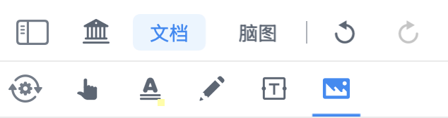
    操作二：点击文档顶部导航栏中的图片按钮（如上方图标所示），在需要的位置单击，然后选择本地相册里的图片，即可插入。
- 操作三：在文档空白处长按/右键呼出弹出菜单栏，点击`图片`按钮。
    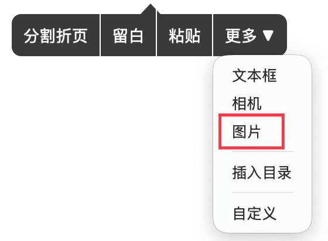
    操作三：在文档空白处长按/右键呼出弹出菜单栏，点击图片按钮。
    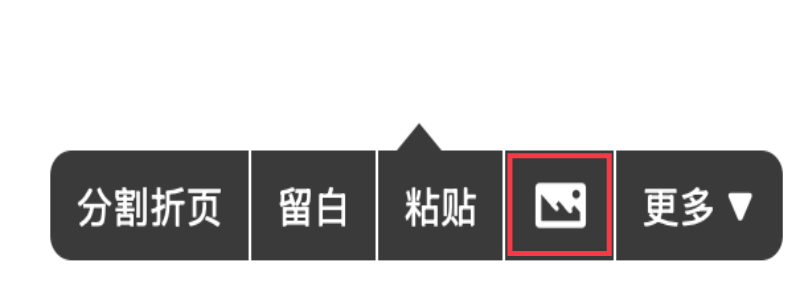
    可在更多-自定义中选择需要的图标加入一级菜单。

  💡
  

iPad版本中，添加图片后需要取消选择<a class="mn-preview-link" data-preview="图片" href="https://www.wolai.com/sujPUshdvjce3pNeqVsyYf" title="图片">图片</a>图标，切换成<a class="mn-preview-link" data-preview="手形工具-文档" href="https://www.wolai.com/9ZgrQpKfNxW3HUkKiH6jfS" title="手形工具-文档">手形工具-文档</a>或其他<code>文档顶部导航栏</code>内的功能后才能继续长按呼出弹出菜单栏； Mac 版本不影响右键呼出弹出菜单栏。

### 2.1.1 对图片的操作

单击插入的图片，可对图片进行<a class="mn-preview-link" data-preview="调整图片大小" href="#2111" title="调整图片大小">调整图片大小</a>、<a class="mn-preview-link" data-preview="复制" href="#2112" title="复制">复制</a>、<a class="mn-preview-link" data-preview="剪切" href="#2113" title="剪切">剪切</a>和<a class="mn-preview-link" data-preview="删除" href="#2114" title="删除">删除</a>。

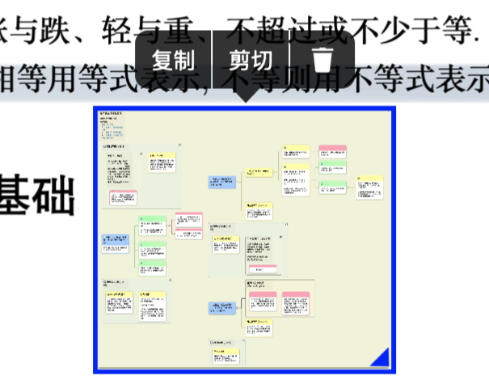

单击插入的图片，可对图片进行调整图片大小、复制、剪切和删除。

#### 2.1.1.1 调整图片大小

拖动图片右下角蓝色三角，即可改变图片尺寸。

#### 2.1.1.2 复制

复制图片，可在其他位置粘贴。

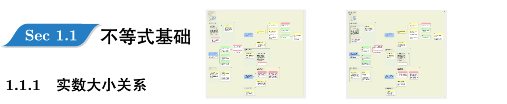

复制后粘贴，获得两张同样的图片。

#### 2.1.1.3 剪切

剪切图片后，再次粘贴在文档，原位置图片移到新位置；若在脑图中添加，则会保存为新卡片。

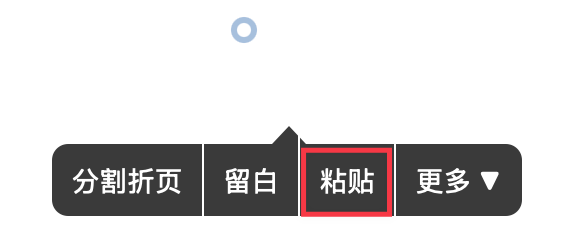

选择剪切后可长按空白处/右键粘贴到新位置。

#### 2.1.1.4 删除

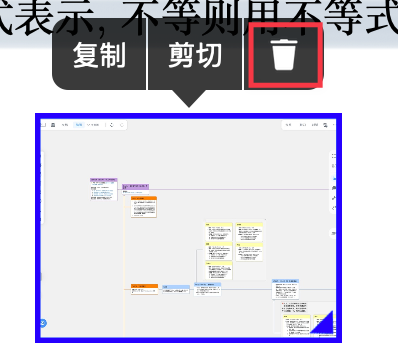

删除

#### 2.1.1.5 裁边（4.4.4 版本及以后）

可以对已插入的图片进行裁边、旋转、改变图片比例。

  ⚠️
  

如果插入时已对图片进行裁切，不支持撤销。

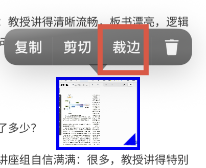

可以对已插入的图片进行裁边、旋转、改变图片比例。

## 2.2 在脑图中添加图片为卡片

有两种方式可以在脑图中添加`图片`：

- 操作一：**最简便** - 从外部 APP直接拖入：iPad 分屏/Mac 端多窗口情况下，可直接将其他软件内的图片直接拖入 MarginNote脑图。
- 操作二：直接粘贴系统粘贴板内的图片到脑图（Command+V），即可在脑图中创建为带图片的新卡片。
    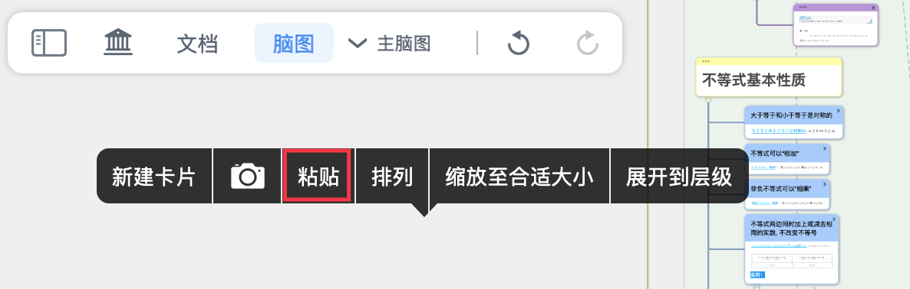
    操作二：直接粘贴系统粘贴板内的图片到脑图（Command+V），即可在脑图中创建为带图片的新卡片。

# 3 在文档和脑图中拍照

  💡
  

MarginNote 中的相机会自动使用<strong>连续扫描仪</strong>选取视野中有用的内容进行拍照；学习者也可以自己点击拍照按钮进行拍照。

## 3.1 在文档中拍照，插入为图片

<a class="mn-preview-link" data-preview="相机" href="https://www.wolai.com/tN9K5fiLSVpNBGMY8GV6La" title="相机">相机</a>

在文档空白处长按/右键呼出弹出菜单栏，点击`相机`按钮（如上方图标所示），即可拍照；对照片的操作与上述文档里`图片`一致。

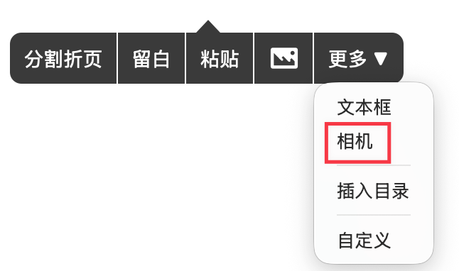

在文档空白处长按/右键呼出弹出菜单栏，点击相机按钮（如上方图标所示），即可拍照；对照片的操作与上述文档里图片一致。

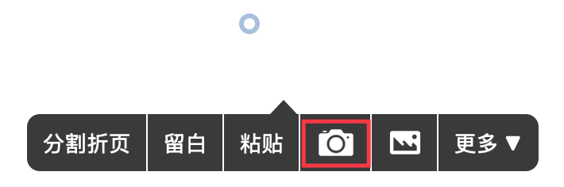

可在工具-自定义中选择需要的图标加入一级菜单。

## 3.2 在脑图中拍照，保存为卡片

1. 在脑图空白处点击呼出弹出菜单栏，点击`相机`图标，即可拍照。
    
    在脑图空白处点击呼出弹出菜单栏，点击相机图标，即可拍照。
2. 拍照后单张照片/多张照片会保存为一张卡片。
    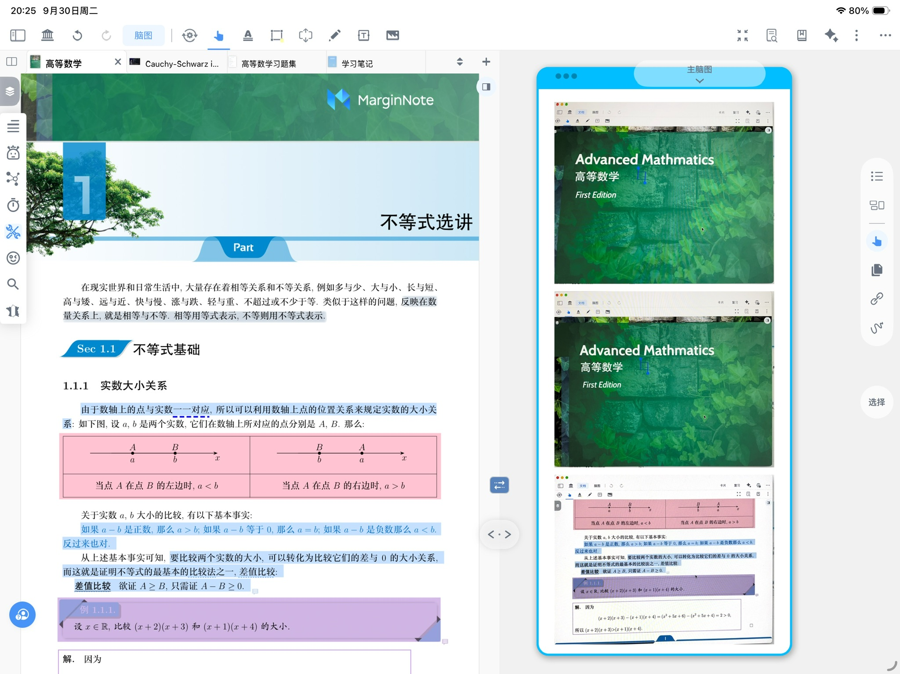
    拍照后单张照片/多张照片会保存为一张卡片。
3. 每张照片为一条评论，可在卡片编辑器中调整照片顺序。
    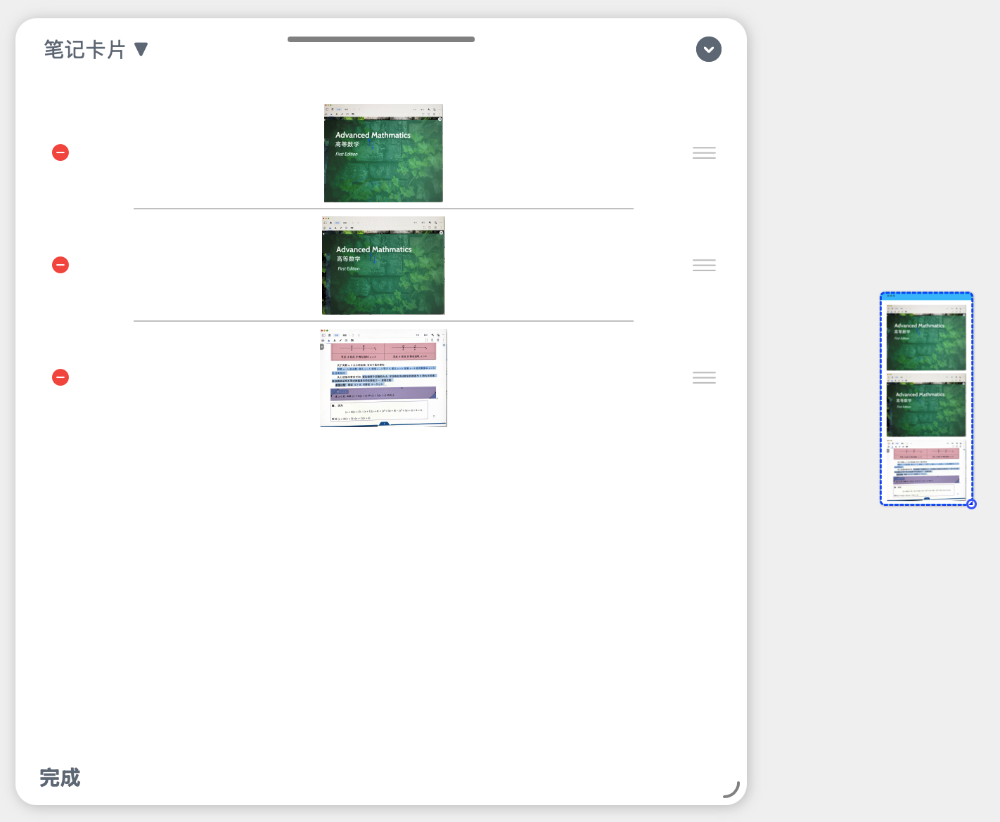
    每张照片为一条评论，可在卡片编辑器中调整照片顺序。
