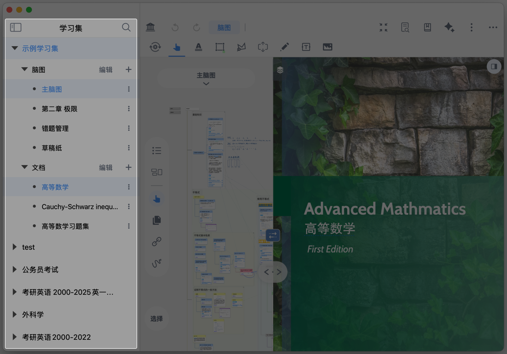
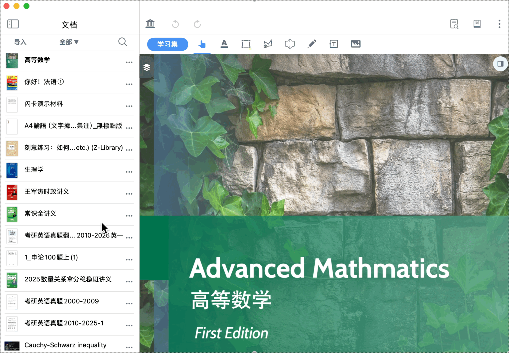
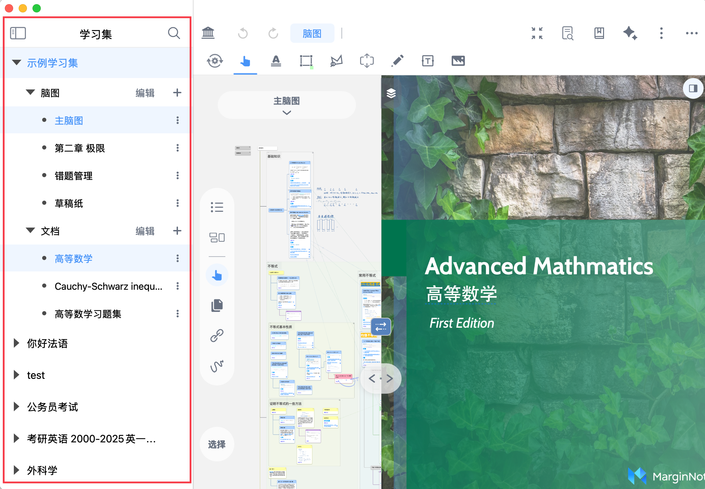
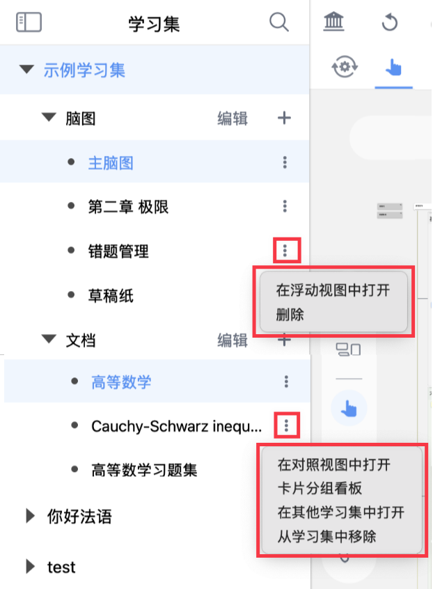

# 边栏快速切换与全局检索

> 💡边栏是文档文件在学习集之间快速交换的便捷抽屉，其更多的作为文件盒使用，必要时可以快速切换其他项目和检索全局信息，便于多材料对照查阅。

# 1 文档边栏

[边栏](https://www.wolai.com/i4WDdkL1bT1yWZ8vpy1fve "边栏")

在文档视图下，点击`边栏`按钮（如上方图标所示），可在边栏中浏览文档库的所有条目，并实现类似标签页切换的效果：在多个文档之间切换阅读，查找。

- **切换文档**：单击目标文档，即可切换到该文档视图
- **双文对照**：按住目标文档拖动到右侧文档区域，即可形成文档双开对照视图。
  > 双文对照的更多用法，详见：[对照①：双文对照窗口](https://www.wolai.com/n8VMVG5yoZj8WRatAPzJkm "对照①：双文对照窗口")
- **修改文档查找范围**：点击`全部🔻`，默认按`分类`查找文档。点击`分类`左侧的`<`，可按`文件夹`查找文档。
- **导入文档**：点击`导入`，可选择`从文件`或`从Web` 导入
  > 导入文档的更多方式见：[导入文档及文档管理](https://www.wolai.com/ehTLoD9HictQhkFirV1g9k "导入文档及文档管理")。
- **搜索文档**：点击🔍，可按**文件名**搜索文档

# 2 学习集边栏

学习集边栏展示学习集库中的所有条目（包括学习集所包含的文档和脑图），使用逻辑与文档边栏大致相同，但支持更丰富的功能。

- **切换学习集**：单击目标学习集/文档/脑图/子脑图，即可切换到对应视图
- **双文对照**：按住目标文档拖动到右侧文档区域，即可形成双文对照视图；或点击目标文档右侧省略号，选择`在对照视图中打开`
  > 双文对照的更多用法见：[对照①：双文对照窗口](https://www.wolai.com/n8VMVG5yoZj8WRatAPzJkm "对照①：双文对照窗口")、[对照②：文档间引证回源](https://www.wolai.com/2dQ7P1XFEV2UyqCLWyU7dU "对照②：文档间引证回源")
- **导入文档**：点击`导入`，可选择`从文件`或`从Web` 导入
- **全局检索**：点击🔍，可按**名称**或**全文本**搜索文档
  - `名称`：只搜索文档名称，如PDF、MP4的名称
  - `全文本`：搜索全部笔记卡片数据库
  > 💡初次使用全文本搜索时，需等待若干秒建立文字索引（取决于笔记总量）。此时设备温度可能会升高，属正常现象。
- **在浮动视图（卡片分组看板）中打开子脑图**：点击目标子脑图右侧省略号，选择`在浮动视图中打开`，即可在卡片分组看板的浮窗中浏览该子脑图的卡片（`卡片源`自动选择该子脑图）
- **在卡片分组看板中浏览文档摘录卡片**：点击目标文档右侧省略号，选择`卡片分组看板`，即可在卡片分组看板的浮窗中浏览该文档的摘录卡片（`卡片源`自动选择该文档）

# 3 附录：全文检索支持一些高级规则

关键词AND,OR,NOT,NEAR可以用于条件组合，需要大写。（小写则被视为普通搜索词）
范例：
word1 AND word2 （包含word1且包含word2）
word1 OR word2（包含word1或包含word2）
word1 NOT word2（包含word1但不包含word2）
word1 NEAR word2 （包含word1且包含word2，并且两个词邻近）
word1 NEAR/2 word2 （包含word1且包含word2， 并且两个词邻近，数字代表邻近程度，越小越近）
支持用括号将以上条件组合成复杂的匹配逻辑，例如：
word1 OR (word2 NOT word3)

搜索词为小写时代表使用beginswith匹配模式。
搜索词为大写时代表使用fullmatch匹配模式。

搜索文档内容时，可以用file:来限定在哪些文件里搜索，例如：
word1 file:Name2 (在目录/文件名包含Name2的PDF文本内容里搜索word1关键词。
