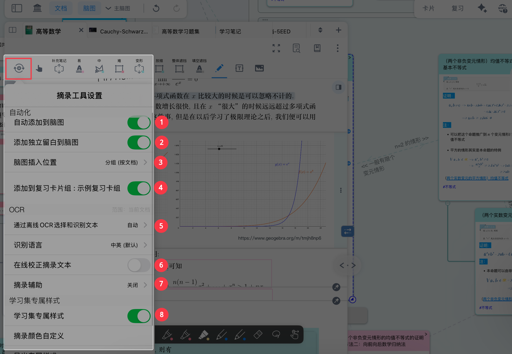
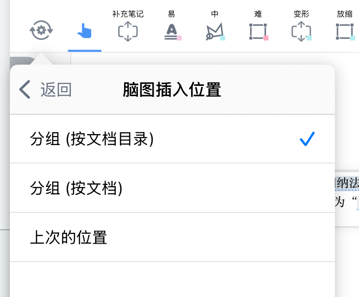
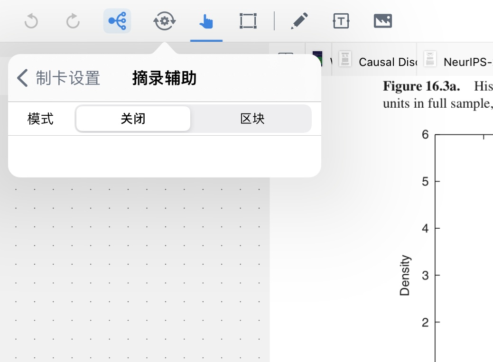
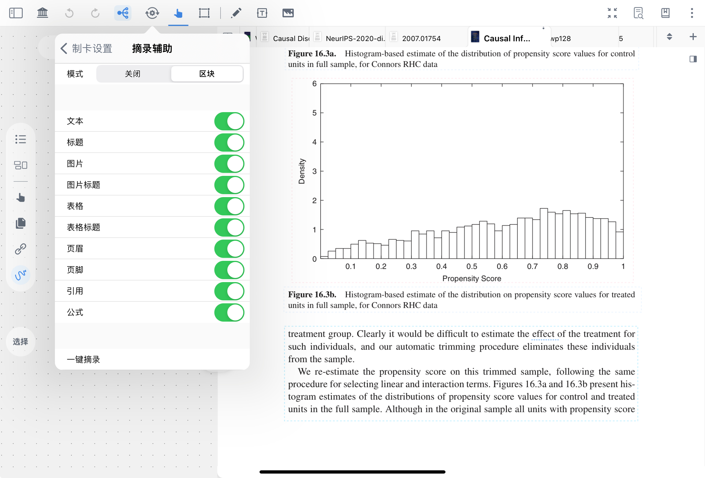
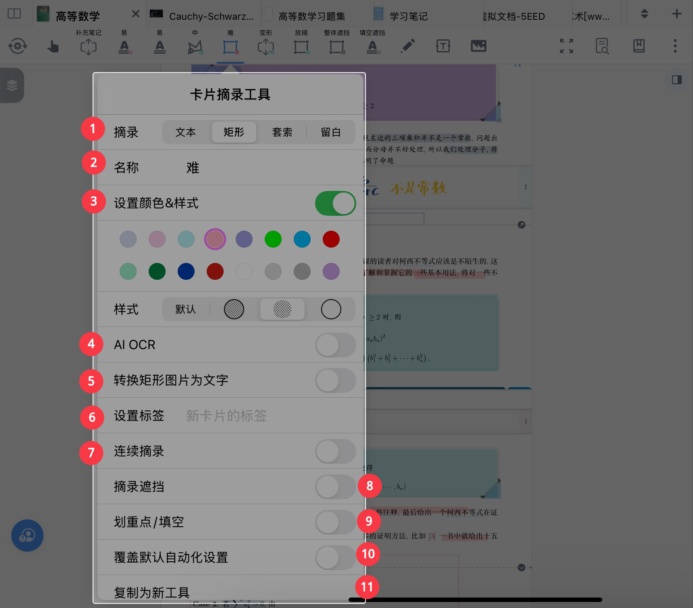
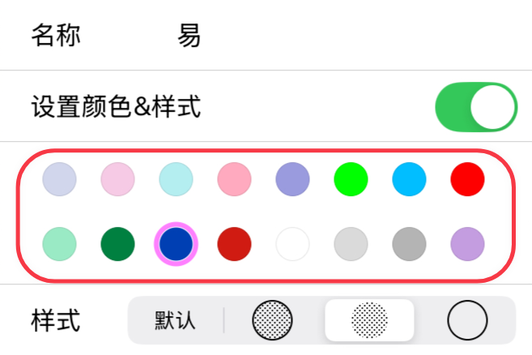
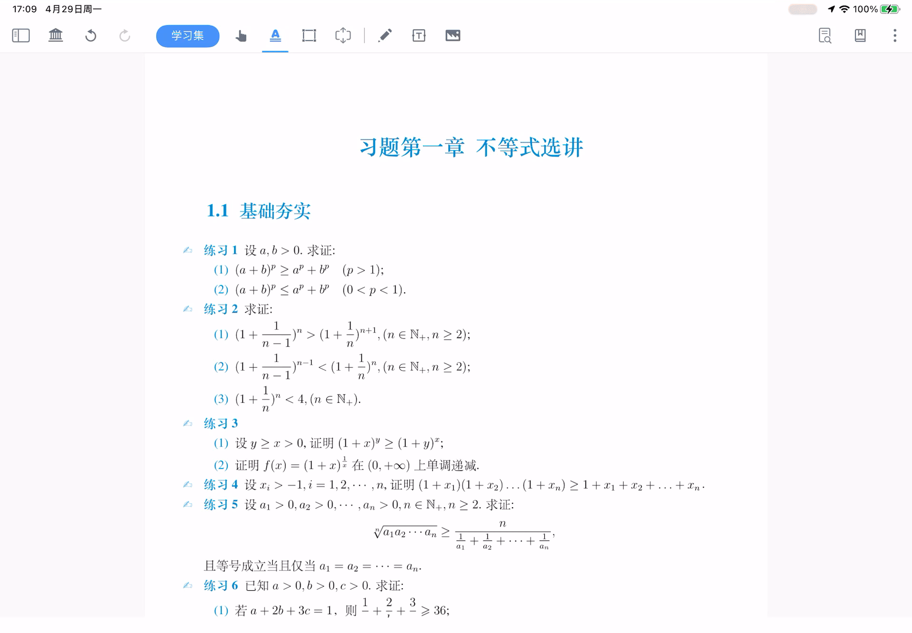

# 摘录工具及其自动化

> 💡使用摘录功能时，有一些固定的操作，例如对图片摘录进行OCR、把所有摘录脑图插入位置，或者有为摘录卡片设置标签、颜色等需求，这些连续流程可以借由文档导航栏的`摘录工具设置`，让这些功能自动进行。

# 1 摘录工具设置（全局默认）

[摘录工具设置](https://www.wolai.com/hgMYX7XCNpvGAMxgBfLAQE "摘录工具设置")

点击`文档导航栏`齿轮状图标（如上图所示），即可唤起`摘录工具设置界面`。在这里进行的设置对学习集内所有摘录工具都有效。

1. 自动添加到脑图
2. 添加独立留白到脑图
3. 脑图插入位置
4. 添加到复习卡片组
5. 通过离线ocr选择和识别文本

## 1.1 自动化设置

### 1.1.1 自动添加到脑图

开启此开关后，无论是文字摘录、图形摘录还是留白，均会被自动添加到脑图之中。

> 💡没有添加到脑图的卡片被收集在[卡片盒视图](https://www.wolai.com/jeJN7Cjyi9fSZovcQ6ZSps "卡片盒视图")中，可以在此处搜索到。

### 1.1.2 添加独立留白到脑图

开启此开关后，在文档中创建的\[\[独立留白会被自动添加到脑图之中。

### 1.1.3 脑图插入位置

打开`自动添加到脑图`后，摘录产生的新卡片会自动排列到脑图结构中的特定位置。

#### 1.1.3.1 分组（按文档目录）

> 💡使用场景：文档有详细目录，希望按照目录组织脑图结构

文档存在目录时，可以选择`分组（按文档目录）`插入新卡片。（若不存在目录，也可[手动&自动生成文档目录](https://www.wolai.com/djV6nMiEdSaxCacjWcptpA "手动&自动生成文档目录")），新摘录卡片将自动插入为该目录脑图节点下的子卡片。

#### 1.1.3.2 分组（按文档）

> 💡使用场景：按照**文档来源**自动整理摘录卡片，从而快速构建一个初始的、有条理的脑图框架。

- 选择`分组（按文档）`插入新卡片。
- 新卡片自动排列成为该文档来源下的子卡片

#### 1.1.3.3 上次的位置

> 💡使用场景：形成结构较为松散的脑图，或者需要将不同文档的摘录集中到一个分支上时

- 选择`上次的位置`插入新卡片。
- 新卡片自动排列成为上一张摘录卡片（或选择卡片）的同级卡片

### 1.1.4 添加到复习卡片组

打开`添加到复习卡片组`开关后，摘录的卡片会自动添加到选定的复习卡组中。

在[闪卡复习①：基于FSRS抗遗忘算法的科学复习](https://www.wolai.com/31KwWufHLt8MUbyxQahbP3 "闪卡复习①：基于FSRS抗遗忘算法的科学复习")界面，可以选择该卡片组进行针对性的复习。

> 关于复习功能，详见：[闪卡复习①：基于FSRS抗遗忘算法的科学复习](https://www.wolai.com/31KwWufHLt8MUbyxQahbP3 "闪卡复习①：基于FSRS抗遗忘算法的科学复习")

## 1.2 OCR

具体内容请参考：[检索①：全文 OCR +搜索定位，扫描版书籍也可畅享阅读](https://www.wolai.com/rpmCakup76GuHCF6N4Ns5c "检索①：全文 OCR +搜索定位，扫描版书籍也可畅享阅读")

> 💡 OCR 功能可以将图片、PDF 里的文字从图像形式转换成文本形式。

### 1.2.1 通过离线ocr选择和识别文本

离线 OCR有3种模式

- `自动`：根据情况对文字进行识别，对识别出的文字可以进行摘录等操作
- `关闭`：将不会对 PDF 进行文字识别，便于进行`矩形摘录`
- `始终`：始终对文字进行识别，适用于页面存在较难识别文字的文档

### 1.2.2 选择识别语言

此设置用于调整 OCR 的语言。

OCR 支持的语言包括：  中英（默认）、英语、葡萄牙语 、法语、德语 、意大利语、西班牙语 、日语 、韩语。

> 💡识别语言不仅影响摘录识别结果，与AI生成目录等需要提取页面文字的其他功能也有关。
>
> 例如，如果 文档语言是中文，ocr语言为日语，此时用 AI为文档生成目录就有可能出现文字乱码。

### 1.2.3 在线校正摘录文本

开启后，MarginNote4将会对文字进行识别后，再次使用其他引擎对文字识别进行矫正。

> 💡现在已有AI COR功能，建议使用AI OCR，更加强大和精确。详见：[AI OCR： 摘录→识别→知识结构化，一步到位](https://www.wolai.com/hQ5STjDE5P7362vywGNa1U "AI OCR： 摘录→识别→知识结构化，一步到位")。

### 1.2.4 摘录辅助

默认情况下，[🖼️ 图片](image/IMG_1158_0rMLLUbcSb.jpg "🖼️ 图片")后所有的元素都会被识别，在文档中可以看到不同颜色的**细虚线框**。

[🖼️ 图片](image/IMG_1159_-BkRbl65Tz.jpg "🖼️ 图片")

点击元素对应开关，关闭辅助摘录元素。对应的细虚线框也会从文档界面消失。

通过摘录辅助中的`一键摘录`功能可以实现批量摘录。

> 关于辅助摘录的详细用法，可参考：[自动生成脑图①：使用AI模型一键摘录](https://www.wolai.com/91ptxv4wkpB2RSq8GQkAtc "自动生成脑图①：使用AI模型一键摘录")。

## 1.3 学习集专属样式

开启`学习集专属样式`，可为每个学习集定制专属美化配置，支持保存、导出、导入，实现样式复用、快速切换与跨用户分享，让学习空间更具个性化

> 具体操作请参考：[学习集专属样式：打造你的专属学习空间](https://www.wolai.com/ueyP4EoMFihG8RpYMY31JV "学习集专属样式：打造你的专属学习空间")

# 2 卡片摘录工具设置（个性化）

在用户熟练运用后，需新建大量相同或类似设定的摘录时，可自行配置个性化的摘录工具。借助该功能，能在摘录时按照个人偏好对不同功能和板块的卡片进行分类，省去后续繁琐的归类工作。

## 2.1 打开卡片摘录工具设置

[卡片摘录设置](https://www.wolai.com/aw2bPfdvhhY45Bki1bUphD "卡片摘录设置")

点击`文档工具栏`中的摘录工具，点击摘录工具下方的`卡片摘录设置`图标（如上图所示），即可打开设置界面。

1. 选择摘录工具的种类
2. 为摘录工具命名
3. 设置颜色和样式
4. AI OCR
5. 转换矩形图片为文字（非文本摘录专属功能）
6. 设置标签
7. 连续摘录
8. 摘录遮挡
9. 选择划重点、填空
10. 选择覆盖默认自动化设置
11. 复制为新工具&删除
12. 文本转标题（文本摘录专属功能）

### 2.1.1 选择摘录工具的种类

点选此栏，可以使摘录工具在四种形式中切换

关于四种工具的详细对比，可参考：[摘录：抓住全文重点](https://www.wolai.com/9aXhp2VEugXYNp9cnWCT7A "摘录：抓住全文重点")。

### 2.1.2 为摘录工具命名

用户可自定义摘录工具在工具栏上显示的名称，以此标识工具的用途。

> 💡例如：在数学学习集中，可将工具命名为 “公式”“简单题目”“困难题目” 等，方便快速切换使用。

### 2.1.3 设置颜色和样式

学习者可自定义摘录工具的颜色和填充样式，用于区分不同类型的摘录内容。

> 💡例如：为 “公式” 摘录设置蓝色 + 填充样式，为 “题目” 摘录设置黄色样式，这样就无需每次摘录时手动切换颜色。

1. **打开设置**

关闭`设置颜色&样式`开关，该工具将无默认配置，使用时会沿用上次选定的配置

打开`设置颜色&样式`开关，则可进行后续的样式设置操作。

1. **选择样式**

点击[🖼️ 图片](image/IMG_1556_ZalBnp2zED.jpeg "🖼️ 图片")，可以选择此摘录工具的默认颜色，颜色会显示在[🖼️ 图片](image/IMG_1557_brzE8fxVcG.jpeg "🖼️ 图片")

点击样式选项，可选择摘录以 “填充”“框线” 等形式展示在文档中。​

> 💡可根据使用场景选择高亮方式，例如若不想让摘录样式过于显眼，影响文档内荧光笔的勾画效果，可选择仅显示“框线”的模式。

### 2.1.4 AI OCR

AI OCR功能能精准识别表格、竖版书、手写体、小语种等多格式内容。支持通过预设或自定义提示词，实现翻译、总结、制卡等知识深加工。

> 详情参考：[AI OCR： 摘录→识别→知识结构化，一步到位](https://www.wolai.com/hQ5STjDE5P7362vywGNa1U "AI OCR： 摘录→识别→知识结构化，一步到位")。

### 2.1.5 转换矩形图片为文字

除了文本摘录工具以外，其他摘录工具都有`转换矩形图片为文字`开关

打开该开关后，摘录区域的文字会被自动 OCR 识别，并以文本形式呈现在卡片中。

> 💡该功能适用于处理多行、排版特殊的文字内容；
>
> 若希望摘录内容以**图片**形式呈现，则需关闭此功能。

### 2.1.6 文本转标题

在卡片中，标题可起到总结内容、建立标题链接的作用，在脑图中只显示标题还能压缩脑图篇幅。

但手动为每张卡片输入标题，或进行批量转标题的操作较为繁琐。此时，可在选定的`文本摘录工具`中打开`文本转标题开关`，开启后，该工具摘录的所有内容都会转为卡片标题，卡片正文则为空白。

> 💡使用场景：在英语学习中，摘录生词时开启文本转标题功能，该单词在文档中会显示蓝色虚线，点击即可跳转至单词卡片，形成专属的 “生词词典”。​

### 2.1.7 设置标签

若希望批量生成带有特定标签的卡片，方便后续整理、筛选和检索，可点击`设置标签`后的空白处

此时会弹出包含现有标签的弹窗，上下滑动弹窗并点击标签即可完成选择。
若弹窗中没有所需标签，可直接输入新标签名称，系统会自动生成并保存该标签。

> 💡例如，为英语学习集的摘录卡片添加 “一级生词”“二级生词”“作文积累” 等标签，便于后续分类检索。

> 关于标签的用法，具体可参考：[卡片分组看板①：从海量卡片中精准筛选](https://www.wolai.com/dJvh1K4GEKaJYtZ14zbfgj "卡片分组看板①：从海量卡片中精准筛选")。

### 2.1.8 连续摘录

打开`连续摘录开关`后，使用该摘录工具时会自动触发连续摘录功能：从首次摘录到终止摘录的所有内容，会被**集中到同一张卡片中**，省去了后续频繁合并不同位置摘录内容的步骤。

**终止连续摘录**：点击文档顶部的`黑色完成框`，或双击文档界面空白处。

#### 2.1.8.1 连续摘录过程中删除摘录

在连续摘录时，摘录新内容或单击已摘录内容，都会弹出`删除键`，点击`删除键`即可删除对应摘录内容。

#### 2.1.8.2 连续摘录过程中定位摘录

开启连续摘录并完成摘录后，内容会汇集在同一张卡片上。点击工具栏下方的阴影区域可结束连续摘录，点击阴影右侧的按钮则能快速定位到摘录内容在文档中的位置。

### 2.1.9 摘录遮挡

打开`摘录遮挡`开关后，使用此摘录工具摘录的文档会显示为色块，隐藏内容，直至进行下一次摘录操作。

摘录完成后，点击该区域内容，也会再次显示为色块，帮助复习回忆。

> 💡点击查看划重点遮挡与摘录遮挡的区别

### 2.1.10 选择划重点、填空

打开`划重点模式`，可以对已摘录的笔记，进行制作遮挡填空

- 没有开启`回忆模式`时，被划重点的文字仅在下方显示蓝色虚线；被划重点的框选会底色加深
- 开启`回忆模式`时，被划重点的位置会变成空白，可用于将文档转换成填空题，辅助复习回忆。点击填空处可以恢复原文，帮助检验回忆的正确性。

> 💡`划重点模式`与`回忆模式`不可同时开启
>
> 仅**pdf**可以连续划重点

### 2.1.11 选择覆盖默认自动化设置

`覆盖默认自动化设置`

使用摘录工具时，可以手动更改由“摘录默认设置”中“脑图插入位置”“自动添加到脑图”“添加到复习”等摘录工具设置所预设的行为，以满足特定情境下的临时需求。

这个功能的核心是 **“灵活性”**，允许您在遵循自动化流程的同时，进行个性化的临时调整。

> 💡例如，默认设置是 “`按文档目录分组`”，但某次摘录需要将内容集中到一个脑图节点，就可通过该功能临时修改插入位置。

### 2.1.12 复制为新工具&删除

在`文档工具栏`中可复制生成新的摘录工具，Max 用户可创建**12个**自定义摘录工具（Pro 用户可创建8个）。

> 💡**使用场景**：
> 不同学科需要相似但略有差异的摘录配置时，可复制基础工具后微调，比如复制 “英语单词摘录” 工具，修改标签后成为 “英语短语摘录” 工具。
> 针对同一文档的不同章节，需要不同的摘录样式时，复制工具并调整颜色、标签等设置，无需重新创建。
