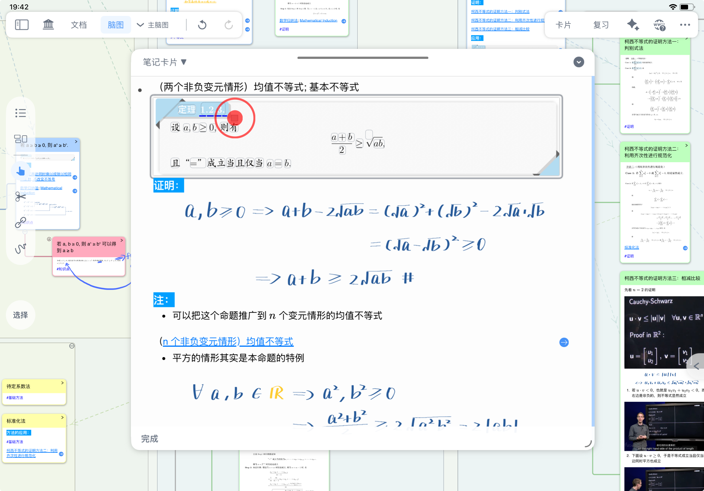
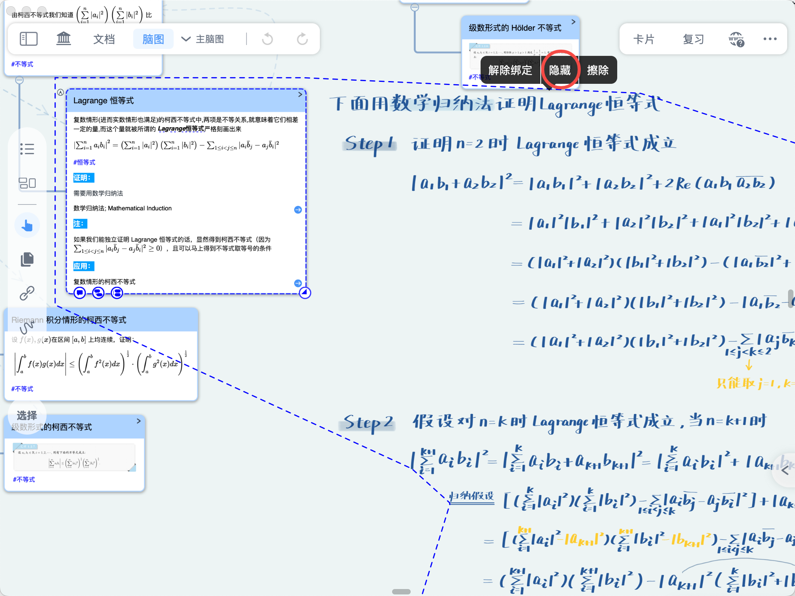

# 脑图复习①：主动回忆与自测方法

> 💡MarginNote 脑图复习功能依托多维度隐藏机制与场景化复习模式，打造上下文关联的主动回忆复习体验，具体如下：
>
> | 方法             | 说明                   | 适合场景                |
> | -------------- | -------------------- | ------------------- |
> | 遮挡回忆（测细节）      | 用遮挡块盖住关键词/公式，看自己能否说出 | 背定义、术语、公式、需要精确复述的内容 |
> | 标题抽查（测主干）      | 只显示卡片标题，隐藏详细内容       | 章节学习后的快速抽查，碎片时间轻量复习 |
> | 节点逐级展开（测结构）    | 从根节点开始，一层层展开并回忆子节点   | 检验知识框架的完整性与层级关系     |
> | 子脑图默写（测完整知识内容） | 在空白脑图中凭记忆画出整张脑图      | 周复盘、考前总复习，检验长期记忆    |
>
> 如果你是第一次做脑图回忆，建议先用「标题式抽查」快速定位薄弱点，再对薄弱点使用「遮挡回忆」强化细节，最后用「子脑图默写」做整章查漏补缺。

# 1 遮挡式回忆：自测知识点细节

## 1.1 使用制作填空遮挡（分词气泡 / 荧光笔）并开启回忆模式自测

**方法一：使用分词气泡（推荐文本类内容）**

- 若你使用遮挡类回忆（填空/荧光笔/手写隐藏），需要先完成脑图遮挡制作；
  - 通过填空遮挡模式，识别卡片文本为分词气泡

    适合背定义、术语、公式关键词，或需要“准确复述”的内容。

    

**方法二：使用荧光笔涂抹遮挡**

- 通过手写笔中`荧光笔`，制作荧光笔遮挡
  1. 打开`手写工具`，切换到`荧光笔`
  2. 涂抹希望回忆的脑图内容（可以涂字、涂公式、涂图），这一步的目标是把“看着眼熟”变成“能主动说出”，降低熟悉感误判
  3. 开启`回忆模式`，涂抹范围转变为遮挡效果
  4. 回忆相关知识，使用`手形工具`，翻看遮挡内容临时显示供记忆核对
     

## 1.2 隐藏绑定到卡片的手写批注

> 💡**什么是绑定？** 
>
> 在脑图中直接书写的笔迹，默认是“浮动”的，不会跟着卡片移动。如果你希望手写批注与特定卡片“绑定”——即选中卡片时手写出现，移开时手写隐藏——需要先进行绑定操作。
>
> **如何绑定？**
>
> - 通过自动工具绑定
> - 通过`焦点模式`绑定
>
> 详情请参阅[脑图手写随动绑定](https://www.wolai.com/bqdqqoArAjk9afFWktd9aF "脑图手写随动绑定")

- 绑定后，手写会跟随对应卡片显示与定位，复习时不容易出现“笔记与知识点错位”。
- 对已绑定的手写开启手写隐藏状态，手写部分隐藏

  手写隐藏主要影响复习时显示状态，不会改变你原有的笔记内容结构

  
- 观看卡片，回忆卡片相关的知识，如此处为定理证明过程：可先口述关键结论与步骤，再展开手写核对；若只能识别、不能复述，说明仍需强化。
- 回忆完毕，选中卡片，绑定的手写内容将临时显示供记忆核对

  每张卡先回忆 5–10 秒，再点开核对，避免边看边复习变成被动浏览。

  

# 2 标题式抽查：快速回顾结构框架

若使用标题抽查或分支展开复习，可直接开始。通过全部卡片进入略缩模式，回忆卡片内容。

- 要开始回忆，需要开启`只显示标题`
  - 点击学习集右上角横排三点
  - 在设置菜单中找到`只显示标题`，并且开启`点击查看全卡`
- 回忆卡片内容，选中节点卡片显示卡片内容供记忆核对

  

# 3 脑图逐级展开法：分层检验记忆深度

通过树状结构脑图的逐级收缩展开辅助回忆。收缩/展开是显示状态的调整，并不会删除节点内容。

## 3.1 收缩全部分支

- 在回忆前，需要先全部收缩分支

  先收缩可强制你从“结构”开始回忆，避免一上来被局部细节牵走注意力。
  - 通过点按节点卡片后的跟随的 `减法收缩符号`

    
  - 通过菜单一键收缩全部子节点
    - 选中上级节点卡片，在弹出菜单栏中点击`基础-更多`
    - 在菜单中，选择`折叠`

## 3.2 逐级展开验证

- 回忆子节点卡片内容，逐级展开分支验证记忆

  建议每展开一级先自述该层要点与关系，再展开下一层进行核对。若某一级展开后大面积回忆卡顿，可将该分支标记为下一轮重点复习区域。
  - 依次点击节点后的跟随的\*\*`+`\*\*
  - 选中上级节点，使用快捷键 1 2 3 4 5 逐级展开对应的一级、二级、三级分支
    

# 4 默写法：新建子脑图默写

通过新建子脑图来默写脑图结构回忆，适用于学习者已经完成了一轮学习，并建构了完整的学科学习要点知识框架，在一段时间后再回忆还原的场景。例如：周复盘或考前总复习阶段。

- 新建空白子脑图，在空白脑图上根据回忆，默写知识框架
- 打开主脑图，切换子脑图为悬浮模式，供记忆核对

