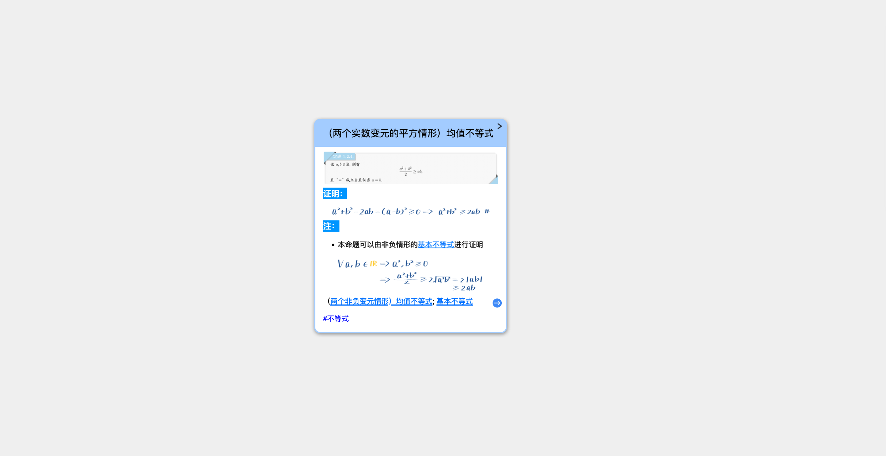
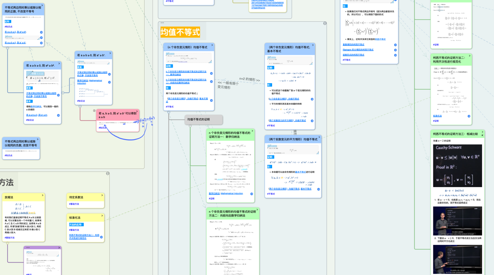
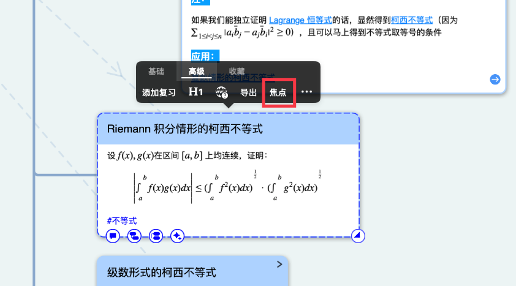
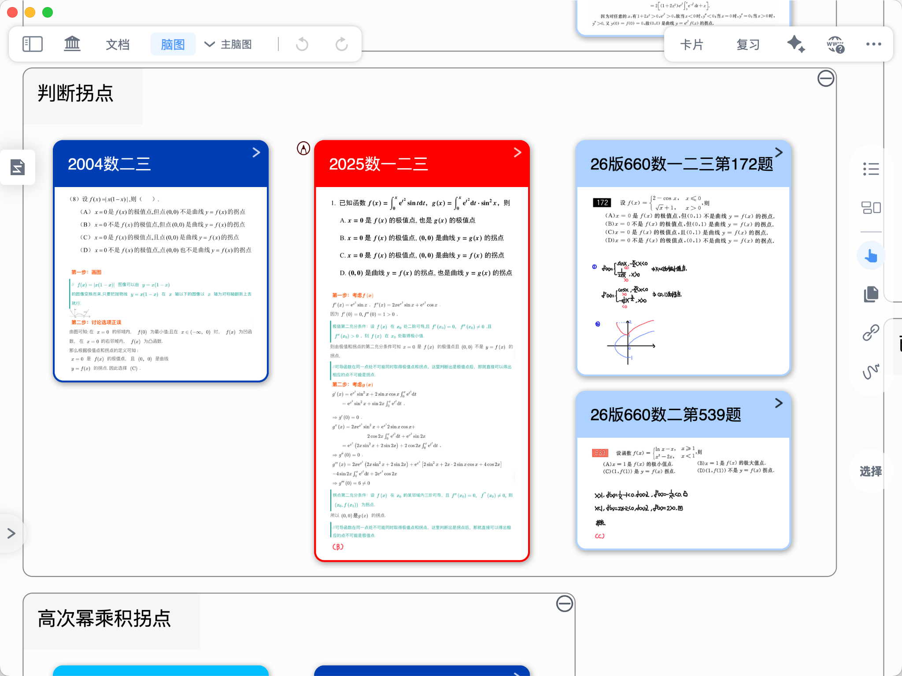
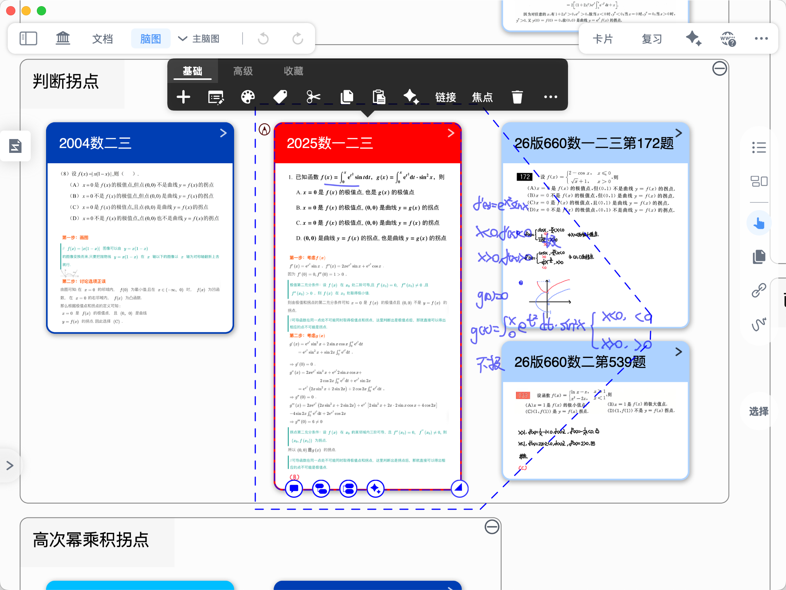

# 脑图焦点

# 1 使用场景

> 💡随着脑图中的卡片越来越多，有的时候在脑图中进行学习时可能会觉得有些干扰，比如当前主要任务是学习这一张卡片里的知识点，但周围的卡片可能会干扰在书写时的注意力，这个时候可以进入这张卡片的`焦点`模式：隐藏除了此卡片和所有下级卡片外的所有卡片，让您可以专注于当前卡片的学习。

# 2 如何进入卡片焦点模式

## 2.1 方法一：点击卡片弹出菜单栏-高级-`焦点`，进入焦点模式

## 2.2 方法二：脑图手写状态下双击卡片，进入焦点模式（推荐）

[脑图手写工具](https://www.wolai.com/2Cfr7YMtWVH4a9dgyDdNev "脑图手写工具")

双击脑图手写工具图标（如上方所示），打开`脑图手写设置`面板，勾选`双击卡片进入焦点`，此后双击卡片即可快速进入卡片的焦点模式。

# 3 退出卡片的焦点模式

双击卡片周围空白处或双击焦点卡片均可退出。

退出焦点后，焦点内的手写默认不显示，以免干扰脑图视野。点击焦点卡片后显示焦点手写。

[Longshot20251004230704.mov](video/Longshot20251004230704_kOr5qZv6P3.mov "退出焦点模式")

以下图的“2025数一二三”红色卡片为例：退出焦点后，默认不显示焦点内的手写，保持脑图视野清爽；单击该卡片则会显示焦点内手写。

