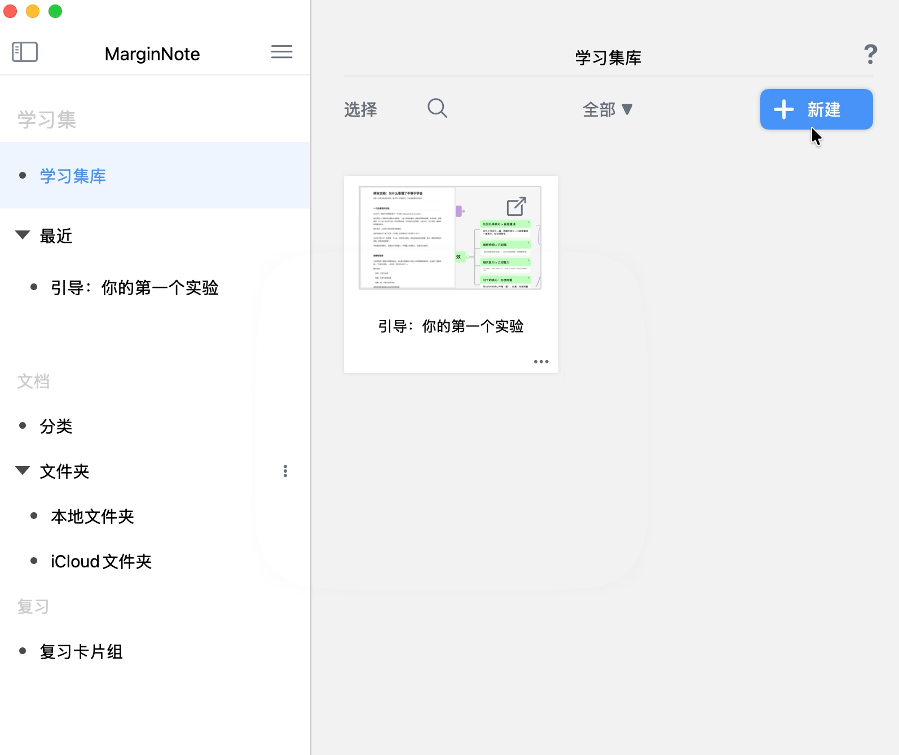
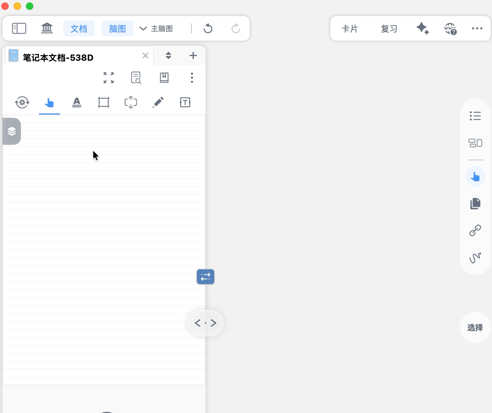
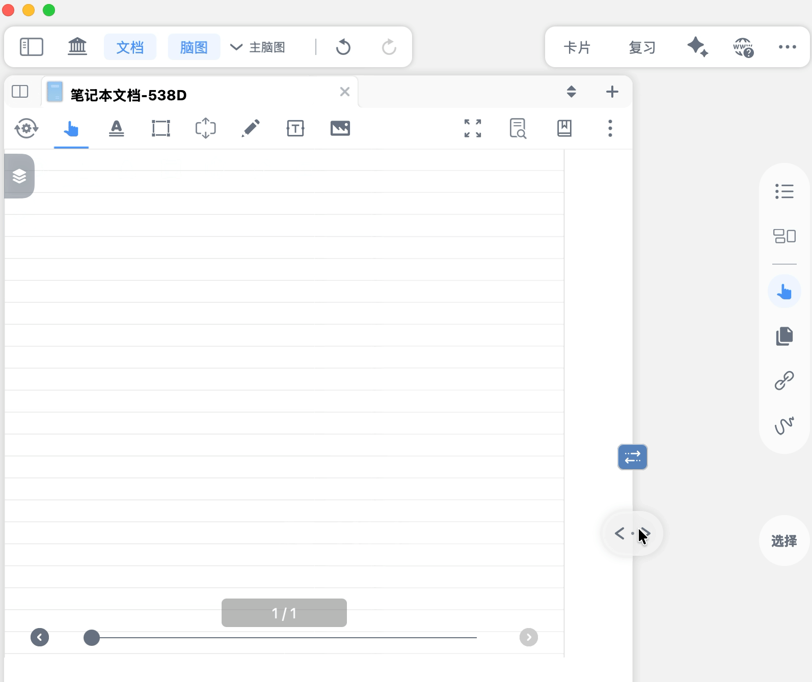
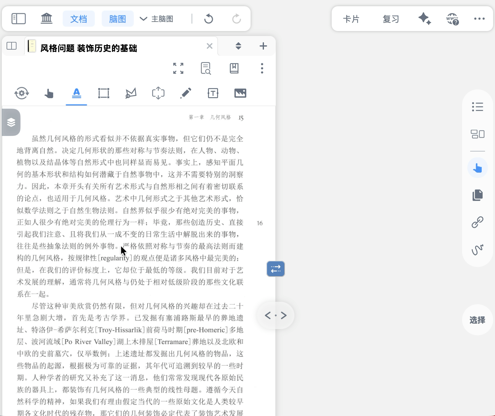
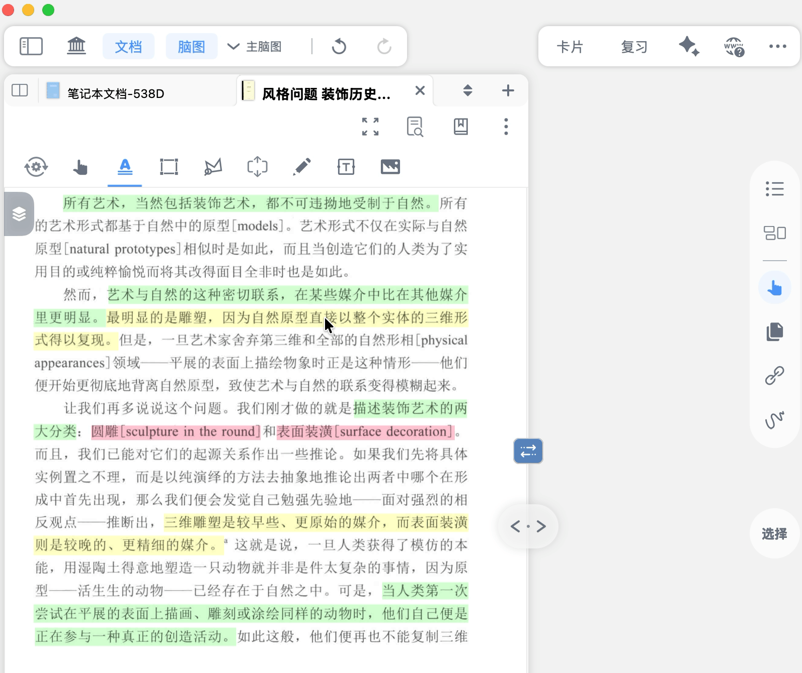
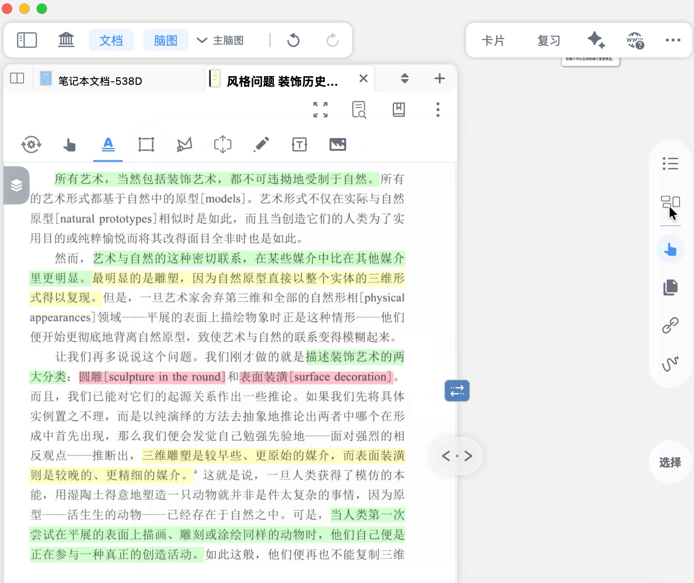
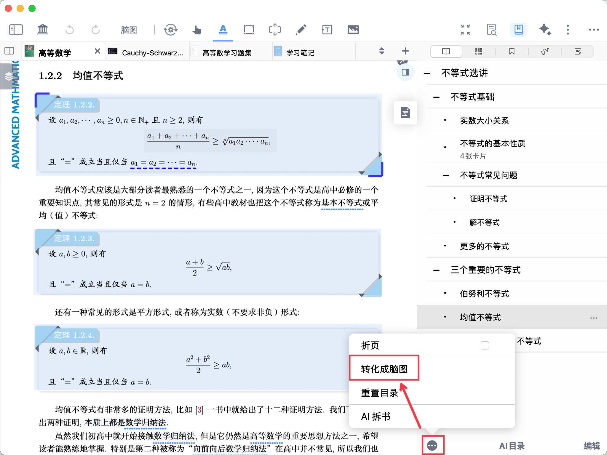
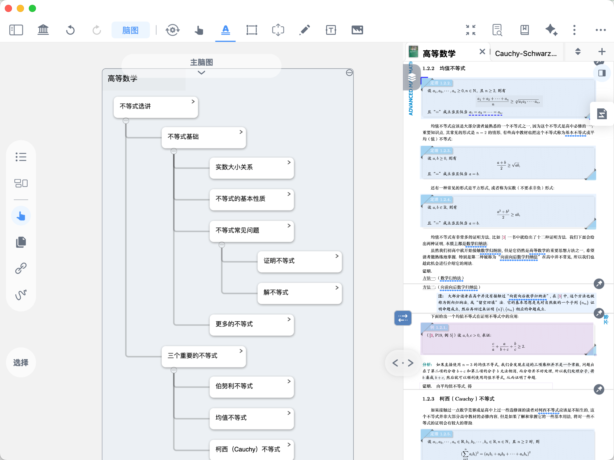

# 手动摘录生成脑图

> 💡完成摘录只是第一步。很多学习者会遇到这样的困惑：摘录了很多内容，卡片却散落在脑图里，不知道怎么组织；或者想把一本教材的笔记整理成清晰的框架，却不知从何下手。
> MarginNote 4 提供了三条路径，可以将文档摘录直接转化为结构化脑图。无论你是边读边记、已经积累了大量摘录，还是面对一本有清晰目录的教材，都有对应的方式：
>
> | 我的情况           | 推荐路径                                                                                                      |
> | -------------- | --------------------------------------------------------------------------------------------------------- |
> | 边读文档，边做脑图      | 路径一：\[边摘录，边生成脑图]\(https\://www\.wolai.com/5sY7oXw6U88xhJnKA6ChUr#kUVmYnWgTtab73z2vzmFNA "边摘录，边生成脑图")      |
> | 已有摘录，想整理成脑图    | 路径二：\[从已有摘录转化为脑图]\(https\://www\.wolai.com/5sY7oXw6U88xhJnKA6ChUr#gTt6bFcD8C9LGj3Cg4TT2b "从已有摘录转化为脑图")    |
> | 文档有目录，想快速搭建框架  | 路径三：\[从文档目录一键生成脑图]\(https\://www\.wolai.com/5sY7oXw6U88xhJnKA6ChUr#gcGSaS1gdhZVpZearpjjyf "从文档目录一键生成脑图")  |

# 1 准备工作

在开始之前，需要完成两项配置，确保摘录内容能够顺利出现在脑图中。

## 1.1 建立学习集，加入文档

> 💡`学习集`是 MarginNote 4 中组织文档与脑图的基本单位。只有将文档加入学习集，摘录内容才能与脑图关联。

建立学习集并加入文档，可以按以下步骤操作：

1. 点击首页右上角  `➕ 新建`按钮，选择新建学习集并为新学习集命名
2. 点击学习集主页的  `➕ 添加`，导入需要学习的文档（详见：[新建学习集：开启主题式学习](https://www.wolai.com/vtjSQ6LvQv1TbbjdctzroM "新建学习集：开启主题式学习")）
3. 文档加入后，点击进入学习集，即可看到文档与脑图的联动界面

## 1.2 调整脑图与文档联动视图

进入学习集后，建议先调整好文档与脑图的显示布局，方便边摘录边查看脑图变化。

- 布局调整：
  - 点击右上角...按钮，进入`学习集-更多`，根据使用习惯勾选文档位置：
    - `文档置于左侧`
    - `文档置于右侧`（默认）
    - `文档置于底部`
  - 也可以直接拖动文档区域，将其拖至左侧、右侧或底部。
- 显示比例调整：拖动文档与脑图之间的`视图调节`按钮，调整文档的显示比例。

> 关于联动视图的更多设置（如横向/纵向布局、多文档显示等），详见[脑图与文档联动视图](https://www.wolai.com/7PQUHR2ZsY58z128y6KtoW "脑图与文档联动视图")。

# 2 路径一：边摘录，边生成脑图

如果你现在正好打开一本新的 PDF，准备从头开始学习，可以按照路径一的方法，实现边摘录、边生成脑图。

> 💡这是最常用的工作方式——在阅读文档的同时，摘录内容会自动添加到脑图中，实时构建知识框架。

## 2.1 配置摘录设置

在开始摘录前，需要先完成两项关键设置，确保摘录内容能够自动出现在脑图中。

[摘录工具设置](https://www.wolai.com/hgMYX7XCNpvGAMxgBfLAQE "摘录工具设置")

1. 点击文档工具栏左上角的摘录工具设置（如上方图标所示）
2. 勾选`自动添加到脑图`
3. 点击`脑图插入位置`，根据需求选择卡片的分组方式
   | 插入位置           | 使用场景                |
   | -------------- | ------------------- |
   | \`分组（按文档目录）\`  | 精度教材，自动按章节目录归组      |
   | \`分组（按文档）\`    | 多文档阅读，自动按文档归组       |
   | \`上次的位置\`      | 自由搭建，卡片添加到上次摘录位置附近  |
   > 关于三种插入方式的详细用法和场景示例，详见[摘录工具及其自动化](https://www.wolai.com/5DiLYYJjNeZ4rQmBpDkRwQ "摘录工具及其自动化")。

以分组（按文档目录）为例：设置完成后，在文档中开始摘录，摘录卡片将自动归入对应的目录章节，脑图框架同步生成

## 2.2 选择摘录工具，开始摘录

完成设置后，选择合适的摘录工具在文档中摘录内容，卡片会自动按照设定的方式添加到脑图中。
MarginNote 4 提供4种摘录工具，适用于不同类型的内容：

| 工具    | 使用场景                      |
| ----- | ------------------------- |
| 文本摘录  | 段落、句子等文字内容                |
| 框选摘录  | 图片、公式、表格等区域               |
| 套索摘录  | 形状不规则的区域                  |
| 留白摘录  | 在文档内或侧部创建可编辑留白区，共有三种摘录形式  |

> 关于每种工具的详细操作步骤，详见[摘录：抓住全文重点](https://www.wolai.com/9aXhp2VEugXYNp9cnWCT7A "摘录：抓住全文重点")。摘录工具还可配置自动化，实现摘录的同时，同步设置好标签、颜色等等，详见：[摘录工具及其自动化](https://www.wolai.com/5DiLYYJjNeZ4rQmBpDkRwQ "摘录工具及其自动化")。

# 3 路径二：从已有摘录转化为脑图

如果你的文档已经学习了一段时间并积累了一批摘录卡片，可以通过以下两种方式将它们添加到脑图中。

## 3.1 单个摘录转化

> 💡适合只需要将个别摘录添加到脑图的情况。

可按照以下步骤进行操作：

1. 在文档中点击需要转化的摘录
2. 在弹出的菜单栏中，点击`添加到脑图`
3. 该摘录卡片将立即出现在脑图中

## 3.2 多个摘录批量转化

> 💡适合需要集中整理某篇文档的全部摘录时。

可按照以下步骤进行操作：

1. 点击脑图侧边工具栏中的`卡片分组看板`（如下方图标所示）

   [卡片分组看板](https://www.wolai.com/eZr3CjDNhGfEF3tuCwtAdu "卡片分组看板")
2. 点击顶部`卡片源`下拉菜单，在`文档`分类下选择需要整理的文档；同时将`分组`设置为`脑图状态`，看板将按“是否添加到脑图”筛选出该文档的全部摘录卡片
3. 在看板中找到`不在脑图中`的卡片，批量选中需要加入脑图的卡片，将它们添加到脑图（[步骤同3.1](https://www.wolai.com/5sY7oXw6U88xhJnKA6ChUr#wtKQ7YoHWUxt6WRro9oNZj "步骤同3.1")）

# 4 路径三：从文档目录一键生成脑图

> 💡对于有清晰目录结构的文档（如教材、报告），可以直接将目录转化为脑图框架，摘录内容会自动归入对应目录脑图的对应章节分支。
>
> 比如摘录第一章节的文字，MarginNote就会自动生成一个以第一章节名称命名的卡片，并自动将新生成的摘录卡片插入到该卡片中成为其子节点。
>
> 

## 4.1 确认文档目录

[书页查找](https://www.wolai.com/bQ3HELpfPdH8QZ4sadPLpu "书页查找")

点击文档右上角的`书页查找`按钮（如上方图标所示），打开`目录`视图，确认文档包含目录。

> 💡提示：若文档没有目录，可手动新建目录，或点击底部`AI目录`按钮让AI自动生成目录。详见：[手动&自动生成文档目录](https://www.wolai.com/djV6nMiEdSaxCacjWcptpA "手动&自动生成文档目录")。

## 4.2 目录转化为脑图

点击目录视图左下角`...`→`转化成脑图`，目录将转化为脑图卡片树。

若将脑图插入位置设置为按文档目录分组（[详见2.1配置摘录设置](https://www.wolai.com/5sY7oXw6U88xhJnKA6ChUr#98jgr9jWGyuBX5gWPBQKVi "详见2.1配置摘录设置")），则后续文档中的摘录将自动插入到目录脑图树中。这样一来，脑图中的卡片结构就如同文档目录一般清晰，即便不打开文档也能轻松在脑图中定位目标章节的卡片。

# 5 脑图生成后，如何高效利用？

脑图生成后，你可以进一步与文档对照查看、整理排版，以及用脑图来复习。

## 5.1 与文档对照查看

> 💡在脑图与文档之间互相定位，点击卡片可跳转到文档原文，点击文档摘录可定位到对应卡片。

[联动控制](https://www.wolai.com/e2NfttLMBb7xjDTRVMA3jh "联动控制")

点击`联动控制`按钮（如上方图标所示），切换到`双向联动`模式

- 在文档中点击摘录高亮、留白，脑图将自动定位到摘录卡片所在位置
- 单击脑图中的摘录卡片，或依次点击卡片右上角的“`>`”按钮-`文档位置`，文档将自动定位到摘录所在页面，突出高亮或框选摘录位置

> 关于脑图与文档联动的详细用法，请见：[脑图与文档联动视图](https://www.wolai.com/7PQUHR2ZsY58z128y6KtoW "脑图与文档联动视图")。

## 5.2 脑图整理和排版

摘录完成后，可以对脑图进行重排、缩放、层级收展，或调整分支样式，让脑图结构更清晰易读。详见[脑图重排、缩放、层级收展](https://www.wolai.com/bAQx7CjrxjacHzdVKUb5VV "脑图重排、缩放、层级收展")、[10种分支样式&子脑图坍缩](https://www.wolai.com/iXZn5PKLW4iogVnxZwQ4pt "10种分支样式&子脑图坍缩")

## 5.3 用脑图复习

脑图不只是笔记，也是复习工具。可以通过主动回忆和自测方法检验掌握程度，也可以利用回源定位在脑图上下文中快速找回原文。详见[脑图复习①：主动回忆与自测方法](https://www.wolai.com/5MLZk1D4vJ6wQRx1Y9t8vy "脑图复习①：主动回忆与自测方法")、[脑图复习②：脑图上下文（回源定位）](https://www.wolai.com/xb9ytGwYP6gPVGJ4hDvca4 "脑图复习②：脑图上下文（回源定位）")

