# 脑图手写图层：分层管理你的批注

> 💡**本页功能概述：**
>
> 在脑图画布区上，新建并管理多个`手写图层`，就像Photoshop的图层一样，实现分层记录、叠加参照与快速切换。例如：第一轮做题用图层1，第二轮订正用图层2，复习时可以叠加对比。
>
> 如果你还不了解基本的手写功能，推荐阅读：[手写： 在文档、脑图、卡片中自由书写](https://www.wolai.com/pYzC5dfXtbC7taLgQC3DFs "手写： 在文档、脑图、卡片中自由书写")。

# 1 创建手写图层

通过了解什么是默认手写图层、如何新建手写图层和切换图层，你可以在脑图画布上实现更清晰的分层记录与复习管理。

> 💡**使用场景**
>
> - **默认层快速批注：**
>
>   随手批注、不需分层管理时，直接在画布书写，笔迹自动保存在`默认手写图层`。
> - **创建独立图层分轮复习：**&#x20;
>
>   通过点击或双击手写图标，进入手写设置，`➕新建手写层`并命名。将**一轮做题**、**二轮复习**分别记录到不同图层，便于分层回看与对比。
> - **多任务并行：**&#x20;
>
>   不同主题/任务分别使用独立图层，在编辑时快速切换。
>
>   例如，“推导”图层记录数学公式的推导过程，“错题”图层记录答题过程。

## 1.1 默认手写图层

> 💡在无新建手写图层的情况下，手写工具在脑图画布上的批注会保存在`默认手写图层`里。
>
> **默认手写图层作为基础图层始终保留，不可删除，确保你的笔迹始终有地方保存**。

## 1.2 新建手写图层

> 💡建议初学者：先使用`默认层`记录关键批注，需求明确后再**新建**`手写图层`。

[脑图手写工具](https://www.wolai.com/2Cfr7YMtWVH4a9dgyDdNev "脑图手写工具")

双击[脑图手写工具](https://www.wolai.com/2Cfr7YMtWVH4a9dgyDdNev "脑图手写工具")（如上方图标所示），打开`脑图手写设置`面板：

- 选择`➕ 新建手写层`
  - 输入新层名，创建空白手写图层。
  > 💡命名建议（便于后续合并与检索）：
  >
  > - 使用主题/日期/轮次等规则，如“概率论\_1125\_一轮”“阅读\_二轮复盘”。

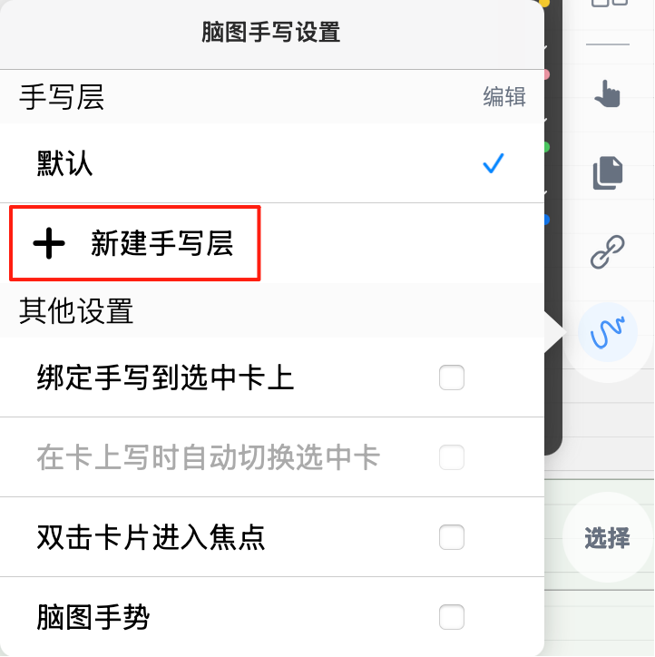

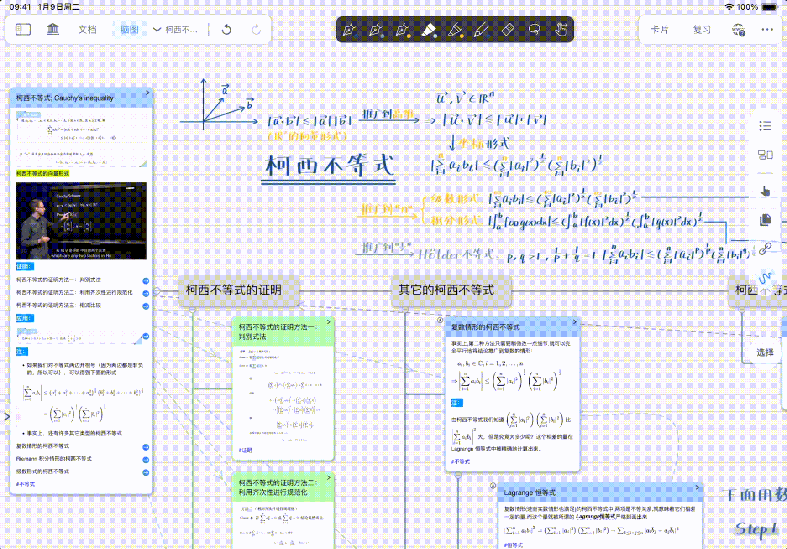

# 2 使用手写图层

## 2.1 切换图层

有两种方法可以切换手写图层。

点击/双击[脑图手写工具](https://www.wolai.com/2Cfr7YMtWVH4a9dgyDdNev "脑图手写工具")图标，打开`脑图手写设置`面板，直接点击不同的图层，即可完成切换。

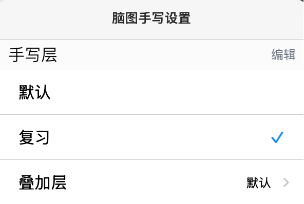

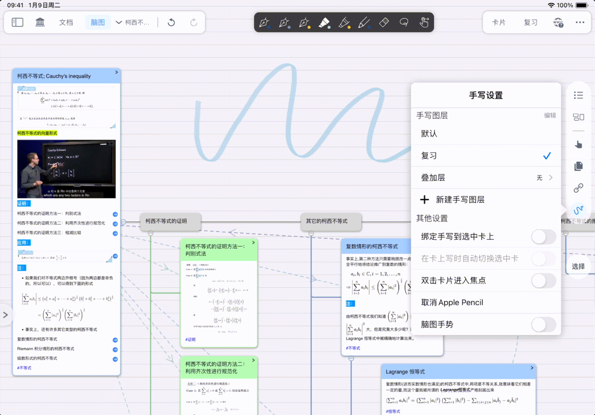

## 2.2 叠加层

> 💡**叠加层**：将其他图层以半透明方式显示在当前图层上方（类似字帖、描图纸），只能查看不能编辑，用于参考和对比。
>
> 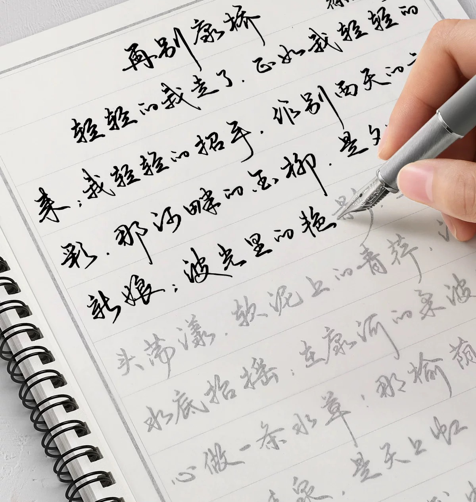

> 💡**叠加层使用场景**
>
> - **对比参考：**&#x20;
>
>   通过`叠加层`功能，将一个或多个手写图层以半透明方式显示在当前图层上。适用于需要**参考**、**对比**、**整合不同批注内容**的场景，比如**复习时叠加一轮做题内容和二轮对答案**等内容。
> - **回忆模式自测：**&#x20;
>
>   开启[文档复习：遮挡挖空与回忆模式](https://www.wolai.com/fyHE27B9XM8VeZ4G2xkFhZ "文档复习：遮挡挖空与回忆模式")后，`叠加层`批注自动隐藏。**适合自测、复习**时避免干扰，减少干扰、专注当下内容。

> 💡仅当需要跨层对照/多轮复习/整合时，再使用叠加层。

- **开启/关闭**`叠加`：点击`叠加层`，选择`无`，则关闭`叠加层`的显示。
- 点击`叠加层`，选择需要叠加的图层：
  - 叠加的手写图层将以**半透明形态**呈现在当前图层，**不可编辑**，仅供参考对照。

    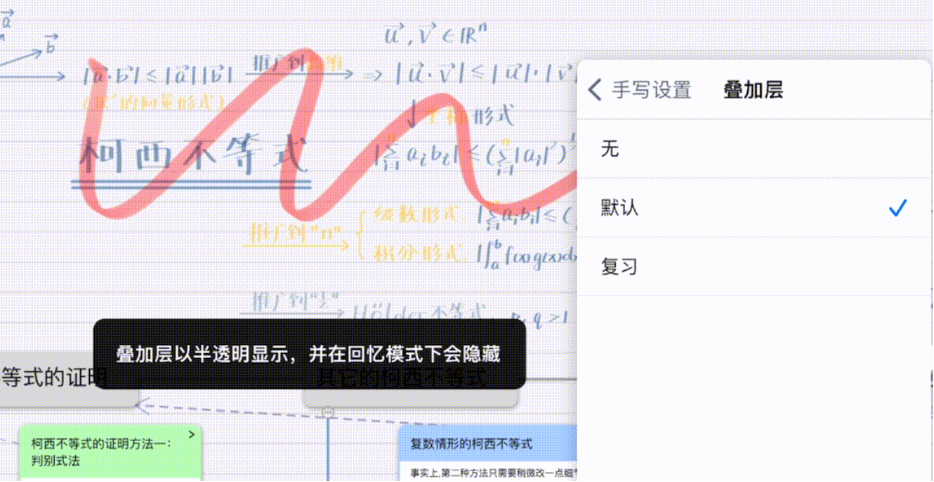

    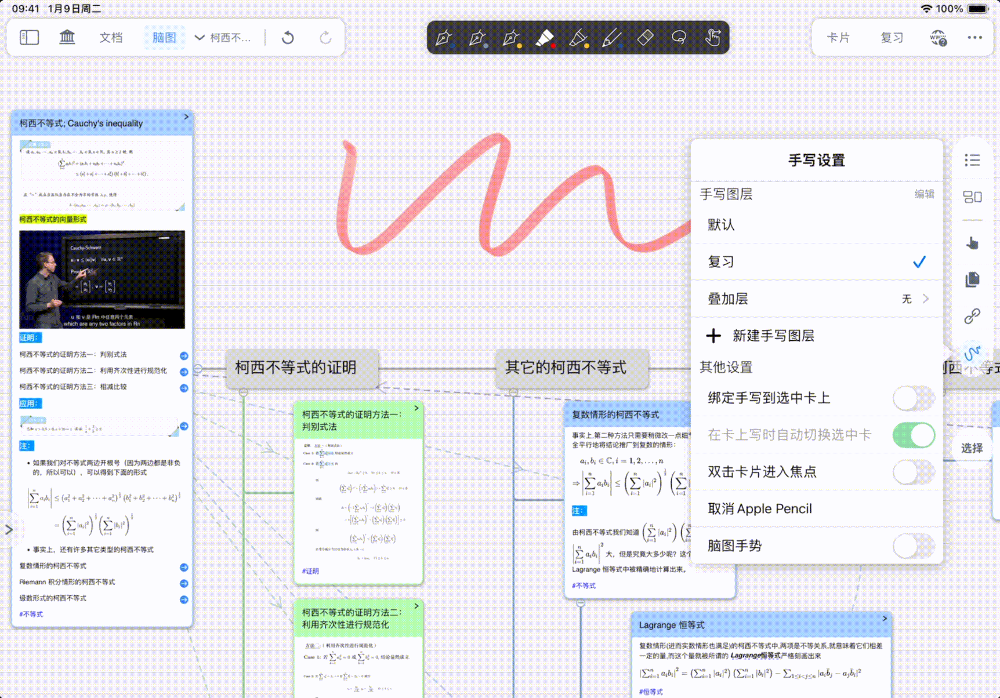
  - **与回忆模式：** 开启`回忆模式`后，`叠加层`批注将自动隐藏（用户自测与强化回忆）。

    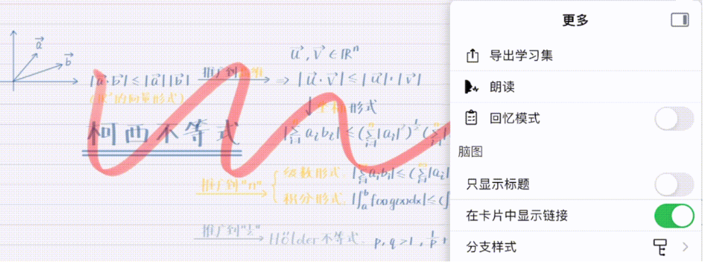

    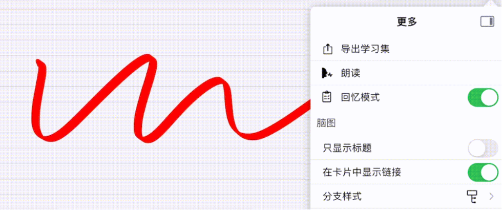

    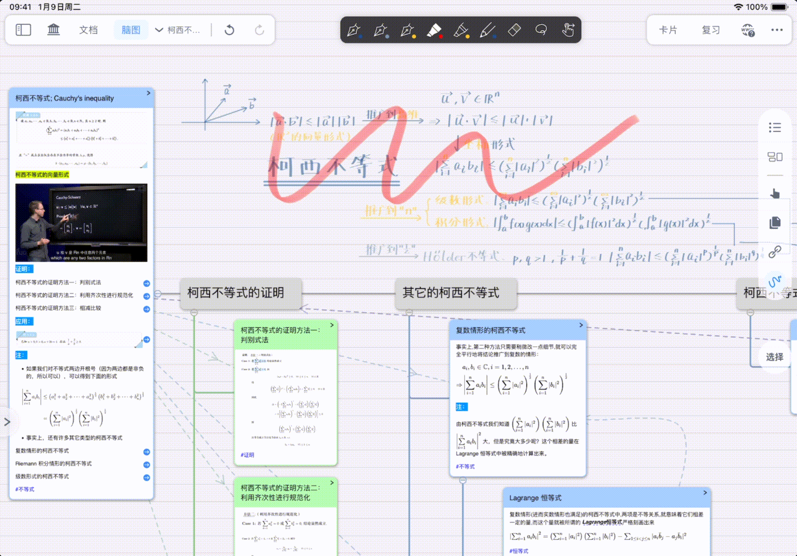

# 3 管理手写图层

**进入编辑：** 在`手写层`，选择右上的`编辑`，点击`手写图层`后的`...（更多）`。

## 3.1 重命名或合并手写图层

点击`脑图手写设置`- `手写层` - `重命名或合并`

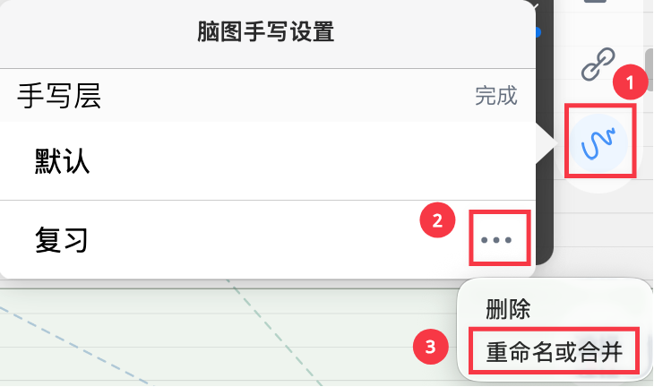

- **重命名：** 输入新层名，即可重命名当前手写图层。
- **合并：** 输入已有目标层名，即可将两个手写图层合并。

  

## 3.2 删除手写图层

> 💡删除图层为不可逆操作，请先确认这个图层的内容完全不需要。
>
> 建议先使用`合并`保留有效批注。

- 点击`脑图手写设置`- `手写层` - `删除`

  

  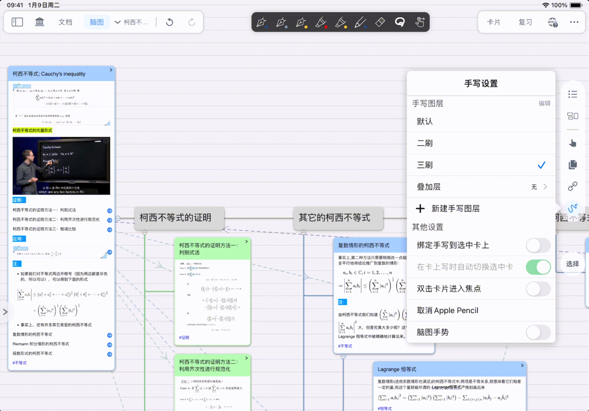

***

> 💡**总结：脑图手写图层的推荐工作流**↓
>
> 1. 开始学习时，先在默认层快速批注 &#x20;
> 2. 需要分轮复习时，创建"一轮""二轮"等图层 &#x20;
> 3. 复习时叠加上一轮的图层，对比学习进度 &#x20;
> 4. 学期结束后，合并所有图层或删除临时图层
