# 脑图卡片①：新建和编辑卡片

> 💡**什么是脑图卡片？**
>
> 脑图卡片是 MarginNote 中的核心笔记单元。你可以将它理解为：
>
> - 在文档中摘录时，它叫"摘录"
> - 在脑图中整理时，它叫"脑图卡片"或"笔记卡片"
> - 添加到复习卡组后，它叫"闪卡"或"复习卡片"
>
> 它们是同一个对象的不同身份，可以在文档、脑图、复习卡组之间自由流通。

> 💡**本页您将学到：**
>
> 1. [认识卡片的构成（标题、摘录、评论）](/67hDfmy3SZi4oXmMb2bvcH "认识卡片的构成（标题、摘录、评论）")
> 2. [5种新建卡片的方式](/67hDfmy3SZi4oXmMb2bvcH "5种新建卡片的方式")
> 3. [快速编辑单张或多张卡片](/67hDfmy3SZi4oXmMb2bvcH "快速编辑单张或多张卡片")
> 4. [使用卡片编辑器深度编辑](/67hDfmy3SZi4oXmMb2bvcH "使用卡片编辑器深度编辑")

# 1 认识卡片的三个构成部分

## `1.1 标题`（Title）

- **纯文本字段**，不支持 markdown格式
- **有长度限制**，最多 250个字符
  > 💡**提示**： 标题不建议过长，超过字数限制时，建议将多余内容移到评论中

## `1.2 摘录`（Excerpt）

- **来自文档的内容**，例如文字、图片。
- 使用摘录工具从文档中提取的原始内容
- 保留了与文档的关联，可以定位回原文

## `1.3 评论`（Comment）

- **你自己添加的笔记内容**
- 支持多种格式：
  - 手写笔迹
  - 富文本（支持 Markdown/LaTeX/HTML/CSS）
  - 代码块、Mermaid 流程图
  - 音频、图片
  - 标签
- 可通过`编辑评论` 调整评论的顺序或删除评论

> 💡**摘录 vs 评论的区别：**
>
> - **摘录**：来自文档的原始内容，保留文档关联
> - **评论**：你添加的补充内容，如理解、分析、记忆技巧等

# 2 新建脑图卡片的5种方式

## 2.1 5种新建方式对比表

| 方式           | 适用场景      | 优点         | 快速操作                |
| ------------ | --------- | ---------- | ------------------- |
| **从空白新建**​   | 头脑风暴、自由创作 | 快速、灵活      | 双击脑图空白处             |
| **从节点新建**​   | 扩展已有结构    | 保持层级关系     | 选中卡片 → ➕            |
| **从大纲新建**​   | 快速输入大量文字  | 类似Word，效率高 | 大纲中按 Enter          |
| **从文档摘录**​   | 从教材文档提取内容 | 保留原文       | 摘录工具选择文档内容          |
| **用 AI 新建**​ | 批量生成卡片    | 省时省力       | AI 对话 + \\\[创建卡片]模块 |

## 2.2 方式一：从空白新建卡片

**双击**脑图空白处，即可快速新建卡片；或[🖼️ 图片](<image/CleanShot 2025-11-03 at 16.00.20@2x_6hArsq2_9y.png> "🖼️ 图片")

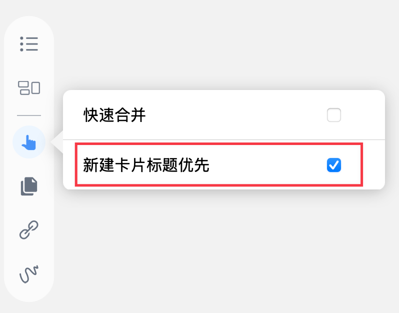

> 💡**设置：新建时输入标题还是正文？**
>
> 默认情况下，新建卡片时会让你输入卡片正文。如果你希望先输入标题，可以设置：
>
> 点击脑图侧边工具栏 →**手形工具**→ 开启`新建卡片标题优先`

## 2.3 方式二：从脑图节点新建卡片

[新子卡片](https://www.wolai.com/dtorfbp4KaksGbstWh6F8R "新子卡片")

[新同级卡片](https://www.wolai.com/p658Q7xSuXq3hqoGS24U3j "新同级卡片")

- [🖼️ 图片](image/image_7GhyDaLdvP.png "🖼️ 图片")（如上方图标所示）
  - `新子卡片`：作为当前卡片的下级节点
  - `新同级卡片`：与当前卡片处于同一层级
  - `新上级卡片`：作为当前卡片的上级节点

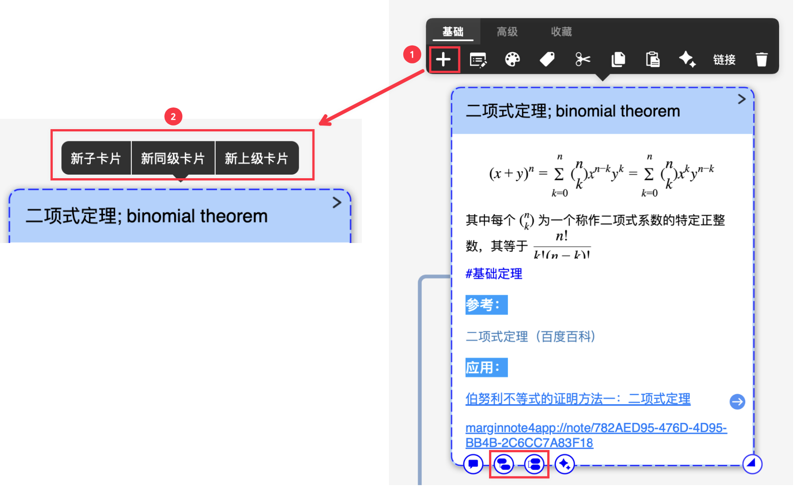

> 💡**使用场景：**
>
> - 新子卡片：扩展知识点的细节
> - 新同级卡片：并列添加相关知识
> - 新上级卡片：为现有卡片归纳上级分类

## 2.4 方式三：从大纲节点新建卡片

[大纲](https://www.wolai.com/6nh8iGMPB2HsDP3m9ZhF9o "大纲")

进入大纲编辑视图，在任一节点末位按下`回车Enter`，即可新建1张同级卡片。

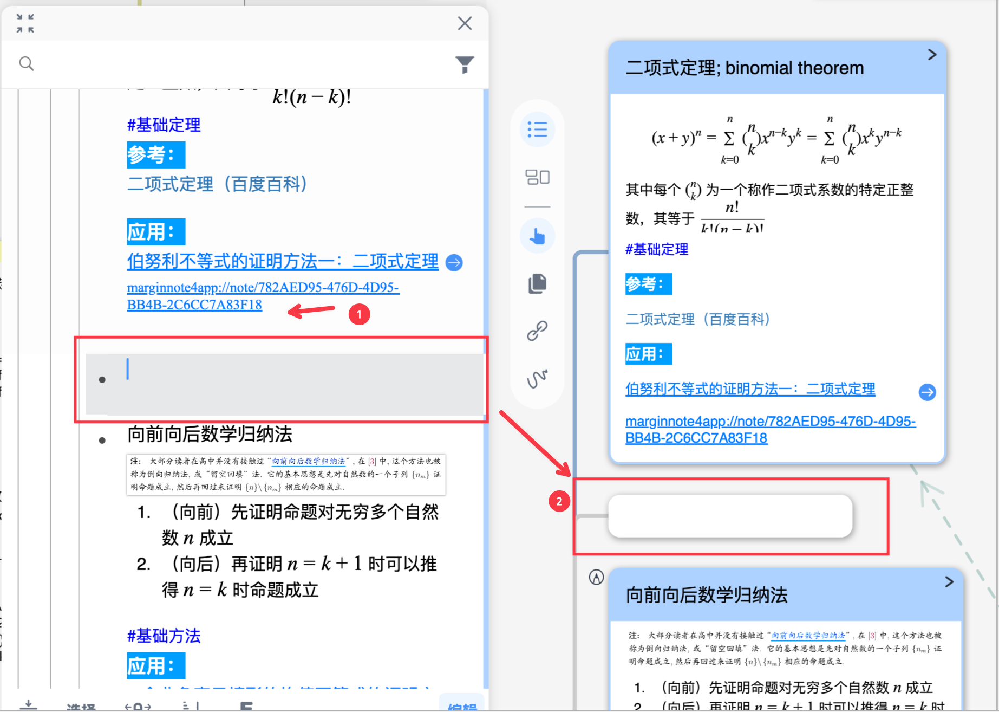

> 💡优势： 大纲视图类似 Word 的大纲模式，适合快速输入大量文字内容，然后自动生成脑图结构。

> 关于大纲的更多用法，详见：[大纲编辑和缩进](https://www.wolai.com/iRnRj5X6AuY3qmEbM8iDuV "大纲编辑和缩进")

## 2.5 方式四：从文档摘录新建卡片

使用摘录工具（或手形工具）摘录文档中的内容，并添加到脑图。

这种方式创建的卡片会保留与文档的关联，可以定位回原文。

> 详细教程：[手动摘录生成脑图](https://www.wolai.com/5sY7oXw6U88xhJnKA6ChUr "手动摘录生成脑图")

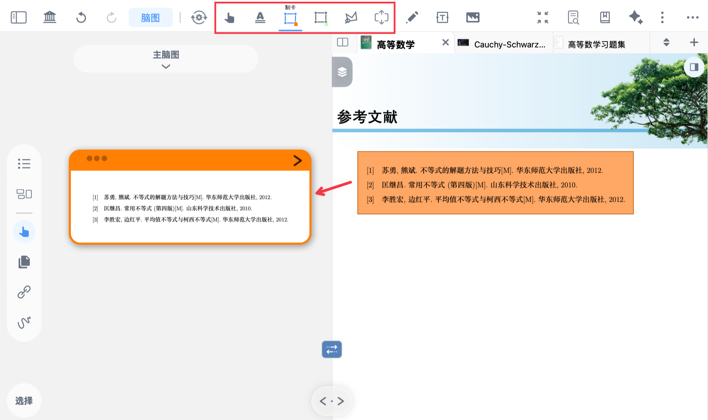

## 2.6 方式五：用AI新建卡片

打开 AI 侧边栏或浮窗，输入制卡的具体要求，并加入 **\[创建卡片]** 模块，AI 将根据要求自动制卡。

💡**基本操作：**

1. 打开 AI 对话窗口
2. 输入制卡要求，例如："将这段文字制作成脑图卡片"
3. 添加 \[创建卡片] 模块
4. 发送给 AI，自动生成卡片

> 关于AI 的更多用法，详见：[认识对话侧边栏（Chat）：还原完整思考过程](https://www.wolai.com/5iNniGsRaUaEWhu4QaXwYB "认识对话侧边栏（Chat）：还原完整思考过程")、[认识提问浮窗（Ask）：在文档和脑图中就地向 AI 提问](https://www.wolai.com/b2MDrDqhWt8LGrmSQD2JYo "认识提问浮窗（Ask）：在文档和脑图中就地向 AI 提问")、[善用模块，3秒写好提示词](https://www.wolai.com/8AT2HxDZJcfh67JkPagVPC "善用模块，3秒写好提示词")

# 3 快速编辑卡片

## 3.1 编辑单张卡片

### 3.1.1 快速编辑内容

**双击**卡片的**标题/摘录/评论**，可快速进入对应的编辑模式。

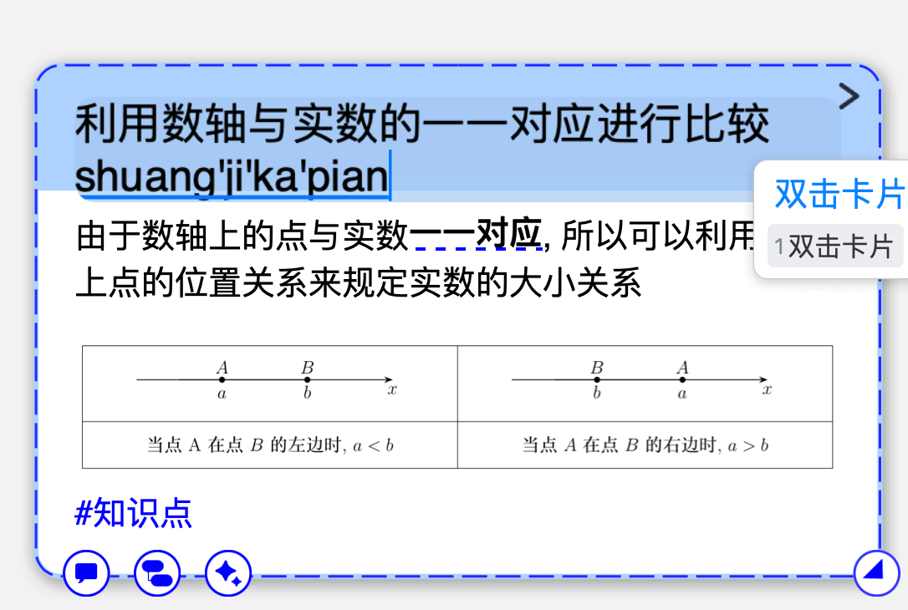

### 3.1.2 修改颜色和标签

单击卡片唤出菜单栏，可在基础栏修改卡片的**颜色、标签**

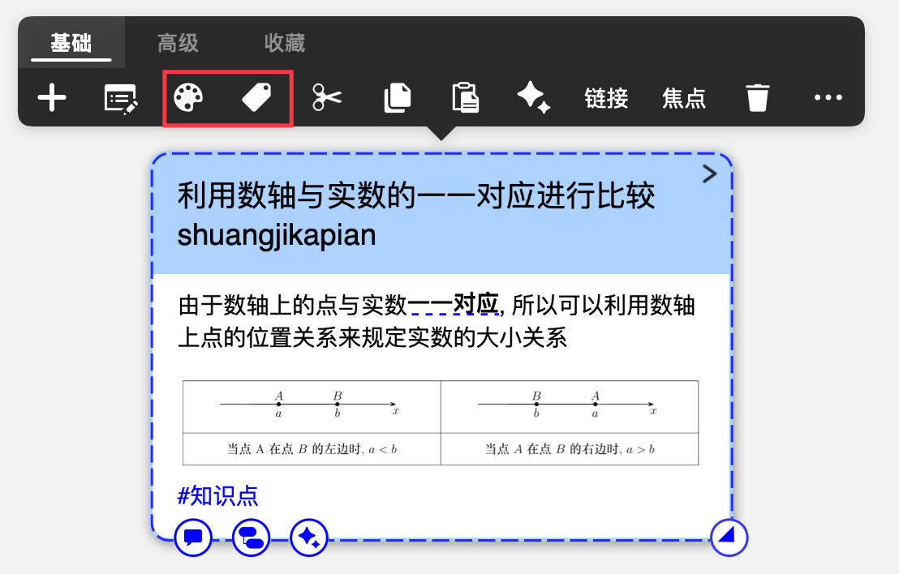

> 关于卡片弹出菜单栏的更多用法，详见：[卡片弹出菜单栏及其自定义](https://www.wolai.com/6QJHeJqZghQKQ4PcEA3w5u "卡片弹出菜单栏及其自定义")。

## 3.2 批量编辑多张卡片

### 3.2.1 矩形拖拽/选择工具：批量编辑相邻的多张卡片

在脑图空白处**长按后拖拽**，框住目标卡片，在底部菜单栏可对这些卡片批量编辑。

**常用操作：**

- **剪切 / 复制：** 复制卡片到剪贴板
- **颜色 / 标签：** 修改卡片的颜色、标签
- **链接：** 获取卡片的双向链接
- **删除：** 删除所选卡片
- **对话**：进入 AI 对话窗口

**高级操作**：详见[脑图底部工具栏](https://www.wolai.com/gtcCcPwxxQihkAKiTSrb9c "脑图底部工具栏")

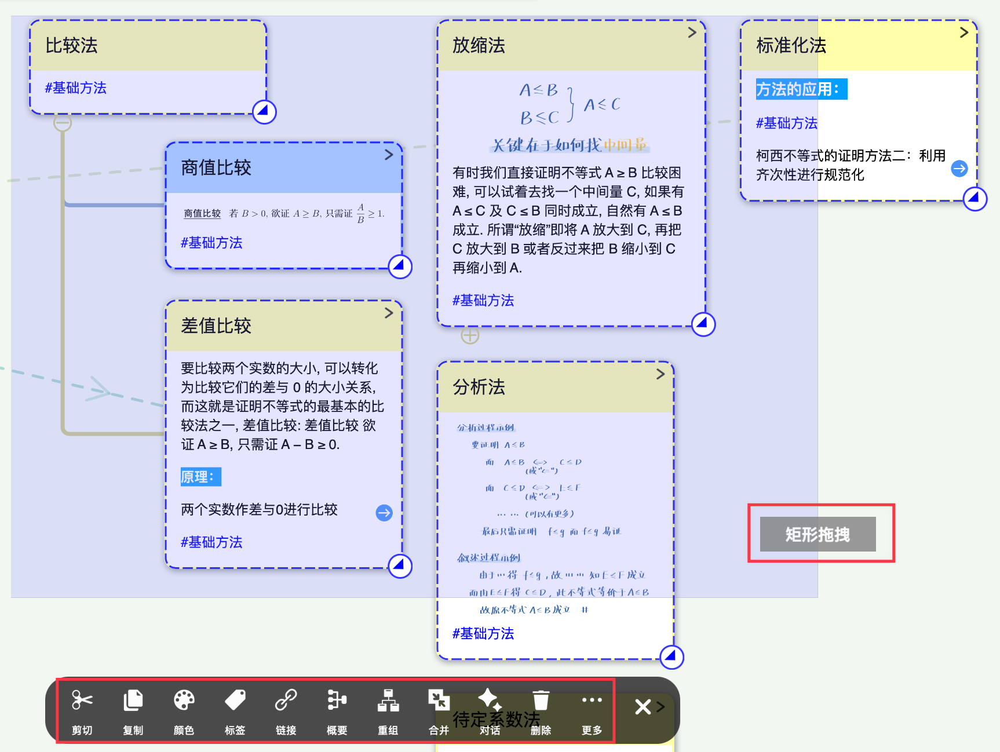

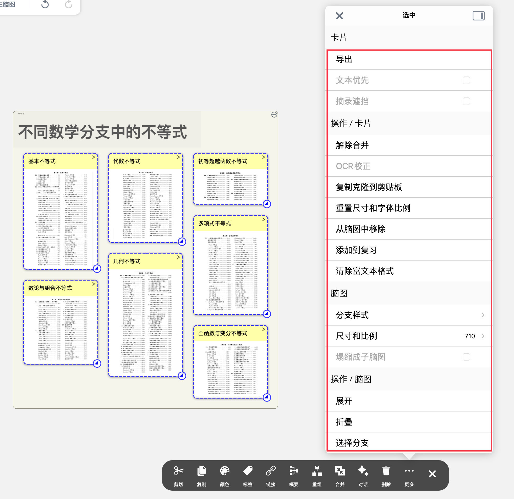

### 3.2.2 选择分支：批量编辑整个分支的卡片

当卡片分支超长、不方便用矩形拖拽全部选中时，可以使用`选择分支`功能一次性选中所有分支。

**操作步骤：**

1. 框选目标卡片
2. 点击底部菜单栏的`更多`
3. 选择`选择分支`
4. 该卡片及其所有下级节点会被全部选中

> 💡**使用场景**： 将整个分支发送给 AI、批量添加到复习、批量修改颜色等。

## 3.3 使用大纲快速编辑

[🖼️ 图片](image/image_hYxzx6icwu.png "🖼️ 图片")。

> 💡大纲视图尤其适合编辑卡片的**标题及内容字段**，类似在 Word 中编辑文本。

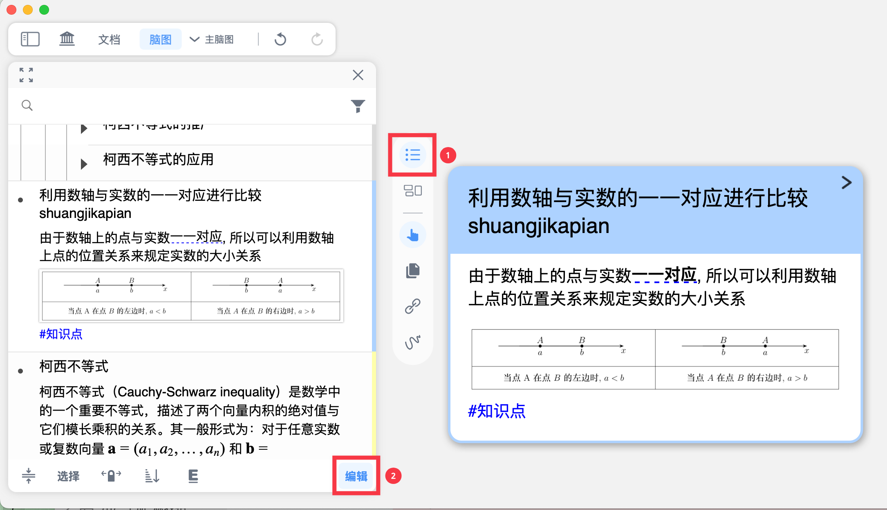

> 关于大纲编辑的更多用法，详见：[大纲编辑和缩进](https://www.wolai.com/iRnRj5X6AuY3qmEbM8iDuV "大纲编辑和缩进")。

# 4 使用卡片编辑器深度编辑

卡片编辑器是一个独立的编辑窗口，可以对单张卡片进行深度编辑和管理，支持 Markdown、LaTeX、代码块等富文本格式。

> 💡**何时使用卡片编辑器？**
>
> - 需要添加复杂内容（代码、公式、音频、图片等）
> - 需要精细调整卡片的多条评论
> - 需要设置闪卡正反面（复习卡片模式）

## 4.1 如何打开卡片编辑器

[卡片编辑器](https://www.wolai.com/rdhVCYTJL3YakoYW4QxtzC "卡片编辑器")

单击脑图中的卡片，在弹出菜单栏中点击编辑器图标（如上方图标所示），打开卡片编辑器。

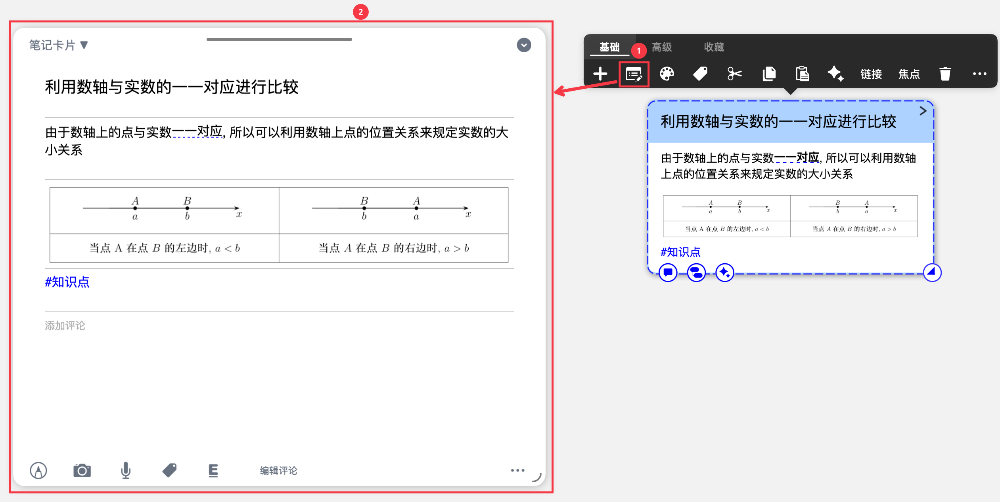

## 4.2 编辑器窗口概览

- **左上角**：切换卡片属性
  - `笔记卡片`：在文档和脑图中所见的学习卡片
  - `复习卡片`：闪卡，分为正面（问题）和背面（卡片全部内容）
    - 需先把卡片`添加到复习`，才能切换到复习卡片
- 右上角：关闭卡片编辑器
- 顶部横条：按住拖动可移动编辑器的位置
- 右下角：按住拖动可缩放编辑器窗口

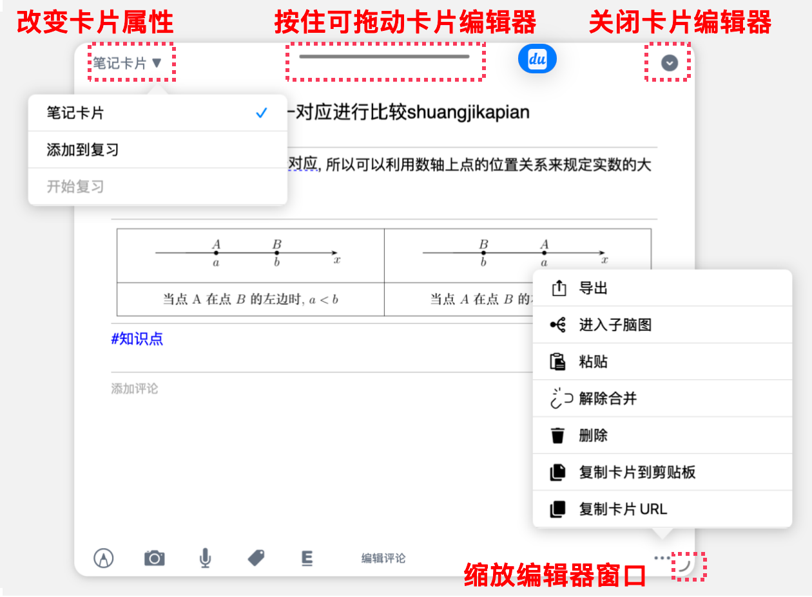

## 4.3 编辑文字样式（支持Markdown）：

可修改字体、字号，划重点，修改字体底纹、字体颜色

> ⚠️**注意**： 卡片标题不支持 Markdown，只有评论支持 Markdown 格式。

## 4.4 编辑器底部工具栏常用功能

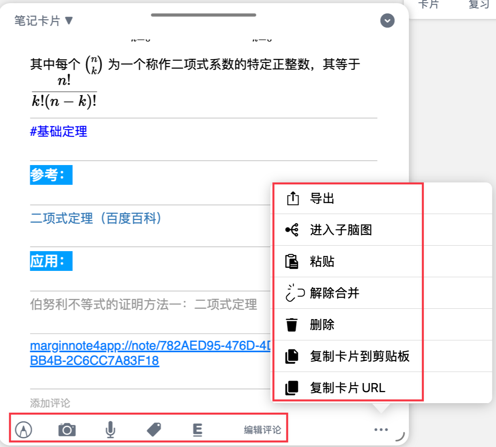

> 💡以下仅介绍**笔记卡片**的编辑器功能，**复习卡片（闪卡）** 的编辑功能详见：[闪卡制作③：设置闪卡正反面](https://www.wolai.com/pBH9BFrgyZgeWJVf3xLyVA "闪卡制作③：设置闪卡正反面")

**从左到右依次为：**

1. `Apple Pencil涂画模式`
   - 在卡片内图片上涂画和标记
   - 在评论区（下方空白界面）涂画，用于演算、分析等
2. `相机/照片库`

   [相机](https://www.wolai.com/tN9K5fiLSVpNBGMY8GV6La "相机")

   可选择**相机拍照、从照片库选择图片**两种方式，向卡片中添加照片。
   > 💡使用场景：
   >
   > 1. 听课时快速拍摄ppt加入笔记中
   > 2. 在脑图知识点中添加其他网页或纸质载体中错题等不易复制的内容，可直接截图添加

- 相机拍照支持闪光灯、形状识别、自动快门等功能，详见：[相机](https://www.wolai.com/tN9K5fiLSVpNBGMY8GV6La "相机")

1. `音频`

   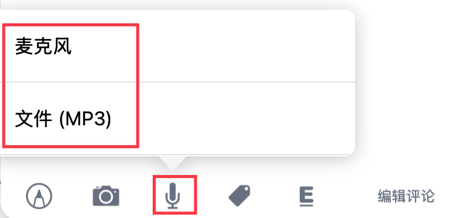

   新建录音或从系统文件app中选择音频。新建录音操作详见：[麦克风](https://www.wolai.com/mMEaofc6vYyYWp5y67BFf3 "麦克风")
   > 💡可用于录课堂讲解，或个人口语练习、讲解知识逻辑等
2. `标签`

   为卡片新建标签或添加到已建立标签。

   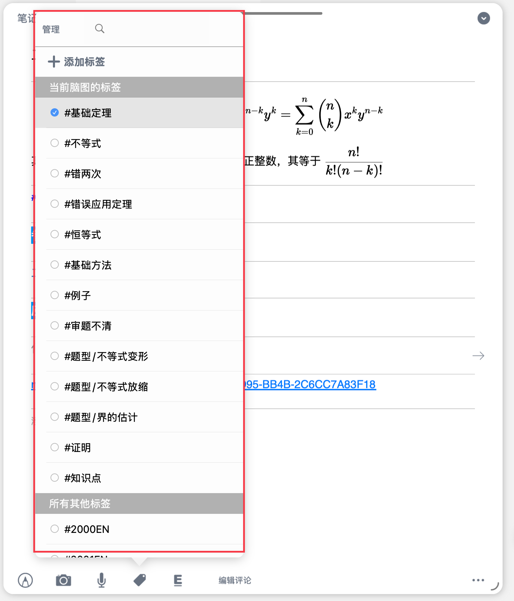
3. `划重点`
   - 对卡片评论的字符块添加划重点（填空）格式。
   - 在开启回忆模式或添加到复习卡组后，划重点的部分将隐藏，可用于复习、回忆，详见：[文档复习：遮挡挖空与回忆模式](https://www.wolai.com/fyHE27B9XM8VeZ4G2xkFhZ "文档复习：遮挡挖空与回忆模式")、[闪卡制作②：添加卡片到复习卡组](https://www.wolai.com/pKZaNAWQAm3Wp41awj1ZJb "闪卡制作②：添加卡片到复习卡组")。
   > 💡注意：Markdown 格式的评论暂不支持划重点功能。
4. `编辑评论`

   调整评论显示顺序、删除评论
   > 💡若没有找到`编辑评论`功能，请尝试拉宽编辑器窗口。
5. `更多`

   详见：[卡片编辑器](https://www.wolai.com/rdhVCYTJL3YakoYW4QxtzC "卡片编辑器")

# 5 常见问题

**Q1：标题、摘录、评论的区别是什么？**

A：标题是卡片的名称，摘录是来自文档的原始内容，评论是你自己添加的笔记。

**Q2：新建卡片时，什么时候输入标题，什么时候输入正文？**

A：默认输入正文。如果你希望先输入标题，可以在手形工具设置中开启`新建卡片标题优先`。

**Q3：从文档摘录和从空白新建有什么区别？**

A：从文档摘录的卡片保留了与文档的关联，可以定位回原文；从空白新建的卡片是独立的，没有文档关联。

**Q4：如何快速编辑卡片的标题？**

A：双击卡片标题，即可快速进入编辑模式。

**Q5：卡片编辑器和大纲编辑有什么区别？**

A：卡片编辑器适合深度编辑单张卡片的复杂内容；大纲编辑适合快速编辑多张卡片的标题和文字。

# 6 📌 下一步

恭喜你掌握了新建和编辑脑图卡片的基本方法！

接下来，学习如何组织和管理大量的脑图卡片，构建结构化的知识体系：

→**继续学习：** 脑图卡片②：卡片组织与管理
