# 卡片弹出菜单栏及其自定义

> 💡场景实例
>
> - **简单整理**：生成卡片后，有时需要整理卡片内容，通过颜色、标签等对卡片进行区分，
> - **丰富内容**：有时也需要针对卡片内容向ai提问。
> - **深入链接**：在整理脑图大纲时，需要调整卡片所在层级，对卡片进行剪切、复制、粘贴。也需要将卡片彼此链接。

# 1 唤起卡片上弹菜单

单击卡片，[🖼️ 图片](image/IMG_1389_HsnECMh5ma.jpeg "🖼️ 图片")，对卡片进行编辑和整理：

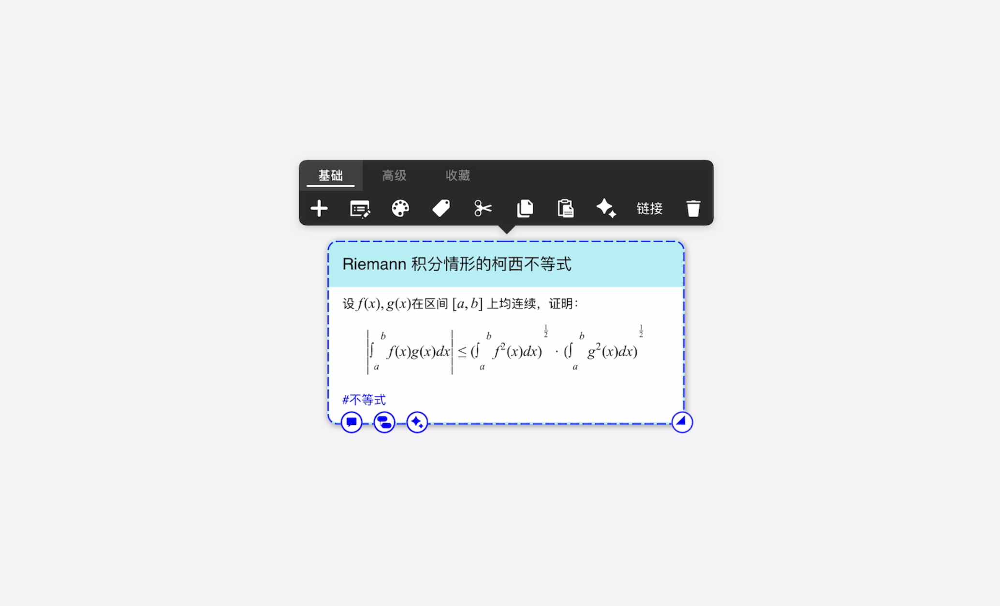

# 2 上弹菜单布局

弹出菜单栏由三部分组成：`基础`、`高级`和`收藏`

- [🖼️ 图片](<image/CleanShot 2025-09-28 at 16.36.19@2x_TVusp1D1kJ.png> "🖼️ 图片")：对该卡片进行简单的操作，包含[添加新卡片](https://www.wolai.com/fZVYVwngNnohGNroR9ji8Y "添加新卡片")、[卡片编辑器](https://www.wolai.com/rdhVCYTJL3YakoYW4QxtzC "卡片编辑器")、[选择颜色](https://www.wolai.com/itZKksYuLFJaUyM7JJ7oDw "选择颜色")、[复制](https://www.wolai.com/H6nhkfEJUyQXs43YqThzY "复制")、[剪切](https://www.wolai.com/bpNyzEyiASt8wGBUtwSjAV "剪切")、[粘贴](https://www.wolai.com/6UpgK22t2D1kHqnJvtmigH "粘贴")、[向AI提问](https://www.wolai.com/rcKVh1HiKybKzJrNveYMWa "向AI提问")、[删除](https://www.wolai.com/6WFcR1Djfow4F7YWkkPqaK "删除")等操作
- [🖼️ 图片](<image/CleanShot 2025-09-28 at 16.36.34@2x_u0cpFaQTKC.png> "🖼️ 图片")：对该卡片进行较为复杂的操作，包含[添加复习](https://www.wolai.com/qHuiKdXtd9h7jYo6P9e52k "添加复习")、[设为标题](https://www.wolai.com/x1SRqKwPye7DaPndATqcGr "设为标题")、[OCR校正](https://www.wolai.com/hYB5T5Y4JijsQTSNN6zHNc "OCR校正")、[研究](https://www.wolai.com/7AXUEU5B5UUuEGW1m7oZ9z "研究")（在MN内置浏览器中搜索）、[文本优先](https://www.wolai.com/jkmju3chfezdjB2FYxa3g5 "文本优先")、[分支](https://www.wolai.com/3JmBrm2aQRChW8iwJsDq78 "分支")（选择分支样式）、[焦点](https://www.wolai.com/7Zm4rcdrCpC43ug3VCxQ87 "焦点")、[坍缩成子脑图](https://www.wolai.com/jpZtd3REF3Yc7Pmdg3PZ8d "坍缩成子脑图")等等

> 💡上弹菜单栏中展示的功能，会因卡片性质不同而改变。例如不含图片的卡片，不会出现“`文本优先`”功能

- [🖼️ 图片](<image/CleanShot 2025-09-28 at 22.40.57@2x_6yXA9itdrZ.png> "🖼️ 图片")：`基础`和`高级`中的常用功能，可以在`收藏`中进行汇总，无需来回切换。点击“＋”符号进入编辑收藏界面（下图），[🖼️ 图片](image/IMG_1397_Z-saucqUsN.jpeg "🖼️ 图片")

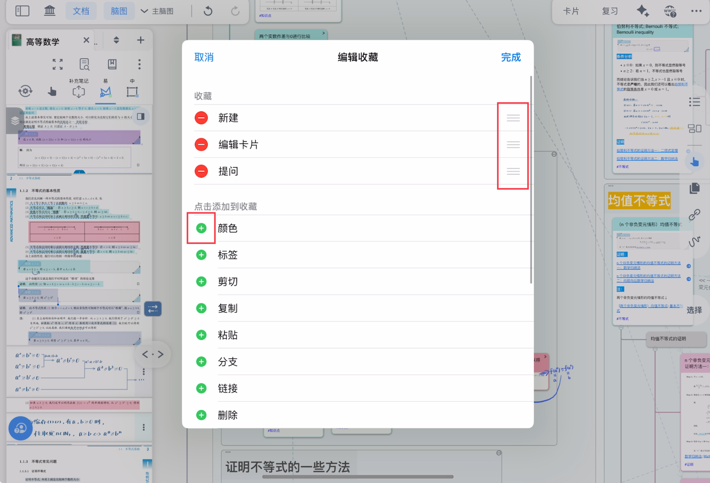

# 3 菜单栏功能详解

## 3.1 基础菜单栏

### 3.1.1 添加新卡片

[添加新卡片](https://www.wolai.com/fZVYVwngNnohGNroR9ji8Y "添加新卡片")

点击`基础`-最左侧“`＋`”符号（如上图所示），可在该卡片的相关层级添加新卡片

- **添加新子卡片**：在下一个层级新建一个空白卡片，排序在该层级的最末尾。
- **添加新同级卡片**：在同一个层级新建一个空白卡片，排序与该卡片紧邻。
- **添加新上级卡片**：在上一个层级新建一个空白卡片，排序在该卡原本的位置。
  > 💡该功能可以缩短“添加同级卡片”→“将同层级卡片移入下层级卡片”→“调整该分支顺序”这一操作链路

### 3.1.2 进行卡片编辑

[卡片编辑器](https://www.wolai.com/rdhVCYTJL3YakoYW4QxtzC "卡片编辑器")

点击`基础`-卡片编辑器图标（如上图所示），可以深入修改卡片内容，具体可参考：[脑图卡片①：新建和编辑卡片](https://www.wolai.com/67hDfmy3SZi4oXmMb2bvcH "脑图卡片①：新建和编辑卡片")

### 3.1.3 改变卡片颜色

[选择颜色](https://www.wolai.com/itZKksYuLFJaUyM7JJ7oDw "选择颜色")

点击`基础`-选择颜色图标（如上图所示），可以修改卡片颜色，也可以修改卡片对应摘录的颜色和高亮方式

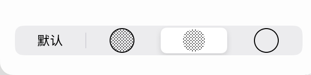

> 💡可以按照使用场景选择高亮方式，例如当不想让摘录显眼，影响文档内荧光笔的勾画，可以选[只有横线的模式](https://www.wolai.com/6QJHeJqZghQKQ4PcEA3w5u#vbQS1HrD5pUP39YNgRvFsM "只有横线的模式")

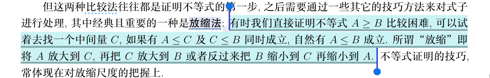

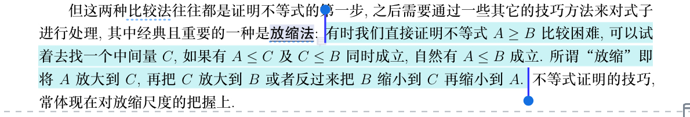

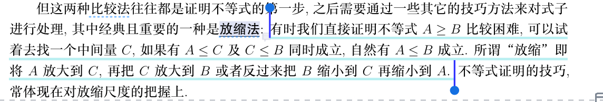

### 3.1.4 选择卡片标签

[标签](https://www.wolai.com/cSrqc8HSRgermXHoSJvNTf "标签")

点击基础-标签图标（如上图所示），打开标签界面，可以为卡片添加多个标签，也可以进行`添加`、`删除`、`重命名标签`等操作。

> 💡在**脑图导航栏**和**卡片分组看板**中搜索卡片时，可以点击筛选图标（如下所示），根据**标签和卡片颜色**筛选需要的卡片
>
> [筛选](https://www.wolai.com/gGdFJPvWQDusSqoXe9N7TR "筛选")

### 3.1.5 剪切、复制和粘贴卡片

[剪切](https://www.wolai.com/bpNyzEyiASt8wGBUtwSjAV "剪切")

[复制](https://www.wolai.com/H6nhkfEJUyQXs43YqThzY "复制")

[粘贴](https://www.wolai.com/6UpgK22t2D1kHqnJvtmigH "粘贴")

- 点击剪切图标，出现`卡片被剪切到剪贴板`则剪切成功

> 💡剪切后原卡片不会立即消失，而是等到粘贴到其他为止后再消失，防止忘记剪切过的卡片。

- 点击复制图标，出现`已复制x张卡片的克隆/引用到剪切板`则复制成功。
  > 克隆和引用的区别：**克隆**节点是一个节点卡片的复刻，**引用**节点则是一个节点的镜像。如对卡片 A 进行**克隆**得到卡片 B，修改卡片 A，卡片 B **不会同步**卡片 A的修改；如对卡片 A 进行**引用**得到卡片 B，卡片 B **会同步**卡片 A的修改。详见：[卡片复制：克隆和引用](https://www.wolai.com/pTDpD5xc9XAoB3jSUScm9g "卡片复制：克隆和引用")
- 复制卡片后点击粘贴：
  - 可以轻点脑图空白处进行粘贴，
  - 也可以点击其他卡片，在上弹菜单中选择`粘贴`，这样复制的卡片就成为该卡片的子节点。

### 3.1.6 修改该卡片的分支样式

> 💡只有存在子卡片的卡片，才会在基础上弹菜单显示“`分支`”功能

[分支](https://www.wolai.com/3JmBrm2aQRChW8iwJsDq78 "分支")

点击`基础`-分支图标，出现`分支样式`弹窗，共有10种分支样式，可以根据个人使用习惯和脑图需求选择。

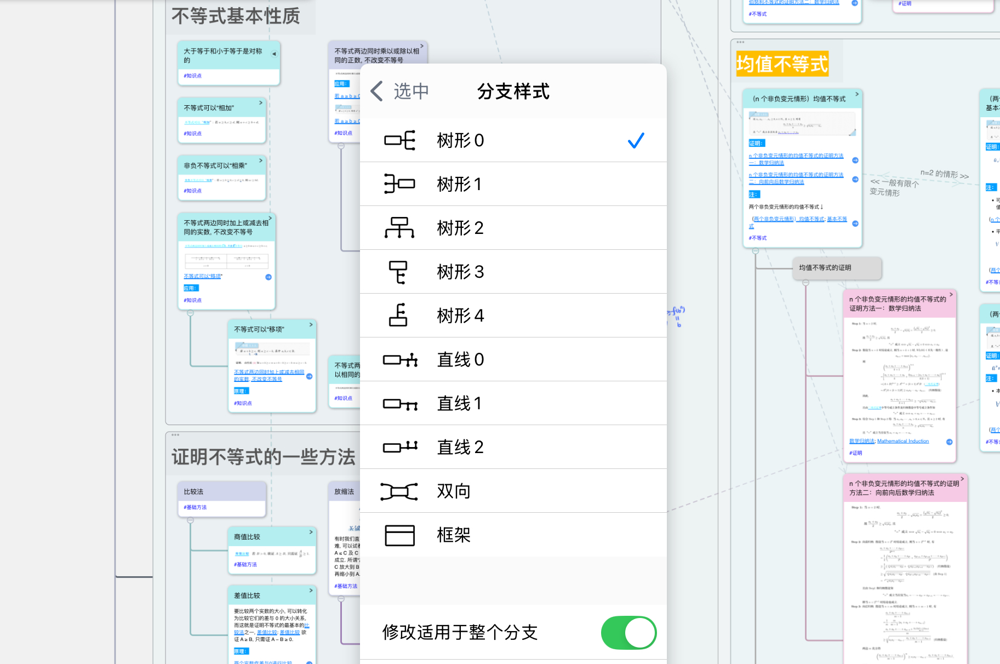

- [**树形**](https://www.wolai.com/6QJHeJqZghQKQ4PcEA3w5u#ski19HMYWvurKMv6VmNww7 "树形")：同级卡片沿竖向分布，最常见的分支样式
- [**直线**](https://www.wolai.com/6QJHeJqZghQKQ4PcEA3w5u#wJgcrCaGaHf8r9XE2JLVJd "直线")：同级卡片沿横向分布，由直线串联，常用于表示时间轴
- [**双向**](https://www.wolai.com/6QJHeJqZghQKQ4PcEA3w5u#ouNzXtjqDVbEBoXhmY4ZJ9 "双向")：同级卡片沿竖向分布，但会均匀分布在上级卡片的两侧，常用于同级卡片过多时
- [**框架**](https://www.wolai.com/6QJHeJqZghQKQ4PcEA3w5u#4Qhodu2JcXxR2PuRtw95Qr "框架")：上级卡片显示为框架，子卡片密集排列在框架中，常用于希望尽可能多的在页面上展示卡片时，例如作为未整理的卡片的集合

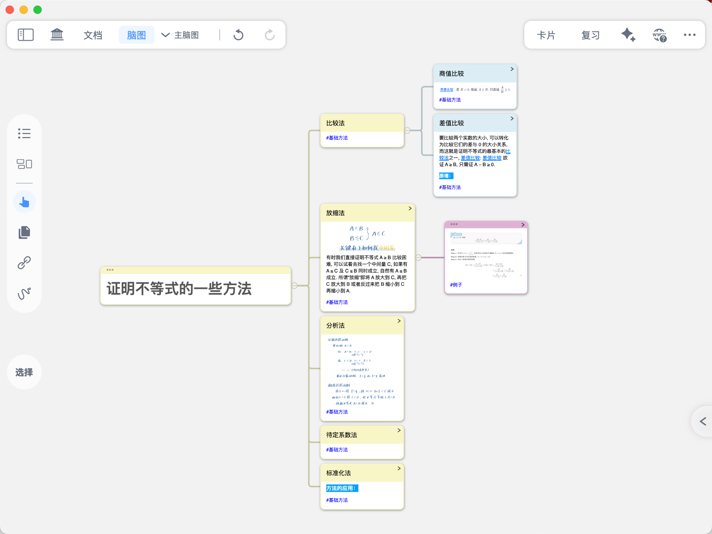

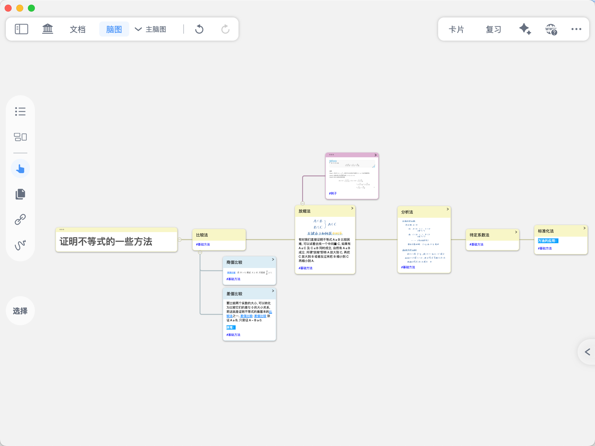

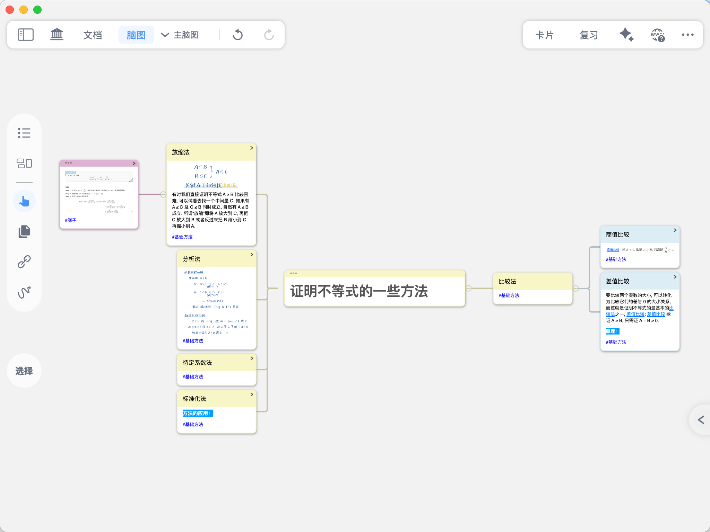

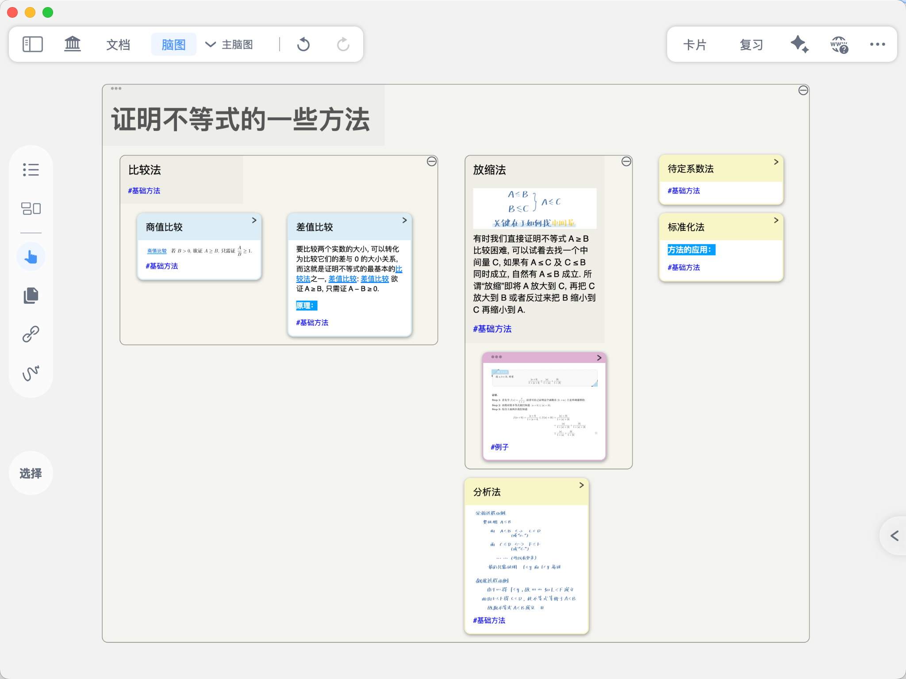

### 3.1.7 提问

[向AI提问](https://www.wolai.com/rcKVh1HiKybKzJrNveYMWa "向AI提问")

点击基础-星型图标（如上图所示），选择各种模式和提示词后，唤起向ai提问弹窗。

通过该功能可让 AI 补充卡片内容、分析知识点等，具体操作详见：[认识提问浮窗（Ask）：在文档和脑图中就地向 AI 提问](https://www.wolai.com/b2MDrDqhWt8LGrmSQD2JYo "认识提问浮窗（Ask）：在文档和脑图中就地向 AI 提问")

### 3.1.8 链接

[链接](https://www.wolai.com/4UKXMAyYMjr1ur9eRXajmp "链接")

点击`链接`，生成[🖼️ 图片](image/41c33a4d27d42359a60a2ffc642f783f_720_z2nLbH1NtR.png "🖼️ 图片")，将`链接球`拖拽到需要链接的卡片上方并松手，即可给两张卡片进行双向链接，后续可跳转查看。

详情参考：[卡片链接①|单双向链接：跨越层级的自由关联](https://www.wolai.com/mGz8BQh6r1ad6wv1jqDo1G "卡片链接①|单双向链接：跨越层级的自由关联")

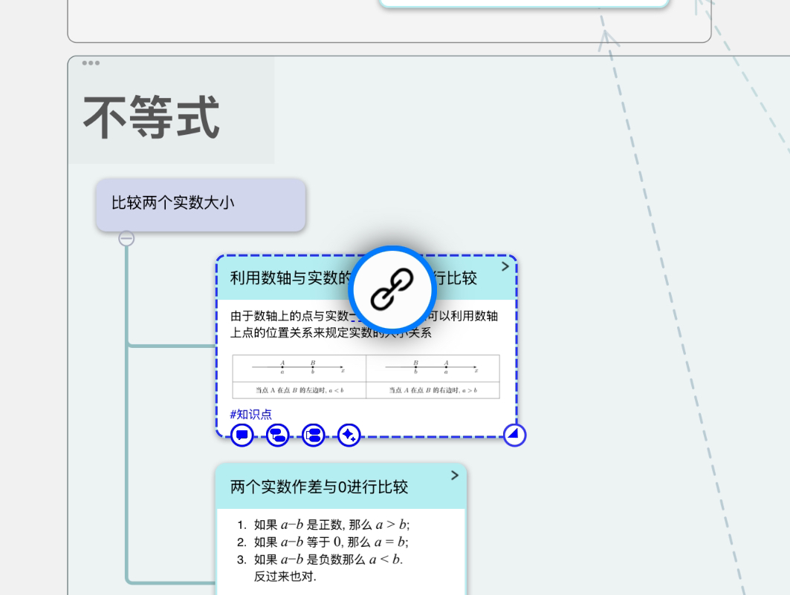

### 3.1.9 焦点

点击`焦点`，该卡片以及其子卡片会进入一个空白脑图中，暂时隐藏其他无关内容，专注梳理目标分支。

详情参考：[脑图焦点](https://www.wolai.com/5nntHuyzfBSdVrEo4YYhxC "脑图焦点")

### 3.1.10 删除

[删除](https://www.wolai.com/6WFcR1Djfow4F7YWkkPqaK "删除")

点击`删除图标`（如上图所示），选择的卡片会被删除。如果该卡片有子卡片，则会弹出删除卡片/删除卡片树选项

- 选择`删除卡片`：只删除该卡片，下方层级的卡片会自动上升层级
- 选择`删除卡片树`：该卡片及该卡片下方所有层级的卡片一并删除。

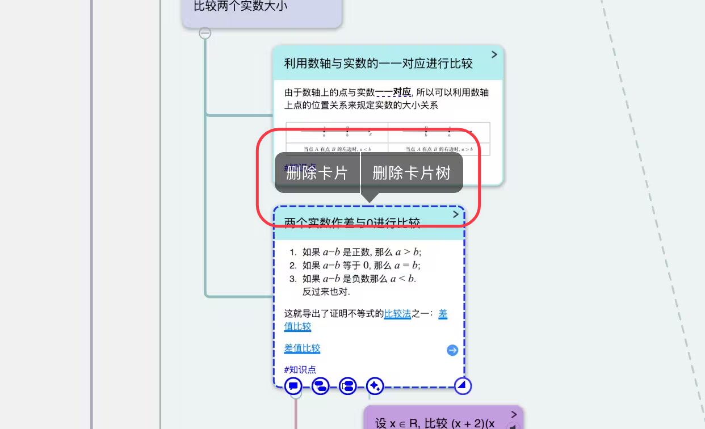

### 3.1.11 更多

点击[基础-更多](https://www.wolai.com/caqYatMbem1bpUFstukpQo "基础-更多")，在`选中卡片操作界面`中对选中卡片进行更多操作

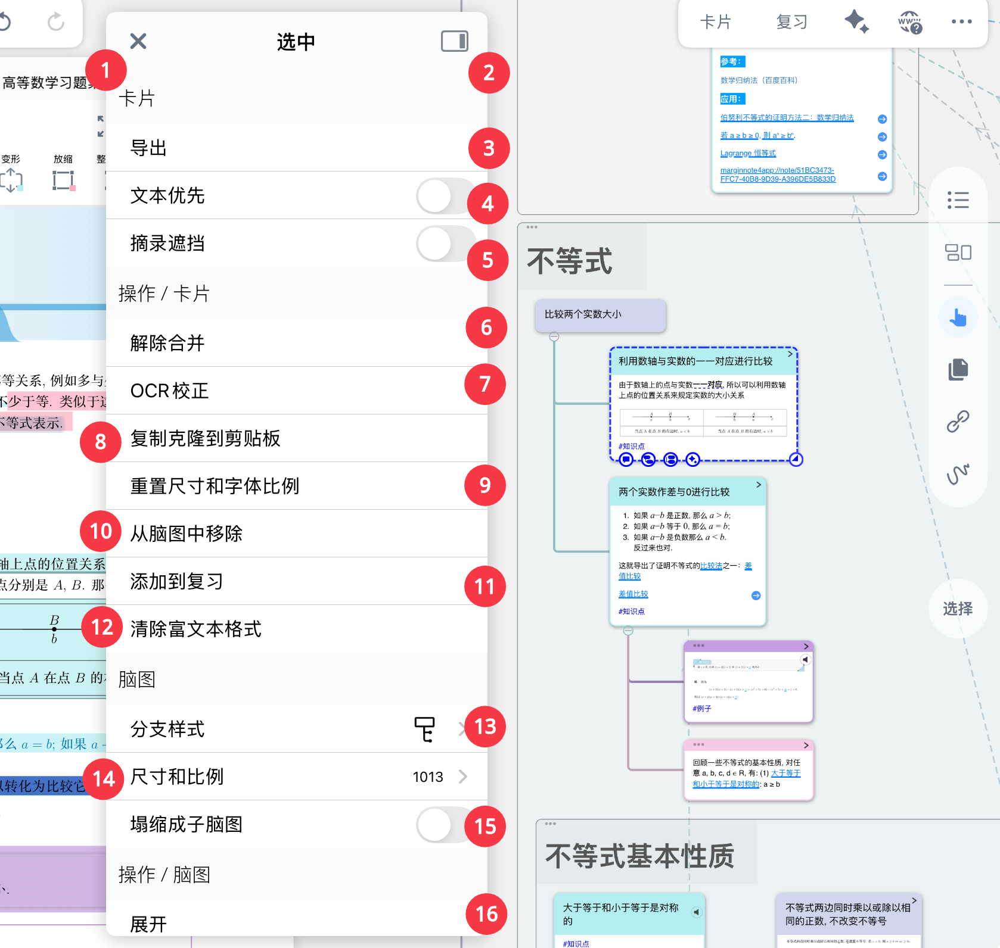

#### 3.1.11.1 卡片

| 序号 | 名称                                                                | 功能                                                          | 备注          |
| -- | ----------------------------------------------------------------- | ----------------------------------------------------------- | ----------- |
| 1  | 关闭键                                                               | 点击可关闭\`选中卡片操作界面\`，单击脑图空白处也达到类似效果                            |             |
| 2  | \[在右侧打开]\(<https://www.wolai.com/bXdAzqphUVKYkNiScGWNgB> "在右侧打开") | 点击可将\`选中卡片操作界面\`吸附到右侧，单击脑图空白处不能关闭界面，达到防止误触的效果               |             |
| 3  | 导出                                                                | 可将卡片导出为pdf或长图格式                                             |             |
| 4  | 文本优先                                                              | 打开该开关，卡片的\`矩形/套索摘录\`会自动转换为文本。  反之，如果希望矩形/套索摘录以图片形式出现，则关闭该开关 | 仅限有图片的卡片    |
| 5  | 摘录遮挡                                                              | 打开该开关，卡片对应的摘录在文档中被遮挡，可以进行复习                                 | 仅限存在文档摘录的卡片 |

#### 3.1.11.2 操作/卡片

| 序号    | 名称        | 功能                                                                                                                                           | 备注                                                                          |
| ----- | --------- | -------------------------------------------------------------------------------------------------------------------------------------------- | --------------------------------------------------------------------------- |
| 6     | 解除合并      | 点击\`解除合并\`，该卡片内第一条摘录不变，其他摘录变为其子卡片                                                                                                            | 仅限有多条摘录的卡片                                                                  |
| 7     | ocr校正     | 对该卡片摘录的内容再次进行ocr识别和校正，点击后卡片摘录内容会改为校正后的内容                                                                                                     |                                                                             |
| 8     | 复制克隆到剪贴板  | 克隆该卡片的全部内容，可以在脑图空白处或其他卡片下进行粘贴                                                                                                                | \[卡片复制：克隆和引用]\(<https://www.wolai.com/pTDpD5xc9XAoB3jSUScm9g> "卡片复制：克隆和引用") |
| 9     | 重置尺寸和字体比例 | \*\*卡片宽度\*\*重置为700，\*\*字体比例\*\*重置为1                                                                                                          |                                                                             |
| 10    | 从脑图中移除    | 将卡片从脑图中移除，\*\*但不删除\*\*，后续可从\`卡片分组看板\`中查找                                                                                                     |                                                                             |
| 11    | 添加到复习     | 将选中的卡片从加入复习卡片组                                                                                                                               |                                                                             |
| 12    | 清除富文本格式   | 清除字体、字号、颜色、段落对齐、图片嵌入等格式信息                                                                                                                    |                                                                             |
| 图中未标出 | 文本转标题     | 点击后第一段摘录将转换为标题  > 💡\*\*标题字段仅能输入 250 个字符\*\*，若转换的文本超出该长度，超出部分会被截断 > 转换后的标题字段只能呈现纯文本，即便原摘录文本包含markdown、富文本格式等，转为标题后也会丢失这些特殊格式，无法保留原有的排版或附加内容。 | 仅限无标题，且第一段为文本格式                                                             |

#### 3.1.11.3 脑图

| 序号 | 名称     | 功能                                                                                                                          | 备注        |
| -- | ------ | --------------------------------------------------------------------------------------------------------------------------- | --------- |
| 13 | 分支样式   | 点击后，打开\`分支样式选择界面\`，可选树形、直线、双向、框架等分支结构，详情参考\[10种分支样式&子脑图坍缩]\(<https://www.wolai.com/iXZn5PKLW4iogVnxZwQ4pt> "10种分支样式&子脑图坍缩") |           |
| 14 | 尺寸和比例  | 点击后，打开\`尺寸和比例详情界面\` 拉动卡片宽度、字体比例滑动条，对这些样式进行动态调节  打开\`紧凑宽度开关\`，卡片宽度会根据卡片内文字数量进行调节，保证卡片没有过多空白（见下方对比图），增加脑图美观程度                 |           |
| 15 | 塌缩成子脑图 | 点击后该卡片会转为子脑图，其子卡片都会进入子脑图中  详情参考\[新建和管理子脑图层级]\(<https://www.wolai.com/wAZ8JuGD8M6EZu8qFjFXmD> "新建和管理子脑图层级")                  | 仅限选择一张卡片时 |

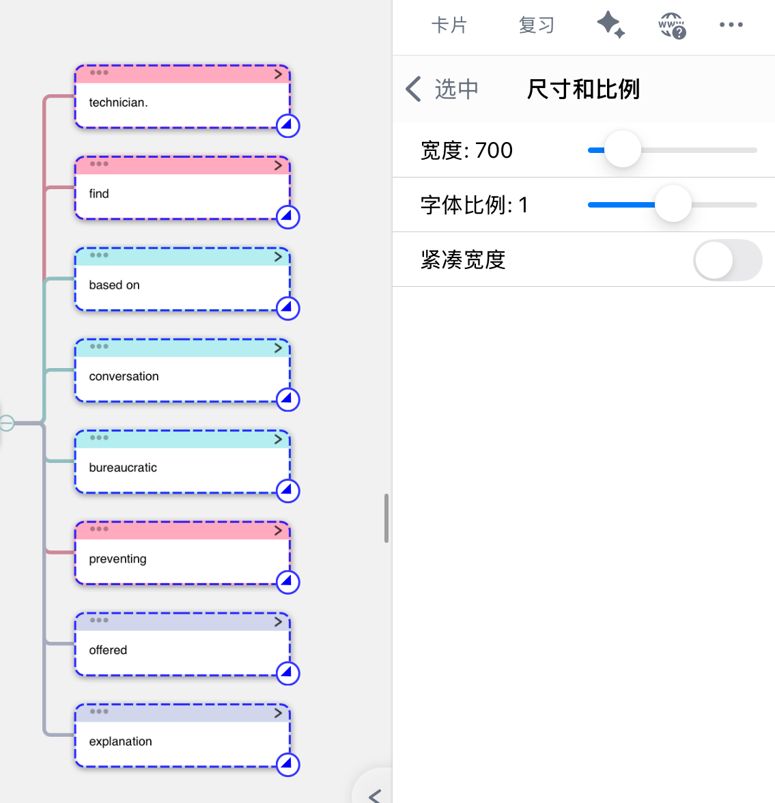

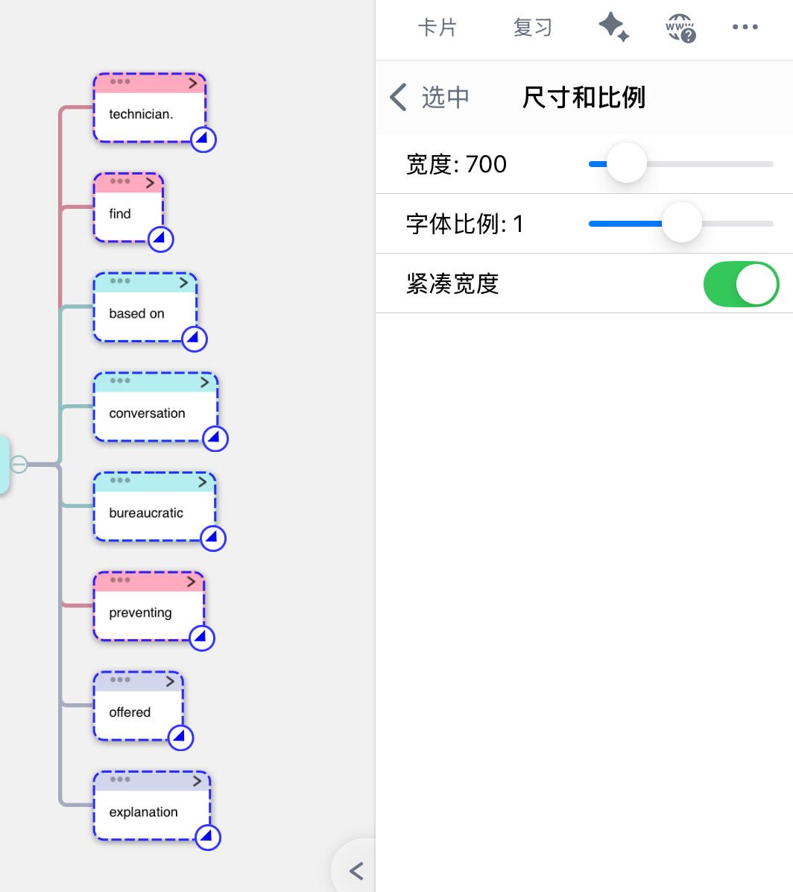

### 3.1.12 操作/脑图

| 序号    | 名称    | 功能                                                                                  | 备注        |
| ----- | ----- | ----------------------------------------------------------------------------------- | --------- |
| 16    | 展开/折叠 | 点击\`折叠\`，该卡片的子卡片会隐藏  点击\`展开\`，隐藏的子卡片会出现  > 💡点击脑图中卡片尾端的\`＋\`、\`-\`符号可以达到同样的情况       | 仅限有子卡片的卡片 |
| 图中未标出 | 选择分支  | 点击\`选择分支\`，该卡片及其下所有层级的卡片都会被选择，可继续对卡片进行批量操作  > 💡有时树形脑图可能长度过长，无法在脑图中精确选取全部，就可以使用这种功能 |           |

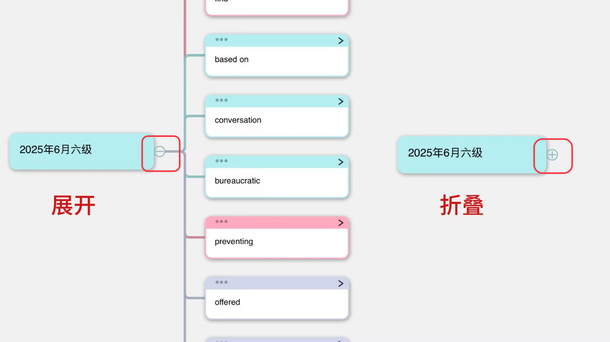

## 3.2 高级

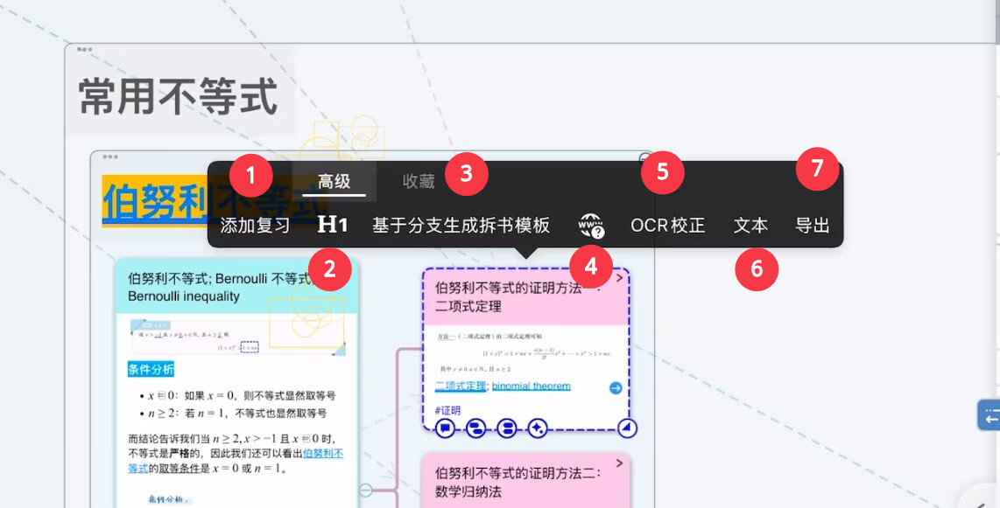

| 序号 | 名称         | 功能                                                                                                                                                                            | 备注             |
| -- | ---------- | ----------------------------------------------------------------------------------------------------------------------------------------------------------------------------- | -------------- |
| 1  | 添加复习       | 将选中的卡片从加入复习卡片组                                                                                                                                                                | 仅限未添加到复习卡片组的卡片 |
| 2  | H1         | 点击后，卡片正文第一条摘录会转换为标题  > 💡与图中未标出的区别在于，在有标题的情况下点击H1，标题会转换为卡片正文。                                                                                                                 |                |
| 3  | 基于分支生成拆书模板 | 点击\`基于分支生成拆书模板，\`可以由ai分析思维脑图结构，并生成基于个性化脑图的拆书模板，该模板可应用于文档界面\[目录]\(<https://www.wolai.com/jaxFYszwK9eiofzRPxzA1J> "目录")中的ai拆书                                                   |                |
| 4  | 在浏览器中搜索    | 点击该图标，在脑图侧边栏会打开\[研究]\(<https://www.wolai.com/7AXUEU5B5UUuEGW1m7oZ9z> "研究")，并自动搜索卡片内容，详情参考：\[检索③：文档与研究浏览器联动]\(<https://www.wolai.com/nfvG3Hah2KmZUXGaD4UJh1> "检索③：文档与研究浏览器联动") |                |
| 5  | OCR校正      | 点击\`OCR校正\`，该卡片的\*\*摘录部分\*\*会被重新进行ocr，并更新卡片中文字                                                                                                                                | 仅限有摘录的卡片       |
| 6  | 文本         | 点击\`文本\`，卡片中的\*\*图片\*\*会被校正为文本格式                                                                                                                                              | 仅限形式为图片的摘录     |
| 7  | 导出         | 可将卡片导出为pdf或长图格式                                                                                                                                                               |                |
