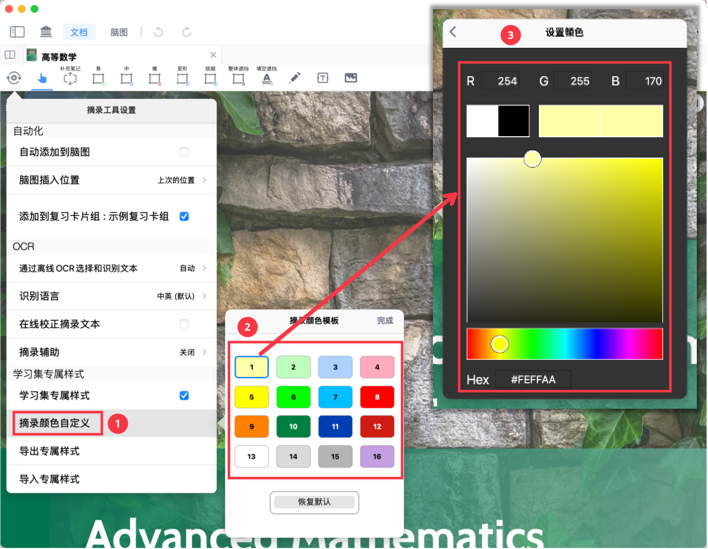
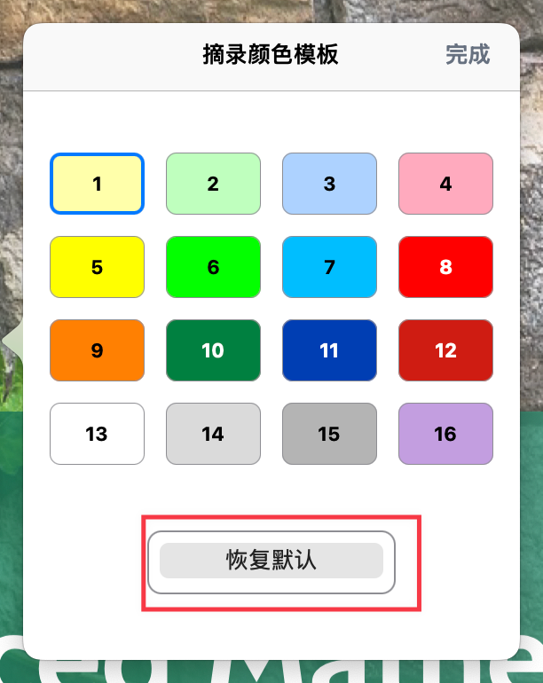
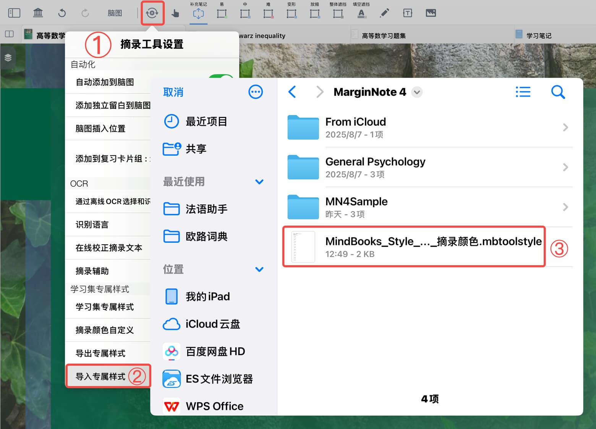
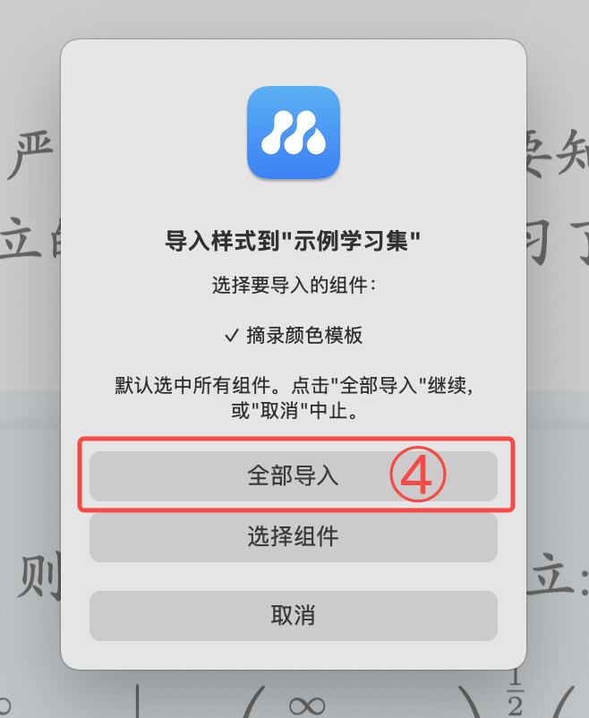

# 自定义卡片摘录颜色

> 💡MarginNote的摘录颜色模板预置了16种颜色，您可以根据个人偏好逐一修改，或导入他人配置好的颜色模板实现批量修改。

# 1 方法一：手动逐个修改颜色

1. 点击`⚙️ 摘录工具设置`-开启`学习集专属样式`-点击`摘录颜色自定义`，在摘录颜色模板中点击需要修改的色块。
2. 输入RGB 参数/Hex 参数，或拖动色盘、色调的滑块，即可修改颜色参数。

> 💡[🖼️ 图片](image/image_FQApNjDhsx.png "🖼️ 图片")

# 2 方法二：一键导入摘录颜色模板

点击`⚙️ 摘录工具设置`-开启`学习集专属样式`-点击`导入专属样式`，选择包含摘录颜色模板的样式文件（.mbtoolstyle格式），导入摘录颜色模板组件。详见：[学习集专属样式：打造你的专属学习空间](https://www.wolai.com/ueyP4EoMFihG8RpYMY31JV "学习集专属样式：打造你的专属学习空间")。

> 💡**MarginNote 素材中心**提供了丰富的摘录颜色模板（.mbtoolstyle格式）供学习者免费下载：
>
> [ 【摘录颜色配置】4.1.22 学习集专属样式升级，一键导入配置！ - 素材中心 - MarginNote 中文社区 v 4.1.23 对学习集专属样式进行进一步升级：【4.1.23】 🆕 弹出菜单基础，「收藏项」增删排序超不基础 :art: 配色样式定位针对不同学科场景优化的预设配色方案解决手动调色耗时的痛点，一键导入即用\&hellip; https://bbs.marginnote.com.cn/t/topic/62141/1](https://bbs.marginnote.com.cn/t/topic/62141/1 " 【摘录颜色配置】4.1.22 学习集专属样式升级，一键导入配置！ - 素材中心 - MarginNote 中文社区 v 4.1.23 对学习集专属样式进行进一步升级：【4.1.23】 🆕 弹出菜单基础，「收藏项」增删排序超不基础 :art: 配色样式定位针对不同学科场景优化的预设配色方案解决手动调色耗时的痛点，一键导入即用\&hellip; https://bbs.marginnote.com.cn/t/topic/62141/1")

> 💡除了摘录颜色模板，**摘录工具、手写工具、弹出菜单自定义**等也支持导入导出样式文件，以实现保存和复用配置，详见：[学习集专属样式：打造你的专属学习空间](https://www.wolai.com/ueyP4EoMFihG8RpYMY31JV "学习集专属样式：打造你的专属学习空间")
