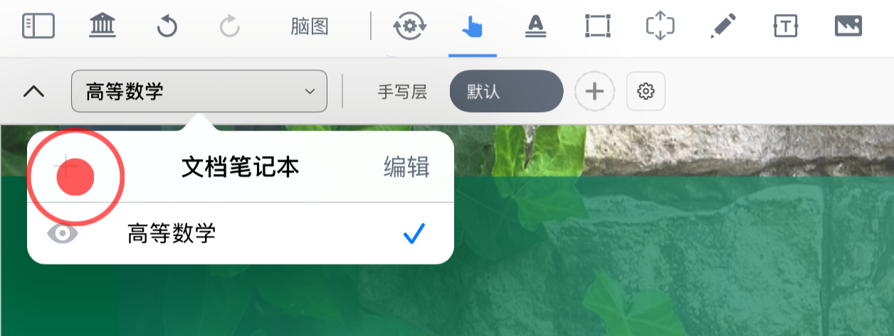
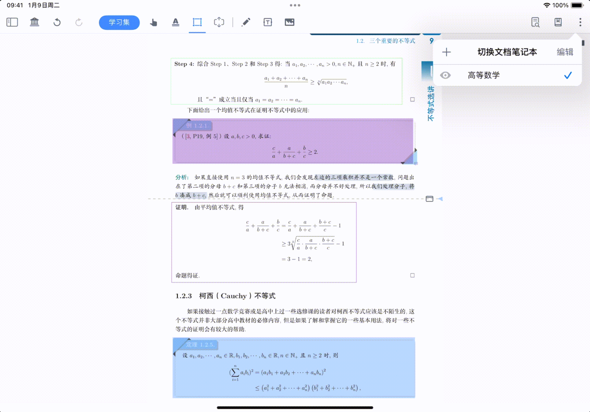
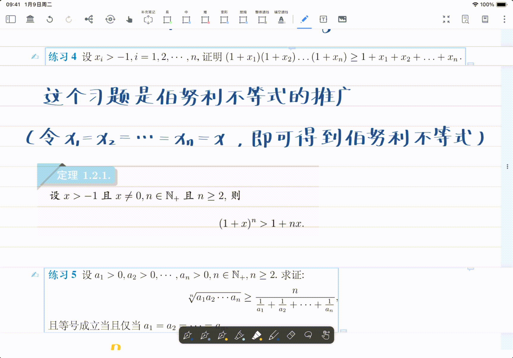
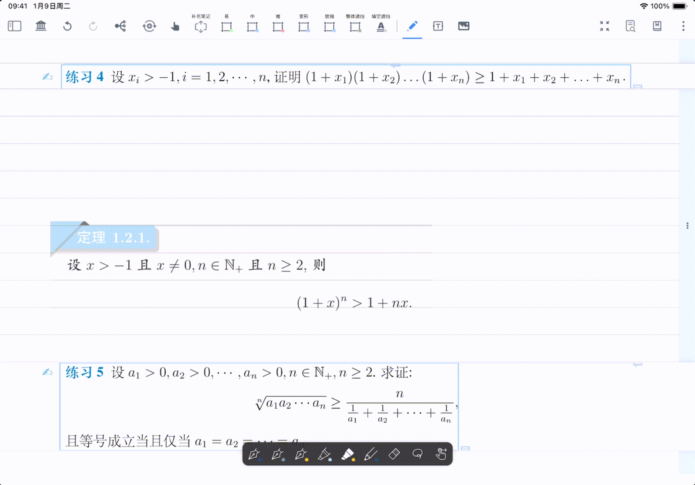
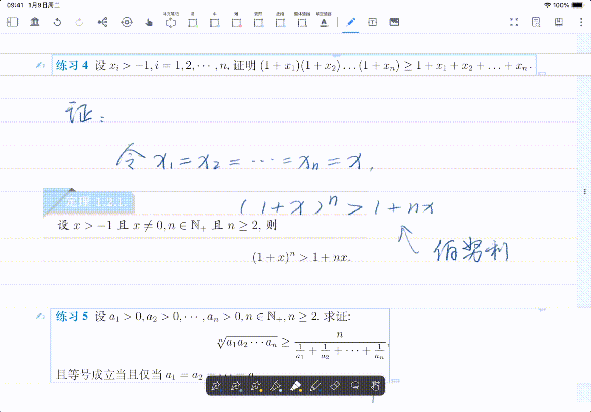
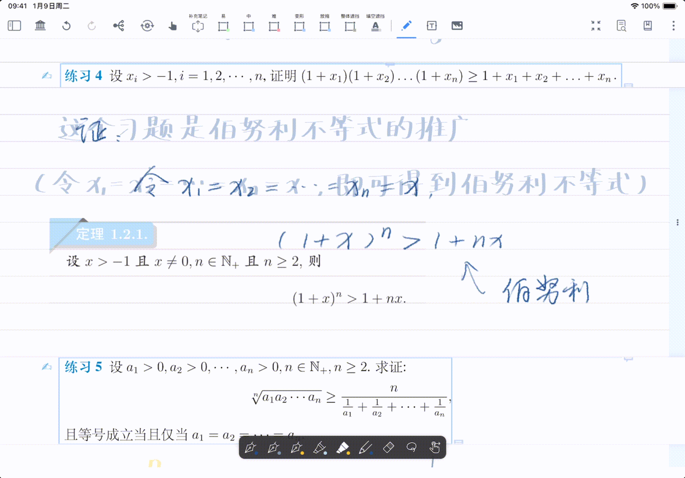
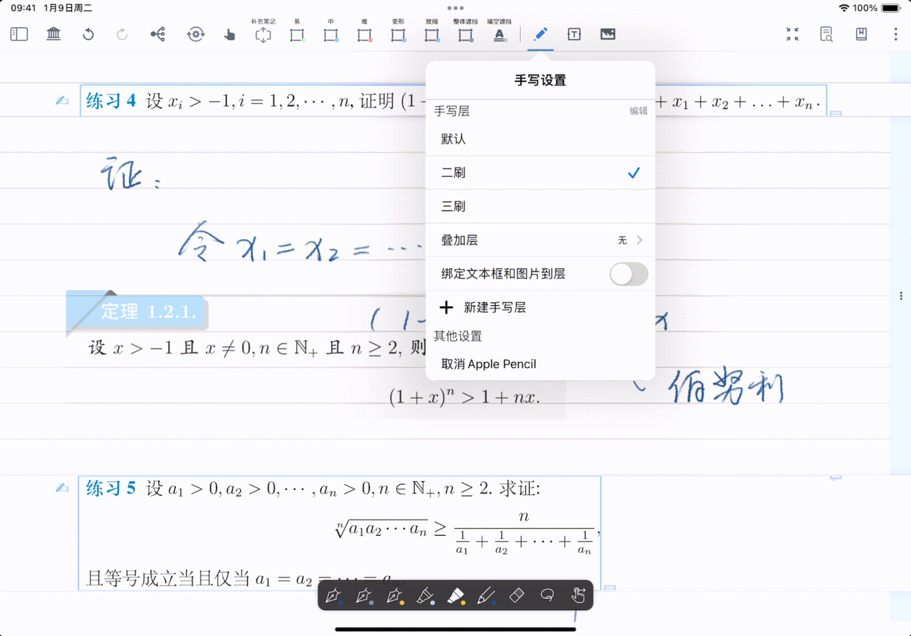
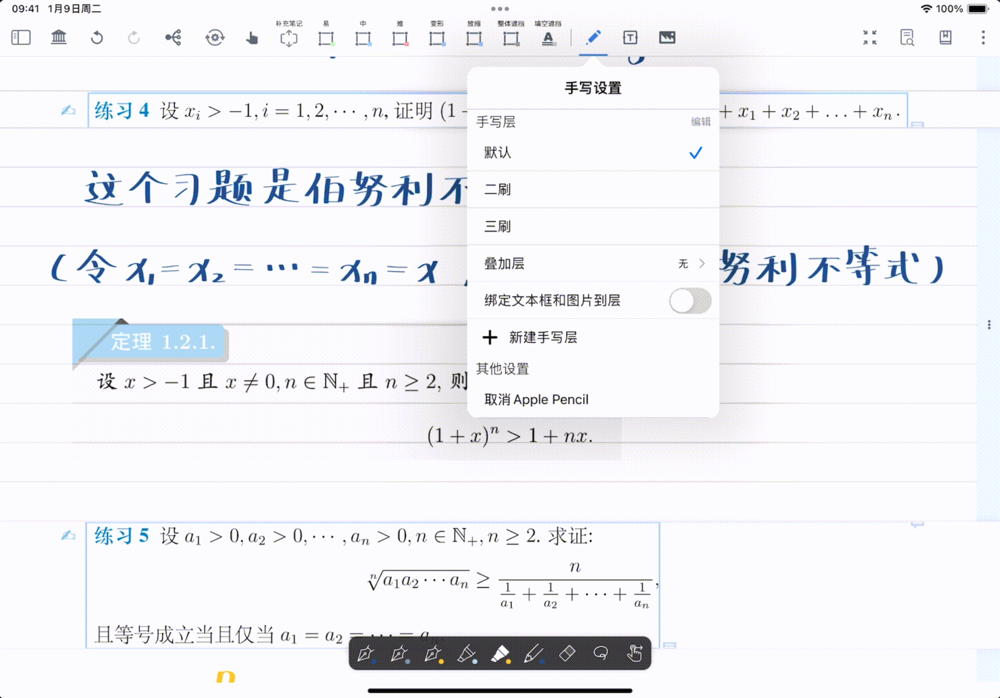
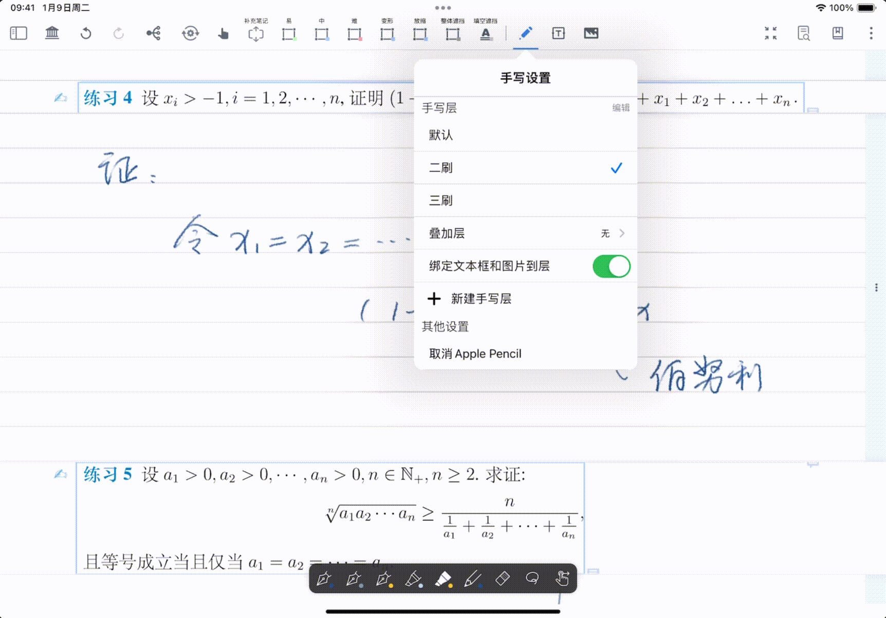
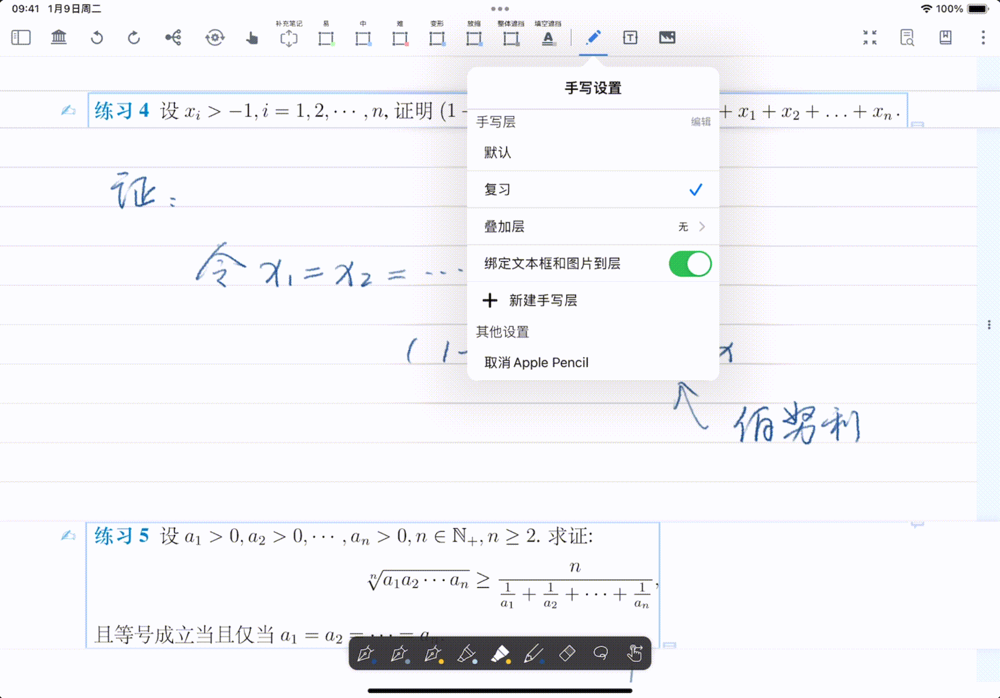

# 图层：文档笔记本&手写图层

# 1 理解图层：文档笔记本图层 vs 手写图层

**核心概念：像“透写纸”一样理解图层**

MarginNote 的图层功能，可以帮你在一份原始PDF上，叠加多张“透明的纸”进行记录。

- **第一层“透写纸”：文档笔记本图层**

  想象你有一份数学教材（原始PDF）。你可以为不同的学习目标，盖上不同的“透写纸”：
  - 第一张“透写纸”叫“课堂笔记”，你在上面摘录重点、画思维导图。
  - 第二张“透写纸”叫“错题复盘”，你在上面重新分析错题。 &#x20;

    这些“透写纸”就是**文档笔记本**。它们彼此独立，让你可以基于同一份书，拥有多套完整的笔记体系。
- **第二层“透写纸”：手写图层**&#x20;

  现在，假设你在“课堂笔记”这张“透写纸”上做题。你想一刷时用铅笔写，二刷时用红笔改。这时，你可以在这张“透写纸”上，再叠加一层更薄的“透明膜”用来书写。这些“透明膜”就是**手写图层**。它们不影响你原有的摘录和留白，只管理你的手写笔迹。

# 2 文档笔记本及相关设置

## 2.1 新建文档笔记本

当你想按任务分开记录（如“课堂笔记”“错题复盘”“考试冲刺”）时，

在MarginNote中，一份教材（原始PDF文件）可以衍生出多个**文档笔记本**。每个**文档笔记本**都是基于该PDF的一个**独立、完整的笔记版本**。

### **何时新建？**

当你想针对同一份资料PDF，开始一套全新的笔记流程时，就新建一个文档笔记本。例如：

- 上课时用“课堂笔记”笔记本记录老师讲解。
- 复习时用“考点梳理”笔记本构建知识框架。
- 考前用“快速回顾”笔记本只看核心要点。

### 2.1.2 如何新建?

[文档笔记本](https://www.wolai.com/658o79cCN6PLnY9ofSYF8 "文档笔记本")

点击文档界面左上角的`文档笔记本`按钮（如上方图标所示），再点击左上`➕`，即可新建一个空白的文档笔记本图层。&#x20;

> 💡注意：为避免产生无内容的冗余笔记本，当前文档笔记本为空白时，则无法另建新的文档笔记本。

## 2.2 切换文档笔记本

点击对应的文档笔记本，即可完成文档笔记本间的切换。

## 2.3 显示/隐藏其他文档笔记本

当你需要对照两个笔记本的内容时，可以“叠加”查看。
在当前笔记本下，开启其他笔记本前的“眼睛”图标，该笔记本的内容就会以**半透明、不可编辑**的状态显示出来。

> 💡**使用场景**
> 例如，你在“错题复盘”本中，可以调出“课堂笔记”本的内容作为参考，查看当时的解题思路，而无需切换笔记本。

> ⚠️显示其他文档笔记本图层时，留白无法以嵌入形式存在。

## 2.4 重命名文档笔记本

点击`编辑`按钮，即可直接对文档笔记本重命名。

## 2.5 删除文档笔记本

- 点击`编辑`，再点击文档笔记本前的`移除`图标，选择`删除`，即可删除对应的文档笔记本。

  
- 如果对当前所处的文档笔记本，执行“删除”操作，该文档笔记本仍存在，但会清空当前笔记本内的所有笔记

  

# 3 手写图层及相关设置

MarginNote4新增了文档手写图层功能，可以在保留已有摘录、留白的情况上，新建多个空白手写图层，以供重复练习。并且能将不同手写图层进行叠加、合并，以便复盘总结。

> 💡手写图层的核心价值在于**重复练习而不破坏原笔记**。
>
> **典型场景：** 你在“课后练习”这个文档笔记本里刷题。
>
> - **第一轮**：新建图层，命名为“一轮\_0310”，独立完成。
> - **对答案后**：新建图层，命名为“二轮\_0312”，在错题旁用红笔订正。
> - **考前回顾**：你可以分别查看或叠加这两个图层，清晰对比自己的错误与修正。

## 3.1 新建/切换手写图层

当你想按“轮次+日期”命名（如：高数\_一轮\_0310）图层以便后续叠加对比与阶段合并时，可以点击手写图标（或者双击手写图标），打开手写设置面板：

- 选择“➕ 新建手写图层”，
  - **输入新层名**，即可创建一个空白的手写图层。

    
  - **输入已有层名**，即可切换到该手写图层。（或者直接点击图层名，也可完成切换。）

    

### 3.1.1 默认手写图层

在无新建手写图层的情况下，手写工具在文档上的批注会保存在默认手写图层里。

> ⚠️默认手写图层不可删除

## 3.2 多个文档手写图层的相关操作

打开`文档手写设置界面`，点击`叠加层`，勾选目标手写层，则目标手写层与当前手写层共同显示。

此时，目标手写层的透明度降低（留白和文本框、图片的透明度也降低），以半透明状态显示，仅用于参考而不可编辑，并在`回忆模式`下隐藏。

### 3.2.1 叠加层

- 点击叠加层，选择“无”，则关闭叠加层的显示。
- 点击叠加层，选择需要叠加的图层：
  - 叠加的手写图层将以半透明形态呈现在当前图层，不可编辑。

    
  - 叠加手写图层的批注在回忆模式下会隐藏，开启回忆模式后自动隐藏叠加层，可减少提示信息干扰，强化主动回忆。

    

> 💡只能选择一个手写层进行叠加。

### 3.2.2 绑定文本框和图片到层

插入的文本框及图片，可以选择在所有手写图层中显示，也可以绑定到某一特定手写图层上。

- 不绑定：

  文本框及图片显示在所有手写图层中。（适合公共参考材料、统一说明）

  
- 绑定：

  文本框及图片只显示在绑定手写图层上。（适合轮次专属材料，如：一轮思路、二轮纠错）

  

> 💡存在文本框时，才有`绑定文本框和图片到层`开关

### 3.2.3 手写图层的编辑

在手写设置面板，选择右上的编辑按钮，点击手写层右侧“...”图标，

- **删除手写图层**：

  点击`删除`，将删除该手写层

  
  > 💡选择删除后，手写层内的手写、绑定的文本框等都将消失，且撤回操作无效，情谨慎操作。
- 重命名或合并手写图层：

  点击`重命名或合并`，出现修改名称弹窗：
  - **重命名手写图层**：

    输入名称与现有图层同名 → 执行合并

    
  - **合并手写图层**：

    输入名称与现有图层不同 → 执行重命名

    

# 4 常见问题

1. **文档笔记本和手写图层有什么区别？**

   **A：** 文档笔记本用于按任务分工作区；手写图层用于同一工作区内分轮次记录与复盘。
   |           | 文档笔记本                                                 | 手写图层\&#x20;                                |
   | --------- | ----------------------------------------------------- | ------------------------------------------ |
   | 定义        | 基于同一个原始PDF创建的独立完整笔记版本，每个文档笔记本均可独立进行摘录、批注、卡片、脑图等全部笔记操作 | 在同个文档笔记本内部，仅针对手写笔迹新增的空白手写层，而保留原有摘录、留白等所有内容 |
   | 新建后效果     | 回到无批注的原始PDF，所有笔记重置                                    | 保留原有摘录、留白，仅新增空白手写层\&#x20;                  |
   | 笔记本/图层间关系 | 各文档笔记本间完全独立、互不干扰                                      | 仅对手写笔迹分层，原有摘录、留白内容保留                       |
   | 适用场景      | 多轮复习、多版本笔记管理                                          | 刷题、草稿、手写批改、临时手写笔记                          |
2. **什么时候该新建笔记本，什么时候只新建图层？**

   **A：** 任务不同（如课堂笔记/错题复盘）用新建笔记本；同一任务的多轮练习（一轮/二轮）用新建图层。
3. **叠加层为什么看得到但不能编辑？**

   **A：** 叠加层用于参考对照，会半透明显示且只读；需要修改请切换到对应手写图层。
4. **删除手写图层会发生什么？**

   **A：** 会删除该层内手写及绑定内容，且不可撤回。建议先合并或备份后再删除。
5. **为什么看不到“绑定文本框和图片到层”的选项？**

   **A：** 需要先插入文本框或图片，系统才会显示该绑定开关。
