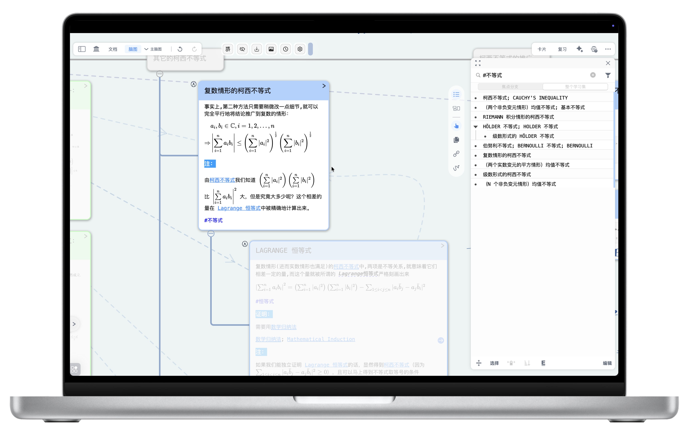
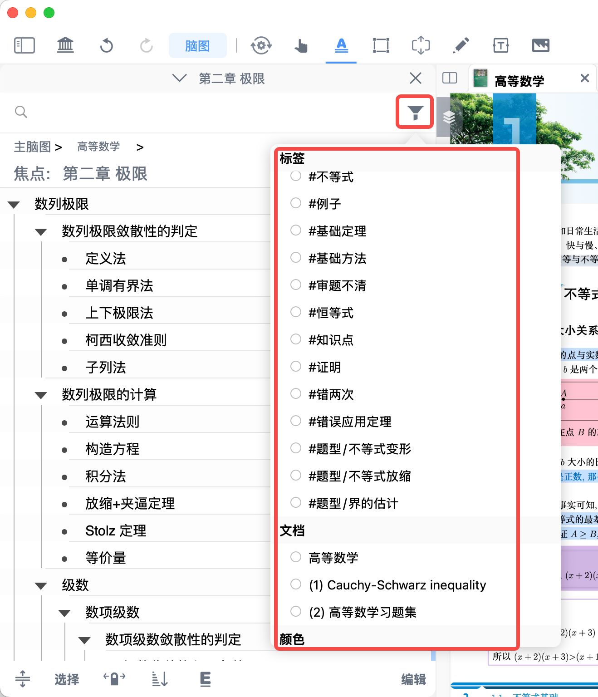
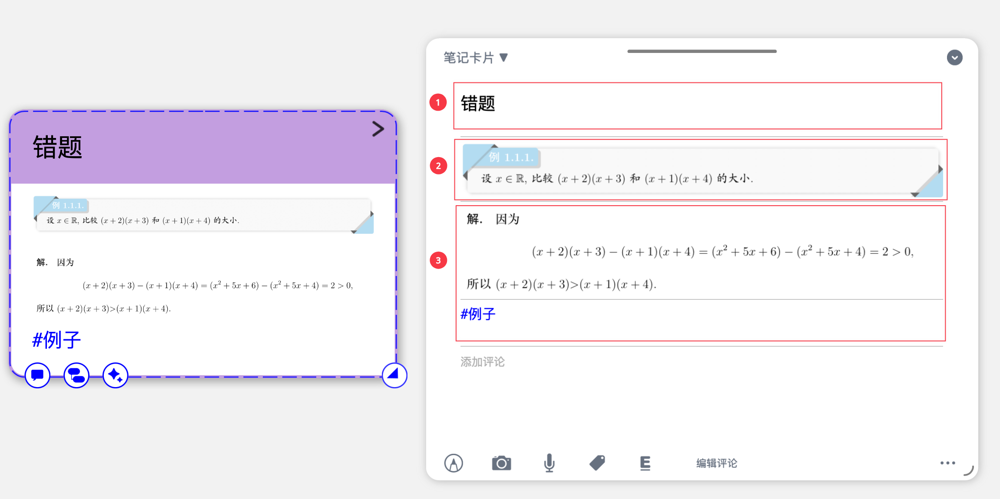

# 大纲筛选和搜索

> 💡 **“大纲”是一种特殊的脑图视图**，它允许用户以大纲列表的形式来组织和编辑脑图中的节点和内容。在此种模式下，更加强调脑图中各个概念或信息点之间的层级关系。相较于脑图，大纲的逻辑更加的严谨，形式更加固定，能帮用户**以严谨的层级列表梳理知识、清晰呈现逻辑关系，避免脑图自由排版导致的结构混乱**。
>
> `大纲`和脑图一样，在使用前需先建立学习集（[新建学习集：开启主题式学习](https://www.wolai.com/vtjSQ6LvQv1TbbjdctzroM "新建学习集：开启主题式学习")）。

# 1 筛选

> 💡“筛选”功能让您能够根据卡片的各种属性（如**标签**、**所属文档**、**摘录颜色**）来缩小显示范围，只看到您当前最关心的卡片。这对于复习特定主题、整理某个文档的笔记或回顾特定类型的摘录非常有用。

[筛选](https://www.wolai.com/gGdFJPvWQDusSqoXe9N7TR "筛选")

点击大纲顶部工具栏最右侧的筛选按钮（如上方图标所示），即可按条件筛选目标卡片。

- 选择卡片筛选范围：
  - `焦点分支`：针对子脑图中的卡片进行筛选
  - `整个学习集`：针对学习集中所有脑图中的卡片进行筛选

[🖼️ 图片](image/image_cbeSwbTlCg.png "🖼️ 图片")。

## 1.1 根据标签进行筛选

> 💡在对卡片进行摘录操作时，或者在卡片摘录结束后。学习者可以给摘录卡片打上自定义标签。后续利用大纲筛选功能，可以筛选出带有特定标签的卡片。

- 在弹出菜单中选择需要筛选的标签

## 1.2 根据文档进行筛选

> 💡除了按照标签筛选以外，MarginNote 4 还允许学习者通过文档来筛选摘录卡片。

- 在文档一栏点选需要筛选的文档
- 选择卡片筛选范围。
  - `焦点分支`：针对子脑图中的卡片进行筛选
  - `整个学习集`：针对学习集中所有脑图中的卡片进行筛选

## 1.3 根据摘录颜色进行筛选

> 💡学习者在利用摘录工具摘录时，会自动生成带有颜色的摘录卡片。在后续的的筛选中，学习者可以针对这些摘录颜色对卡片进行筛选。

- 在颜色一栏点选需要筛选的颜色
- 选择卡片筛选范围。
  - `焦点分支`：针对子脑图中的卡片进行筛选
  - `整个学习集`：针对学习集中所有脑图中的卡片进行筛选

## 1.4 筛选规则

### 1.4.1 并集筛选

- **规则**：当您选择**相同类型**的多个筛选条件时（例如，只选择了多个“标签”，或者只选择了多个“文档”，或者只选择了多个“颜色”），系统会进行**并集筛选**。这意味着只要卡片符合您所选的**任意一个**条件，它就会被显示出来。
- **举例**：如果您选择了标签“重点”和标签“疑问”，那么所有带有“重点”标签的卡片**和**所有带有“疑问”标签的卡片都会被显示。

### 1.4.2 交集筛选

- **规则**：当您选择**不同类型**的多个筛选条件时（例如，同时选择了“标签”和“文档”，或者同时选择了“标签”、“文档”和“颜色”），系统会进行**交集筛选**。这意味着卡片必须**同时符合您所选的所有不同类型**的条件，才会被显示出来。
- **举例**：如果您选择了标签“重点”和文档“《经济学原理》”，那么只有那些**既带有“重点”标签，又来自“《经济学原理》”文档**的卡片才会被显示。

# 2 搜索

> 💡“搜索”功能让您能够通过输入关键词，快速定位到卡片中包含这些关键词的内容。

## 2.1 卡片的构成

- `标题`（Title）

  标题字段为**纯文本**字段（不支持 markdown），**有长度限制**（≤ 250个字符）。
- `摘录`（Excerpt）

  来自文档的笔记，例如文字、图片。
- `评论`（Comment）
  - 向卡片添加的笔记，如手写、文本（支持富文本）、公式代码（支持Markdown/Latex/Html/CSS/代码块/Mermaid流程图）、音频、图片、标签等内容；
  - 可通过`编辑评论`来调整评论的顺序，或删除评论。

## 2.2 如何进行搜索

- 在大纲顶部**搜索框**中输入想要查找的**关键词**；
- 随着您的输入，MarginNote 4 会实时显示包含这些关键词的卡片；
- 在搜索结果中，您可以点击相应的卡片，快速跳转到该卡片的位置。

> 💡**在默认情况下搜索功能会检索卡片的所有内容**，如果学习者仅需定位卡片标题，可以点击搜索结果底部的`仅搜索标题`，快速定位卡片标题。
