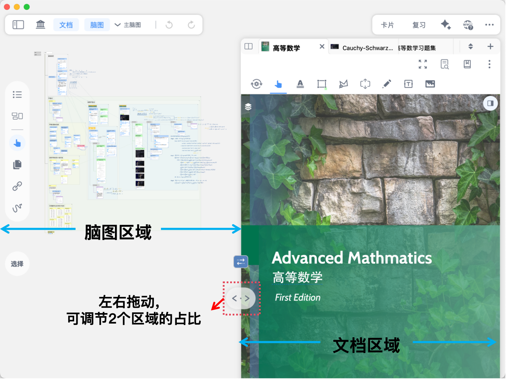
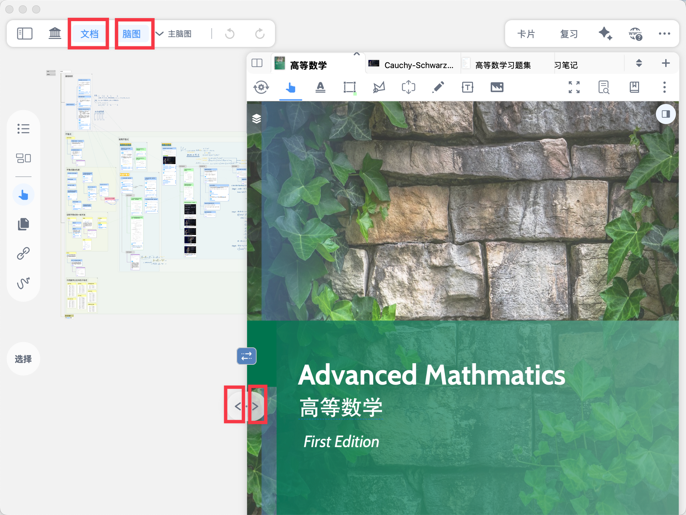
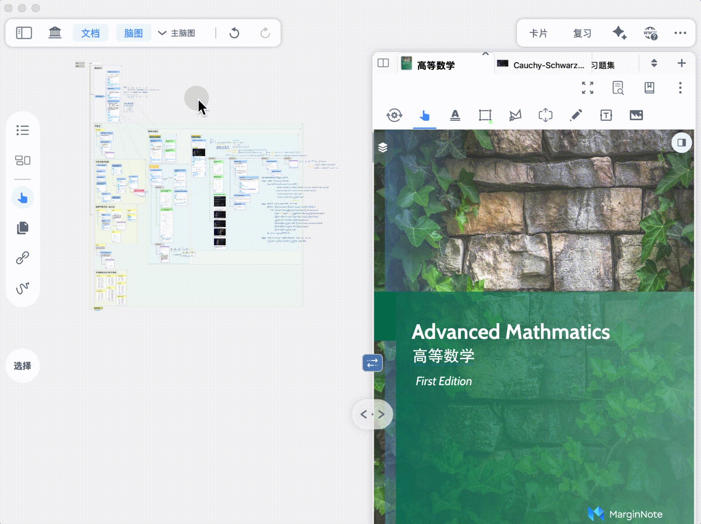
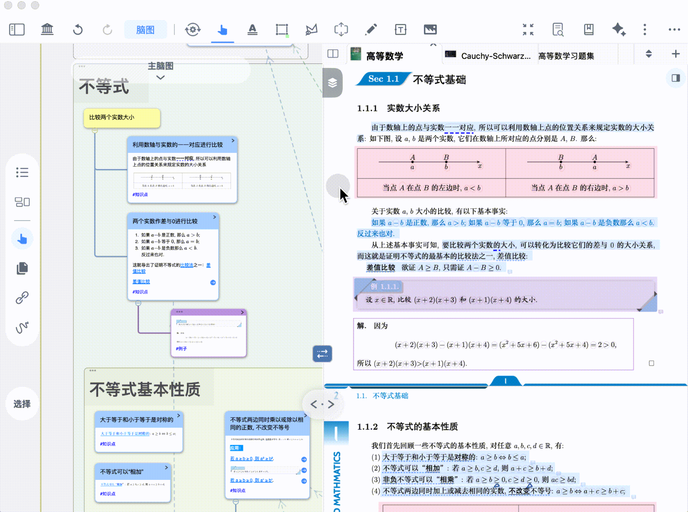
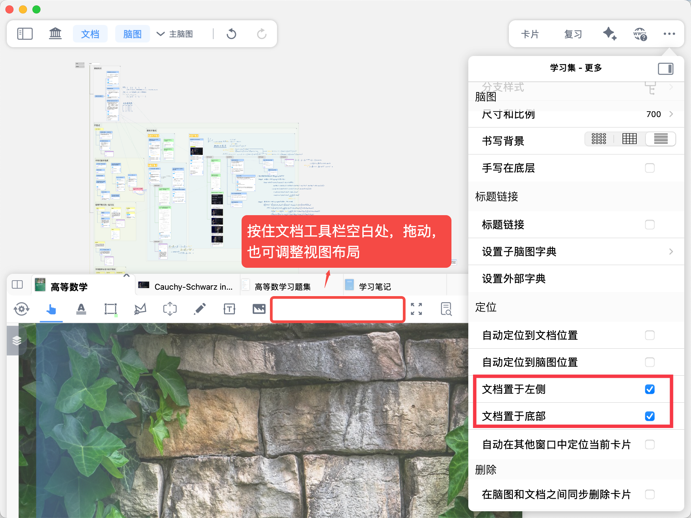

# 脑图与文档联动视图

> 💡**脑图+文档**，**真正的“对照学习”**：
>
> 在MarginNote中，文档资料与思维导图笔记并非彼此孤立，而是动态联动的有机整体。
>
> 它们一左一右同时摆在您面前，构筑了一条文档知识点与脑图逻辑结构之间的双向高速公路：点击文档或脑图中的任意一处，都能在另一端实现精准定位。
>
> 不用再在两个软件或者窗口之间来回切来切去，边读边整理思路变得超级方便。

## 1 调节视图比例

[视图调节](https://www.wolai.com/ogZzhfRkAMQ7y5dxvfXZ8w "视图调节")

[🖼️ 图片](image/20251028213305_rec__i9Cy2ewl1U.gif "🖼️ 图片")

> 💡Mac上通过 ⌘+鼠标滚轮**缩放脑图/文档大小**,\*\* **⇧+鼠标滚轮可以**横向移动视图\*\*

## 2 单一视图模式

当您需要**纯净的**脑图或文档界面时，可以将另一个视图完全隐藏：[**单击**](https://www.wolai.com/7PQUHR2ZsY58z128y6KtoW#gDUaoLRNaY61CCE3BK8MHV "单击")[学习集顶部的](https://www.wolai.com/7PQUHR2ZsY58z128y6KtoW#gDUaoLRNaY61CCE3BK8MHV "学习集顶部的")[文档](https://www.wolai.com/7PQUHR2ZsY58z128y6KtoW#gDUaoLRNaY61CCE3BK8MHV "文档")[、](https://www.wolai.com/7PQUHR2ZsY58z128y6KtoW#gDUaoLRNaY61CCE3BK8MHV "、")[脑图](https://www.wolai.com/7PQUHR2ZsY58z128y6KtoW#gDUaoLRNaY61CCE3BK8MHV "脑图")[按钮，或](https://www.wolai.com/7PQUHR2ZsY58z128y6KtoW#gDUaoLRNaY61CCE3BK8MHV "按钮，或")[**单击**](https://www.wolai.com/7PQUHR2ZsY58z128y6KtoW#gDUaoLRNaY61CCE3BK8MHV "单击")[视图调节按钮的](https://www.wolai.com/7PQUHR2ZsY58z128y6KtoW#gDUaoLRNaY61CCE3BK8MHV "视图调节按钮的")[左箭头<](https://www.wolai.com/7PQUHR2ZsY58z128y6KtoW#gDUaoLRNaY61CCE3BK8MHV "左箭头<")[、](https://www.wolai.com/7PQUHR2ZsY58z128y6KtoW#gDUaoLRNaY61CCE3BK8MHV "、")[右箭头>](https://www.wolai.com/7PQUHR2ZsY58z128y6KtoW#gDUaoLRNaY61CCE3BK8MHV "右箭头>")[，可将对应的视图隐藏（同时，另一个视图将全屏展示）](https://www.wolai.com/7PQUHR2ZsY58z128y6KtoW#gDUaoLRNaY61CCE3BK8MHV "，可将对应的视图隐藏（同时，另一个视图将全屏展示）")。

## 3 控制视图联动

[联动控制](https://www.wolai.com/e2NfttLMBb7xjDTRVMA3jh "联动控制")

点击联动控制按钮，可以改变文档摘录与脑图卡片之间的定位关系，共有4种联动模式：

1. [从文档定位到脑图](https://www.wolai.com/7PQUHR2ZsY58z128y6KtoW#aNdPfCJ73K5QB7mMkNo22Q "从文档定位到脑图")：点击文档摘录时，自动定位到对应的脑图卡片；
2. [从脑图定位到文档](https://www.wolai.com/7PQUHR2ZsY58z128y6KtoW#gq3u5utcnKNAMdcofSUJp "从脑图定位到文档")：点击脑图卡片时，自动定位到对应的文档摘录；
3. [双向联动](https://www.wolai.com/7PQUHR2ZsY58z128y6KtoW#ub2KtjMYjt7773q4kJYhFL "双向联动")：兼具1和2的定位；
4. [联动关闭](https://www.wolai.com/7PQUHR2ZsY58z128y6KtoW#a7z1pJqYNrasudtDBmF8MH "联动关闭")：定位完全关闭。

## 4 全屏模式

[全屏模式](https://www.wolai.com/nubiscCTQnh4vALgvyBvPa "全屏模式")

点击全屏模式按钮（如上方图标所示），可进入`全屏模式`，文档工具栏将置于学习集顶部，也可继续关闭文档标签页，以获得最大的文档屏幕空间。

## 5 布局调整

上文的展示图片中，文档均置于右侧，实际使用中您可以按需改变布局关系：

`。。。(学习集-更多)`→ `文档置于左侧`、`文档置于底部`；或按住文档工具栏空白处将文档拖动到左侧。

> 💡温馨提示：若开关显示为下图的灰色禁用状态，原因是隐藏了文档或脑图视图，将2个视图同时开启，即可恢复正常。
>
> 
