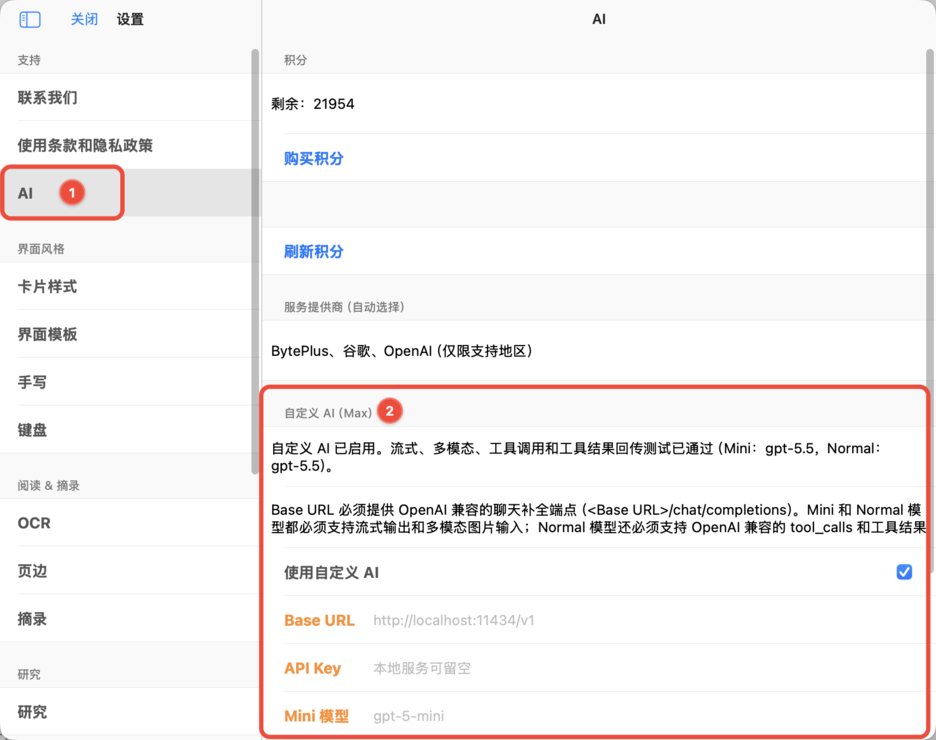
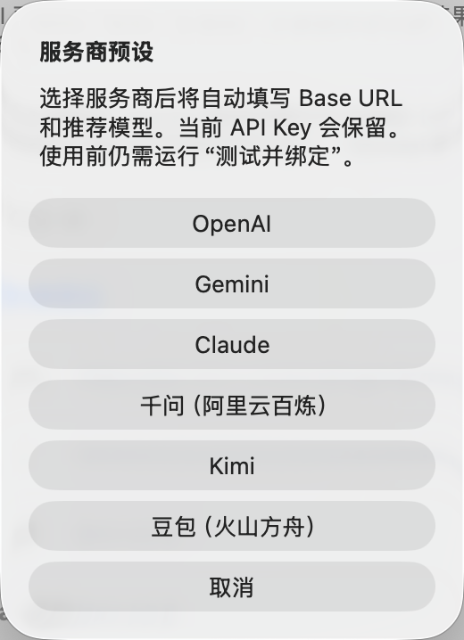
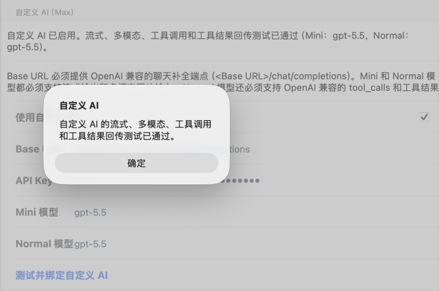
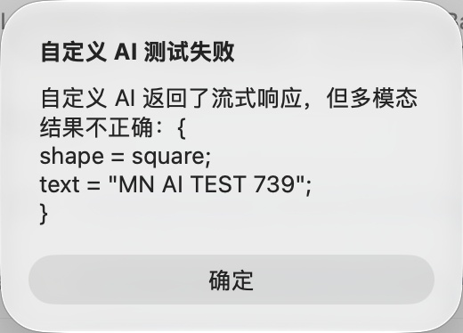
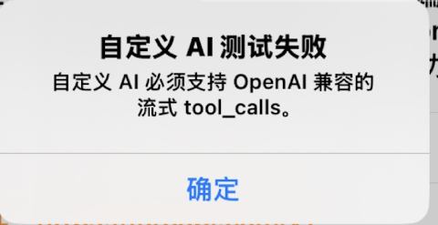

# 自定义 AI API 配置教程（4.4.4 及后续版本）

📌

<code>自定义 AI（Max）</code> 是 Max 用户可使用的高级设置。它用于把 您自己的服务提供商或本地模型服务接入到MarginNote AI 中。开启自定义 AI 后，您可以把 MarginNote 的 AI 请求接入自己准备的模型服务，在阅读、摘录、卡片整理和深度问答时使用更符合个人需求的模型配置。本文将帮助您完成服务地址、密钥和模型名称的填写，并确认自定义 AI 是否已经绑定成功。绑定成功后，MarginNote 中的 AI 功能将全部使用当前自定义 AI 配置。

如果不配置自定义 AI，您也可使用MN 内置AI 功能，后者需要消耗 AI 积分。关于AI积分详见：<a class="mn-preview-link" data-preview="了解MarginNote AI积分" href="https://www.wolai.com/kr1DqNY4irGSmikpwLoyV8" title="了解MarginNote AI积分">了解MarginNote AI积分</a>

# 1 使用前需要准备什么

在开始设置前，请先确认您已经拥有可调用的 AI 服务。MarginNote 使用 OpenAI Chat Completions 格式的 API，因此自定义 AI 接入的 API 也必须完美兼容 OpenAI Chat Completions 格式，并且可以被当前设备访问。

常见准备项及接口兼容要求：

- 可访问的`Base URL` ：必须提供 OpenAI 兼容的聊天补全端点，示例：[https://api.openai.com/v1/chat/completions](https://api.openai.com/v1/chat/completions "https://api.openai.com/v1/chat/completions")（具体以MaaS 平台的接口文档为准）以及其对应的 `API Key` 。如果使用本地服务，且该服务不需要密钥，可以留空。
- 用于轻量任务的 `Mini 模型` 和 用于常规任务的 `Normal 模型` （可以与 mini模型相同），`Mini 模型` 和 `Normal 模型` 都必须支持流式输出、多模态图片输入（主要用于图片识别）。
- `Normal 模型` 还必须支持 OpenAI 兼容的`tool_calls`，以及工具结果回传。
- 确保 MarginNote4已更新到4.4.4及更新版本（👉[前往App Store检查更新](https://apps.apple.com/cn/app/marginnote-4-ai%E9%98%85%E8%AF%BB-%E6%80%9D%E7%BB%B4%E5%AF%BC%E5%9B%BE/id1531657269 "前往App Store检查更新")）

如果您使用的是本地模型服务，请先启动本地服务，再回到 MarginNote 中填写地址。示例：[http://127.0.0.1:1111/v1/chat/completions](http://127.0.0.1:1111/v1/chat/completions "http://127.0.0.1:1111/v1/chat/completions")

# 2 进入自定义 AI 设置

1. 打开 MarginNote。
2. 进入 `设置`。
3. 在左侧选择 `AI`。
4. 找到 `自定义 AI（Max）` 区域。

按图中所示顺序进入自定义 AI 页面

# 3 填写连接信息

📌

可以直接在 MarginNote 中选择服务商预设，快速配置常见的服务商

服务商预设

按顺序填写以下字段：

- `Base URL`：填写 AI 服务的接口地址。使用本地服务时，可以填写本机地址；使用云端服务时，请填写服务商提供的接口地址。
- `API Key`：填写服务商提供的密钥。本地服务如果不需要密钥，可以保持为空。
- `Mini 模型`：填写用于轻量任务的模型名称，例如快速整理、简单问答等场景。
- `Normal 模型`：填写用于常规任务的模型名称，例如长文本理解、复杂问答和卡片整理等场景。

请直接填写模型在服务端注册的名称。模型名称不需要额外添加引号，也不要填写模型说明文字。严格大小写（大部分情况为小写，示例：claude-opus-4-6、gpt-5.5、gemini-3.1-pro-low）。

# 4 测试并绑定自定义 AI

填写完成后，点击 `测试并绑定自定义 AI` 按钮。

MarginNote 会依次检查自定义 AI 的基础连接能力，以及流式输出、多模态、工具调用和工具结果回传等能力。测试通过后将自动开启自定义 AI 功能，页面会提示“自定义 AI 的流式、多模态、工具调用和工具结果回传测试已通过”的状态提示，并展示当前绑定的 `Mini 模型` 和 `Normal 模型`。

配置 API 成功页面

  💡
  

    
如果测试失败，请优先检查以下内容：

    <ul>
      <li><code>Base URL</code> 是否可以被当前设备访问。</li>
      <li>本地模型服务是否已经启动。</li>
      <li><code>API Key</code> 是否正确，或本地服务是否允许留空。</li>
      <li><code>Mini 模型</code> 与 <code>Normal 模型</code> 的名称是否和服务端保持一致，设置别名无效，严格大小写。以及对应模型是否支持多模态图片识别、流式输出、OpenAI 兼容的<code>tool_calls</code>，以及工具结果回传。</li>
      <li>当前网络是否允许访问对应服务。</li>
    </ul>
  

# 5 什么时候需要修改设置

当您**更换模型、切换服务商，或从本地服务改为云端服务**时，可以回到 `设置` > `AI`，重新修改 `Base URL`、`API Key`、`Mini 模型` 和 `Normal 模型`。

修改后请再次点击 `测试并绑定自定义 AI` 按钮。只有测试通过后，新的自定义 AI 配置才适合用于后续阅读、摘录和卡片处理。

# 6 所有涉及自定义 AI 的场景

配置自定义 API成功后，MarginNote 中的 AI 功能全部使用当前自定义 AI 配置。

> 如果不配置自定义 AI，可使用MN 内置AI 功能，这需要消耗 AI 积分。关于积分购买细则详见：<a class="mn-preview-link" data-preview="了解MarginNote AI积分" href="https://www.wolai.com/kr1DqNY4irGSmikpwLoyV8" title="了解MarginNote AI积分">了解MarginNote AI积分</a>

- <a class="mn-preview-link" data-preview="AI 浮窗（Ask）" href="https://www.wolai.com/qx5HusQ7gV2WZmK4S4PfhY" title="AI 浮窗（Ask）">AI 浮窗（Ask）</a>
- <a class="mn-preview-link" data-preview="AI 对话侧边栏（Chat）" href="https://www.wolai.com/dbRow-5iNniGsRaUaEWhu4QaXwYB-2WafWJVa7zyQJ8xduDNUXA" title="AI 对话侧边栏（Chat）">AI 对话侧边栏（Chat）</a>
- <a class="mn-preview-link" data-preview="AI目录" href="https://www.wolai.com/dR9jWaQeoKJx3zreicvxvo#kEJH3fcRdAGhf8VpWmtHhG" title="AI目录">AI目录</a>
- <a class="mn-preview-link" data-preview="记忆回朔" href="https://www.wolai.com/dR9jWaQeoKJx3zreicvxvo#dF1KdHWENyg7TveUyMuYw6" title="记忆回朔">记忆回朔</a>
- <a class="mn-preview-link" data-preview="AI 一键识别为 Markdown 文本" href="https://www.wolai.com/dR9jWaQeoKJx3zreicvxvo#7sJPSm6pe4i3NeBDJZsKUQ" title="AI 一键识别为 Markdown 文本">AI 一键识别为 Markdown 文本</a>
- <a class="mn-preview-link" data-preview="AI OCR" href="https://www.wolai.com/dR9jWaQeoKJx3zreicvxvo#hQ5STjDE5P7362vywGNa1U" title="AI OCR">AI OCR</a>

# 7 报错分析

1. 多模态已通过，但存在工具调用（tool_calls）存在兼容性问题。

    - 报错原因：流式工具调用失败，不完美兼容 OpenAI Chat Completions 格式。
    - 解决方案：请更换模型或 MaaS API 平台。

      

      案例2

2. 自定义 AI 测试失败。自定义 AI 必须支持 OpenAI 兼容的流式Tool_calls。

    - 报错原因：部分中转站只支持 OpenAI Response 格式 API，不支持 Chat Completions 格式。
    - 请更换 MaaS  API 平台。

      

      案例3

## 补充排错

修改配置后请重新运行完整测试。不要只以普通文本聊天成功判断兼容性，应以 MarginNote 的完整测试全部通过为准。

  ⚠️
  
本节补充只按 <a href="https://developers.openai.com/api/reference/resources/chat/subresources/completions/methods/create" title="OpenAI Chat Completions">OpenAI Chat Completions</a> 格式核对：请求端点为 <code>POST /v1/chat/completions</code>，请求体使用 <code>model</code> 和 <code>messages</code>；流式请求使用 <code>stream: true</code>；图片输入位于 <code>messages[].content</code> 数组中 <code>type: image_url</code> 的内容块内；工具定义使用 <code>tools</code>，模型返回的工具调用位于 <code>tool_calls</code>，工具结果使用 <code>role: tool</code> 和对应的 <code>tool_call_id</code> 回传。Responses API 是另一套接口，本节不将其字段作为配置依据。

### 无法连接、超时或网络错误

**常见原因**：Base URL 无法访问、本地服务未启动、端口错误、局域网地址不可达、HTTPS 证书异常、代理或防火墙拦截。

**处理方法**：确认 Base URL 是完整端点；本地服务确认进程和端口已经启动；跨设备访问时不要使用`127.0.0.1`；检查当前设备的网络、代理、防火墙和证书设置。

### 401、403 或鉴权失败

**常见原因**：API Key 错误或过期、Key 前后混入空格、账号无模型权限，或中转服务使用非标准鉴权。

**处理方法**：重新复制密钥，确认账号权限与余额，并核对服务是否兼容标准的`Authorization: Bearer <API Key>`鉴权。

### 404、接口不存在或方法不支持

**常见原因**：把`/v1/responses`、`/v1/completions`或服务商根地址当成 Chat Completions 端点；Base URL 被重复拼接；服务商实际路径不同。

**处理方法**：以服务商文档为准填写完整的 Chat Completions 地址。OpenAI 官方端点为`https://api.openai.com/v1/chat/completions`。

### 模型不存在、无权限或余额不足

**常见原因**：模型名称或大小写错误、使用了展示别名、账号没有模型权限、额度不足或触发限流。

**处理方法**：从服务商控制台复制实际模型 ID；确认 Mini 和 Normal 两项均可调用；检查余额、速率与并发限制。

### 流式输出测试失败

**常见原因**：服务只返回一次性 JSON；中转站没有透传 Server-Sent Events；响应不兼容 Chat Completions 的`stream: true`。

**处理方法**：开启服务端流式输出，或更换完整兼容 Chat Completions 流式响应的模型或 MaaS 平台。

### 多模态图片测试失败

**常见原因**：模型不支持图片输入；中转站只转发文本；图片字段或数据 URL 格式不兼容。

**处理方法**：为 Mini 和 Normal 都选择支持 Chat Completions 图片输入的多模态模型，并确认服务商没有关闭视觉能力。

### 流式工具调用兼容性问题

**进一步排查**：模型可能只支持非流式工具调用，或者中转站在流式响应中丢失`tool_calls`、调用 ID、函数名或参数片段。仅“能够调用函数”不代表流式格式完全兼容。

### 服务仅提供 Responses API

**进一步排查**：确认服务实际提供`/v1/chat/completions`，并接受`messages`、`stream`和`tools`。只有`/v1/responses`的服务即使普通文本可以返回，也不满足这里的接口要求。

### 工具结果回传失败

**常见原因**：服务能生成工具调用，却不能接收带有对应`tool_call_id`的工具结果消息；中转站修改或丢失调用 ID；模型不能继续生成最终答复。

**处理方法**：确认服务完整支持“模型发起工具调用 → 客户端回传工具结果 → 模型继续回答”的多轮流程；无法修复时更换模型或 MaaS 平台。

### 返回内容为空、格式异常或测试偶发失败

**常见原因**：服务返回自定义包裹结构、限流后仍返回 200、内容审核拦截、上下文窗口过小，或服务不稳定。

**处理方法**：稍后重试并查看服务端日志；检查响应是否保持 OpenAI Chat Completions 字段结构；降低并发或更换稳定端点。

  💡
  
仍无法定位时，请记录测试阶段、完整错误提示、服务商名称、Base URL 的域名与路径、Mini/Normal 模型名称及服务端日志。分享排查信息时务必隐藏 API Key。

