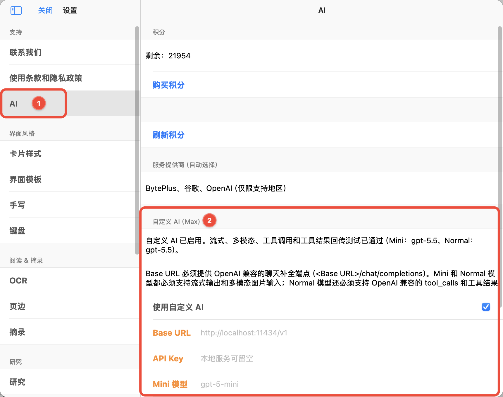
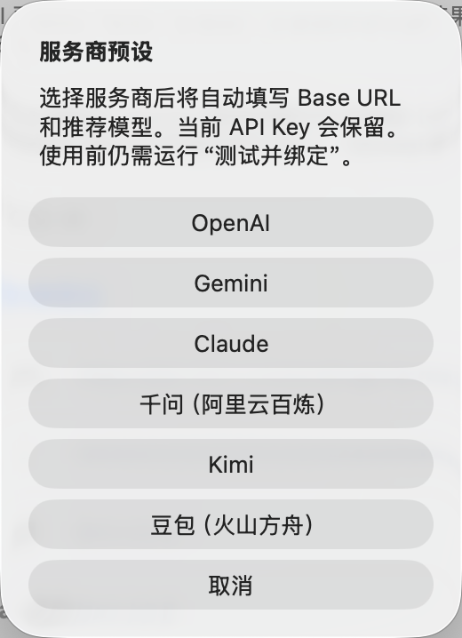
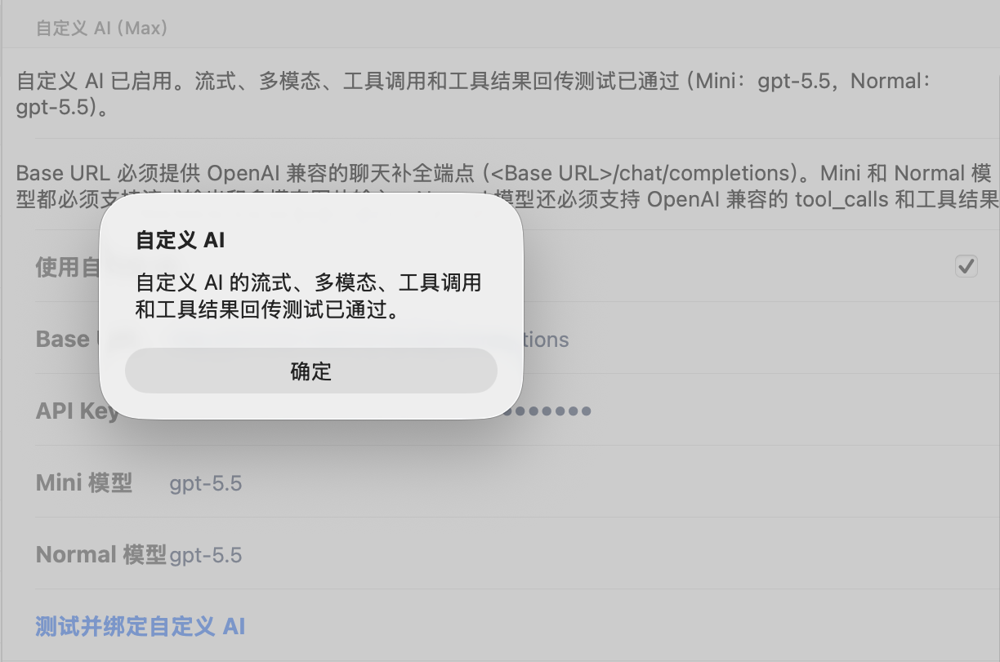
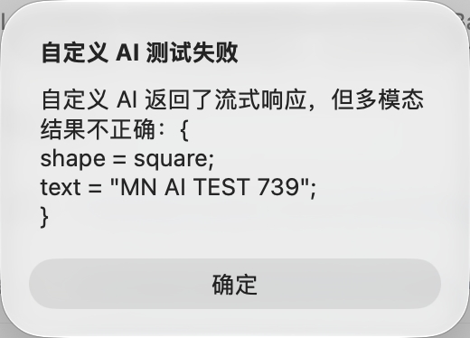
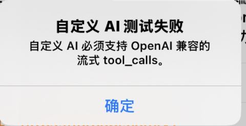

# 自定义 AI API 配置教程（4.4.4 及后续版本）

> 📌`自定义 AI（Max）` 是 Max 用户可使用的高级设置。它用于把 您自己的服务提供商或本地模型服务接入到MarginNote AI 中。开启自定义 AI 后，您可以把 MarginNote 的 AI 请求接入自己准备的模型服务，在阅读、摘录、卡片整理和深度问答时使用更符合个人需求的模型配置。本文将帮助您完成服务地址、密钥和模型名称的填写，并确认自定义 AI 是否已经绑定成功。绑定成功后，MarginNote 中的 AI 功能将全部使用当前自定义 AI 配置。
>
> 如果不配置自定义 AI，您也可使用MN 内置AI 功能，后者需要消耗 AI 积分。关于AI积分详见：
>
> [了解MarginNote AI积分](https://www.wolai.com/kr1DqNY4irGSmikpwLoyV8 "了解MarginNote AI积分")

## 1 使用前需要准备什么

在开始设置前，请先确认您已经拥有可调用的 AI 服务。MarginNote 使用 OpenAI Chat Completions 格式的 API，因此自定义 AI 接入的 API 也必须完美兼容 OpenAI Chat Completions 格式，并且可以被当前设备访问。

常见准备项及接口兼容要求：

- 可访问的`Base URL` ：必须提供 OpenAI 兼容的聊天补全端点，示例：[https://api.openai.com/v1/chat/completions](https://api.openai.com/v1/completions "https://api.openai.com/v1/chat/completions")（具体以MaaS 平台的接口文档为准）以及其对应的 `API Key` 。如果使用本地服务，且该服务不需要密钥，可以留空。
- 用于轻量任务的 `Mini 模型` 和 用于常规任务的 `Normal 模型` （可以与 mini模型相同），`Mini 模型` 和 `Normal 模型` 都必须支持流式输出、多模态图片输入（主要用于图片识别）。
- `Normal 模型` 还必须支持 OpenAI 兼容的`tool_calls`，以及工具结果回传。
- 确保 MarginNote4已更新到4.4.4及更新版本（👉[前往App Store检查更新](https://apps.apple.com/cn/app/marginnote-4-ai%E9%98%85%E8%AF%BB-%E6%80%9D%E7%BB%B4%E5%AF%BC%E5%9B%BE/id1531657269 "前往App Store检查更新")）

如果您使用的是本地模型服务，请先启动本地服务，再回到 MarginNote 中填写地址。示例：[http://127.0.0.1:1111/v1/chat/completions](http://127.0.0.1:8317/v1/chat/completions "http://127.0.0.1:1111/v1/chat/completions")

## 2 进入自定义 AI 设置

1. 打开 MarginNote。
2. 进入 `设置`。
3. 在左侧选择 `AI`。
4. 找到 `自定义 AI（Max）` 区域。

## 3 填写连接信息

> 📌可以直接在 MarginNote 中选择服务商预设，快速配置常见的服务商
>
> 

按顺序填写以下字段：

- `Base URL`：填写 AI 服务的接口地址。使用本地服务时，可以填写本机地址；使用云端服务时，请填写服务商提供的接口地址。
- `API Key`：填写服务商提供的密钥。本地服务如果不需要密钥，可以保持为空。
- `Mini 模型`：填写用于轻量任务的模型名称，例如快速整理、简单问答等场景。
- `Normal 模型`：填写用于常规任务的模型名称，例如长文本理解、复杂问答和卡片整理等场景。

请直接填写模型在服务端注册的名称。模型名称不需要额外添加引号，也不要填写模型说明文字。严格大小写（大部分情况为小写，示例：claude-opus-4-6、gpt-5.5、gemini-3.1-pro-low）。

## 4 测试并绑定自定义 AI

填写完成后，点击 `测试并绑定自定义 AI` 按钮。

MarginNote 会依次检查自定义 AI 的基础连接能力，以及流式输出、多模态、工具调用和工具结果回传等能力。测试通过后将自动开启自定义 AI 功能，页面会提示“自定义 AI 的流式、多模态、工具调用和工具结果回传测试已通过”的状态提示，并展示当前绑定的 `Mini 模型` 和 `Normal 模型`。

> 💡如果测试失败，请优先检查以下内容：
>
> - `Base URL` 是否可以被当前设备访问。
> - 本地模型服务是否已经启动。
> - `API Key` 是否正确，或本地服务是否允许留空。
> - `Mini 模型` 与 `Normal 模型` 的名称是否和服务端保持一致，设置别名无效，严格大小写。以及对应模型是否支持多模态图片识别、流式输出、OpenAI 兼容的`tool_calls`，以及工具结果回传。
> - 当前网络是否允许访问对应服务。

## 5 什么时候需要修改设置

当您**更换模型、切换服务商，或从本地服务改为云端服务**时，可以回到 `设置` > `AI`，重新修改 `Base URL`、`API Key`、`Mini 模型` 和 `Normal 模型`。

修改后请再次点击 `测试并绑定自定义 AI` 按钮。只有测试通过后，新的自定义 AI 配置才适合用于后续阅读、摘录和卡片处理。

## 6 所有涉及自定义 AI 的场景

配置自定义 API成功后，MarginNote 中的 AI 功能全部使用当前自定义 AI 配置。

> 如果不配置自定义 AI，可使用MN 内置AI 功能，这需要消耗 AI 积分。关于积分购买细则详见：
>
> [了解MarginNote AI积分](https://www.wolai.com/kr1DqNY4irGSmikpwLoyV8 "了解MarginNote AI积分")

- [AI 浮窗（Ask）](https://www.wolai.com/qx5HusQ7gV2WZmK4S4PfhY "AI 浮窗（Ask）")
- [AI 对话侧边栏（Chat）](https://www.wolai.com/dbRow-5iNniGsRaUaEWhu4QaXwYB-2WafWJVa7zyQJ8xduDNUXA "AI 对话侧边栏（Chat）")
- [AI目录](https://www.wolai.com/dR9jWaQeoKJx3zreicvxvo#kEJH3fcRdAGhf8VpWmtHhG "AI目录")
- [记忆回朔](https://www.wolai.com/dR9jWaQeoKJx3zreicvxvo#dF1KdHWENyg7TveUyMuYw6 "记忆回朔")
- [AI 一键识别为 Markdown 文本](https://www.wolai.com/dR9jWaQeoKJx3zreicvxvo#7sJPSm6pe4i3NeBDJZsKUQ "AI 一键识别为 Markdown 文本")
- [AI OCR](https://www.wolai.com/dR9jWaQeoKJx3zreicvxvo#hQ5STjDE5P7362vywGNa1U "AI OCR")

## 7 报错分析

1. 多模态已通过，但存在工具调用（tool\_calls）存在兼容性问题。

- 报错原因：流式工具调用失败，不完美兼容 OpenAI Chat Completions 格式。
- 解决方案：请更换模型或 MaaS API 平台。

1. 自定义 AI 测试失败。自定义 AI 必须支持 OpenAI 兼容的流式Tool\_calls。

- 报错原因：部分中转站只支持 OpenAI Response 格式 API，不支持 Chat Completions 格式。
- 请更换 MaaS  API 平台。

