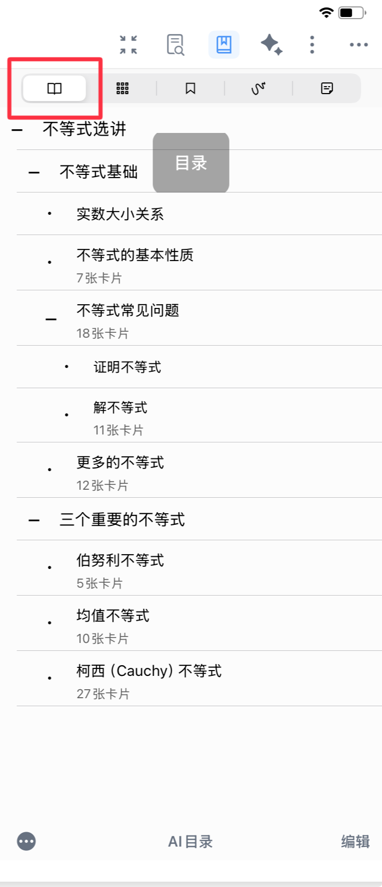
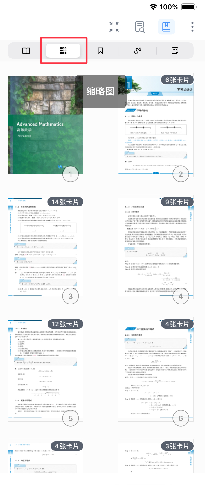
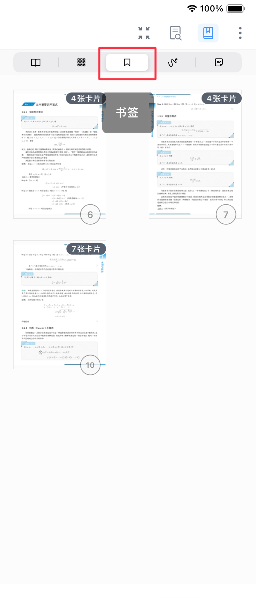
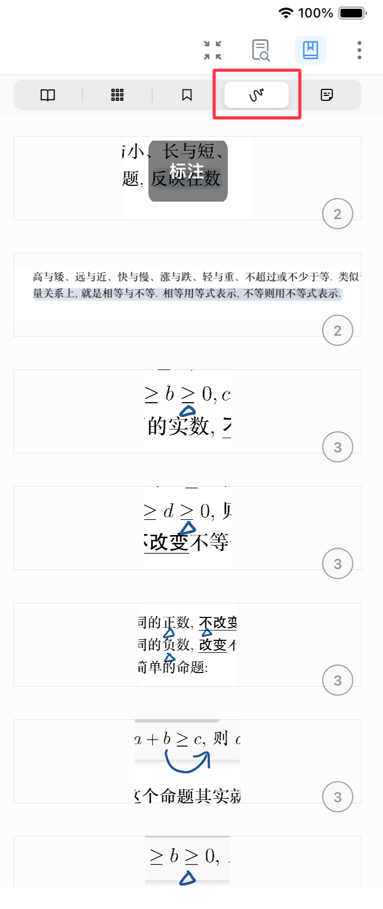
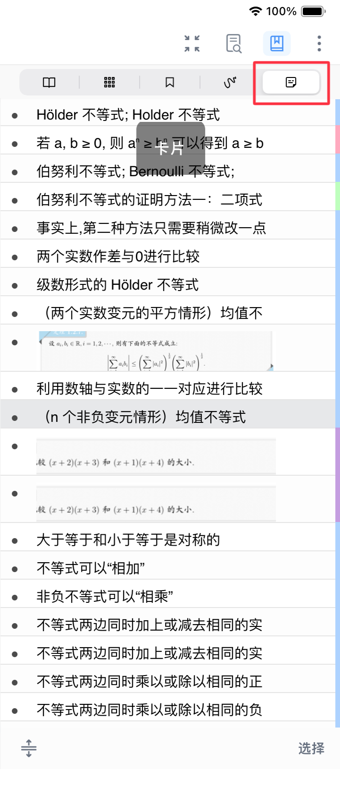
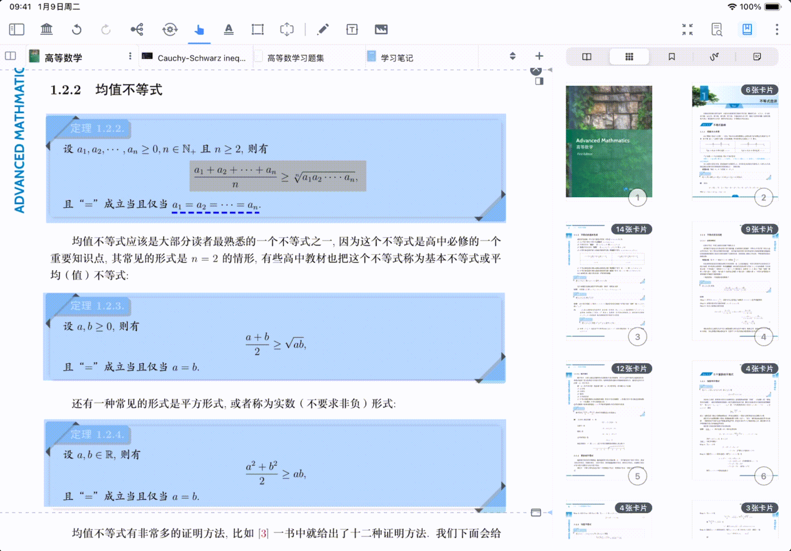
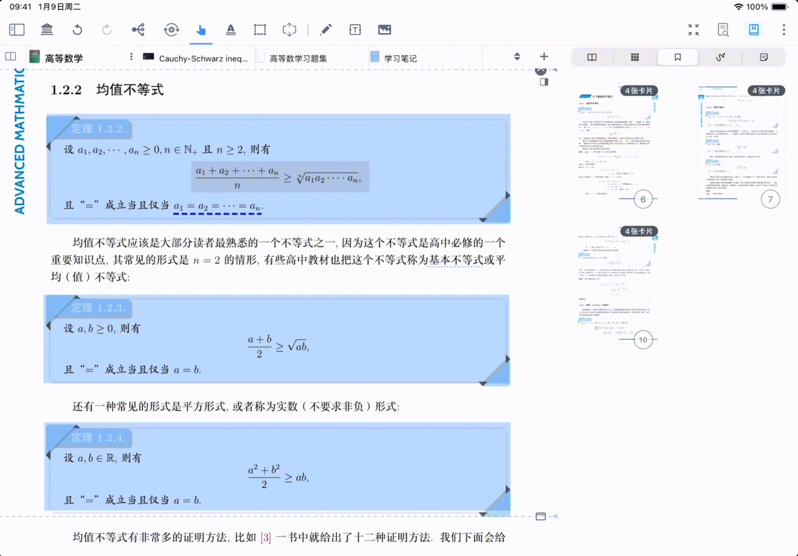

# 检索②：查看文档目录/缩略图/书签/手写标注/卡片

> 💡MarginNote 的书页查找功能整合了五种检索方式：**目录、缩略图、书签、手写标注和卡片**，可根据不同使用需求快速定位目标页面。

# 1 书页查找功能及用法

[书页查找](https://www.wolai.com/bQ3HELpfPdH8QZ4sadPLpu "书页查找")

打开文档右上角的`书页查找`按钮，从左往右依次为：**目录、缩略图、书签、手写标注和卡片**。

> 💡**如何选择查找方式：**
>
> | 你当前知道什么 | 推荐搜索方式 | 原因        |
> | ------- | ------ | --------- |
> | 知道章节标题  | 目录     | 最快按结构跳转   |
> | 记得页面大致长 | 缩略图    | 视觉定位效率高   |
> | 之前打过书签  | 书签     | 直接回到关键锚点  |
> | 记得自己涂画过 | 手写标注   | 直达学习痕迹    |
> | 从卡片回找原文 | 卡片     | 笔记-原文双向链接 |

### 1.1 按目录查找

- 功能简介：依据文档自带的章节层级目录检索，点击对应章节即可跳转至目标页面。（若文档无目录可以[手动&自动生成文档目录](https://www.wolai.com/djV6nMiEdSaxCacjWcptpA "手动&自动生成文档目录")）
- 适用场景：阅读教材、长篇论文等结构化强的文档，快速定位某一章节内容。

### 1.2 按缩略图查找

- 功能简介：以页面缩略图的形式展示全部文档，通过滑动浏览、点击缩略图至目标页面。
- 适用场景：适合快速跳页与跨页对比，不适合精确关键词查找。

### 1.3 按书签查找

- 功能简介：检索手动添加的书签标记，一键跳转至标记的关键页面。
- 适用场景：定位已标记的重点知识点、疑难段落，无需重新翻阅全文。

### 1.4 按手写标注查找

- 功能简介：检索带有手写标注过的区域，快速筛选出做过笔记的内容。
- 适用场景：复习阶段快速回顾自己标注过的重点、易错点。

### 1.5 按卡片查找

- 功能简介：检索从页面中摘录生成的笔记卡片，关联跳转至卡片对应的原文档页面。
- 适用场景：复盘时从笔记反查原文出处，尤其适合“做卡后回源核对”。

# 2 相关功能：书页重组

书页重组属于“查找后的页面重编排”能力，适合把检索到的页面重新组织成学习材料。

按住书页查找里的目录、缩略图、书签、标注不放，拖拽到`标签页栏`，也可以实现对PDF页面的重组（新建或者合并），详见[书页重组](https://www.wolai.com/kFM4Uh2thC5pEXp11wCuJz "书页重组")。

# 3 常见问题

1. 为什么目录里找不到某些内容？

   目录依赖文档目录结构，若原文目录不完整，可改用缩略图或全文检索。
2. 按标注查找会显示哪些内容？

   会显示有手写标注痕迹的页面区域。
3. 按卡片查找适合什么场景？

   适合从已摘录的卡片快速回到原文出处，做复盘与上下文核对。
4. 想要检索信息时，OCR 搜索和书页查找这2种方式应该如何选择？
   - 知道关键词、术语、原句 → 用OCR 检索（[检索①：全文 OCR +搜索定位，扫描版书籍也可畅享阅读](https://www.wolai.com/rpmCakup76GuHCF6N4Ns5c "检索①：全文 OCR +搜索定位，扫描版书籍也可畅享阅读")）
   - 不知道关键词，但知道章节/大概页段/自己做过标注 → 用书页查找（[检索②：查看文档目录/缩略图/书签/手写标注/卡片](https://www.wolai.com/8PoZfbSRai6owkvzpttZAE "检索②：查看文档目录/缩略图/书签/手写标注/卡片")）
   - 复杂场景：先用②粗定位，再用①精确搜索
