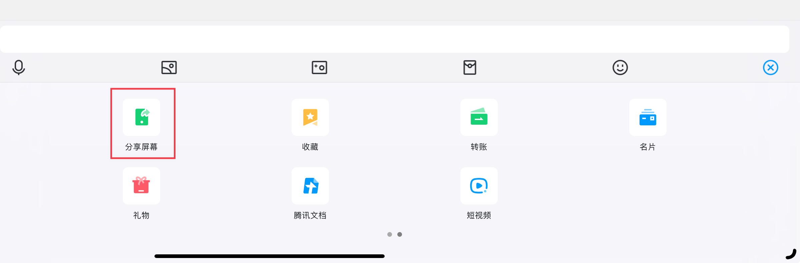
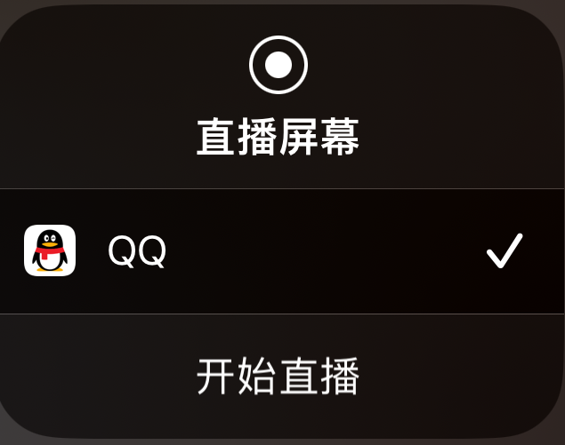
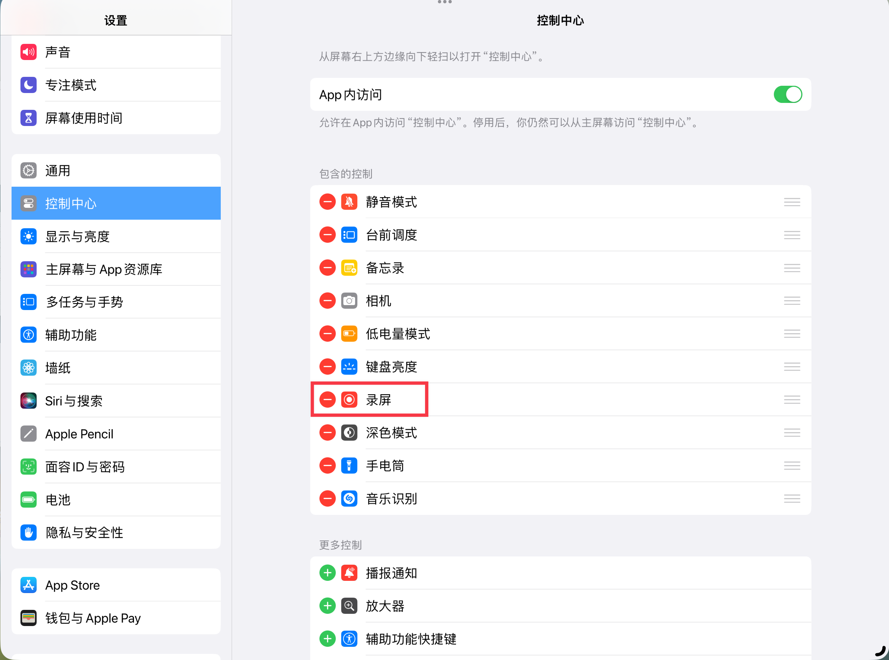
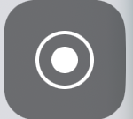
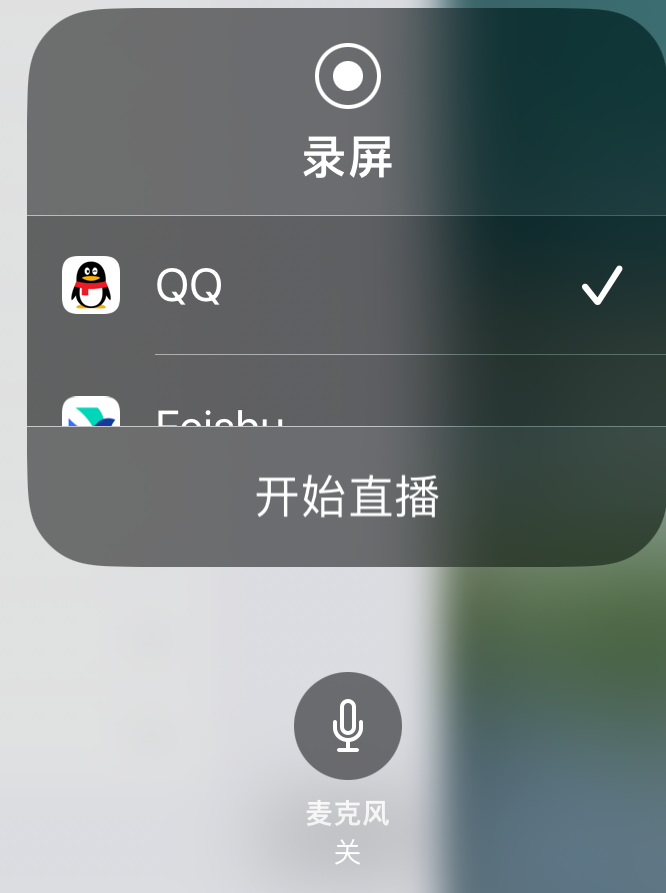

# 演示模式及其应用

> 💡当学习者想要录制自己的操作方式展示给别人作为教学时，演示模式能够将手指的轻点展示为红点点击的样式，将手写笔的点击展示为虚拟的apple pencil模型。通过演示模式，学习者能够更好的将自己的操作步骤展示给其他人。

# 1 打开演示模式

1. 打开首页侧边栏，点击菜单按钮
2. 点击`设置`
3. 下拉找到`混合`中的`演示模式`，点击后重启MarginNote 4即可打开演示模式。

# 2 投屏

## 2.1 本地投屏

MarginNote 3支持外接投影仪, 大屏幕投屏显示, 此项功能MarginNote 4 将会在后续更新。

## 2.2 在线投屏

在Mac端的社交/会议软件可以通过软件自带的投屏方式观看演示操作。当学习者想要通过iPad直播屏幕内容时可以通过以下方式来将iPad屏幕内容作为画面进行展示，配合演示模式可以更直观的直播学习者的操作。

### 2.2.1 分享屏幕

打开任一社交/会议软件的分享屏幕功能，以QQ为例。

1. 在聊天框右侧找到➕按钮，点击后工具栏右滑找到“分享屏幕”

   
2. 点击开始直播。

> 💡其他常用软件官方指南：[腾讯会议](https://meeting.tencent.com/support/topic/1633/index.html "腾讯会议")、[飞书](https://www.feishu.cn/hc/zh-CN/articles/360046586533-使用共享屏幕功能 "飞书")

# 3 录屏

## 3.1 Mac

- 可采用Mac自带的QuickTime Player软件
  1. 打开QuickTime Player
  - 你可以通过在Finder中的“应用程序”文件夹找到QuickTime Player，或者使用Spotlight搜索（按下`Command` + `Space`键，并输入"QuickTime Player"）来启动它。
    &#x20;2\. 开始录制
  - 在QuickTime Player中，选择菜单栏上的“文件” > “新建屏幕录制”。
  1. 设置录制选项
  - 点击屏幕录制窗口中的红色录制按钮后，会出现一个提示，询问你是否要录制整个屏幕或者只录制选定区域。
  - 如果你只想录制屏幕上的部分区域，点击`拖拽以录制部分屏幕`，然后选定你想要录制的区域。
  1. 开始和停止录制
  - 设置好你的录制区域后，点击`开始录制`按钮。
  - 录制完成后，你可以通过点击屏幕顶部菜单栏中的停止录制按钮（一个圆形的停止标志），或者同时按`Command` + `Control` + `Esc`键来结束录制。

## 3.2 iPad

1. 首先确保iPad在设置-控制中心中把录屏加入了控制中心

   

1) 屏幕右上角下滑打开控制中心后，点击录屏图标即可进行屏幕录制
   > 💡长按录屏图标可以进行设置。麦克风开关
   > 

1. 结束录制：录制结束后下滑打开控制中心再次点击录屏按钮即可结束屏幕录制。
