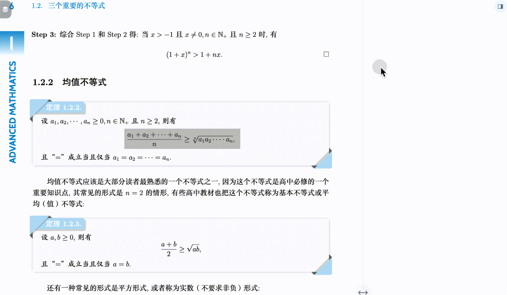
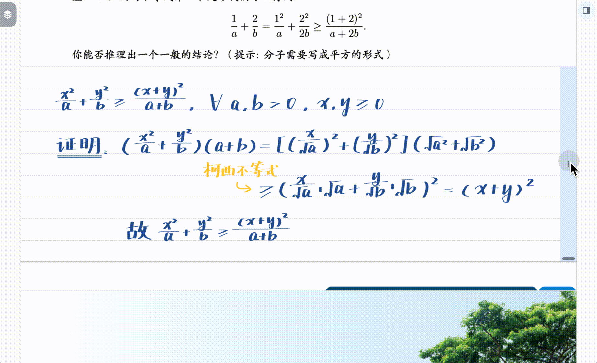
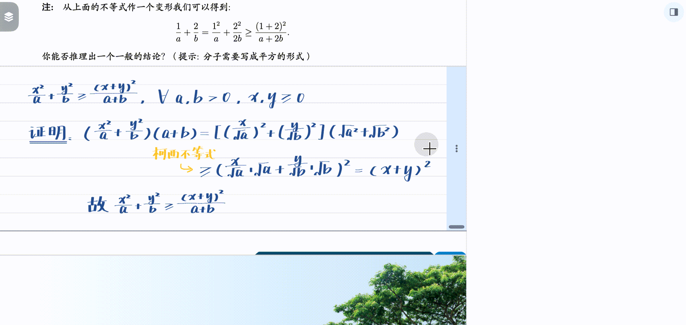

# 留白②|使用场景：分层管理阅读笔记

***

> 💡在阅读时，**我们记在书里的笔记并非同等重要**：有些需要深入理解原文（如补充推导步骤），有些只是临时想法（如待办事项）。MarginNote 4的`留白`功能让你根据笔记类型，灵活选择展示位置。
>
> 如何判断笔记类型⬇️：
>
> - **重要笔记（适合嵌入文中）：**
>   - 补充原文省略的推导步骤
>   - 解释难懂的概念
>   - 记录必须掌握的知识点
>   - 需要反复查看的内容
> - **次要笔记（适合暂存页边）：**
>   - 临时想法和灵感
>   - 扩展阅读资料
>   - 待办事项和提醒
>   - 与当前学习关系不大的内容
>
> 本页是`留白`功能的典型应用场景。如果你还不了解留白的基本操作，请先阅读：[留白①|基础操作：字里行间自由开辟笔记空间](https://www.wolai.com/vYi6Yu4oCudNCr2zDuNQkj "留白①|基础操作：字里行间自由开辟笔记空间")。

# 1 场景一：重要笔记嵌入文中

阅读数学教材时，定理的推导过程往往省略了中间步骤。**你可以用**\*\*`留白`\*\***直接在定理下方补充完整推导，就像在课本里"插入"了额外的空白笔记区**。

- **效果展示**：[🖼️ 图片](<image/CleanShot 2025-10-25 at 19.50.26@2x_paG4zDkApu.png> "🖼️ 图片")

  
- **优势**：复习时，推导过程和原文在同一视线范围内，无需来回翻页对照。

# 2 场景二：次要笔记暂存页边

阅读论文时，你可能随时产生一些想法（如"这个观点和XX理论有关联"），**但这些想法不是理解原文必需的。** 你可以把它们记在`页边评论区`，像便利贴一样贴在书页旁边，既不干扰原文排版，也方便随时与原文对照。

- **操作方式**：点击文档右上角`...(文档-更多`）→将`留白`切换到`页边`模式，同时`页边评论区`会自动打开。左右拖拽←→按钮，可调节页边评论区的宽度

- **页边评论区支持**：
  - `文本`：插入**纯文本**留白
  - `📷`：调用相机拍照（**支持图片矫正**，适合拍摄PPT）
  - `留白`：插入**可手写**的留白
  - `粘贴`：粘贴剪贴板内容

- **优势**： 页边笔记不影响原文排版，既能随时查看，又不会打断阅读心流。

# 3 场景三：折叠←→展开，**动态调整笔记**位置

**笔记的价值会随学习进程变化。** 起初以为不重要的想法，后来可能变得很关键；最初需要的详细推导，熟练后可能只需折叠隐藏。

## 3.1 展开与折叠

- **折叠笔记**： 复习时不需要查看的笔记，可以`折叠`为一条虚线，不干扰阅读。
- **展开笔记**： 需要时点击虚线，笔记立即`展开`。

## 3.2 嵌入与页边互转

- **页边转嵌入：** 发现页边笔记很重要时，可以`展开`为嵌入笔记。
- **嵌入转页边：** 开启`页边评论区`后，`折叠`的嵌入笔记会自动显示在页边（而不是完全隐藏）。

***

> 💡\*\* 注意事项\*\*
>
> - **页边模式是全局设置：** 切换到页边模式后，所有新建留白都会显示在页边。如果需要在文中嵌入笔记，请切换回"正常（嵌入）"模式。
> - **适度使用：** 过多的嵌入留白会增加页面长度和卡顿概率，影响阅读体验。建议只嵌入必要的理解型笔记。
> - **详细操作：** 留白的创建、编辑、删除等详细操作，请查看：[留白①|基础操作：字里行间自由开辟笔记空间](https://www.wolai.com/vYi6Yu4oCudNCr2zDuNQkj "留白①|基础操作：字里行间自由开辟笔记空间")。
