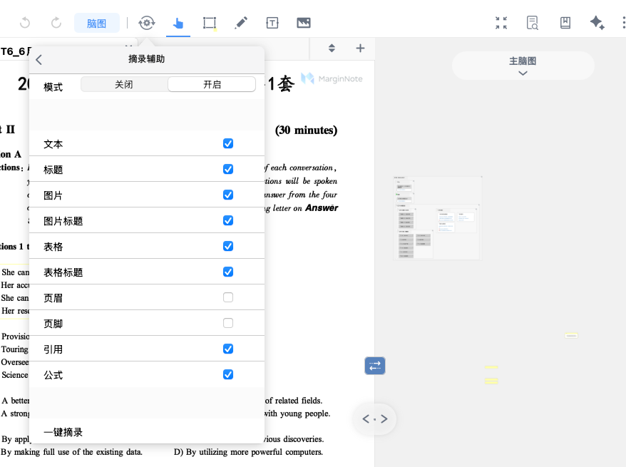
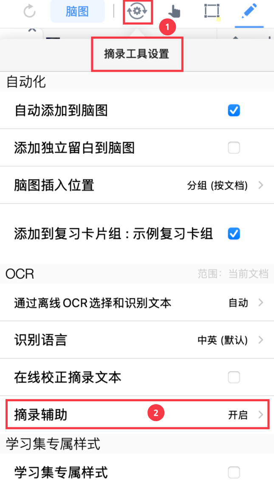
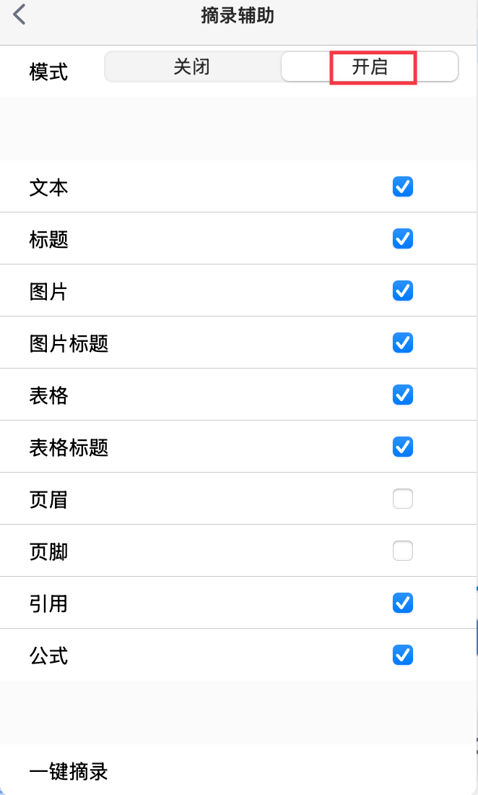
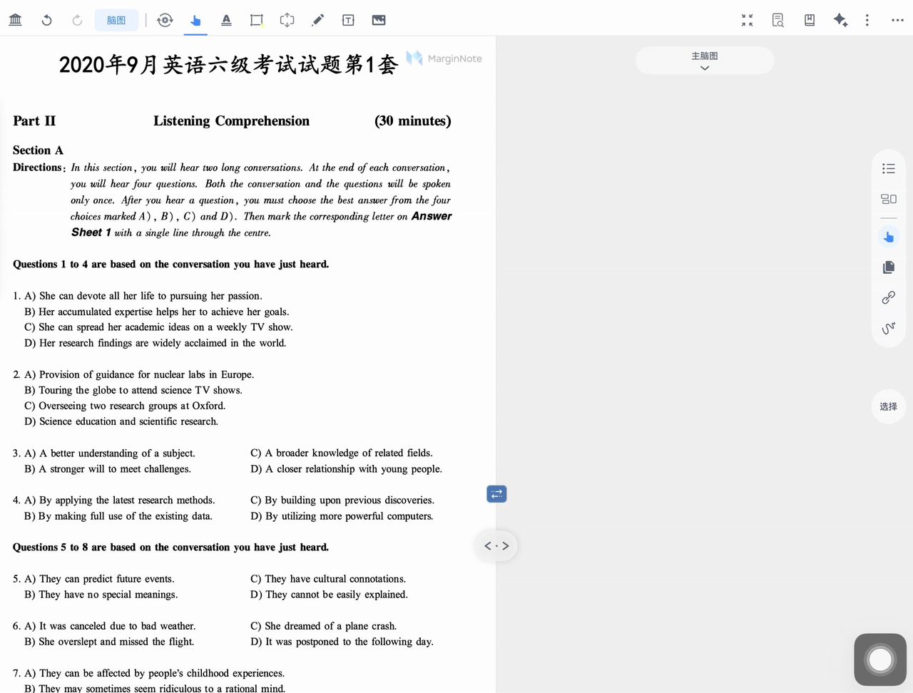
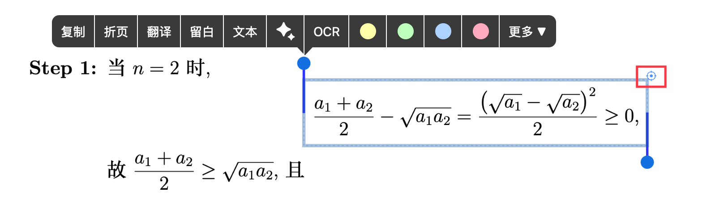
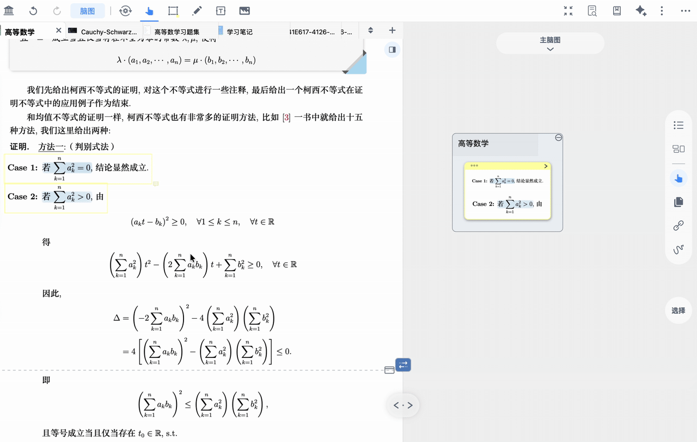
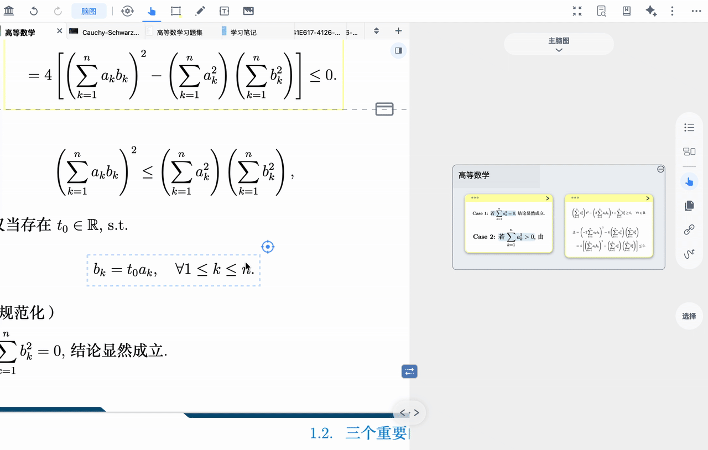
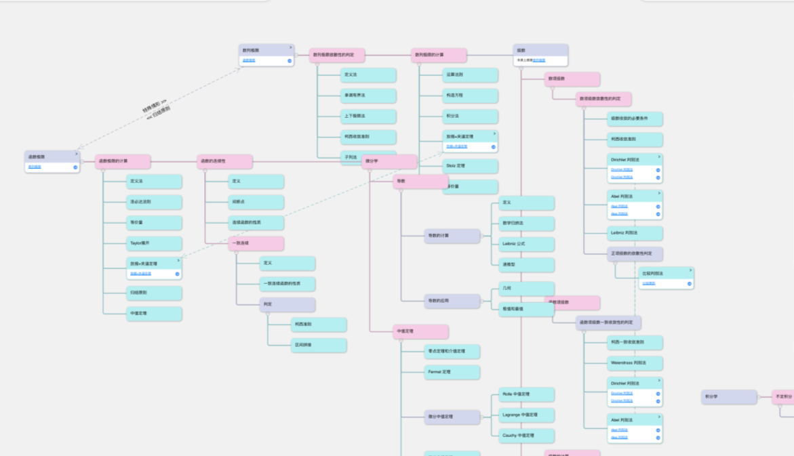

# 自动生成脑图①：使用AI模型一键摘录

MarginNote 一键摘录模型支持文本、标题、图片、图片标题、表格、表格标题、页眉、页脚、引用和公式的识别，不再需要手动框选调整，`辅助摘录`帮助你更快更准的选取所需元素。

> 💡本页功能速览：
>
> - &#x20;摘录辅助设置：自动识别文档中的“文本、标题、图片、图片标题、表格、表格标题、页眉、页脚、引用、公式”等元素
> - 内容块辅助识别：在细虚线框上双击完成单次摘录；或点击右上角图标，进行`合并卡片`、`成为子卡片`等整理
> - 一键摘录（Max 功能）：对已显示的可摘录元素进行批量摘录，快速生成卡片

# 1  摘录辅助设置

[摘录工具设置](https://www.wolai.com/hgMYX7XCNpvGAMxgBfLAQE "摘录工具设置")

> 💡推荐摘录原则：先筛选元素，再进行高效率摘录。

1. 点击`摘录工具设置` - 开启`摘录辅助`

1. 在元素开关中，仅保留需要的元素。

1. 在文档中：
   1. 单击显示摘录辅助区域；
   2. 双击选中区域，弹出`菜单栏`；
   3. 再次双击摘录成卡。

> 💡常见场景建议
>
> - 论文摘录：仅开启`标题`、`文本`、`图片`、`图片标题`、`表格`、`表格标题`、`引用`和`公式`。
> - 图文混排课程讲义：开启`图片`、`图片标题`、`文本`，快速一键摘录后再整理为子卡片。
> - 公式为主的教材：开启`公式`、`正文`，用单次摘录确保表达式准确。

> ⚠️温馨提示：摘录辅助功能会增加耗电功率，并在部分低性能设备上易导致闪退，建议确有需要时再开启

# 2 内容块辅助识别

> 💡除了快速摘录之外，MarginNote 4支持内容块一键识别，不再需要手动框选图片、公式。

1. 开启`摘录辅助`功能后，单击目标元素 - 右上角图标，唤出`弹出菜单栏`。

1. 快速对目标内容进行操作。

## 2.1 合并卡片

基于内容块辅助识别，点击右上角图标选中目标内容，拖动进行卡片合并。

## 2.2 成为子卡片

基于内容块辅助识别，点击右上角图标选中目标内容，拖动即可完成卡片合并或设为子卡片。

# 3 一键摘录（Max 功能）

> 💡适用：摘录短篇论文，快速将整本元素生成卡片。

选择需要摘录的元素，点击`摘录辅助`中的`一键摘录`。

> 💡摘录后的卡片会将同一类元素设置为同一种颜色。

> 💡在脑图里阅读卡片，手动[脑图卡片②：移动、合并、重组](https://www.wolai.com/pmyU9i1nmv96THhMEM65Na "脑图卡片②：移动、合并、重组")，通过[卡片链接①|单双向链接：跨越层级的自由关联](https://www.wolai.com/mGz8BQh6r1ad6wv1jqDo1G "卡片链接①|单双向链接：跨越层级的自由关联")整理脑图卡片之间的联系，图形化提升记忆效果。
>
> 

# 4 常见问题

- 看不到细虚线框？
  - 确认`摘录辅助`已开启；元素开关未全部关闭
- 一键摘录了太多不需要的内容怎么办？
  - 返回关闭多余元素的开关，再用`一键摘录`选取有用元素
  > ⚠️温馨提示：摘录辅助功能会增加耗电功率，并在部分低性能设备上易导致闪退，建议确有需要时再开启
