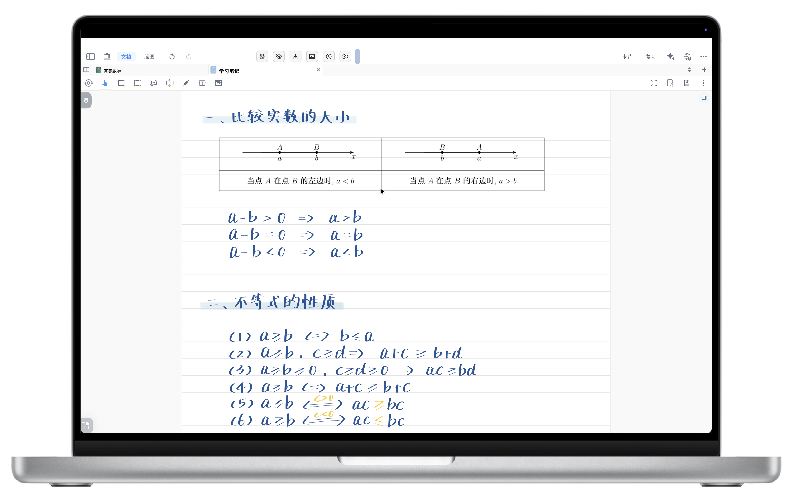
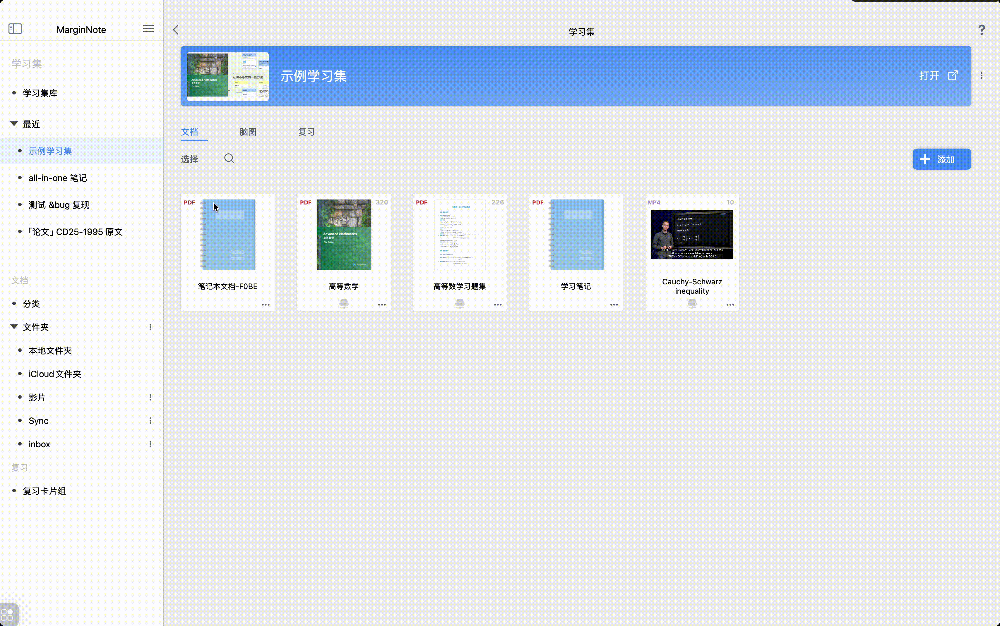
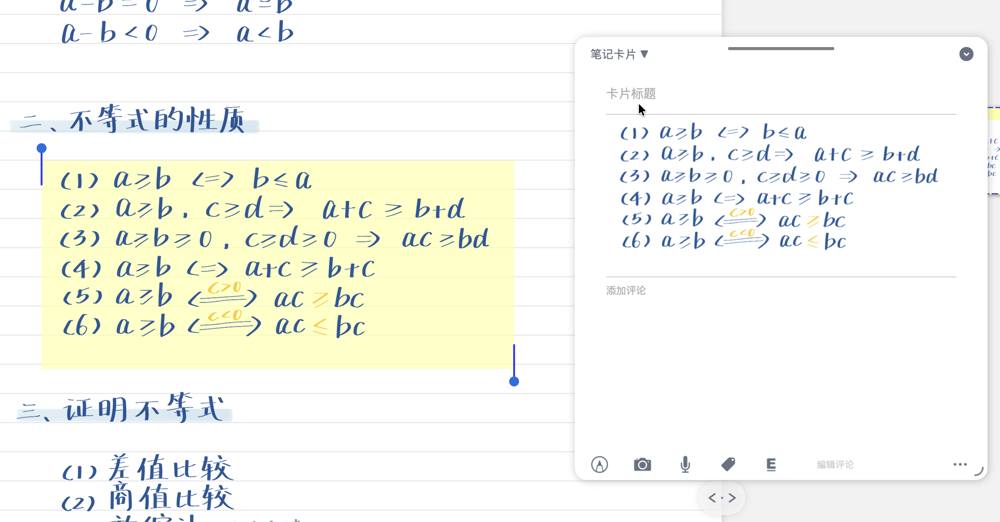
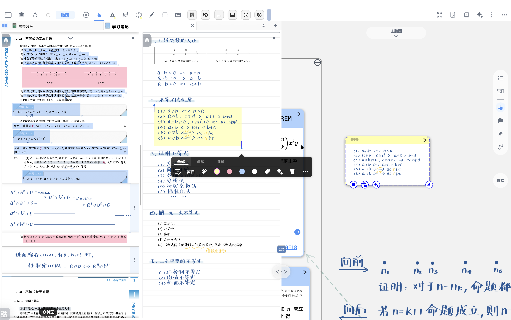

# 新建空白笔记本

> 💡新建笔记本是 MarginNote 4 提供的功能，允许你在某个学习集中创建一个独立的空白笔记本，用来做课后笔记、草稿、思维导图前的手写草稿等。它与直接在 PDF 上做笔记一样，可转为卡片并纳入脑图、复习流程中。

> ❗**准备工作**：新建的**空白笔记本**会保存在学习集的“文档（Documents）”板块中，**若没有学习集请先创建**。

> 💡新建笔记本具有以下优点。
>
> - **多种页面样式**：空白、点阵、方格、横线（未来版本可能增加）。
> - **笔记可“卡片化”**：手写或键入的笔记可以制作成卡片，参与脑图、复习与复习计划。
> - **与学习资料整合**：可与同一学习集中的 PDF/EPUB 等文档互相引用、链接，便于复习时检索出处。

# 1 如何新建笔记本

## 1.1 从学习集页面新建（推荐用于想统一管理的情况）

- 打开 MarginNote 4，进入目标学习集页面
- 找到页面中的\*\*`文档`\*\*（Documents）板块并进入
- 点击\*\*`添加`**或**`+`\*\*按钮
- 在弹出的选项中选择`新建笔记本`（如下方图标所示）

  [新建笔记本](https://www.wolai.com/3Uq3oeaVimt8cvpgnqFDT2 "新建笔记本")

## 1.2 从文档/脑图页面新建（推荐在阅读时顺手创建）

- 打开某个文档或进入文档阅读页面。
- 在`文档标签页`区域，点击右侧的导入按钮（如下方图标所示）

  [导入](https://www.wolai.com/bAubaTbpTaq17bRcwv7GGK "导入")
- 在弹出菜单中选择选择`新建笔记本`

> 💡笔记本复用说明
>
> - 复用笔记本：如果想在其他学习集中使用同一笔记本，可在学习集页面将该笔记本拖拽到目标学习集中。
> - 借助新建文档笔记本或手写图层, 可实现笔记本自身的循环复用。（详见：[图层：文档笔记本&手写图层](https://www.wolai.com/6gbzKZ4a16uYGaFNLMYASD "图层：文档笔记本&手写图层")）
>
> 

# 2 笔记本的基础功能

> 💡MarginNote 4 的空白笔记本 =「手写 + 键入 + 媒体」三合一画布，所有元素均可摘录后「卡片化」后进入脑图与复习流。

## 2.1 笔记本支持的笔记功能

新建笔记本不仅支持手写，还提供了丰富的笔记工具，让您的想法得以灵活记录：

- **手写笔记**：支持Apple Pencil或其他手写笔进行流畅书写和绘图，可将手写内容转化为卡片。（详见：[手写： 在文档、脑图、卡片中自由书写](https://www.wolai.com/pYzC5dfXtbC7taLgQC3DFs "手写： 在文档、脑图、卡片中自由书写")）

  
- **文本框**：可插入独立的文本框进行排版。（详见：[新建文本框/图片/拍照](https://www.wolai.com/3w7coSpmfsLecSW1hxQV24 "新建文本框/图片/拍照")）
- **插入图片与照片**：支持从相册导入图片或直接拍照插入到笔记本中，丰富您的笔记内容。（详见：[新建文本框/图片/拍照](https://www.wolai.com/3w7coSpmfsLecSW1hxQV24 "新建文本框/图片/拍照")）
- **图层功能**：支持手写图层与文档图层分离，便于管理和复用。（详见：[图层：文档笔记本&手写图层](https://www.wolai.com/6gbzKZ4a16uYGaFNLMYASD "图层：文档笔记本&手写图层")）

## 2.2 更改笔记本页面样式（空白/点阵/方格/横线）

> 💡MarginNote 4新建笔记本提供了四种不同的页面样式 **（空白、点阵、方格、横线）**，以适应不同学习者的笔记习惯。（样式可能会随着软件更新而增加）

- 打开你要更改的笔记本文档
- 在学习集界面顶部找到“文档工具栏” → 点击右侧`文档-更多`按钮。

  [文档-更多](https://www.wolai.com/sXcbPqE5bY2h9Y6UWxv8F3 "文档-更多")
- 在背景样式选择处，从左到右依次选择：空白、点阵、方格、横线（选择后会即时应用）。

> 💡提示：页面样式更改不会影响已保存的笔记内容。

## 2.3 笔记本页面管理

除了更改页面样式，笔记本还提供灵活的页面管理功能：

- **添加页面**：您可以随时在笔记本中添加新页面，无限扩展您的笔记空间。
- **页面裁边**：支持对笔记本页面进行裁边，以适应不同的阅读或打印需求，优化显示效果。

> 💡具体操作详见：[增删页面、裁剪纸张](https://www.wolai.com/akPnCSBmGv2BXCzkTBrFTB "增删页面、裁剪纸张")

# 3 实用技巧与建议（提高效率）

- 命名规范：为笔记本和卡片使用一致的命名规则，如（课程\_章节\_主题），便于检索。
- 目录化：给笔记本建立简单目录快速跳转。（详见：[手动&自动生成文档目录](https://www.wolai.com/djV6nMiEdSaxCacjWcptpA "手动&自动生成文档目录")）
- 使用样式：对比不同页面样式（点阵适合草图，方格适合数学/表格，横线适合速记），依据用途选择。
- 定期整理卡片：把散落的临时笔记制作成卡片并整理到脑图中。（详见：[手动摘录生成脑图](https://www.wolai.com/5sY7oXw6U88xhJnKA6ChUr "手动摘录生成脑图")）

  
