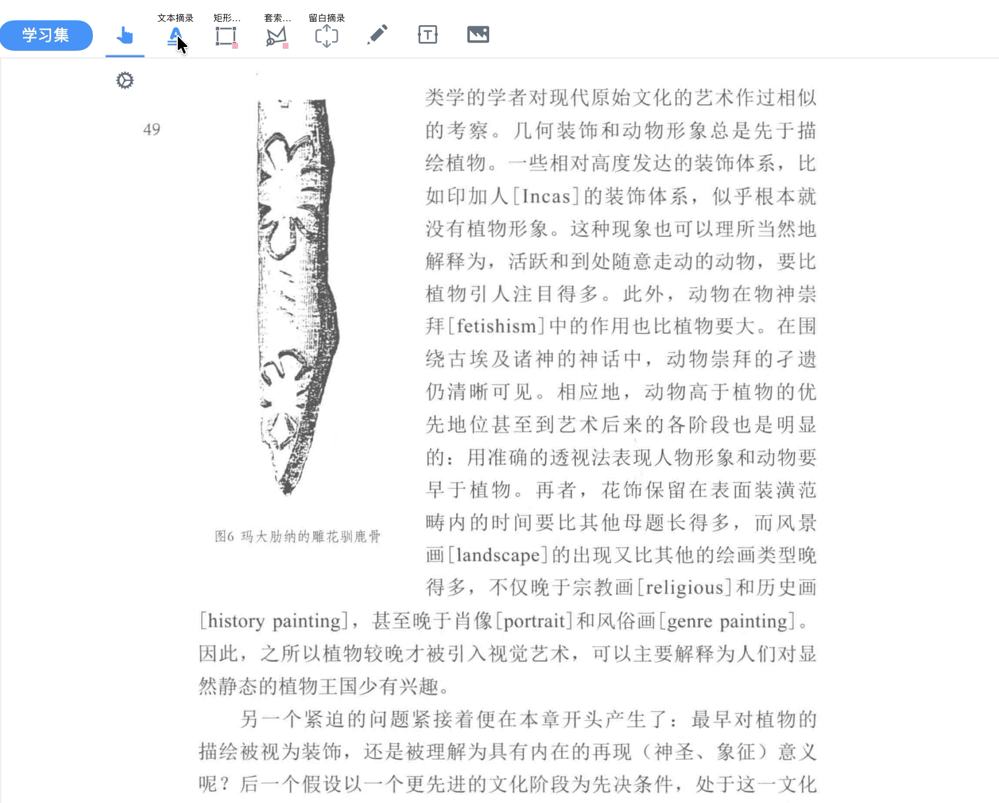
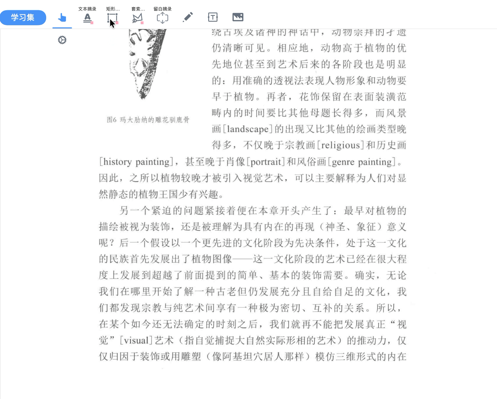
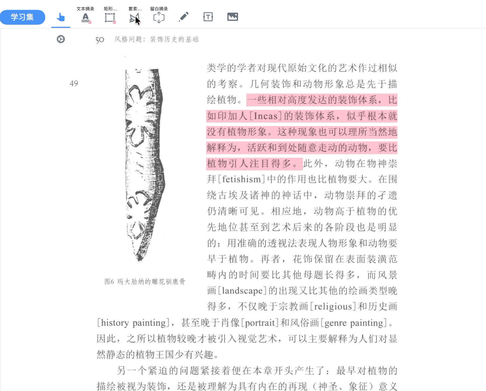
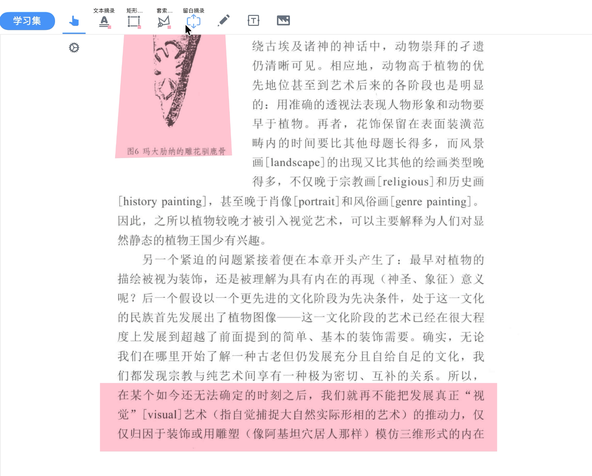
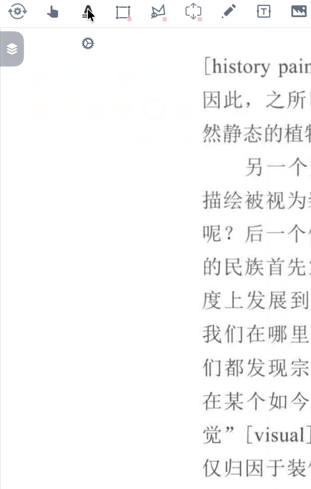
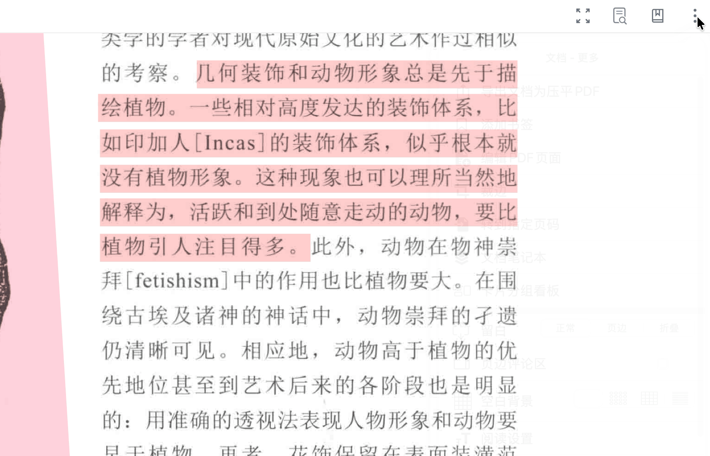
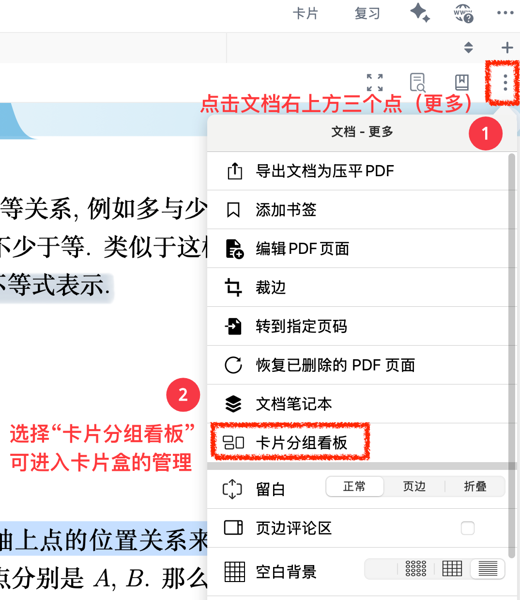
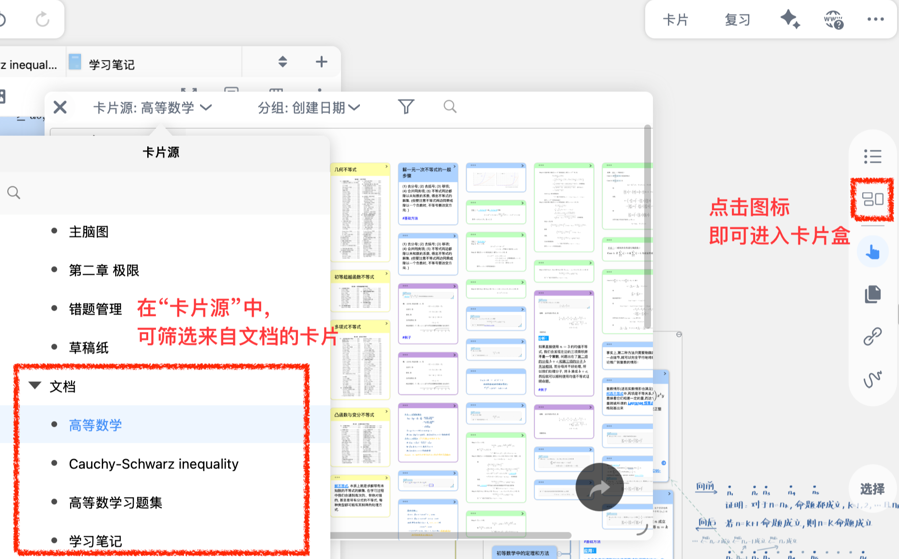
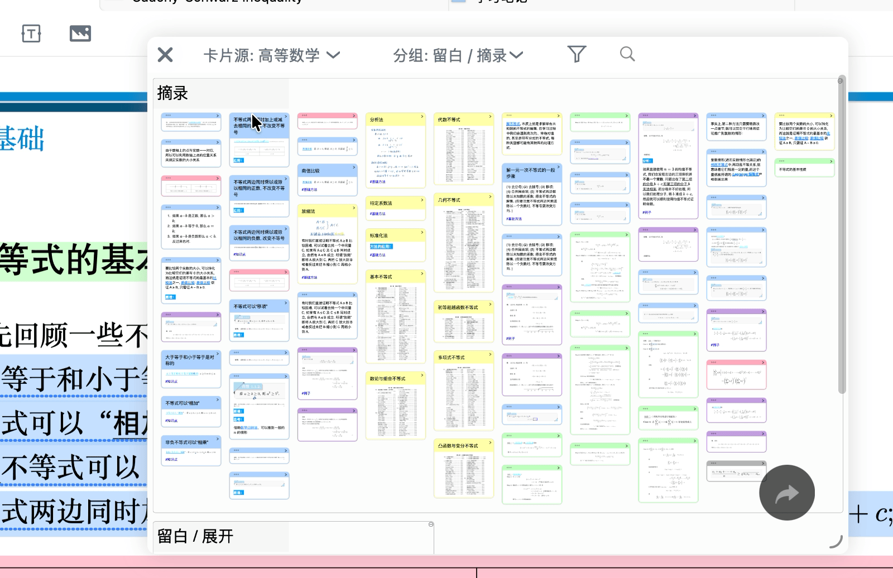

# 摘录：抓住全文重点

> 💡`摘录`是 MN4 文档阅读笔记的核心功能，无需绑定脑图框架，就能高效提取、管理和复用关键信息。兼具可编辑、易复用的优势，适配多种阅读场景。

# 1 功能定位

- 摘录是 MN4 纯文档阅读笔记模式的核心基础操作，可将文档关键信息提取为独立可编辑摘录卡片，无需绑定脑图框架，即可完成高效的信息提取、管理与复用。
- 适配场景：碎片化知识留存、单文档深度研读、临时重点提炼等。
- 与`荧光笔`等其他工具相比的突出优势：可筛选、可编辑、易管理、能导出。

# 2 核心功能模块

## 2.1 四大摘录工具

内置`文本摘录`、`矩形摘录`、`套索摘录`和`留白摘录`4类核心摘录工具，适配不同阅读需求，可按需选择使用。

| 摘录工具  !\[  ]\(\<image/截屏2026-01-13 16.29.55\_2GJWyigaMd.png> "  ") | 文本摘录                                                         | 矩形摘录                                                         | 套索摘录                                                         | 留白摘录                                                                                                                                                                                       |
| ------------------------------------------------------------------ | ------------------------------------------------------------ | ------------------------------------------------------------ | ------------------------------------------------------------ | ------------------------------------------------------------------------------------------------------------------------------------------------------------------------------------------ |
| 功能概括                                                               | 精准提取可编辑文本生成摘录卡                                               | 拖拽框选规则区域                                                     | 自由圈选不规则选区                                                    | 在文档内或侧部创建可编辑留白区，共有三种摘录形式                                                                                                                                                                   |
| 适用场景                                                               | 文献、教材等文本类信息提取                                                | 留存图表、公式等，或保留原始排版                                             | 异形图文、无冗余信息、特殊排版内容                                            | 深度补充、逻辑梳理                                                                                                                                                                                  |
| 图片示意                                                               | !\[  ]\(\<image/截屏2026-01-16 02.11.18\_vOryLWBkQo.png> "  ") | !\[  ]\(\<image/截屏2026-01-16 02.11.40\_J4bB94q-B0.png> "  ") | !\[  ]\(\<image/截屏2026-01-16 02.11.07\_Vy7fEiTyuS.png> "  ") | !\[  ]\(\<image/截屏2026-01-16 02.12.03\_1L37w5-8rF.png> "  ")  !\[  ]\(\<image/截屏2026-01-16 02.12.19\_4kt469Ed6f.png> "  ")  !\[  ]\(\<image/截屏2026-01-16 02.14.00\_g7r\_Hl\_O3m.png> "  ") |
|                                                                    |                                                              |                                                              |                                                              |                                                                                                                                                                                            |

# 3 核心操作步骤

## 3.1 基础操作

> 💡温馨提示：导入新的文档时，需要等待一段时间建立文字索引，否则文本摘录可能无法准确识别。

1. 进入文档阅读模式，打开需处理的 PDF/EPUB 等文档；
2. 在文档顶部工具栏选中一个摘录工具；
   1. `文本`摘录工具：用于高亮文本
   2. `矩形`摘录工具：用于高亮矩形选区
   3. `套索`摘录工具：用于高亮不规则选区
   4. `留白`摘录工具：用于插入空白
      > 关于`留白`摘录的具体操作，可参见：[留白①|基础操作：字里行间自由开辟笔记空间](https://www.wolai.com/vYi6Yu4oCudNCr2zDuNQkj "留白①|基础操作：字里行间自由开辟笔记空间")
3. 选择目标文本/选区，即可完成摘录。

> ⚠️注意：EPUB文档只能使用文本摘录工具

# 4 进阶操作

> 💡相比于荧光笔标注，摘录的独特优势是 “脱离原文可复用”：
>
> - 可二次加工：优化格式、改色、加标签、补批注
> - 可转为卡片：添加到脑图/复习卡组成为卡片
> - 可高效管理：统一收纳、精准搜索筛选
> - 可跨场景导出：单条 / 批量导出，适配多场景复用

## 4.1 文档摘录的编辑优化

在文档中生成基础摘录后，即得到相应的摘录卡片。后续可对其进行信息深加工，让摘录从 “文本复制” 升级为 “个人笔记”：

1. 点击摘录，在弹出菜单栏中点击`卡片编辑器`图标后进入编辑界面；
2. 核心操作：
   - **补注补充**：在卡片下方`添加评论`栏增加个人见解、疑问、知识点关联，完成认知加工；
   - **格式优化**：支持原生 MarkDown 格式，可添加加粗、列表、公式，适配学术阅读与专业笔记需求；
   - **标签 / 颜色**：给卡片添加专属标签或颜色，为后续分类管理铺垫。

## 4.2 文档摘录转化为脑图卡片

若想将文档中的摘录添加至脑图进行深度加工，可通过以下两种方式操作：

- 实时添加：在任意`卡片摘录工具`中，勾选`覆盖默认自动化设置`，再开启`自动添加到脑图`，后续新生成的摘录会自动同步至脑图；
- 补加历史摘录：若此前已有部分摘录未同步至脑图，可通过`卡片分组看板`筛选并选中目标卡片，批量添加至脑图即可。

## 4.3 搜索和管理文档摘录：使用`卡片分组看板`

- **唤起入口**：可通过入口统一管理所有未添加至脑图的摘录：
  1. 入口 1：在当前学习集左侧栏，点击文档名称右侧的三个点`文档 - 更多` ，选择`卡片分组看板`；
  2. 入口 2：直接在学习集中点击`卡片分组看板`，筛选条件选择`文档`，即可看到所有文档的未入脑图摘录；

- **精准筛选**：进入`卡片分组看板`后，可叠加`颜色`、`标签`、`文档`等进一步缩小范围；
- **核心操作**：单卡点击溯源原文、编辑；可批量删改、加标签、导出；支持按`创建时间`、`标签`、`颜色`等分组排序，顶部切换文档来源查看多文档摘录。

> 关于卡片分组看板的更多用法，详见：[卡片分组看板①：从海量卡片中精准筛选](https://www.wolai.com/dJvh1K4GEKaJYtZ14zbfgj "卡片分组看板①：从海量卡片中精准筛选")

## 4.4 摘录的导出

- 单条导出：选中目标摘录卡片，跳出菜单栏后，点击三点“更多”中的`导出`，可导出为`PDF`、`长图`；
- 批量导出：进入`卡片分组看板`，批量选中`摘录`，导出为 `PDF` / `长图`文件，适配笔记汇总场景。

