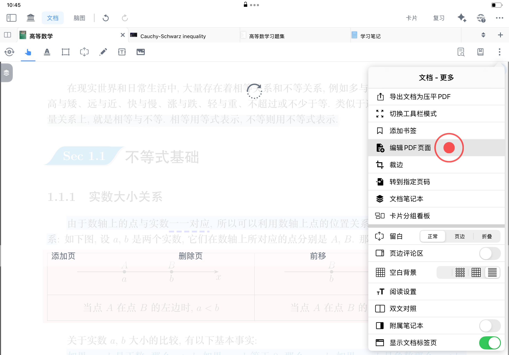
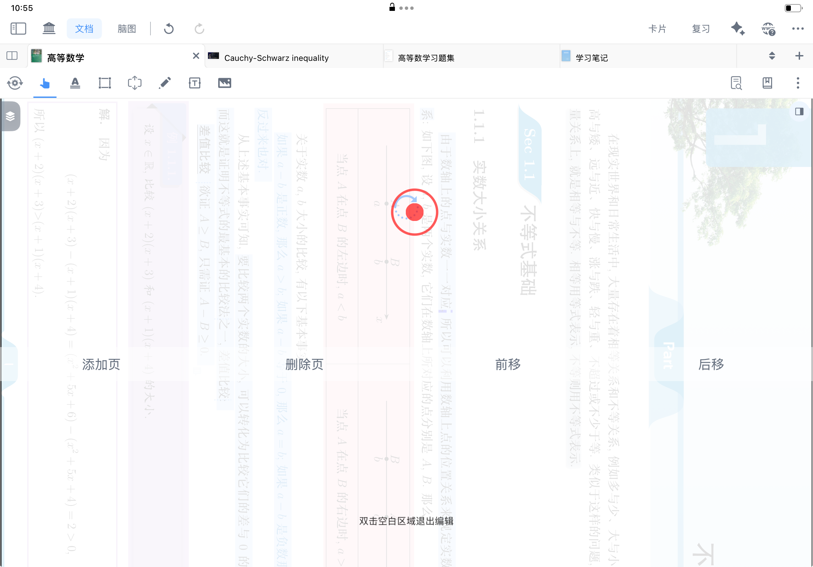
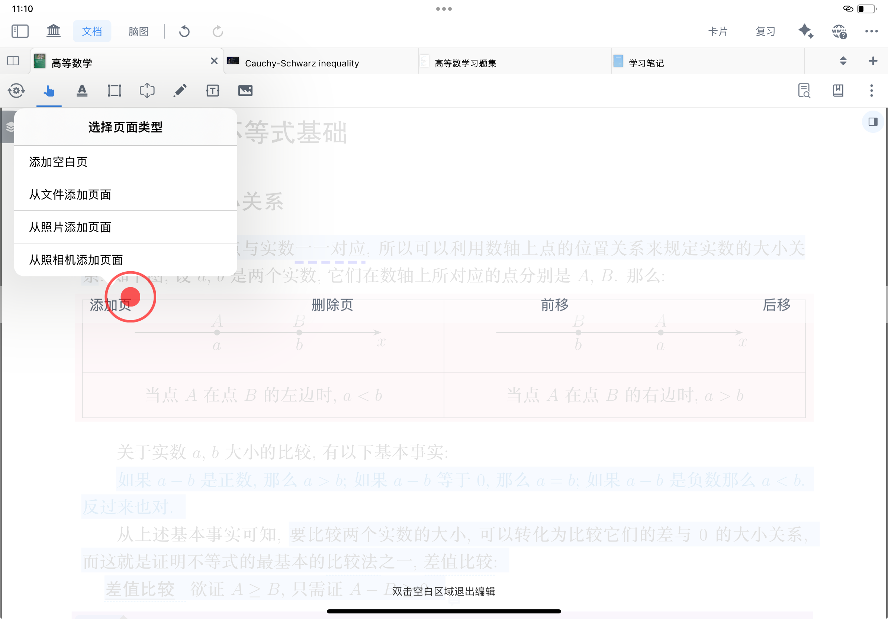
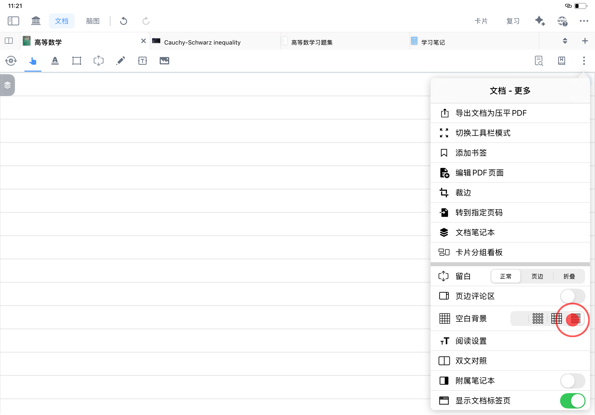
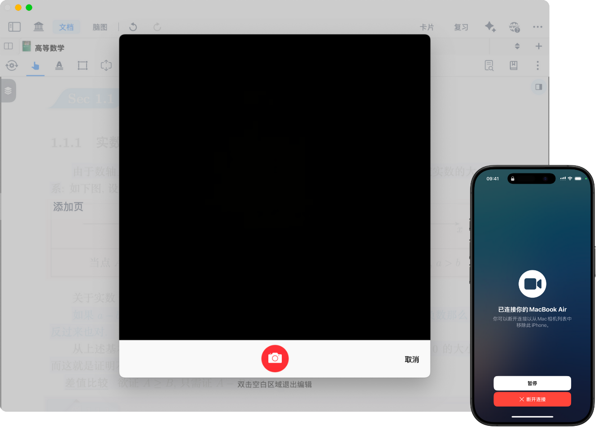
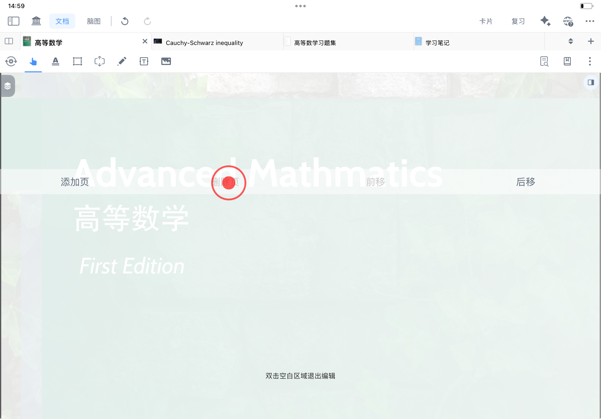
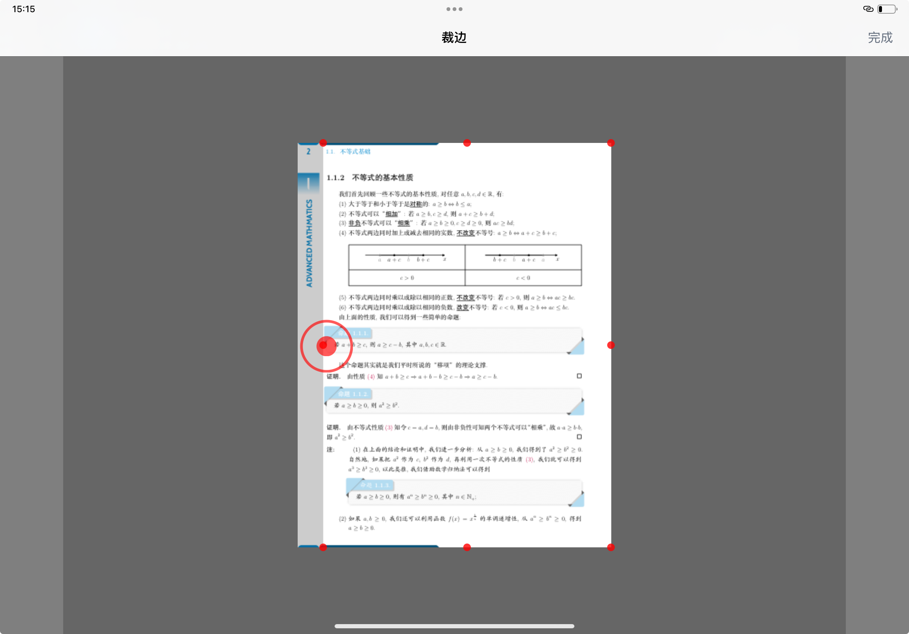
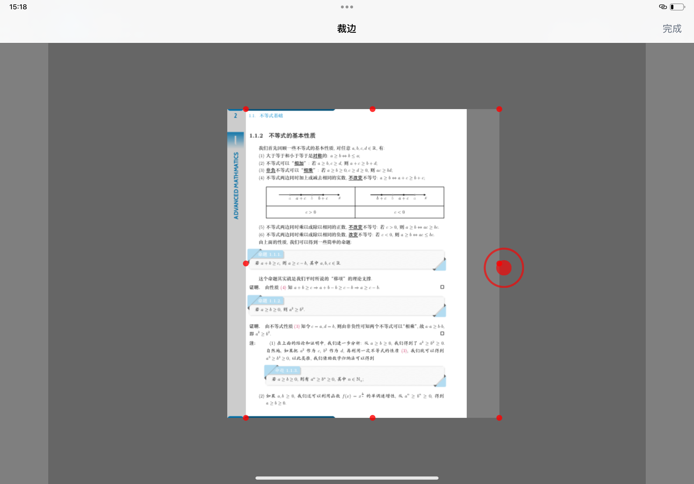
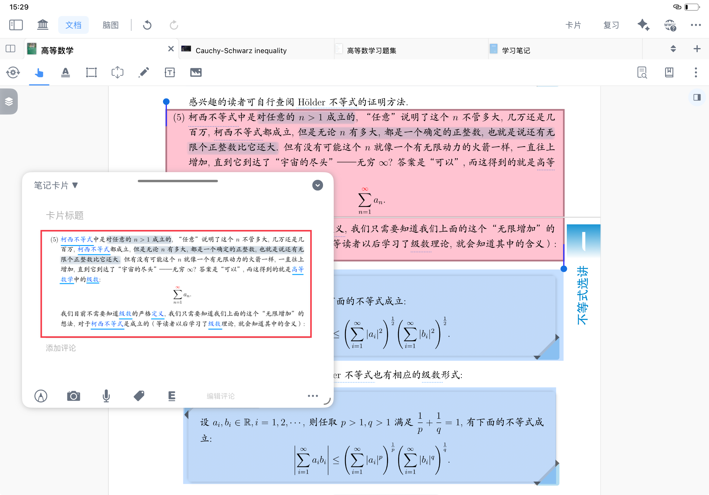
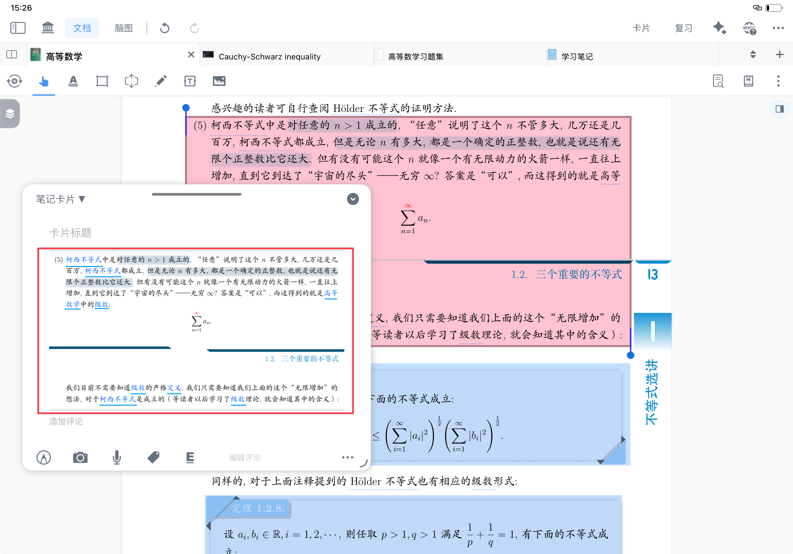

# 增删页面、裁剪纸张

## 1 增删页面

[编辑 PDF 页面](https://www.wolai.com/pxhe2puyjrFSoLExxU54yW "编辑 PDF 页面")

点击[文档-更多](https://www.wolai.com/sXcbPqE5bY2h9Y6UWxv8F3 "文档-更多")按钮，找到[编辑 PDF 页面](https://www.wolai.com/pxhe2puyjrFSoLExxU54yW "编辑 PDF 页面")，即可对当前页面进行`旋转`、`添加页`、`删除页`、`前移`、`后移`等相关操作。

### `1.1 旋转`&#x20;

每点击旋转图标一次，当前页面将顺时针旋转90°；可通过多次点击旋转图标，将页面调整至所需要的显示效果。

### `1.2 添加页`

MarginNote支持4种加页方式：`添加空白页`、`从文件添加页面`、`从照片添加页面`、`从照相机添加页面`。

#### `1.2.1 添加空白页`

新增空白页，纸张背景底纹可通过修改[空白背景](https://www.wolai.com/417kpNps6JG7DaHBqMotQy "空白背景")来设置空白、点阵、格纹、横线效果。

#### `1.2.2 从文件添加页面`

可从文件中选取PDF相应页面或图片作为新页面添加到当前文档中。

#### `1.2.3 从照片添加页面`

可从照片里选取所需照片作为新页面添加到当前文档中。

#### `1.2.4 从照相机添加页面`

可调用相机拍照来添加新页面。

当在Mac端使用时，可以调用iPhone端相机来进行拍照（v4.1.14新增功能）。

### `1.3 删除页`

点击“删除页”，将当前页面删除。

> 💡注意：文档的第一个页面不支持直接删除，可先后移到第二页，再删除

### `1.4 前移`

点击“前移”，将当前页面向前移动一页；连续点击几次“前移”，页面相应向前移动几页。

### `1.5 后移`

点击“后移”，将当前页面向前移动一页；连续点击几次“后移”，页面相应向后移动几页。

### `1.6 双击空白区域退出编辑`

进行以上`旋转`、`添加页`、`删除页`、`前移`、`后移`等相关操作后，双击空白区域即可退出PDF页面编辑状态。

## 2 裁边

[裁边](https://www.wolai.com/q9ordkyd68q8BFqggaY6PB "裁边")

点击[文档-更多](https://www.wolai.com/sXcbPqE5bY2h9Y6UWxv8F3 "文档-更多")按钮，找到[裁边](https://www.wolai.com/q9ordkyd68q8BFqggaY6PB "裁边")，即可对当前文档页面进行裁边、扩页等相关操作。

### `2.1 裁边`

按住页边红点向内移动至合适位置，点击“完成”，即可裁剪页面。

> 💡**如何调整文档笔记空间？（裁边、折页、留白功能区别对比）**
>
> 裁边聚焦页面尺寸调整，折页侧重局部内容隐藏，留白主打笔记内容补充，三者从不同维度优化 MarginNote 4阅读与记笔记的体验。

| 功能类型\&#x20; | 核心作用\&#x20;                | 作用对象        | 典型应用场景 \&#x20;                                                                                                                                                                                            |
| ----------- | -------------------------- | ----------- | --------------------------------------------------------------------------------------------------------------------------------------------------------------------------------------------------------- |
| 裁边          | 调整页面尺寸，裁剪冗余边距/页眉页脚，或扩展页面区域 | 全部页面\&#x20; | 1\\. 批量剔除教材、论文的页眉页脚；  2\\. 裁剪特殊水印、侧边广告；  3\\. 扩页补充长篇笔记内容\&#x20;                                                                                                                                           |
| 折页          | 隐藏指定内容，按需展开查看              | 单页内的局部内容    | 1\\. 折叠习题答案，复习时展开核对；  2\\. 屏蔽文献附录、参考文献，聚焦核心论证；  3\\. 隐藏待研究笔记片段，避免干扰阅读 \&#x20;  > 详见： \[书页折叠]\(<https://www.wolai.com/3ceKFREpJyZRZRqk6WgGjM> "书页折叠")                                                      |
| 留白          | 补充笔记信息，拓展内容维度              | 单页内的特定位置    | 1\\. 嵌入模式：在知识点旁添加注解，紧密关联原文；  2\\. 页边评论区模式：在页边写批注，不遮挡正文；  3\\. 弹出模式：隐藏大段案例/数据，点击查看保持页面整洁 \&#x20;  > 详见：\[留白①\|基础操作：字里行间自由开辟笔记空间]\(<https://www.wolai.com/vYi6Yu4oCudNCr2zDuNQkj> "留白①\|基础操作：字里行间自由开辟笔记空间") |

### `2.2 扩页`

按住页边红点向外移动至合适位置，点击“完成”，即可扩展页面。

### 2.3 恢复默认页面大小

1. 将页面裁为一个点后，
2. 再次选择“裁边”，
3. 即可恢复页面为初始状态大小。

### 2.4 应用：优化跨页摘录卡片的显示效果

> 💡当你在整理教材**跨页**知识点、论文连续论证段落、电子书**跨页**排版内容时，页眉页脚易干扰到正文摘录。
>
> 以专业课跨页公式推导为例，先裁边剔除冗余元素，再跨页摘录，即可得到逻辑连贯的笔记卡片，提升知识梳理效率。

跨页摘录时，存在页眉/页脚，会影响摘录卡片的显示效果：

可以预先用“裁边”工具裁去页眉/页脚，再摘录，以优化显示效果：

