# 闪卡制作①：认识闪卡和复习卡片组

> 💡📖 **闪卡系列导航**
> 本系列帮助你掌握 MN4 的闪卡制作和科学复习。
>
> - 制作闪卡：
>   - 新手必读：
>     ① 认识闪卡和复习卡片组
>     ② 添加卡片到复习卡组
>   - 进阶：
>     ③ 设置闪卡正反面（本页）
> - 科学复习：
>   - 新手必读：
>     ① 基于FSRS抗遗忘算法的科学复习
>   - 进阶：
>     ② 溯源上下文

# 1 理解核心概念

## 1.1 什么是闪卡/复习卡片

- **认识闪卡：**
  > 💡闪卡是用于记忆复习的卡片，由"问题（正面）"和"答案（背面）"组成。
  > 复习时，你先看到问题，尝试回忆答案，然后翻转卡片查看完整内容。通过多次重复和间隔复习，帮助你牢固记忆知识点。
  > 📋 闪卡示例
  > \- 正面（问题）："伯努利不等式的内容是什么？"
  > \- 背面（答案）：定理 ...条件分析...证明过程...
  > 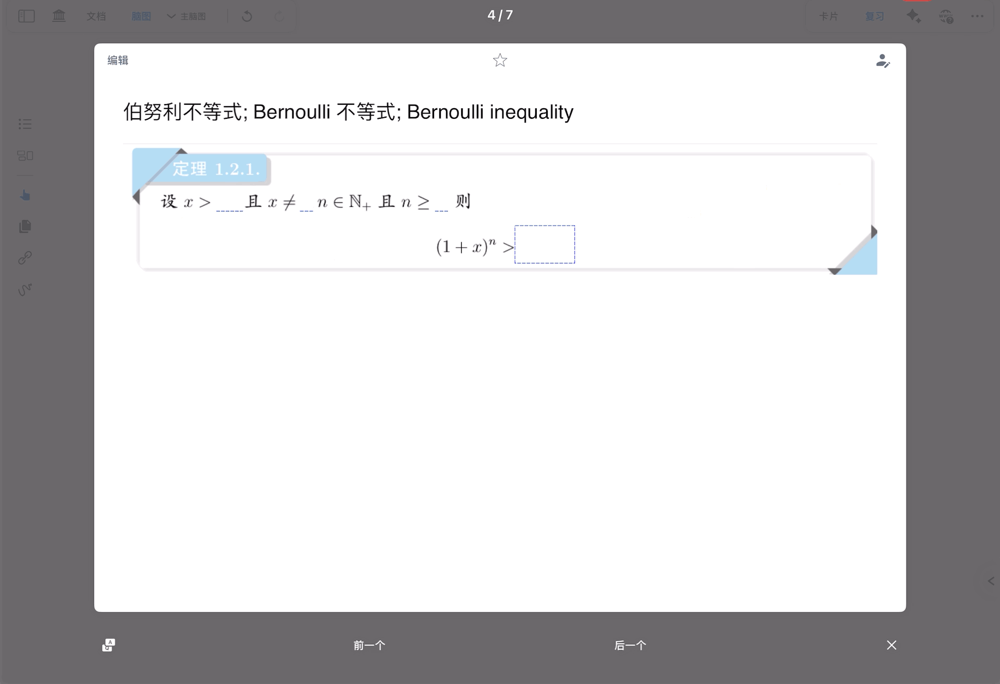
- **闪卡的组成：**
  - 正面（问题）： 可以从卡片内容中提取，也可以自行编辑。默认使用卡片标题作为问题。
  - 背面（答案）： 包含笔记卡片的全部内容（标题和正文）。
- **什么内容适合做成闪卡？**
  - ✅ 需要记忆的概念、定义、公式
  - ✅ 重要的定理、原理
  - ✅ 容易混淆的知识点
  - ✅ 错题和易错点
  - ❌ 理解型的长篇论述（不适合）
  - ❌ 需要结合大量上下文才能理解的内容（不适合）

## 1.2 什么是复习卡片组

> 💡复习卡片组类似于"记忆卡片盒"，专门用来存放需要复习的卡片。

一个学习集可以绑定一个复习卡片组。你可以将学习集中的卡片添加到复习卡片组中，系统会根据科学算法安排复习时间，帮助你高效记忆。

⚠️ 重要： 复习卡片组依托于学习集，无法独立存在。必须先有学习集，才能创建复习卡片组。

## 1.3 闪卡 vs 笔记卡片的关系

在 MN4 中，闪卡其实就是你的笔记卡片，它们是同一张卡片的不同"身份"：

- **在文档中摘录时** → 叫"摘录"
- **在脑图中整理时** → 叫"笔记卡片"
- **添加到复习卡组后** → 叫"闪卡"或"复习卡片"

卡片可以在文档、脑图、复习卡组之间自由切换身份。你在脑图中编辑笔记卡片，修改会同步到复习卡片；在复习卡片组中删除闪卡，不会删除原来的笔记卡片。

# 2 快速开始：创建你的第一张闪卡

通过下面的步骤，你将快速体验闪卡的制作和使用流程。

## 2.1 新建复习卡片组

**操作步骤：**

1. 打开一个学习集
2. 点击学习集右上角的`复习`按钮
3. 点击`➕新复习卡片组`
4. 输入复习卡片组的名称（例如："高等数学期末复习"）
5. 完成创建

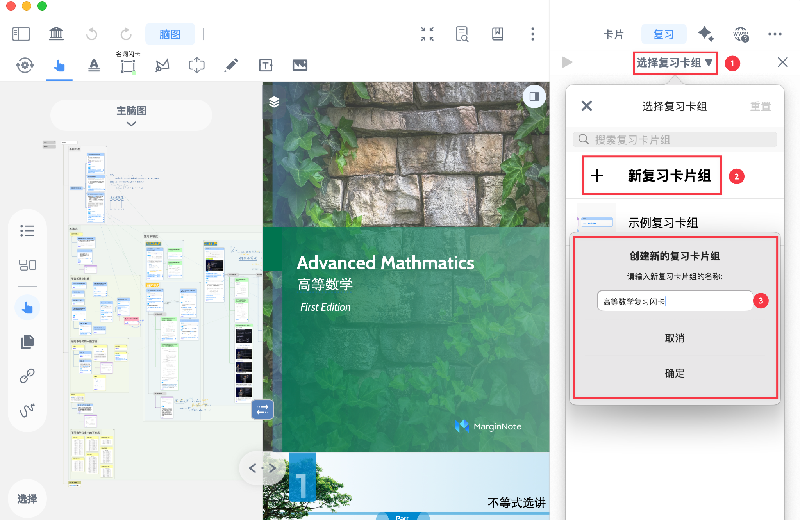

✅ 创建成功后，当前学习集就绑定到这个复习卡片组了。

## 2.2 添加一张卡片到复习卡组

1. 在脑图中选中一张卡片（或者在文档中选中1个摘录）
2. 点击卡片（摘录），在弹出菜单栏中中点击`基础`栏-`...（更多`
3. 点击`添加到复习`

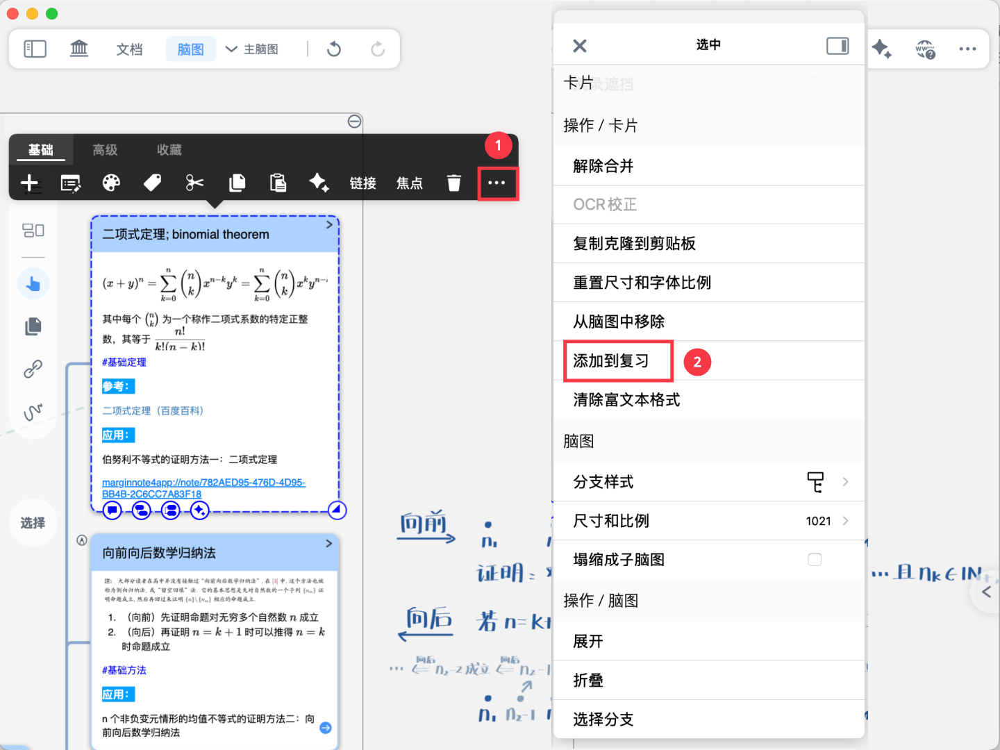

✅ 这张卡片就添加到复习卡组了！

> 💡提示：如果你想批量添加多张卡片，或者在摘录时自动添加到复习卡组，请阅读下一页：[闪卡制作②：添加卡片到复习卡组](https://www.wolai.com/pKZaNAWQAm3Wp41awj1ZJb "闪卡制作②：添加卡片到复习卡组")

## 2.3 查看闪卡效果

- **查看你添加的闪卡：**
  1. 在 MN4 主页点击左侧边栏的 **`复习卡片组`**
  2. 选择你刚才创建的复习卡片组
  3. 在左侧闪卡列表中，可以看到你添加的卡片

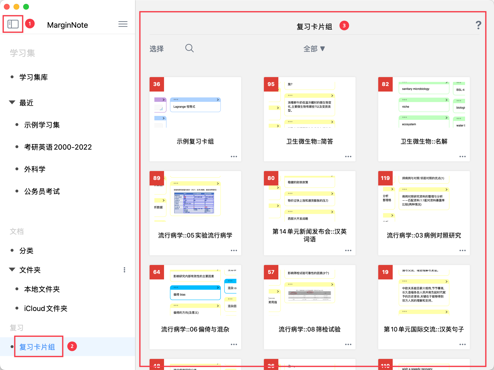

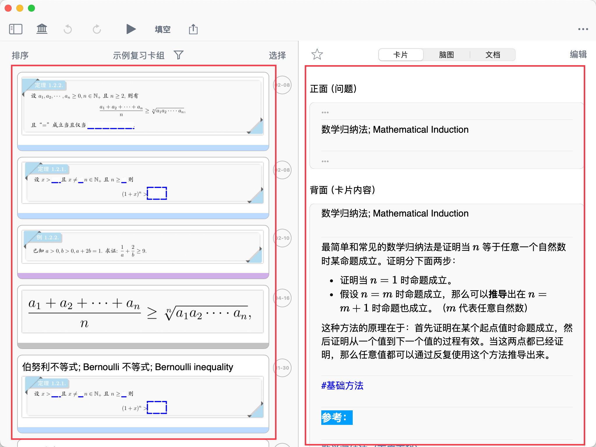

- **切换到复习卡片模式查看正反面：**
  1. 点击卡片进入`卡片编辑器`

     [卡片编辑器](https://www.wolai.com/rdhVCYTJL3YakoYW4QxtzC "卡片编辑器")
  2. 在卡片编辑器左上角切换到`复习卡片`模式
  3. 你会看到闪卡的正面（问题）和背面（答案）
     默认情况下，卡片的标题会作为闪卡正面（问题），卡片的全部内容作为背面（答案）。若卡片没有标题，则将第一条评论作为正面。

# 3 浏览和管理复习卡片组

## 3.1 复习卡片组界面介绍

复习卡片组界面分为**左右两部分**：

- **左侧：闪卡列表**
  - 仅显示卡片正面（问题）
  - 可以滚动浏览所有闪卡
- **右侧：三栏详情**
  - **卡片栏：** 展示闪卡的正面（问题）和背面（答案）
  - **脑图栏：** 定位到闪卡在脑图中的位置
  - **文档栏：** 定位到闪卡在文档中的位置

> 💡右侧三栏设计让你在浏览闪卡时，可以随时查看卡片在脑图中的位置和文档中的上下文，帮助理解记忆

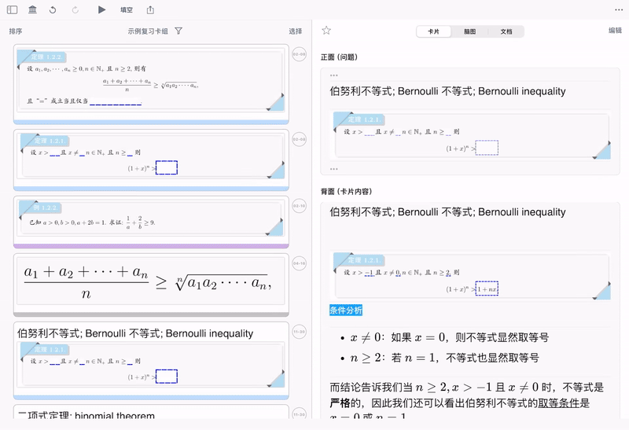

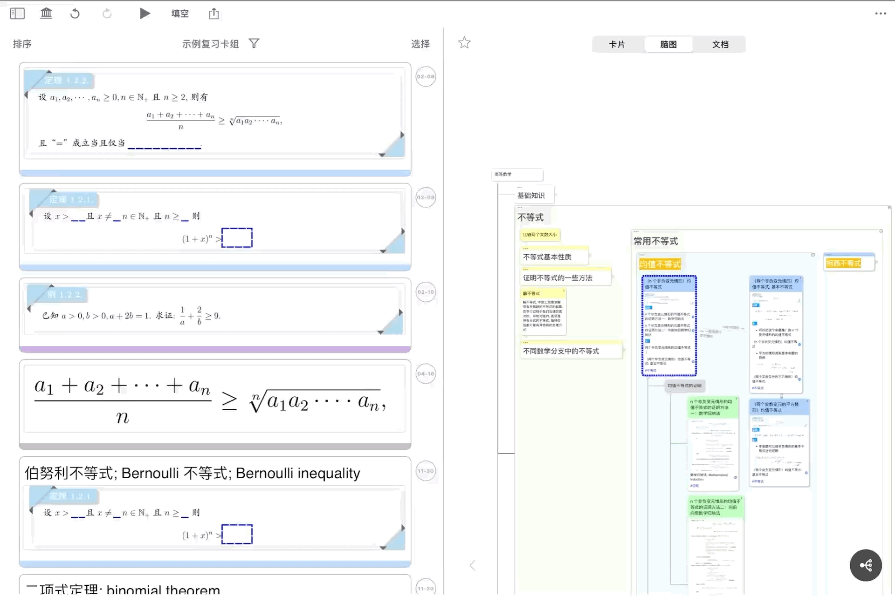

## 3.2 筛选和排序闪卡

- **排序闪卡**：点击左侧闪卡列表顶部的`排序`，可以选择排序方式：
  - `按添加时间排序`： 最新添加的卡片在前
  - `按到期时间排序`： 最快到期的卡片在前
  - `按文档位置排序`： 按照卡片在源文档中的顺序排列
  - `按文本排序`： 按照卡片正面的文字排序
  - `随机排序`： 随机打乱顺序
- **筛选闪卡**：点击左侧闪卡列表顶部的漏斗图标，可以按条件筛选：
  - `到期`： 只显示已到复习时间的卡片
  - `评分`： 按记忆程度筛选（难/良好/易）
  - `收藏`： 只显示收藏的卡片
  - `标签`： 筛选含有特定标签的卡片（如 #重点、#易错）
  - `文档`： 筛选来自特定文档的卡片
  - `颜色`： 筛选特定颜色的卡片

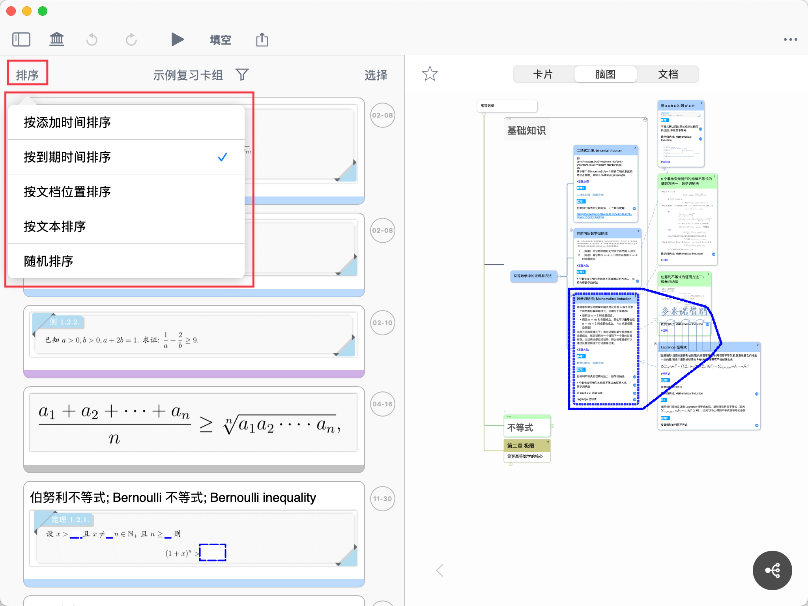

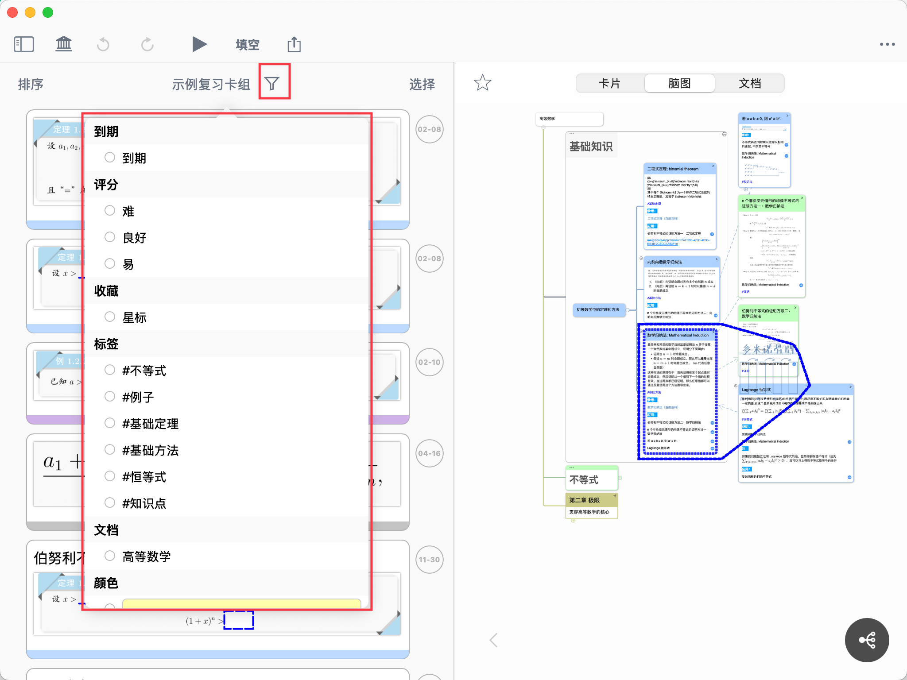

> 💡使用技巧： 多种筛选条件可以同时选择，取交集。例如，筛选"已到期 + 标签为#重点 + 评分为难"的卡片，进行专项复习。

## 3.3 管理复习卡片组

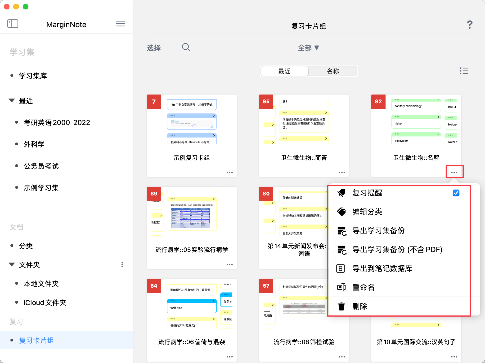

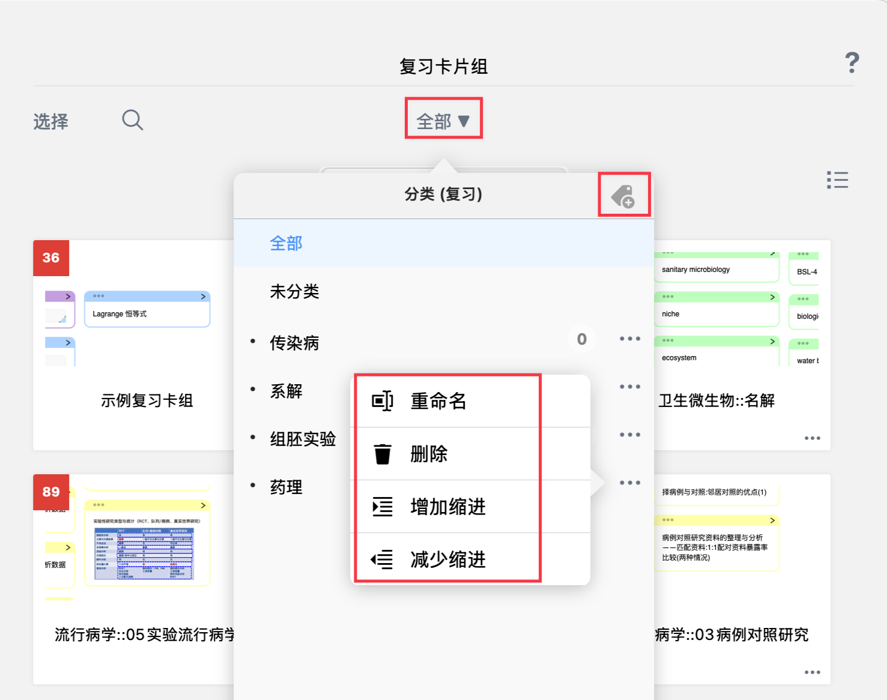

在复习卡片组主页（边栏-复习卡片组），点击复习卡片组右下角的 三点图标，可以进行以下操作：

- **开启**\*\*`复习提醒`\*\*
  - 卡片到达复习时间后，会通过 App 消息弹窗提醒你复习
  > ⚠️ 需要在系统设置中打开 MarginNote 4 的通知权限
- **编辑分类**
  - 为复习卡片组设置分类，类似文件夹管理
  - 点击顶部下拉列表，可按分类查看复习卡片组，或新建分类
  - 分类支持重命名、删除、增加缩进、减少缩进
- **导出学习集备份**
  - 可以导出复习卡片组的备份，选择是否包含关联的学习集和 PDF
  > 💡建议选择包含学习集一并打包，便于查看卡片的来源和上下文
  >
  > 
- **重命名 / 删除**
  - 重命名：修改复习卡片组的名称
  - 删除：删除复习卡片组
  - ⚠️ 删除复习卡片组**不会删除**对应的脑图卡片和文档摘录，只是将卡片从复习卡组中移除

# 4 常见问题

**Q1：闪卡和笔记卡片有什么区别？**

A：它们是同一张卡片，只是在不同位置有不同的名称和用途。笔记卡片用于整理知识，闪卡用于复习记忆。

**Q2：删除闪卡会不会删除我的笔记？**

A：不会。从复习卡片组中删除闪卡，只是取消复习，不会删除脑图中的笔记卡片或文档中的摘录。

**Q3：一张卡片可以同时加入多个复习卡片组吗？**

A：不可以

**Q4：一个学习集可以绑定多个复习卡片组吗？**

A：可以，但是同一时间只能绑定一个复习卡片组，需手动切换绑定的卡组。

**Q5：修改笔记卡片会影响闪卡吗？**

A：会同步。在脑图中编辑笔记卡片，修改会自动同步到复习卡片组中的闪卡。

**Q6：如何将卡片的某部分挖空，制作填空题？**

A：这属于设置闪卡正反面的高级功能，详见：[闪卡制作③：设置闪卡正反面](https://www.wolai.com/pBH9BFrgyZgeWJVf3xLyVA "闪卡制作③：设置闪卡正反面")

# 5 📌 下一步

恭喜你完成了闪卡的入门学习！

现在你已经了解了闪卡的基本概念，并创建了第一张闪卡。接下来，学习如何批量添加卡片到复习卡组，提高制卡效率：

→**继续阅读**[：](https://www.notion.so/2c31f3d8ed1f80dd9fc0dcd9725e81f9?pvs=21 "：")[闪卡制作②：添加卡片到复习卡组](https://www.wolai.com/pKZaNAWQAm3Wp41awj1ZJb "闪卡制作②：添加卡片到复习卡组")

学完制作闪卡后，不要忘记学习如何科学复习：

→**科学复习：**[闪卡复习①：基于FSRS抗遗忘算法的科学复习](https://www.wolai.com/31KwWufHLt8MUbyxQahbP3 "闪卡复习①：基于FSRS抗遗忘算法的科学复习")&#x20;
