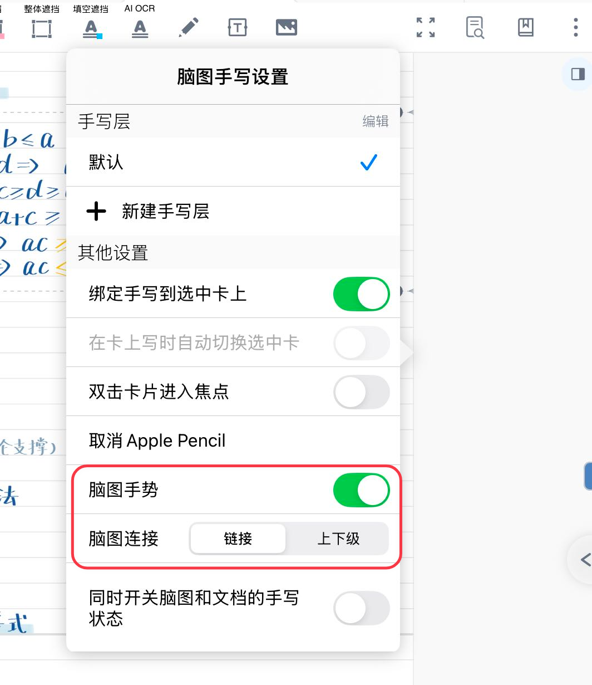
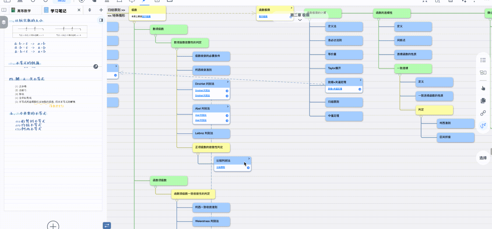
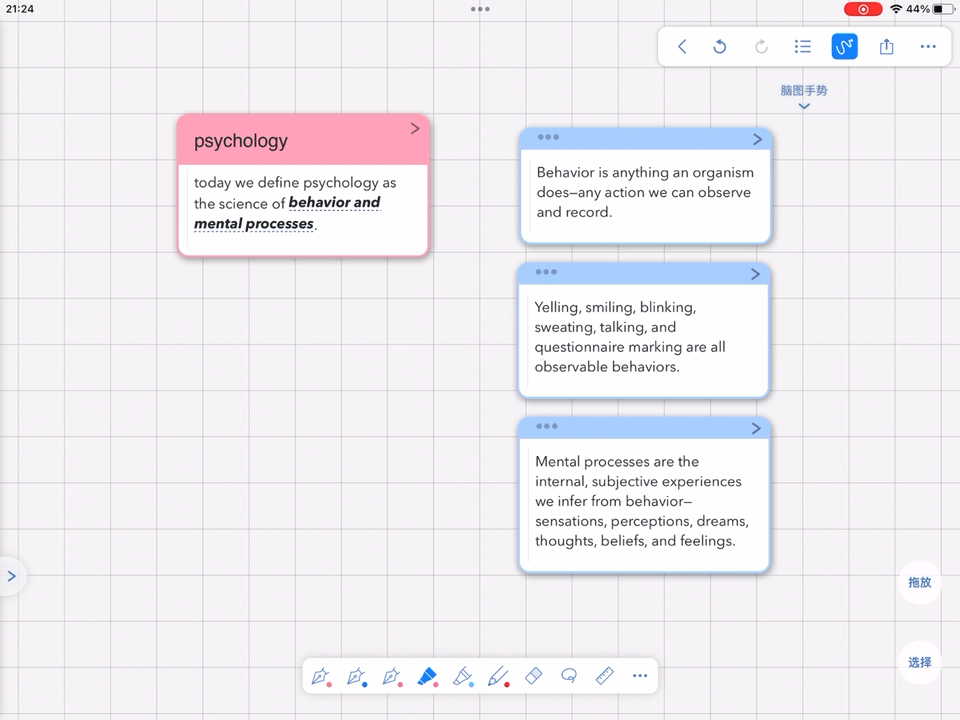

# 卡片链接③：手绘曲线链接

> 💡开启脑图手势时，使用几种手写笔画即可调整脑图的构造，无需切换模式，提升操作效率。

# 1 打开脑图手势

[脑图手写工具](https://www.wolai.com/2Cfr7YMtWVH4a9dgyDdNev "脑图手写工具")

- **双击**脑图侧边栏的手写工具，打开`脑图手写设置`界面中的`脑图手势`开关

# 2 通过手势进行单向 / 双向链接

在`脑图手写设置界面`的`脑图连接`选项中选择`链接`，意味着使用手写连接两个卡片时，将被识别为给卡片添加

## 2.1 建立链接

绘制线条连接两张卡片，即可建立链接关系：

- 从卡片 A 向卡片 B 绘制线条，卡片 A 与卡片 B 形成**单向链接**（卡片 A 可跳转至卡片 B）；
- 再从卡片 B 向卡片 A 绘制线条，卡片 A 与卡片 B 形成**双向链接**（两张卡片可互相跳转）。

> 💡与普通的直线链接不同，链接的线条与手绘线条相似，可以通过这种方式建立更精美的链接

## 2.2 删除链接

在已建立的链接线上绘制折线，即可删除该链接关系。

# 3 形成上下级卡片

在`脑图手写设置界面`的`脑图连接选项`中选择`上下级`，意味着使用手写连接两个卡片时，将被识别为给卡片添加层级关系。

## 3.1 创建子节点卡片

绘制线条将卡片A连接到卡片 B，卡片 A将自动成为卡片 B的子节点卡片。

## 3.2 删除上下级关系

在卡片的分支连接线上绘制折线，即可删除该卡片与上级卡片的上下级关系。

# 4 选择与删除脑图卡片

- 用 手写在目标卡片上绘制圆圈，即可选中该卡片；
- 在多张卡片上绘制圆圈，可实现卡片多选。
- 在目标卡片上绘制折线，即可删除该卡片。

