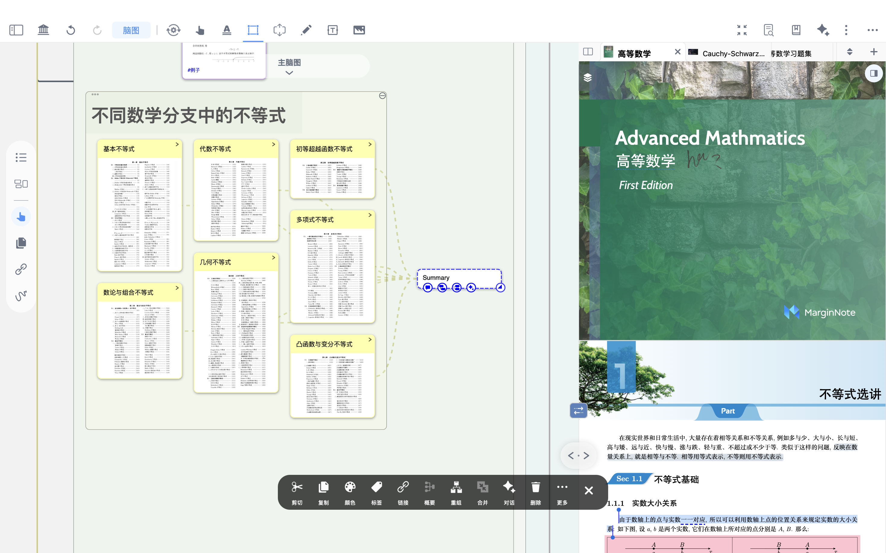

# 脑图概要：跨分支创建总结节点，支持延展为新分支

# 1 什么是概要（Summary）

> 💡 **概要**（**Summary）——结构化归纳的智慧工具**：
>
> **概要（Summary）** 功能用于对多个脑图卡片进行汇总，**生成一张新的总结卡片**，以概括核心内容、提炼要点。当脑图以层级结构为主时，可通过概要（Summary）实现知识的纵向整合与横向对比，使原本分散的概念形成清晰的逻辑脉络。
>
> 此外，生成的Summary卡片还能**继续扩展为新的树形分支**，支持发散性思考与跨主题延伸，帮助构建更系统、更具深度的知识网络。

# 2 如何生成概要（summary）卡片

[手形工具-脑图](https://www.wolai.com/ZZTg45zHLVw17uSZysVDb "手形工具-脑图")

- 点击脑图侧边工具栏的手形工具（如上方图标所示）
- 选中需要进行总结的卡片
- 在下方多选工具栏中点击`概要`，自动生成一张新卡片

- 此外，新生成的summary卡片支持进一步创建新的树形脑图分支
- 也可进行直接拖拽到另一卡片上自动成为链接

