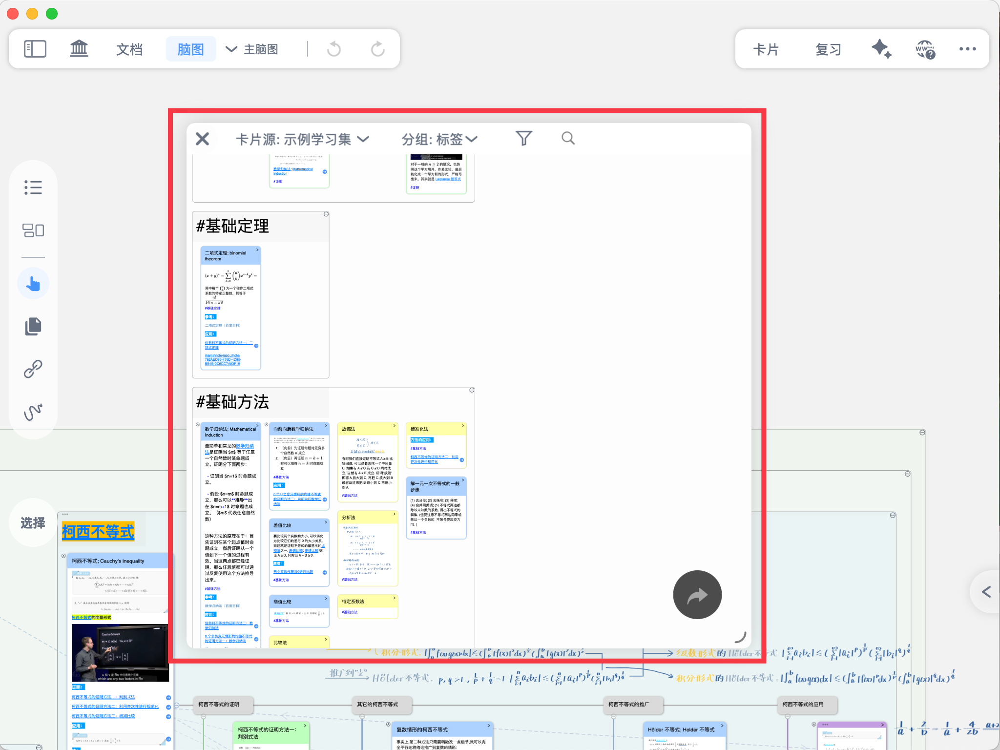
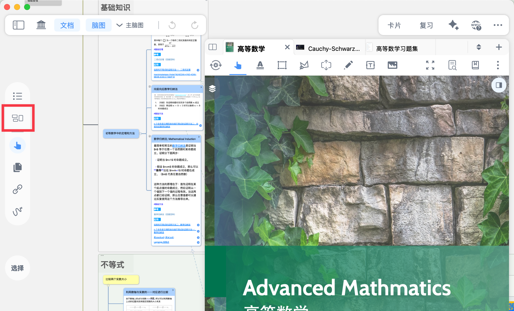
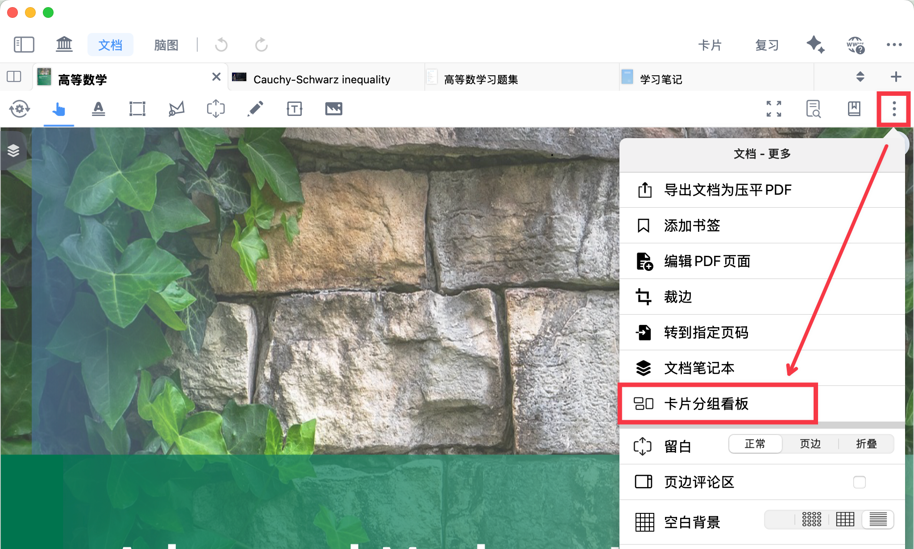
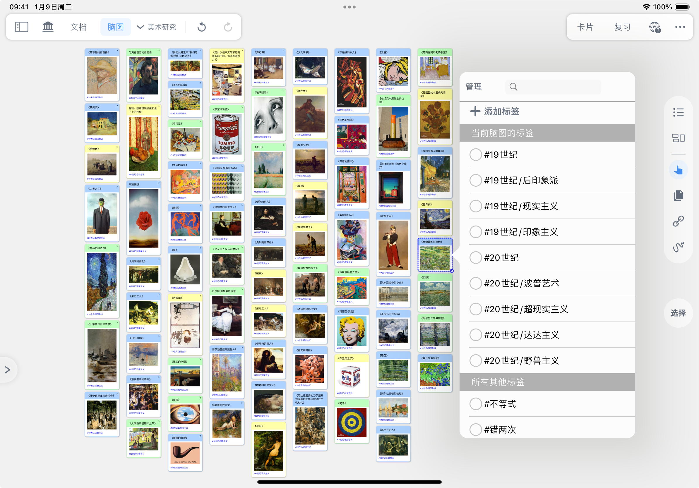

# 卡片分组看板①：从海量卡片中精准筛选

> 💡`卡片分组看板`是非常强大的卡片筛选器，您可以按照卡片来源、颜色、标签、创建日期等多个属性，从海量卡片中筛选出需要的卡片，进行集中浏览、编辑和管理。

# 1 如何打开卡片分组看板

[卡片分组看板](https://www.wolai.com/eZr3CjDNhGfEF3tuCwtAdu "卡片分组看板")

在脑图侧边栏点击卡片图标（如上图所示）

# 2 按`卡片源`筛选特定学习集/脑图/文档的卡片

按来源的**学习集、文档、脑图**筛选特定卡片，可根据`分组`条件进一步筛选卡片。

# 3 按`分组`筛选特定卡片

MarginNote支持多种卡片分组条件，让您可以快速找到自己需要的特定卡片。

## 3.1 支持按卡片的哪些属性分组？

| \`颜色\`                                                          | \[🖼️ 图片]\(\<image/CleanShot 2025-10-05 at <01.24.01@2x_izngsJEQoV.png>> "🖼️ 图片")。MarginNote共提供16种可选的卡片颜色。                                                                                                   |
| --------------------------------------------------------------- | ------------------------------------------------------------------------------------------------------------------------------------------------------------------------------------------------------------- |
| \`标签\`                                                          | - \[🖼️ 图片]\(\<image/CleanShot 2025-10-07 at <22.39.53@2x_8gPtaWzuqI.png>> "🖼️ 图片") - \[🖼️ 图片]\(image/image\_EB8CnQ5WX0.png "🖼️ 图片") - \[🖼️ 图片]\(image/20240422005411-convert\_S\_LcvpnB5\_.gif "🖼️ 图片") |
| \`文档\`                                                          | \[🖼️ 图片]\(\<image/CleanShot 2025-10-07 at <22.41.44@2x_eXAH1gYFK6.png>> "🖼️ 图片")  > ⓘ若\`卡片源\`已经选择文档，则此时只有一个分组。                                                                                              |
| \`文档目录\`                                                        | \[🖼️ 图片]\(\<image/CleanShot 2025-10-07 at <22.49.41@2x_AzUG_htaa5.png>> "🖼️ 图片")  > ⓘ若目录中存在缩进，对应的分组也会有相应的嵌套。                                                                                                |
| \`创建日期\`                                                        | \[🖼️ 图片]\(\<image/CleanShot 2025-10-07 at <22.50.17@2x__UxYZmykvq.png>> "🖼️ 图片")                                                                                                                            |
| \`修改日期\`                                                        | \[🖼️ 图片]\(\<image/CleanShot 2025-10-07 at <22.51.13@2x_15sOLJuuJc.png>> "🖼️ 图片")                                                                                                                            |
| \`标题链接\`                                                        | \[🖼️ 图片]\(\<image/CleanShot 2025-10-07 at <22.52.39@2x_PLzEQiemmE.png>> "🖼️ 图片")  > ⓘ关于标题链接的更多介绍，详见：\[卡片链接④\|关键词标题链接：打造你的个人字典]\(<https://www.wolai.com/aBEbDgL6oDgDT4CeXotdbS> "卡片链接④\|关键词标题链接：打造你的个人字典")。  |
| \`复合搜索\`                                                        | \[🖼️ 图片]\(\<image/CleanShot 2025-10-07 at <23.20.24@2x_IVG-2bdFKy.png>> "🖼️ 图片")   > ⓘ包括卡片的标题和内容。                                                                                                           |
| 当按\`卡片源\`筛选特定学习集/脑图/文档的卡片选择某一\*\*文档\*\*时，分组将\*\*额外支持\*\*2个卡片属性： |                                                                                                                                                                                                               |
| \`脑图状态\`                                                        | \[🖼️ 图片]\(\<image/CleanShot 2025-10-07 at <22.53.28@2x_9-91lgxmxd.png>> "🖼️ 图片")                                                                                                                            |
| \`留白/摘录\`                                                       | \[🖼️ 图片]\(\<image/CleanShot 2025-10-07 at <22.54.00@2x_bFmnmDkyBx.png>> "🖼️ 图片")                                                                                                                            |

设定分组条件后，点击右侧漏斗图标，可以过滤您需要的组别：

## 3.2 分组为什么有`一级`和`二级`？

分组支持2级嵌套，可以使卡片筛选更高效、精准，例如：

- 要筛选**A 文档**中的**红色**卡片：一级分组选`文档`，二级分组选`颜色`
- 要筛选**蓝色**卡片中带有 **#高频考点** 标签的卡片：一级分组选`颜色`，二级分组选`标签`

# 4 搜索卡片

您可以按关键词搜索卡片，搜索范围包括卡片的全部内容（标题+评论）。搜索功能可搭配[卡片源](https://www.wolai.com/dJvh1K4GEKaJYtZ14zbfgj#h9GCvMokCccCEaL3tA8ce5 "卡片源")和[分组](https://www.wolai.com/dJvh1K4GEKaJYtZ14zbfgj#bMk4MA8qpKmBSSQWmqb7P7 "分组")使用。

# 5 编辑和管理卡片

在看板中筛选出您需要的特定卡片后，可以多选这些卡片，进行**批量编辑和管理**，如修改`颜色`、`标签`、`合并`、`删除`等等。

# 6 从看板生成脑图

在看板中选中卡片，拖拽到看板外，即可自动生成新的脑图结构（以复制的形式）。适合整理自己的个人集锦（如错题本、美术画册等等）。详见：[卡片分组看板②：从看板自动生成脑图，打造个人知识集锦](https://www.wolai.com/pXcHjMTVqjcvvgEiNnTQm5 "卡片分组看板②：从看板自动生成脑图，打造个人知识集锦")。
