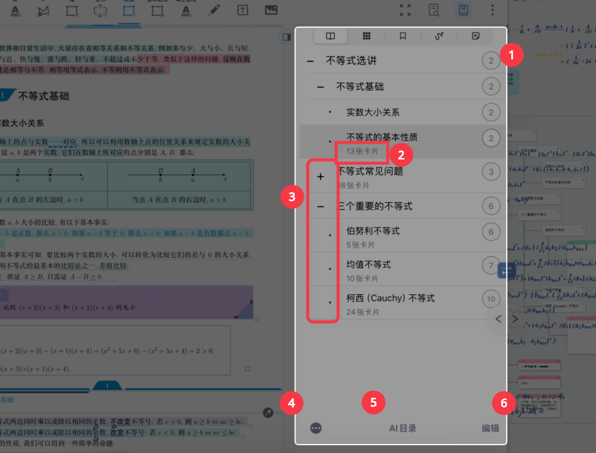
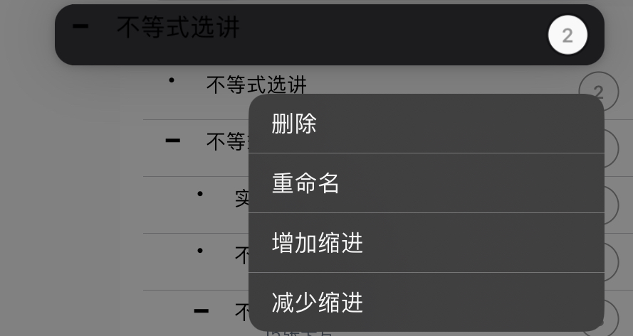
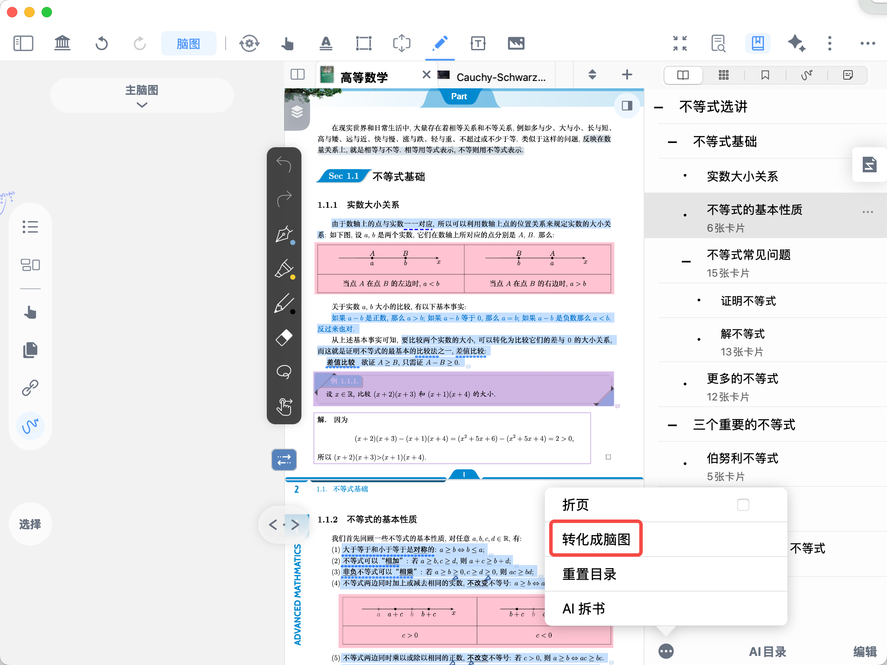
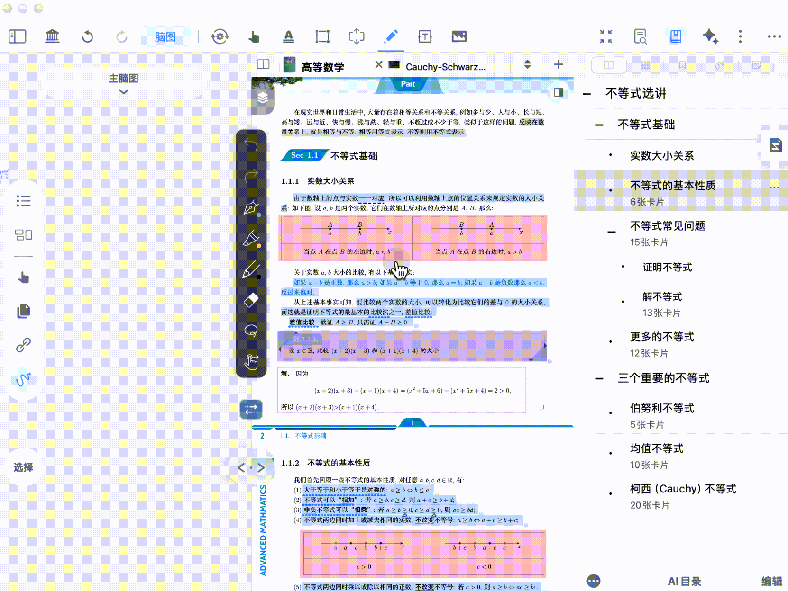

# 手动&自动生成文档目录

> 💡目录使用场景：
>
> **为 PDF 文档搭建清晰的章节层级**，方便快速定位目标内容、跳转页面，提升阅读与检索效率。
>
> **按文档目录组织脑图结构**，让摘录笔记自动按目录分组，助力搭建系统化知识结构。
>
> 根据目录进行重组，适配个性化学习逻辑，让页面顺序与笔记管理更贴合需求
>
> **简化复习流程**，增加/减少缩进，结合笔记卡片精准回溯知识点。

> 💡Marginnote4中创建和调整的目录是**虚拟目录**，不会修改源文件目录数据，重置目录

# 1 打开目录

[书页查找](https://www.wolai.com/bQ3HELpfPdH8QZ4sadPLpu "书页查找")

[目录](https://www.wolai.com/jaxFYszwK9eiofzRPxzA1J "目录")

点击文档导航栏的`书页查找`按钮（如上图1图标），选择`目录`（如上图2图标），即可显示目录界面。

如图所示：

1. `目录界面`右侧数字为该章节的起始页码，**点击**该章节，即可**跳转相应页码**
2. 如果文档中有摘录、留白等笔记卡片，目录名称下侧会显示该章节**卡片数量**

> 💡可以通过目录章节-卡片数量，估量整本文档的重点和难点

1. 目录可以显示**多个缩进层次**，点击目录名称前的`+`、`-`符号，可以**展开/收缩子目录**。
2. 点击··· 图标，进一步进行根据目录折页、[目录转化为脑图](https://www.wolai.com/djV6nMiEdSaxCacjWcptpA#2FfCqVSjK4TtsUBVQ7ib3P "目录转化为脑图")、重置目录等操作
3. 点击`编辑`，可以选择多个目录章节进行批量处理，详情见：调整多项目录

# 2 创建目录&#x20;

有三种目录生成的方式：文档自带、手动创建和AI生成。

## 2.1 文档自带目录

> 💡有些文档（PDF、epub）会自带目录，Marginnote4可以识别目录的内容和结构，并在目录界面显示。

此时如果认为目录如果不够全面，可以使用手动创建进行补足，其排序以页面顺序为准。

如果文档自带目录为“1、2、3……”等大量无用数字，可以批量进行删除，具体操作见：调整多项目录

## 2.2 手动创建

> 💡**优点：**
>
> - **完全控制权：** 用户拥有最高的自主权，可以根据文档的具体内容、逻辑结构和自己的需求，精确地设计目录的层级、标题名称和顺序，使其最贴合文档意图。
> - **灵活性高：** 不受软件或算法规则限制，可以创建非常规结构或包含特殊说明的目录。
> - **理解深入：** 在创建过程中，用户需要深入理解文档内容，有助于梳理思路和确保目录的准确性。

### 2.2.1 从选区创建目录

> 💡无需在弹窗中输入标题，希望页面内文字直接作为目录项目的标题

[手形工具-文档](https://www.wolai.com/5TZDgoQjGt95vdiTYiXAnD "手形工具-文档")

使用`文档导航栏`中手型工具（如上图所示）长按选择文字或矩形区域，在弹出菜单中选择"`插入目录`"。

选择文本：该新建目录项目名称与选中文本内容一致

选择可识别文字的矩形区域：该新建目录项目名称与选中区域ocr后文本一致

框选不可识别文字：仍然弹出请输入新目录项目的标题弹窗，可以排查ocr功能是否打开，语种选择是否正确。

### 2.2.2 从页面创建目录

> 💡适用于页面无文字时，或需要在特定区域（某点、某线）内定位目录

[手形工具-文档](https://www.wolai.com/5TZDgoQjGt95vdiTYiXAnD "手形工具-文档")

- 使用`文档导航栏`中手型工具（如上图所示）长按文档页面任意位置，在弹出菜单中选择插入目录。
  > 💡如果找不到`插入目录`，可能是没有使用手形工具，也可能`手形工具菜单栏`中隐藏了目录显示，详情见[手形工具弹出菜单栏及其自定义](https://www.wolai.com/iLGrRDRMEQepittcNY4Bun "手形工具弹出菜单栏及其自定义")
- 在弹出的框内输入目录项目的标题。
- 点击确定，创建新目录项目。

## 2.3 ai生成目录

> 💡**优点**：
>
> - **高度自动化：** AI可以快速分析文档内容（通常是文本内容），自动识别主题、关键点和潜在结构，生成初步的目录大纲，极大地提高了效率，尤其适合处理海量文档。
> - **提供灵感/起点：** 对于思路不清晰或文档结构复杂的用户，AI生成的目录可以作为一个很好的起点或灵感来源，帮助用户梳理内容。
> - **处理复杂文本潜力：** 先进的AI模型可能能识别出文本中隐含的逻辑关系，生成更符合内容实质的目录。

如果认为大量手动添加目录占用过多时间精力，可以使用AI自动生成目录，详见：[AI 一键生成目录](https://www.wolai.com/kEJH3fcRdAGhf8VpWmtHhG "AI 一键生成目录")

# 3 调整目录

建立好目录以后，用户可以在目录界面中进一步调整目录，优化其导航能力，方便根据目录构建脑图。

> 💡只有PDF格式的文档才可以调整目录

## 3.1 调整单项目录

长按某一目录项目，可在弹出的菜单中选择要对此项进行的调整。

- `删除`：可以去除不必要的目录。
- `重命名`：可以修改目录项目的名称。
- `增加缩进`和`减少缩进`，可以修改目录层级，制作条理清晰的目录。

## 3.2 调整多项目录

### 3.2.1 选择多项目录

点击目录界面左下角的`编辑`图标，可以对多项目录批量进行调整。

1. 点击目录前出现的空心圆点，选中需要调整的多项目录
2. 点击上级目录项目，自动选中其子级目录。
3. 点击目录视图下方的`全部`图标，自动选中全部目录 。

### 3.2.2 调整多项目录

#### 3.2.2.1 删除

[删除](https://www.wolai.com/6WFcR1Djfow4F7YWkkPqaK "删除")

点击垃圾桶图标（如上图所示），可以将选中目录批量删除

> 💡tips：误删目录时，可以点击界面左上角的撤回按钮来恢复。

#### 3.2.2.2 增加/减少缩进

[增加缩进](https://www.wolai.com/vtuBHCsmo3iGrX3SH7ehXJ "增加缩进")

[减少缩进](https://www.wolai.com/5di7B1dDCA1ewUMRxbyc5o "减少缩进")

点击缩进图标（如上图所示），可以批量改变目录的缩进

## 3.3 重置目录

> 💡`重置目录`功能可帮助用户将调整过的目录重置到原始状态，也就是文档导入进MarginNote4时的目录状态。

- 点击目录视图左下角的`···`按钮
- 在弹窗中继续点击`重置目录`

> 💡可以点击脑图导航栏中的“撤回”图标，取消重置目录的操作

# 4 文档目录转化为脑图

目录创建完成后，还可一键转化为目录脑图。目录脑图是书本的“主干”，可以帮助学习者厘清知识框架，且省去了手动搭建的过程。

**步骤**：点击目录视图左下角`。。。`，选择`转化成脑图`。

**相关应用**：可在摘录工具设置-脑图插入位置中，将选项改成按文档目录，之后从文档摘录的卡片即可自动插入到目录脑图对应的章节分支下

