# 复习视图

> 💡本页主要讲解下图中的“复习”视图中的基础功能，关于**闪卡复习**的复杂功能详见：[闪卡制作①：认识闪卡和复习卡片组](https://www.wolai.com/auMvW4AbuCoxDmYipisYoS "闪卡制作①：认识闪卡和复习卡片组")、[闪卡复习①：基于FSRS抗遗忘算法的科学复习](https://www.wolai.com/31KwWufHLt8MUbyxQahbP3 "闪卡复习①：基于FSRS抗遗忘算法的科学复习")

# 1 什么是复习视图

> 💡**复习视图——文档、脑图与记忆的无缝衔接空间**：
>
> 在不离开学习集界面的情况下，即可直接开启闪卡复习。将笔记内容以卡片形式呈现，让学习者在原文脉络中即时检索、回顾与强化记忆。无需频繁切换学习与复习模式，实现了知识吸收与记忆巩固的同步进行，使学习流程更加连贯、高效。
>
> 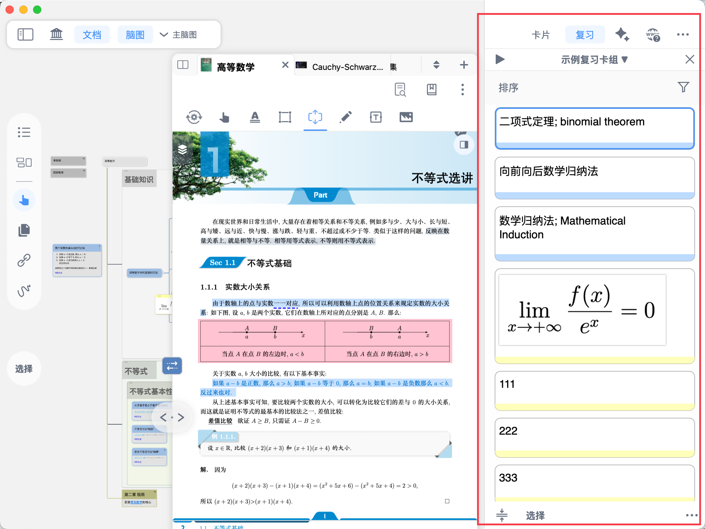

# 2 打开复习视图

- **非全屏模式下**，点击学习集界面右上角`复习`按钮，即可打开`复习视图`
- **全屏模式下**，依次点击学习集界面右上角`...` - `复习`，即可打开`复习视图`

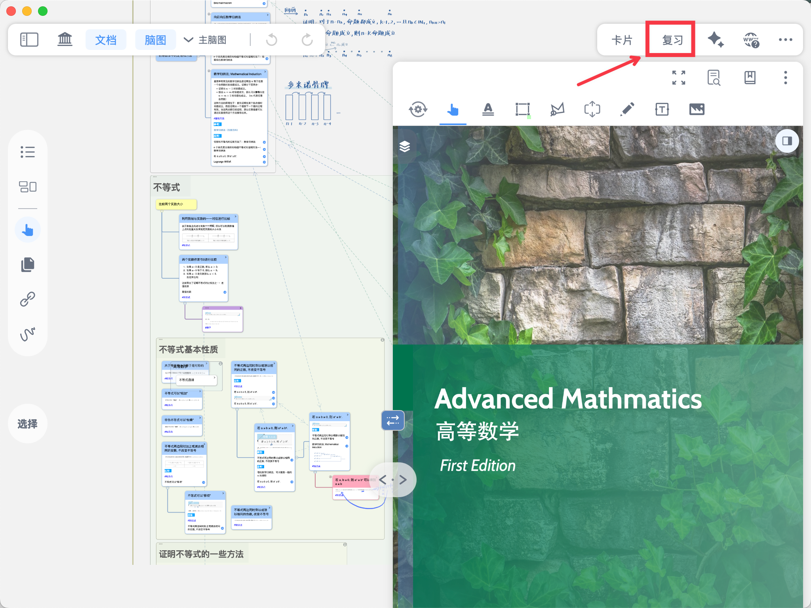

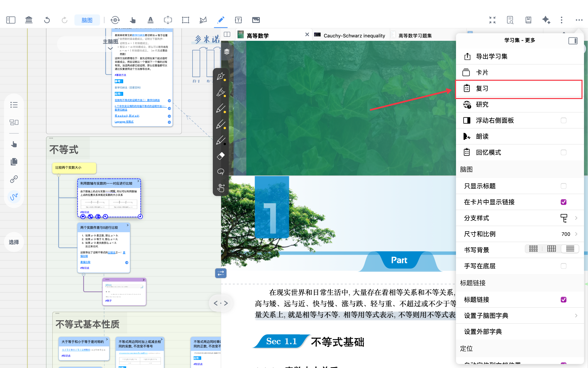

# 3 复习视图相关操作

## 3.1 复习视图

- 复习视图内部按钮如下：

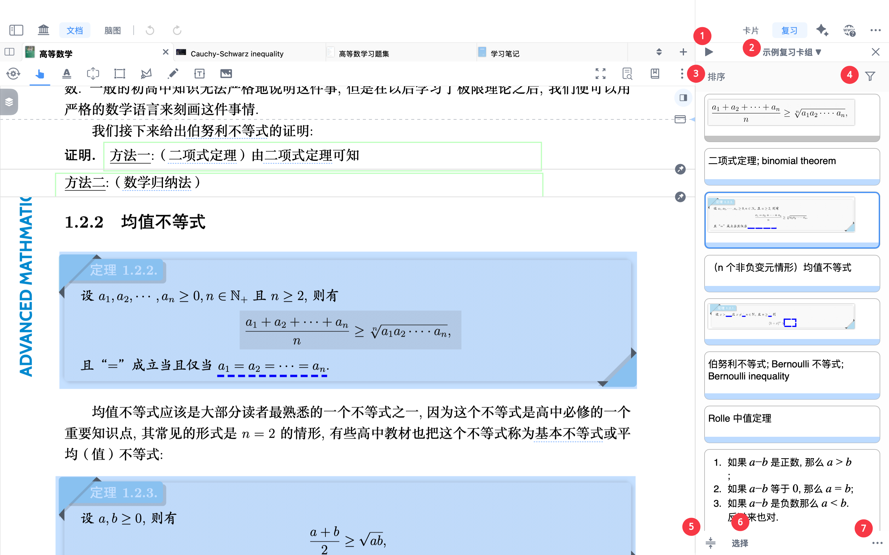

1开始复习

2切换复习卡片组

3将卡片排序（按`添加时间`/`到期时间`/`文档位置`/`文本`/`随机`排序）

4筛选卡片（按是否`到期`/`评分`/`收藏（星标）`/`标签`/`文档`/`颜色`筛选）

5“单行显示”按钮（如下方图标所示）

[单行显示](https://www.wolai.com/mmMx6RUSgjLf9FCAy2dWUv "单行显示")

6多选卡片

7更多：进入全屏复习模式/更新卡片问题/导出卡片`至anki`

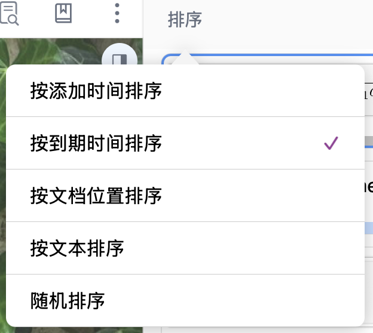

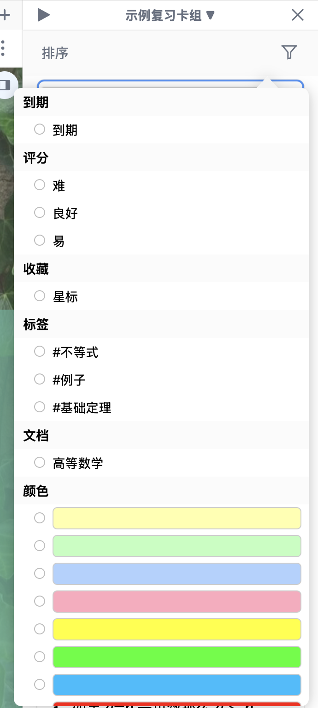

> 💡`更新卡片问题`：用于将已修改的原笔记卡片内容同步更新到对应的复习卡片中。当原卡片发生调整后，可通过更新卡片操作，使复习卡片组内的内容保持与最新笔记一致，避免因多次修改导致复习内容与原始记录不一致。

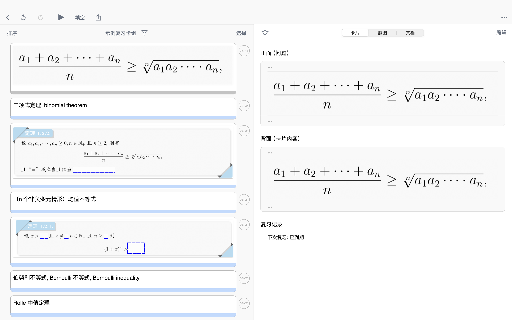

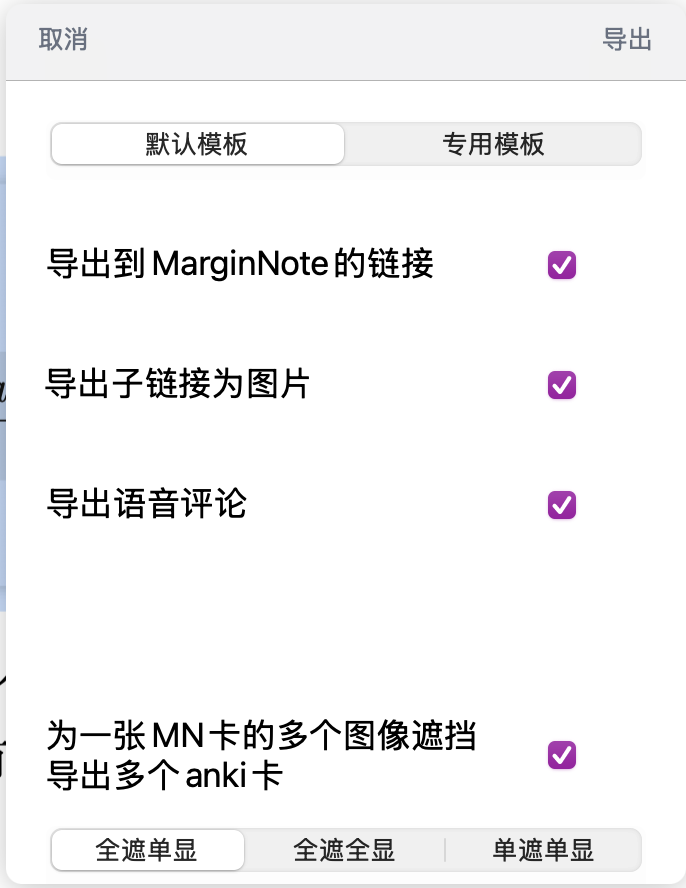

## 3.2 对卡片的进一步操作

- 以带有划重点的矩形摘录卡片为例：

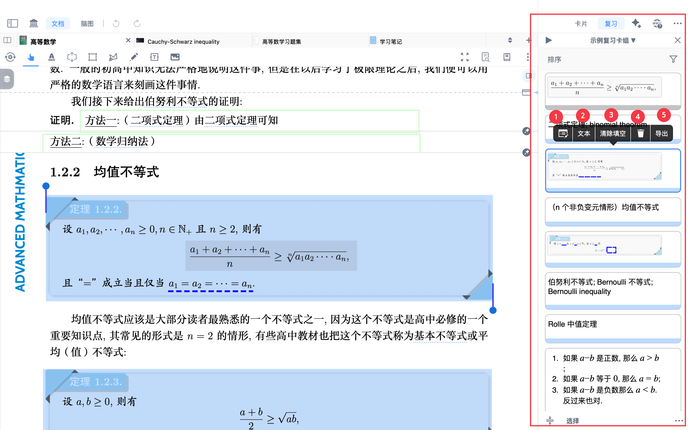

1打开卡片编辑器

2 对卡片进行`文本OCR`

3`清除填空`（清除划重点内容）

4删除复习卡片

5`导出`此复习卡片

> ❗`删除复习卡片`：仅表示将该卡片从当前复习卡组中移除，不会删除对应的原始笔记卡片。原卡片仍保留在学习集或脑图中，可继续查看、编辑或再次加入复习。

# 4 进行复习

## 4.1 打开闪卡复习界面

- 在`复习视图`内，点击按钮1打开闪卡视图，开始复习

## 4.2 闪卡复习界面内部

- 在闪卡复习界面
- 卡片首先以正面显示（左图）
- 点击`卡片空白处`或（左图）按钮4`显示答案（划重点/卡片背面内容）`
- 卡片呈现背面答案内容（右图）

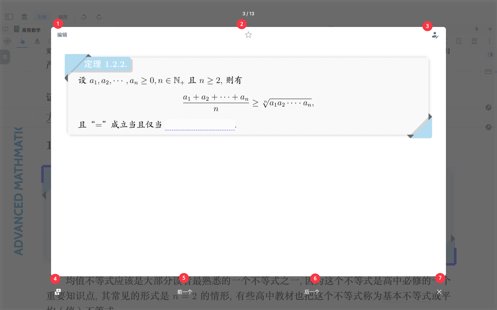

1`编辑`卡片

2星标卡片

3添加手写批注

4显示答案（划重点/卡片背面内容）

5显示`前一个`卡片

6显示`后一个`卡片

7关闭闪卡复习界面

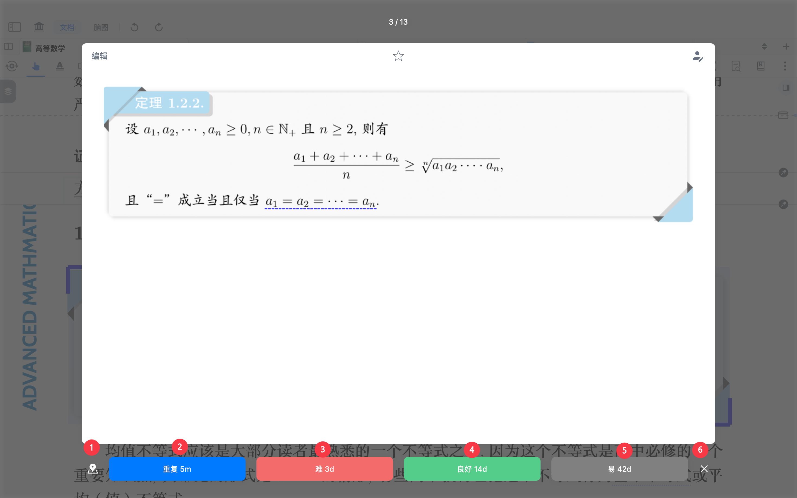

1定位卡片文档内部位置

2`重复 5m`：5分钟后到达下次复习时间，适合完全无法回忆的闪卡

3`难 10m`：10分钟后到达下次复习时间，适合记忆程度不佳的闪卡

4`良好 1d`：1天后到达下次复习时间，适合记忆程度较好的闪卡

5`易 2d`：2天后到达下次复习时间，适合已经牢固记忆的闪卡

6关闭闪卡复习界面
