# Markdown与公式

# 1 什么是 Markdown

Markdown是一种用于协作的轻量级标记语言，它可以通过简单易懂的语法标记，将纯文本转化为格式化的HTML文档，帮助学习者在写作时迅速排版，从而更好地专注于写作内容本身；

借助一些工具，Markdown文档可以很方便地转换为 TXT、PDF、Word、HTML、ePub等各种类型的文件。

# 2 如何在MarginNote中启用Markdown输入？

在MarginNote4中，学习者可以在**编辑卡片某条文本评论时**点击键盘输入栏上的`Markdown`选项，开关此条评论的 Markdown 模式。在后面**添加新的文本评论**时，Markdown 模式的开关状态将沿用上一次的设置。


> ⚠️注意：若开启 Markdown 模式，则 Html 模式下的文本评论中编辑的字体、文字大小等富文本格式将消失，并且开启后及时马上关闭，原有样式设置也不会恢复，所以开启前请留心。

# 3 Markdown语法基础

## 3.1 标题

有两种标记方式：

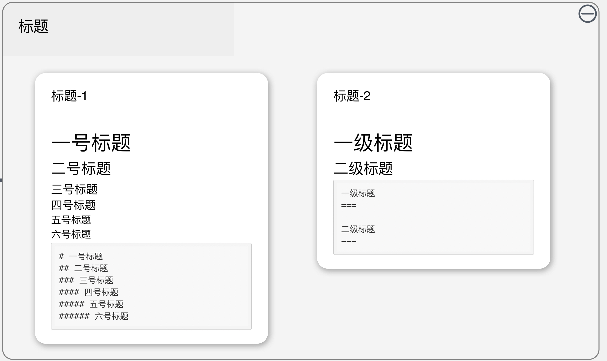

1. `#` +空格+标题内容

   在行首输入#号，空一格，再输入标题内容。
   ```markdown 
   # 一号标题
   ## 二号标题
   ### 三号标题
   #### 四号标题
   ##### 五号标题
   ###### 六号标题
   ```

   这种语法支持六级标题，但在MarginNote4中五级和六级标题的大小差异不大。

1) 标题内容 + `===` / `---`
   ```markdown 
   一级标题
   ===
    
   二级标题
   ---
   ```

   这种语法只支持两种标题。

## 3.2 文本样式

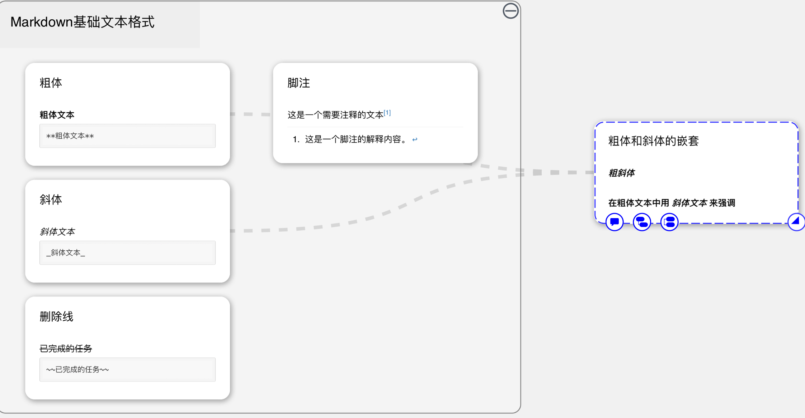

### 3.2.1 粗体

**粗体文本**

```markdown 
**粗体文本**
```


### 3.2.2 斜体

*斜体文本*

```markdown 
_斜体文本_

```


> 📌**粗体**和*斜体*的嵌套用法
>
> 1. ***粗斜体***
>    ```markdown 
>    __*粗斜体*__
>    ```
>
> 2. **在粗体文本中用*****斜体文本*****来强调**
>    ```markdown 
>    **在粗体文本中用 _斜体文本_ 来强调**
>    ```
>

### 3.2.3 删除线（MN4中暂不支持）

~~已完成的任务~~

```markdown 
~~已完成的任务~~
```


### 3.2.4 脚注（MN4中暂不支持）

这是一个需要注释的文本[^1]

（由于渲染效果差异，本页的脚注内容显示在本页面最下方）

```markdown 
这是一个需要注释的文本[^1]

[^1]: 这是一个脚注的解释内容。
```


> 💡若学习者希望使用markdown标记实现下划线、高亮、上下标、字号、字体颜色、背景颜色、行对齐等更多文本格式效果，请参考内嵌html和css。

## 3.3 段落与换行

Markdown中的段落由一行或多行文本组成，在Marginnote4中，换行即可标记新段落，使用键盘输入时，按`O``ption+Enter`换行。在 MN4 当前显示里，换一行和空一行间距可能一致。

## 3.4 列表

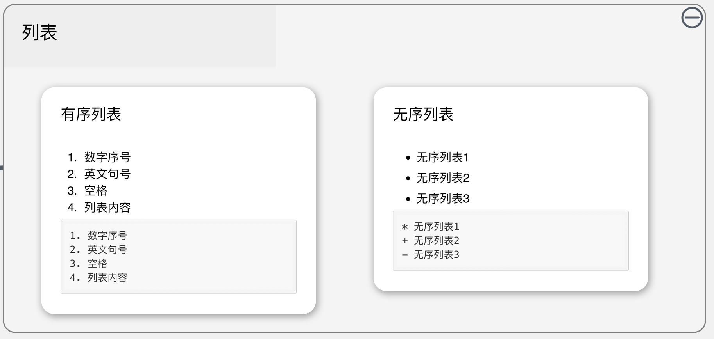

1. 有序列表：数字序号+英文句号+空格+列表内容

   第一个列表编号决定了后面的编号怎么排

   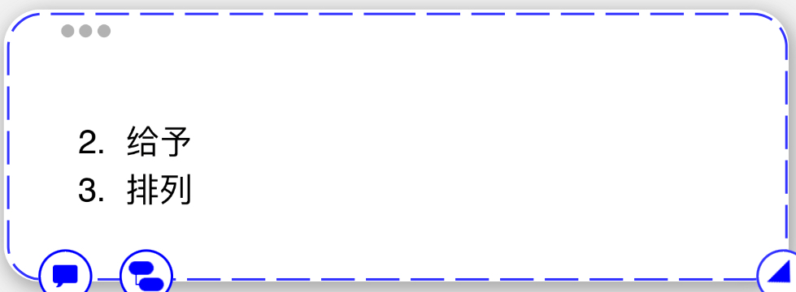
2. 无序列表："星号`*`/加号`+`/减号`-`" +空格+列表内容

> 💡Tips：有序列表和无序列表之间可以进行互相嵌套。

## 3.5 引用

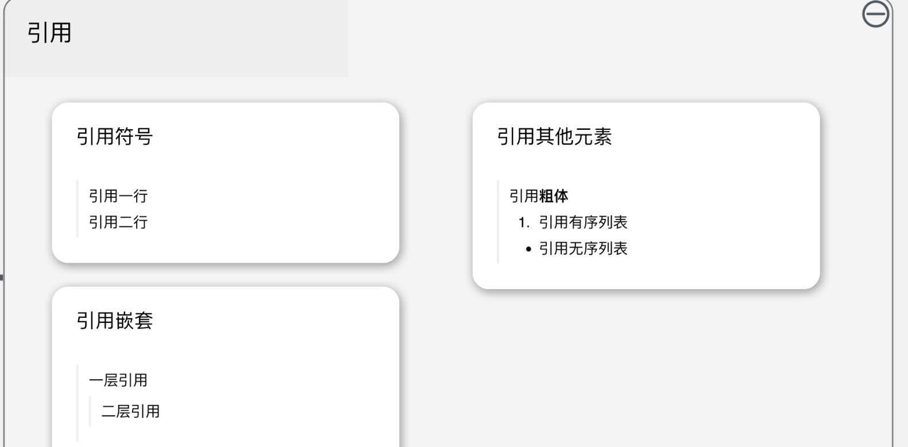

1. 引用符号：大于号 `>` +空格。
   ```markdown 
   > 引用一行
   > 
   > 引用二行

   ```

2. 引用嵌套
   ```markdown 
   > 一层引用
   > > 二层引用
   ```

3. 引用其他元素
   ```markdown 
   > 引用**粗体**
   > 1. 引用有序列表
   > - 引用无序列表

   ```


## 3.6 分隔符

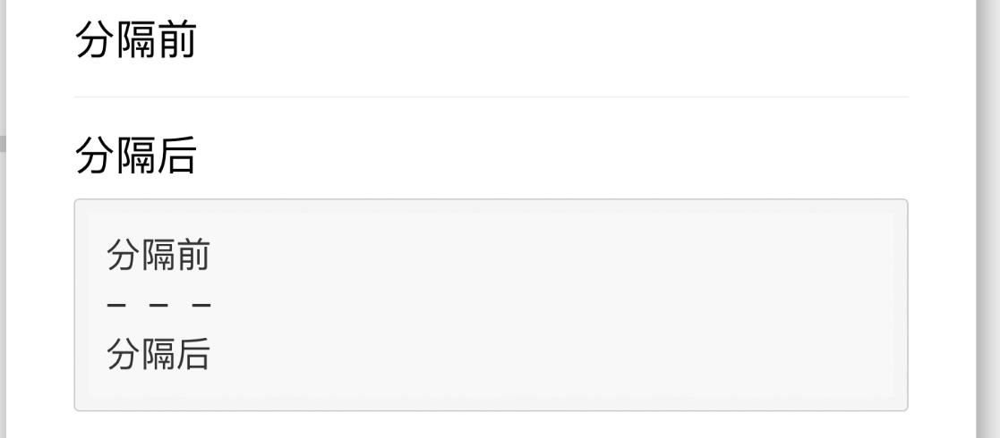

当学习者想要在两段文字间生成分线时，中间的一行需要只输入三个或三个以上的星号(`*`)、下划线(`_`)或三个用空格隔开的减号(`-`)。

```markdown 
分隔前
- - -
***
___
分隔后
```


## 3.7 代码

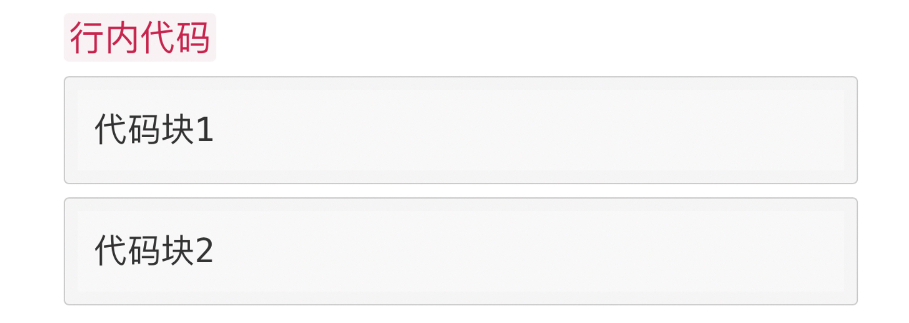

1. 行内代码：反引号(`` ` ``)+代码内容+反引号(`` ` ``)
   ```markdown 
   `行内代码`
   ```

2. 代码块：
   1. 三个反引号(`` ` ``)+换行+代码内容+换行+三个反引号(`` ` ``)
      ```markdown 

      ```

      代码块1
      ```text 

      ```

   2. 四个空格/`tab`+代码内容
      ```markdown 
          代码块2
      ```


> 💡Tips：当学习者想在Markdown编辑器输入一些标记符号，但又不想让这些符号被渲染时，可以使用斜杠进行转义：
>
> ```markdown 
> \!\"\#\$\%\&\'\(\)\*\+\,\-\.\/\:\;\<\=\>\?\@\[\\\]\^\_\`\{\|\}\~
> ```
>

## 3.8 超链接

在Markdown编辑器中直接输入的链接会被转换为超链接（将网络地址和邮箱地址用`<>`包裹也可转换为超链接），当多个链接杂乱不美观时，学习者可以用以下方法美化链接的表达：

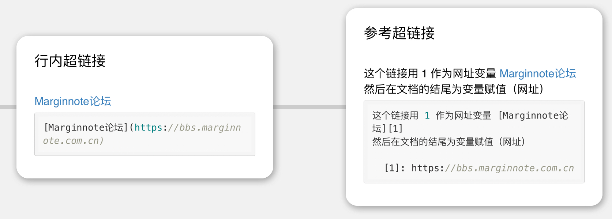

1. 行内超链接：`[链接文本](链接地址)`
   ```markdown 
   [MarginNote论坛](https://bbs.marginnote.com.cn)
   ```

2. 参考超链接（MN4中暂不支持）：`[链接文本][链接标识符]`，然后在其他段落定义`[链接标识符]: 链接地址`
   ```markdown 
   这个链接用 1 作为网址变量 [MarginNote论坛][1]
   然后在文档的结尾为变量赋值（网址）

     [1]: https://bbs.marginnote.com.cn
   ```


超链接已支持卡片的 URL，具体参看[卡片链接⑤|行内链接](https://www.wolai.com/sncaMzMHTBx6abg1dZcPfB "卡片链接⑤|行内链接")。

## 3.9 图片（MN4中暂不支持）

```markdown 


```


## 3.10 表格

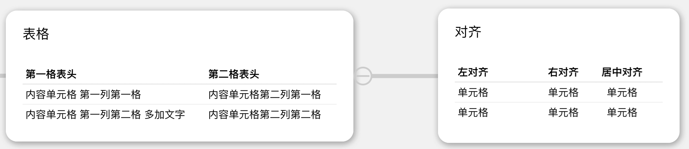

1. 表格
   ```markdown 
   第一格表头 | 第二格表头
   --------- | -------------
   内容单元格 第一列第一格 | 内容单元格第二列第一格
   内容单元格 第一列第二格 多加文字 | 内容单元格第二列第二格
   ```

2. 表格对齐
   ```markdown 
   | 左对齐 | 右对齐 | 居中对齐 |
   | :-----| ----: | :----: |
   | 单元格 | 单元格 | 单元格 |
   | 单元格 | 单元格 | 单元格 |
   ```


# 4 Markdown语法进阶

## 4.1 公式

Marginnote4的Markdown编辑器支持Latex、Katex、MathJax和Html标签输入公式，想了解如何用Markdown编辑公式的学习者可以通过[帮助文档](https://www.latexlive.com/help "帮助文档")学习markdown公式的写法，或者直接通过[网页编辑器工具](https://www.latexlive.com/home "网页编辑器工具")生成公式对应的markdown代码。

## 4.2 内嵌html和css

### 4.2.1 下划线

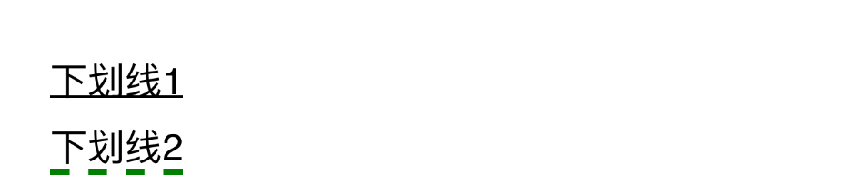

```markdown 
<u>下划线</u>

<span style="border-bottom:5px dashed green;">下划线2</span>
```


### 4.2.2 高亮


```markdown 
<mark>荧光笔</mark>
```


### 4.2.3 背景颜色


```markdown 
<table><tr><td bgcolor=yellow>背景色yellow</td></tr></table>
```


### 4.2.4 行对齐


```markdown 
<center>居中</center>
<p align="left">左对齐</p>
<p align="right">右对齐</p>
```


### 4.2.5 字号


```markdown 
<small>小号字体</small>
普通字体
<big>大号字体</big>
```


### 4.2.6 文字颜色


```markdown 
<font color=red>红色</font>
<font color=#008000>绿色</font>
```


Tips：文字和颜色的联合使用

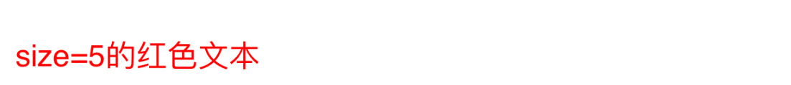

```markdown 
<font size=5 color=red>size=5的红色文本</font>
```


### 4.2.7 上下标


```markdown 
这是<sup>上标</sup> 文本
```


```markdown 
这是<sub>下标</sub> 文本
```


还有图片和表格也能通过html和css进一步美化，更多html和css美化教程可参阅[w3scnool](https://www.w3school.com.cn/index.html "w3scnool")和[菜鸟教程](https://www.runoob.com/html/html-tutorial.html "菜鸟教程")。

## 4.3 论坛插件拓展

[MarginNote论坛](https://bbs.marginnote.com.cn "MarginNote论坛")用户制作的插件提供了许多Marginnote4的Markdown中尚未支持的功能，例如需要更进阶Markdown功能支持的学习者，还可以使用[Milkdown插件](https://bbs.marginnote.com.cn/t/topic/34772 "Milkdown插件")。若是想在卡片中快速制图，也可以使用[Excalidraw插件](https://bbs.marginnote.com.cn/t/topic/46056 "Excalidraw插件")，还有[CKEditor](https://bbs.marginnote.com.cn/t/topic/7282 "CKEditor")和[myMarkDown](https://bbs.marginnote.com.cn/t/topic/13635 "myMarkDown")等插件来辅助美化卡片。

[^1]: 这是一个脚注的解释内容。
