# 导入文档及文档管理

> 💡本页面你将学到：在 MarginNote 4 中完成“导入文件—归类管理”的完整流程
>
> 适合第一次使用的用户，按步骤操作即可上手。

## 1 快速认识文档库

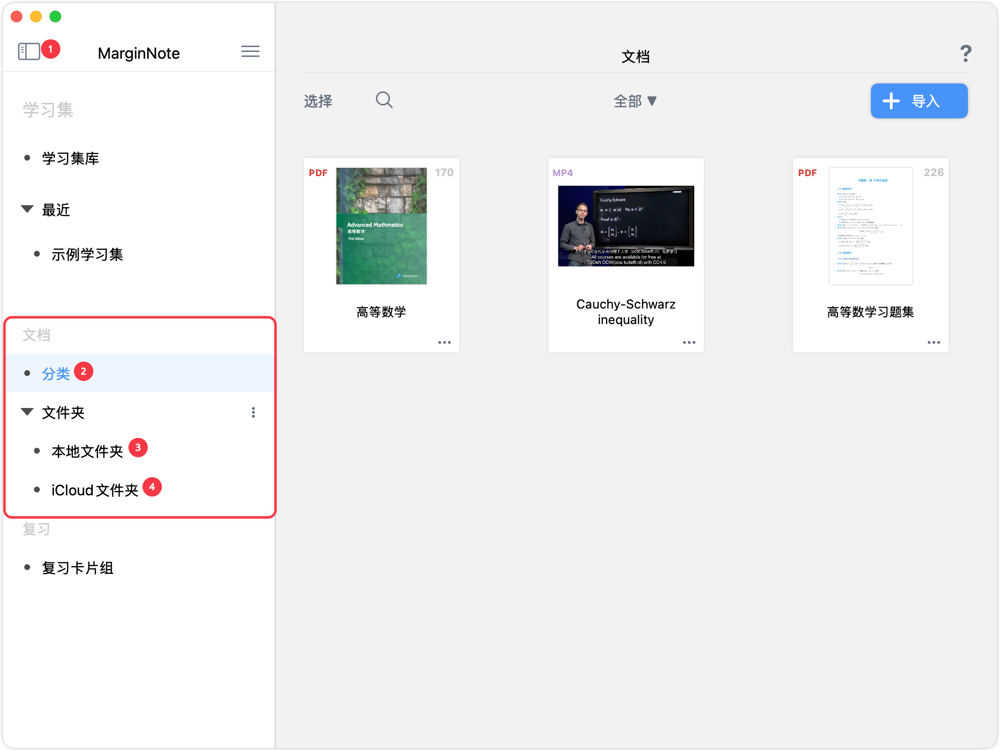

- 入口：在首页左侧边栏点击`文档`分区下的`分类`**、**`文件夹`
- 基本结构：
  - `分类`：标签式归类，支持多级标签（支持缩进形成子分类）。
  - `文件夹`：像电脑里的目录结构，适合按项目或学期整理。
    > 💡默认拥有`iCloud文件夹`、`本地文件夹`，如果是max用户还可以使用[添加USB存储文档库](https://www.wolai.com/wW5jUCGqwwDVgqFKz7dF48 "添加USB存储文档库")功能挂载外部文件夹。

***

## 2 导入文档

MarginNote 4支持 PDF、EPUB、MOV、MP3、MP4、M4V、M4A格式的文件，同时支持保存哔哩哔哩、YouTube视频以及Web网页到软件内。

- 支持格式：
  - 文档：PDF、EPUB
  - 音视频：MOV、MP3、MP4、M4V、M4A&#x20;
  - 可转换为PDF格式的文件：Word、PPT、Excel的office文档文件
    > 💡对于Word、PPT等**非 PDF格式的文件**，MN会将其转换成PDF文件后再导入，若转换效果不佳，建议使用更专业的文档编辑应用（WPS、Office）转换成PDF后再导入

### 2.1 软件外导入（从其他应用打开）

> 💡需要云同步的文档，建议直接存入 iCloud 的 MarginNote4 文件夹（**文档**：默认导入到iCloud文件夹[^注释1]/同步学习集的同时同步文档 [^注释2]）

- iPad：在网盘或聊天应用中选择“以其他应用打开” → 选 MarginNote 4，即可导入。
  > 💡由于百度网盘在 iOS/iPadOS 文件 App 中无法正确下载后打开文件，不建议通过“文件 App → 百度网盘”直接导入。
- Mac：在[受支持的文件](https://www.wolai.com/ehTLoD9HictQhkFirV1g9k#iKM43XEh9YbSwHpPMimtvj "受支持的文件")上右键“打开方式” → 选 MarginNote 4，完成导入。

### 2.2 软件内导入

#### 2.2.1 文档管理页面右上角“导入”

点击文档管理页面的`➕导入`，可选择**从文件**、**从Web**导入（添加 Web网页、保存YouTube和哔哩哔哩视频到本地）。

- **从文件**导入

  点击文档管理页面的`➕导入`-`从文件`，即可在文件app中选择需要导入的文件（支持多选文件一次性全部导入）

  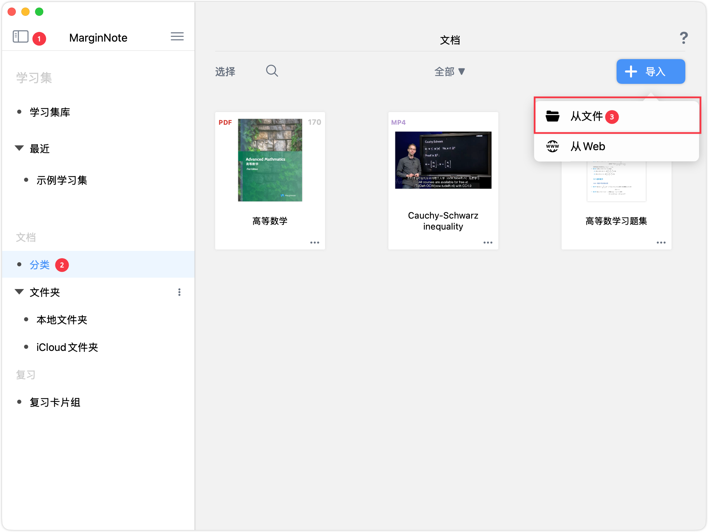
- **从Web**导入

  点击文档管理页面的`➕导入`**-**`从Web`，打开网页后检索页面或粘贴网址，或在视频网站搜索（支持哔哩哔哩、YouTube），点击**下载按钮**即可保存网页或在线视频到本地文档库

  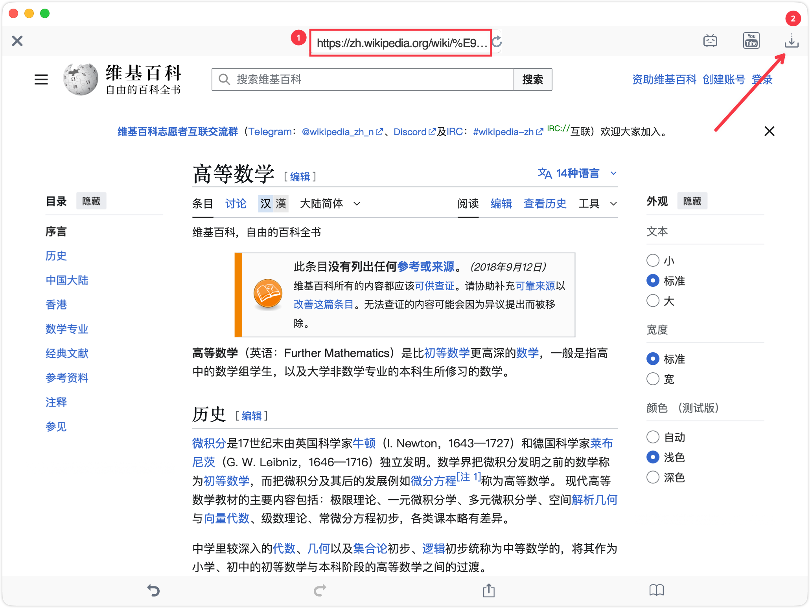
  > 💡导入哔哩哔哩和YouTube前先登录账号，以确保导入视频的清晰度

#### **通过Wifi 链接从 PC/Mac 上添加文档**（仅iOS设备支持）

- 点击文档管理页面的`➕导入`-`通过wifi从PC/MAC上传文档`

  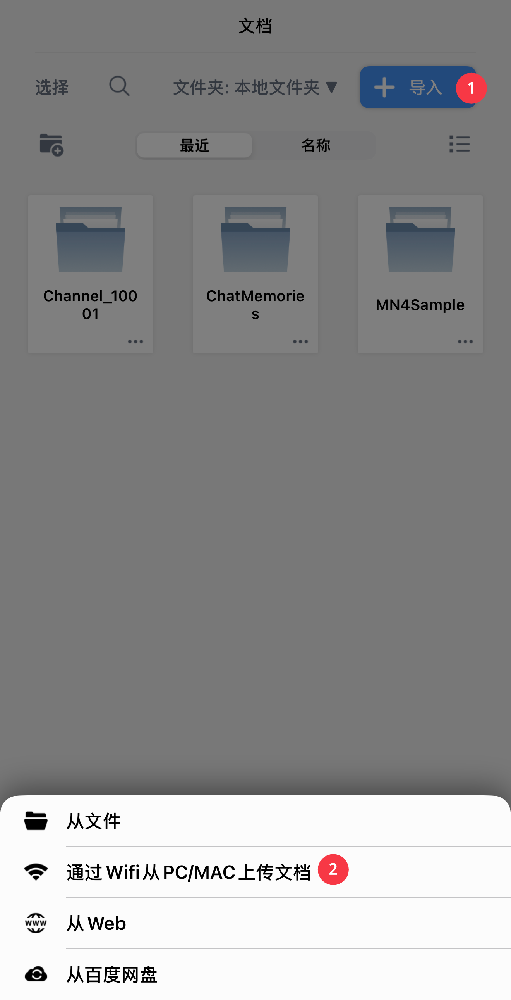
- 弹窗会显示一个链接，在电脑浏览器输入并打开这个链接（需要iOS设备和PC/Mac在同一局域网下）

  
- 可以点击\*\*`Upload Files`\*\*选择PC的文档并上传到iOS设备中

  1`Upload Files` ：上传文档

  2`Create Folder`：在软件里创建文件夹

  3`Refresh`：刷新显示

  4进入文件夹

  5删除

  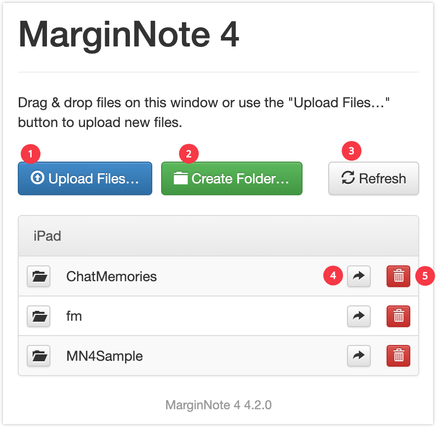

#### 2.2.3 从百度网盘导入

- 点击文档管理页面的`➕导入`-`从百度网盘`，可以直接导入百度网盘里的文件，支持格式见本章开头

  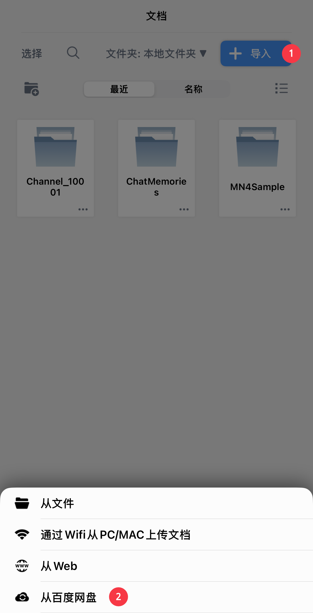
  > 💡第一次打开会有登录弹窗，可以扫码登录也可以使用手机号登录（建议直接使用验证码,因为输入账号密码百度还是会验证手机号）

## 3  文档存储位置与云同步规则

### 3.1 从其他应用打开或PDF打开方式设为“用 MarginNote 4 打开”时

- 存储位置取决于你当前在 MarginNote 中打开的页面：

  示例：
  - 打开“学习集：数学” → 导入文档将加入该学习集的文档标签页但不会加入该学习集，需要进行摘录或点击➕。
  - 打开“分类：英语” → 导入文档将加入“英语”分类。
  - 打开“文件夹：大一” → 导入文档将加入“大一”文件夹（如果打开默认导入到iCloud文件夹，即便当前打开了本地文件夹的页面，文件也会默认导入到iCloud文件夹）。

### 3.2 本地与云端

- **导入到“本地文件夹”的文档默认不参与云同步**，直到满足以下条件才自动加入云同步：
  1. 文档被加入某个学习集；
  2. 该学习集开启了云同步；
  3. 该文档在学习集中有新增笔记摘录（手写/文本框/摘录等任何在文档上新增笔记的行为）。
- 满足条件后，文档会自动进入 iCloud 的 MNDocs 文件夹中参与同步。详见：[数据同步、备份与恢复](https://www.wolai.com/qU6nwa4s6GCBuTDsjs9oeu "数据同步、备份与恢复")和[常见问题：iCloud云同步指南](https://www.wolai.com/teaCPu5CKGw3xvVUJNNvBE "常见问题：iCloud云同步指南")

## 4  管理文档

### 4.1 分类（轻量归类）

- 进入分类页面：在文档管理页面点击`分类`&#x20;

  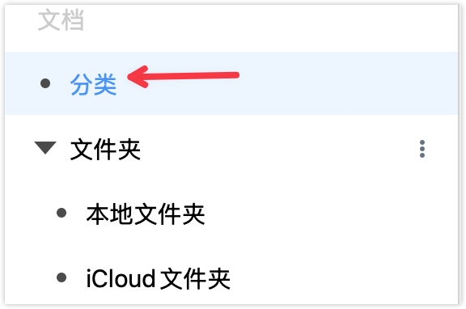
- 添加到分类：
  - 单个文档：在文档“更多”菜单中选择“编辑分类”。

    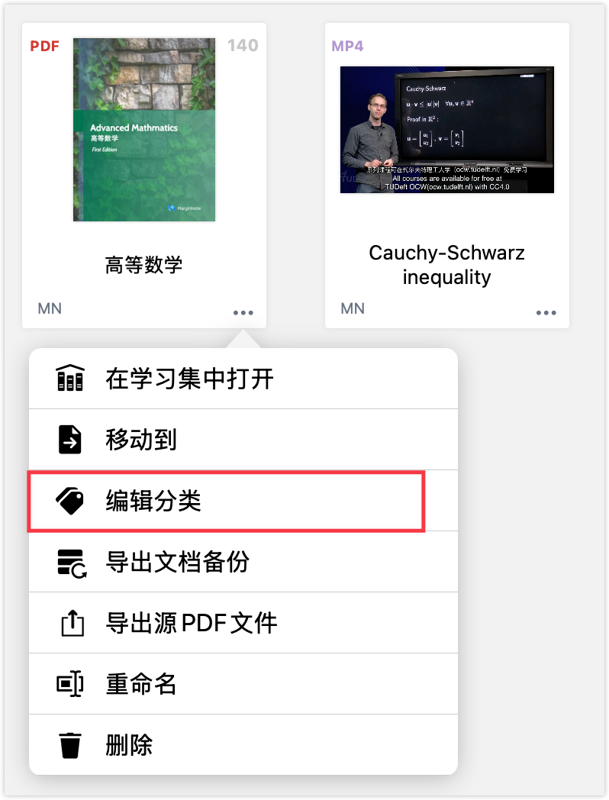
  - 多个文档：点击`选择` 按钮→ 勾选文档（Mac 多选需按住 ⌘） → 底部工具栏“编辑分类” → 勾选目标分类（可多选）。

    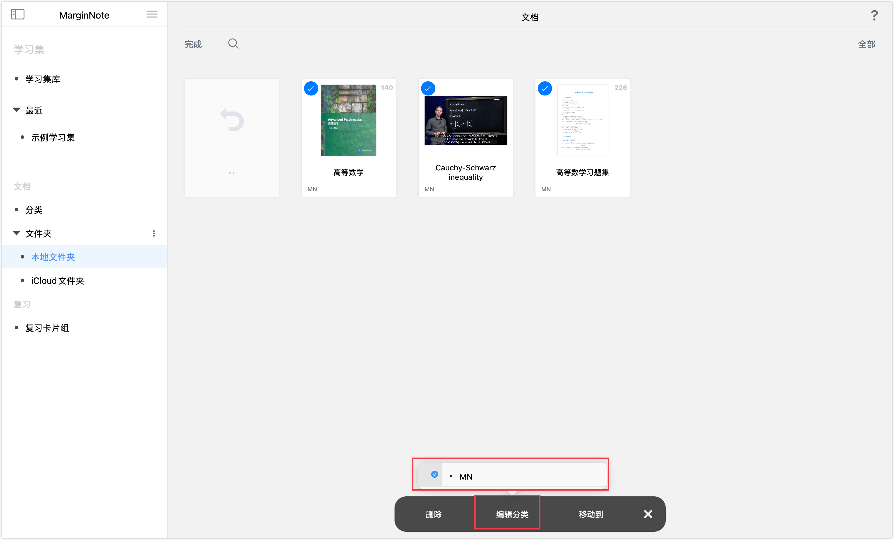
- 管理分类：

  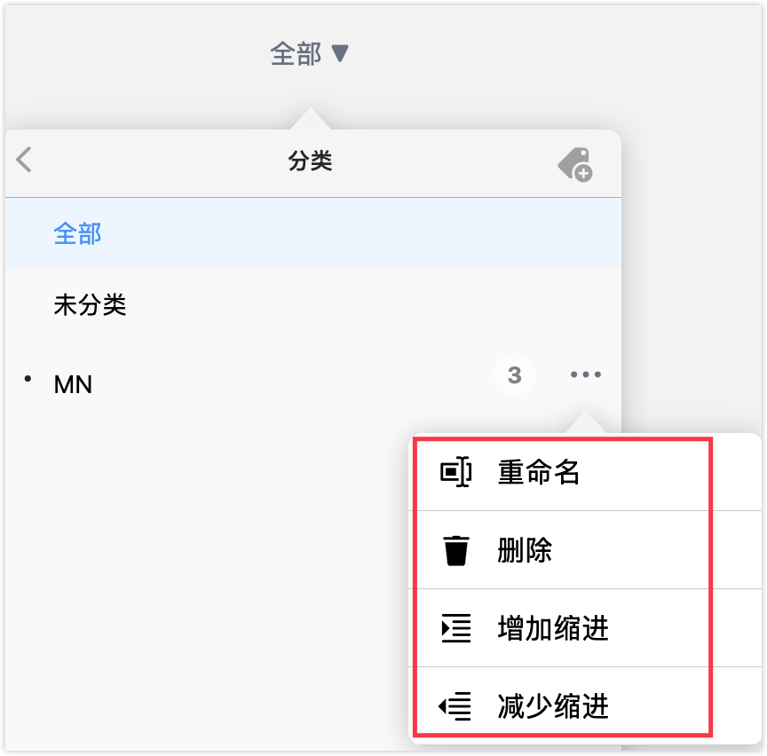
  - 点击右侧`…`可`重命名`、`增加缩进`/`减少缩进`、`删除`。
  - `增加缩进`/`减少缩进`：向右拖动增加缩进，向左拖动减少缩进。

### 4.2 文件夹（结构化整理）

- 创建文件夹：点击页面右上角“新建文件夹”。
- 移动文档/文件夹：
  - 多选后移动
    > 💡只能将文档（文件夹）在本地文件夹/iCloud内部进行移动，不能在本地文件夹/iCloud文件夹之间互相移动
    > 点左上“选择” → 勾选对象 → 底部“移动到” → 选择目标文件夹 → 点击“移动到”确认。
    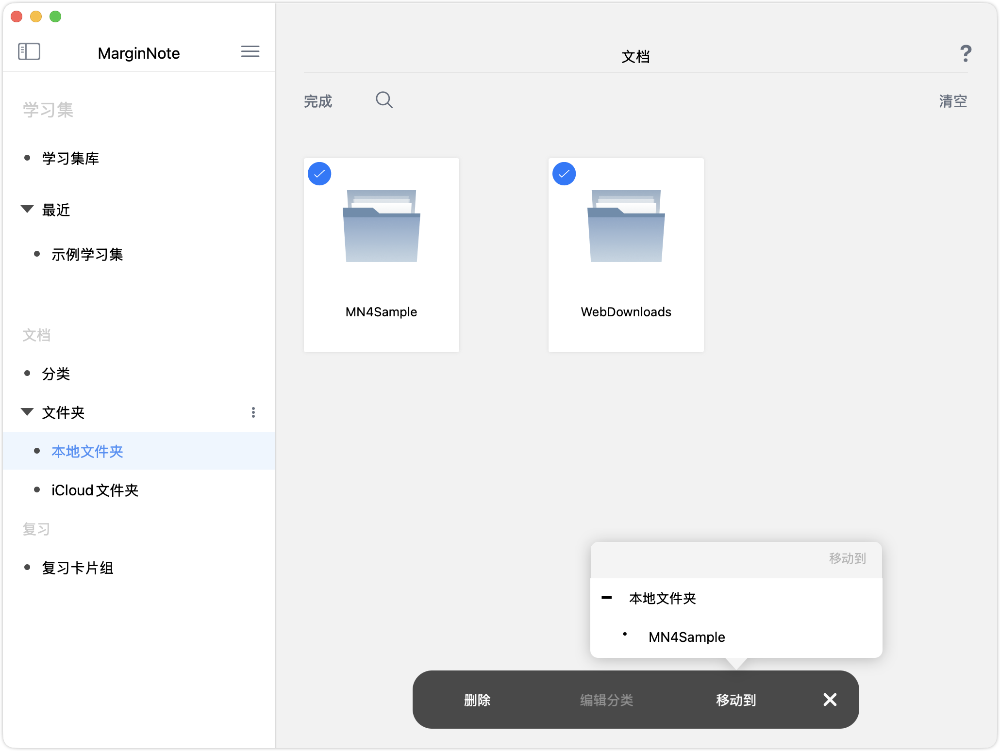
  - 文档/文件夹右下角`...`进行移动

    点击`移动到`

    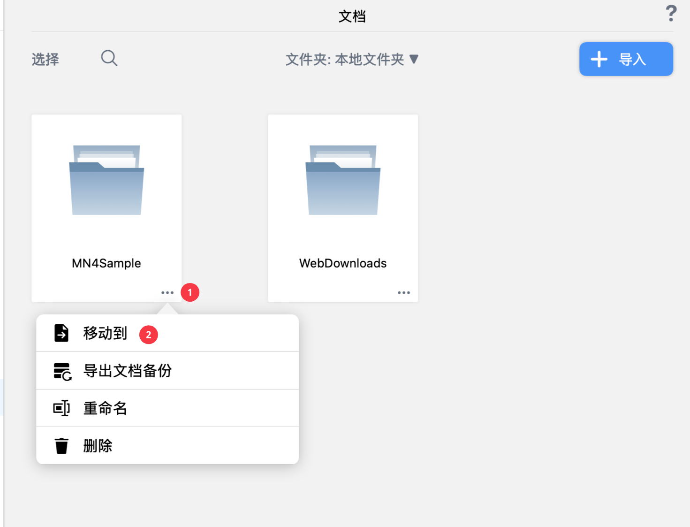
    > 💡注意左上角的返回按钮，可以返回到文档库选择其他文件夹
    >
    > 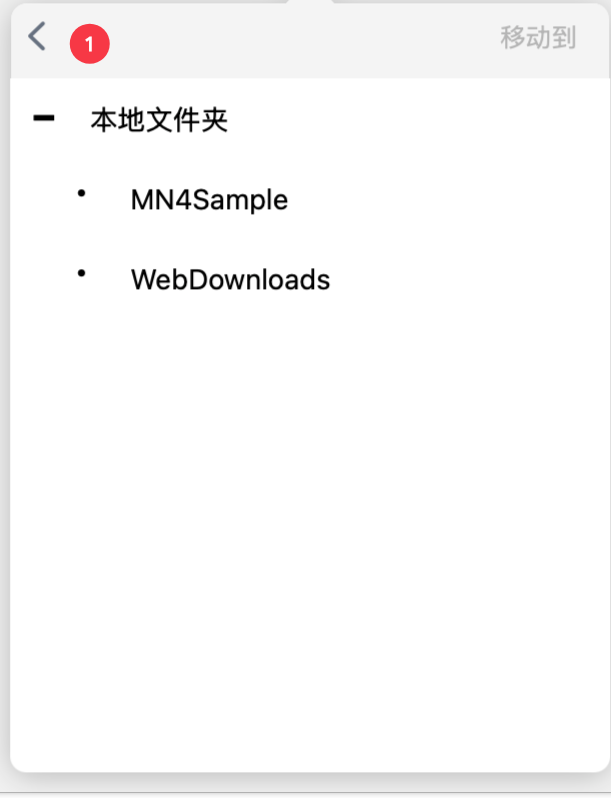

[^注释1]: 软件外导入的文件将默认导入到软件的iCloud文件夹位置

[^注释2]: 开启该项会在文档有新增笔记时同步本地文件夹的文档，否则默认只会同步iCloud文件夹中的文档。
