# 导出文档、脑图和学习集

> 💡本页面主要讲述如何导出PDF、导出脑图、导出学习集用于分享。涉及到文档备份以及笔记备份的导出详见[数据同步、备份与恢复](https://www.wolai.com/qU6nwa4s6GCBuTDsjs9oeu "数据同步、备份与恢复")

> 💡**常见场景快速跳转**
> 1\. 导出带有笔记的PDF：导出压平PDF（含有笔记）
> 2\. 导出全部脑图/大纲列表为PDF：导出脑图为PDF格式
> 3\. 导出部分脑图/大纲列表为PDF：导出脑图为PDF格式（焦点分支）

# 1 导出

## 1.1 文档

### 1.1.1 源文件PDF（不含笔记）

当学习者需要将原本的文档导出时，可以点击文档右下角的“...”更多按钮后在弹出的子菜单轻点“导出源PDF文件

### 1.1.2 导出压平PDF（含有笔记）

当学习者需要将含有笔记的文档导出时有两种方式：

1. 点击文档界面右上角的`文档-更多`按钮，点击`导出文档为压平PDF`即可将文档导出为压平PDF或长图

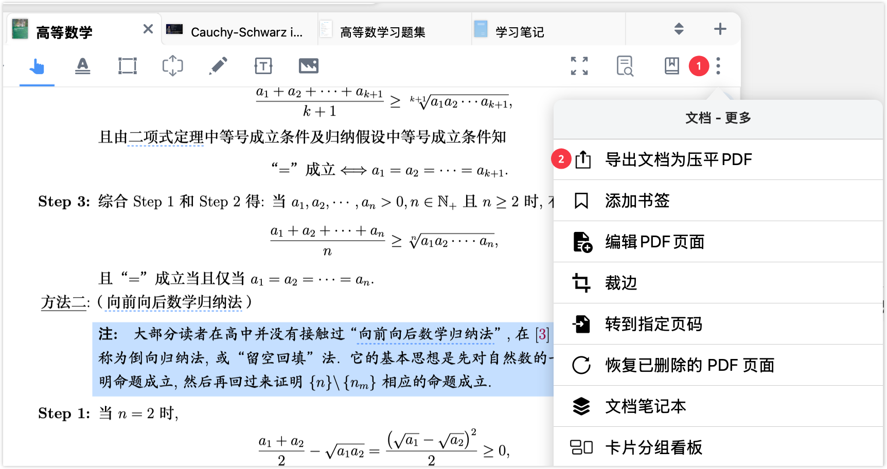

1. 点击学习集界面右上角`学习集-更多`-`导出学习集-导出文档为压平PDF`

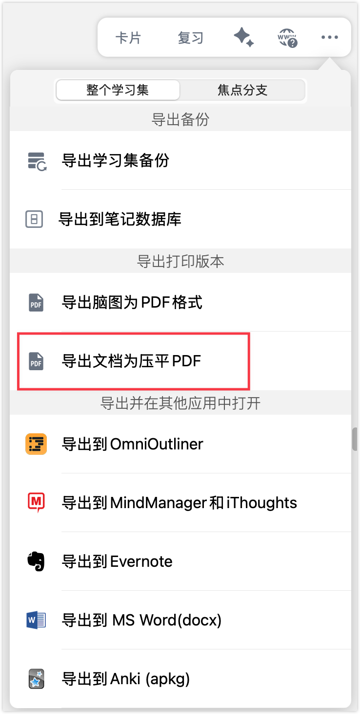

> 💡导出的压平PDF中的笔记内容不支持在任何软件编辑（含MarginNote），且目前导出压平PDF不含有在MarginNote中制作的目录

## 1.2 脑图

### 1.2.1 导出脑图为PDF格式

> 💡导出的PDF的是脑图/大纲在当前展开下的效果，因此需要显示全部内容**需要展开全部层级**

1. 点击`学习集-更多`

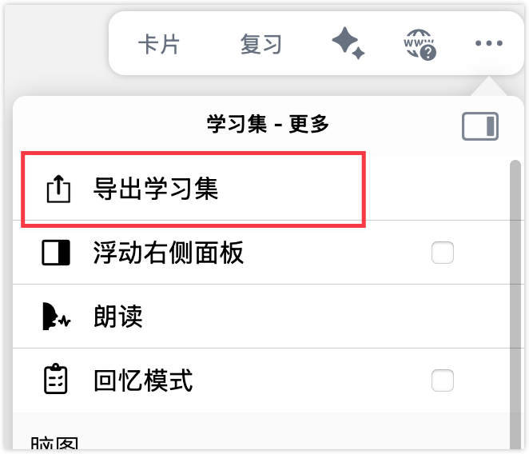

2.点击`导出脑图为PDF格式`

1. 选择`导出思维导图`以及`导出卡片大纲`
   > 💡导出的PDF的是脑图/大纲在当前展开下的效果，因此需要显示全部内容**需要展开全部层级**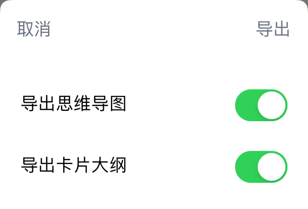
   选择需要导出的内容，点击`导出`，在脑图PDF格式预览界面选择打印或导出到其他APP。

### 1.2.2 导出脑图为PDF格式（焦点分支）

> 💡当我们仅需要导出脑图的一部分时可以选择仅导出焦点分支

1. 首先进入我们想导出的分支的最上级卡片的焦点模式（进入焦点的具体方式参考[脑图焦点](https://www.wolai.com/5nntHuyzfBSdVrEo4YYhxC "脑图焦点")）
2. 点击`学习集-更多`-`导出学习集`

1. 点击`焦点分支`-`导出脑图为PDF格式`，其余步骤与注意事项同导出脑图为PDF格式

   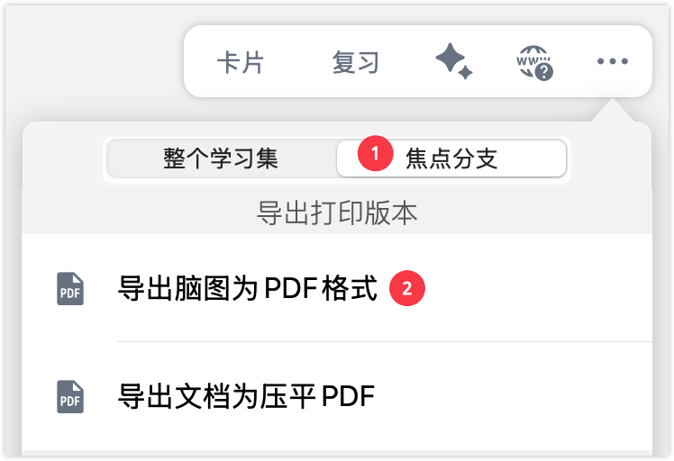

## 1.3 学习集

点击`学习集-更多`-`导出学习集`

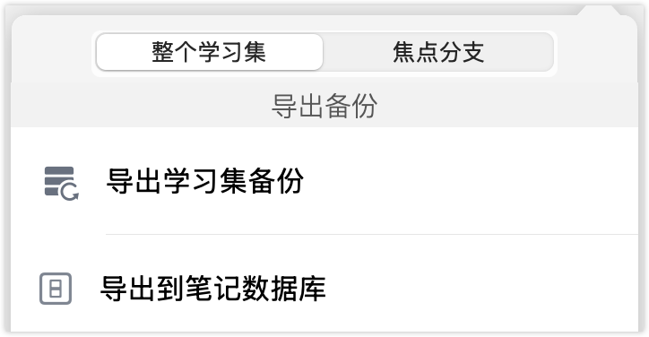

`导出备份`选项卡下有`导出学习集备份`以及`导出到笔记数据库`

1. `导出学习集备份`：可以导出当前学习集的所有文档与笔记数据用于分享或者备份，备份文件仅可以用Marginnote打开
2. `导出到笔记数据库`：多笔记数据库Max专属功能，通过将部分学习集导出到其他笔记数据库可以方便的让我们将学习集在不同数据库间转移，可用于不同时期，不同领域的笔记数据隔离。
   > 💡关于笔记数据库的使用用法与常见场景详见[笔记数据库①：新建和管理数据库](https://www.wolai.com/wVmpipXpgJM4ZicKDvV6A7 "笔记数据库①：新建和管理数据库")

## 1.4 导出为其他格式

> 💡导出其他格式也可以选择仅导出焦点分支，操作步骤同导出脑图为PDF格式（焦点分支）

1. 点击`学习集-更多`-`导出学习集`
2. 可以选择如下格式导出:OmniOutliner（oo3）、MindManager和iThoughts（mmap）、Evernote（api）、MS Word（docx）、Anki（apkg）

> 💡用[Markdown与公式](https://www.wolai.com/eShEtotNTstcUnT6o3FLAP "Markdown与公式")制作的卡片，导出后在不支持Markdown语法的软件中无法正确渲染显示

### 1.4.1 导出到OmniOutliner（oo3）

1. 点击该项，选择是否想导出大纲时附带摘录颜色。
2. &#x20;生成oo3文件，选择支持oo3文件格式的软件OmniOutliner导入。

> 💡tips：该文件在MarginNote4本地文件夹中位于ExportedOmniOutlinerFiles文件夹。

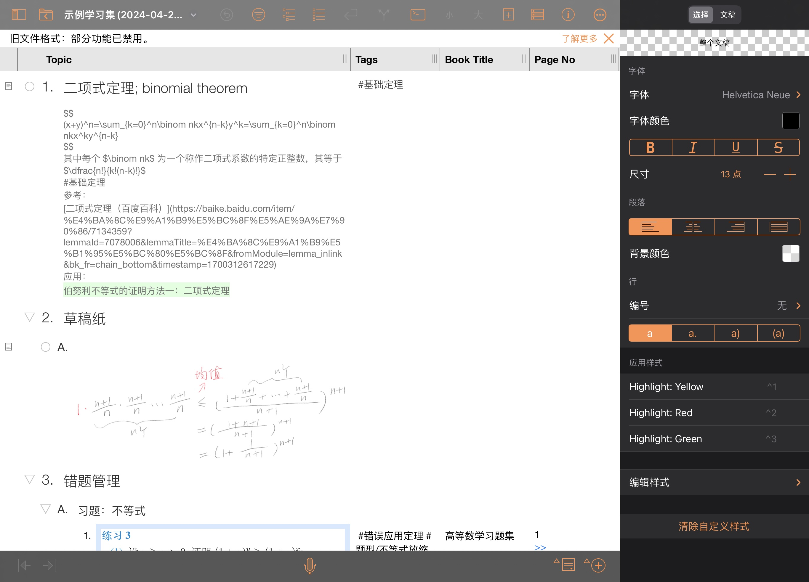

> 💡tips：OmniOutliner的编辑功能需订阅且收费较高，可点击界面左上角文件名后的更多选项-Exports As，转换为更多文件模式。
>
> 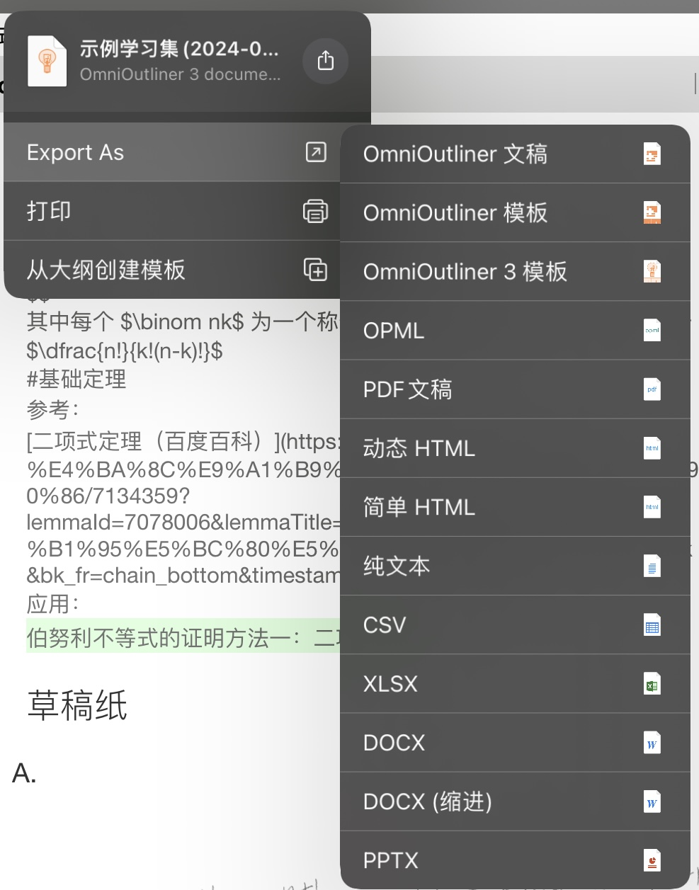

### 1.4.2 导出到MindManager和iThoughts（mmap）

1. 点击该项，可选择是否想在导出的思维导图中加入Marginnote链接，若加入，可通过点击链接跳转回MarginNote的对应卡片位置

   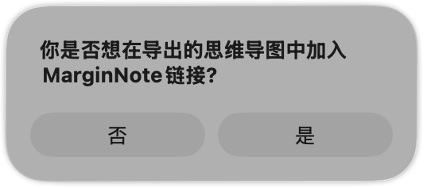
2. 生成mmap文件，选择支持mmap格式文件的软件导入。
   > 💡tips：该文件同时位于MarginNote4本地文件夹。
3. 支持mmap格式的软件：
   1. MindManager

      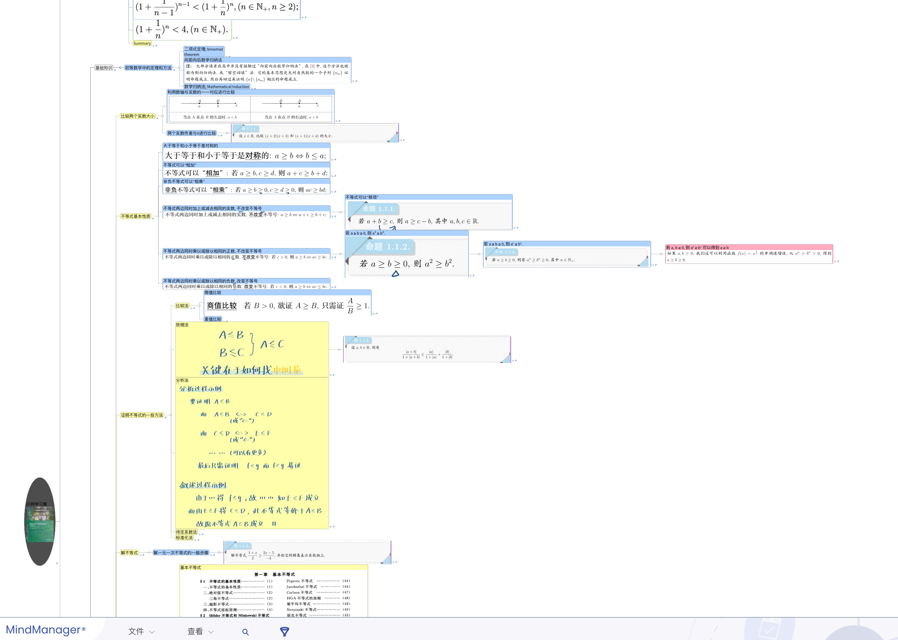
      > 💡App Store中的MinManager go仅能浏览mmap文件
   2. iThoughts

      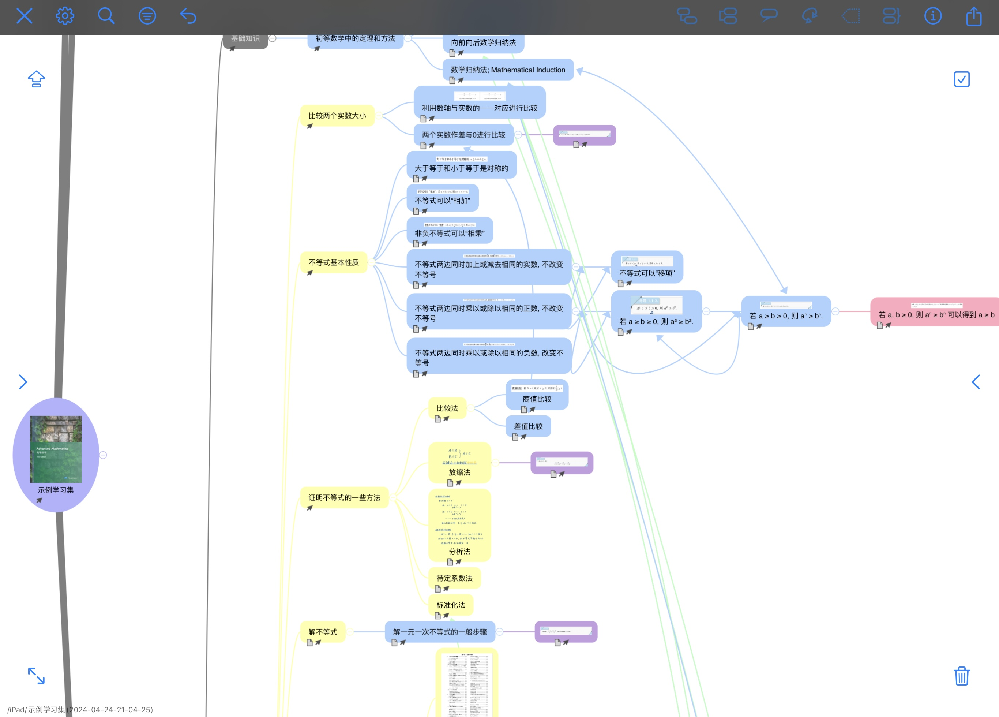
      > 💡tips：ithoughts可以将思维导图转为多种格式，其中mm、opml、xmind格式的文件可以导入幕布（需小于2m），幕布可以让学习者在全平台多端同步阅览思维导图/大纲，将幕布文件导出，也可以通过iThoughts转为mmap文件，导回Marginnote4，并且可以选择追加到已有学习集脑图或创建新脑图。
      >
      > ⚠️App store已经不提供ithoughts下载，mac和win可以自行寻找iThoughts安装包。
      >
      > 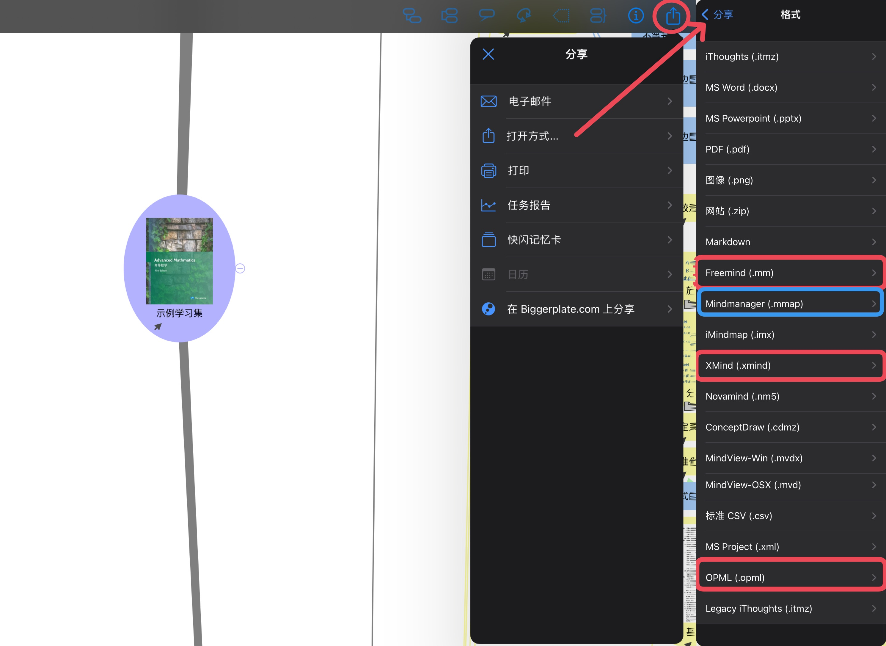
   3. Mindnode

      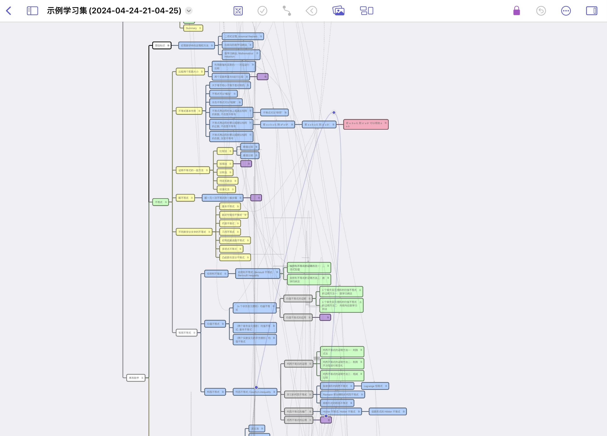
      > 💡tips：mindnode可以将脑图格式转换为如图所示的格式。
      >
      > 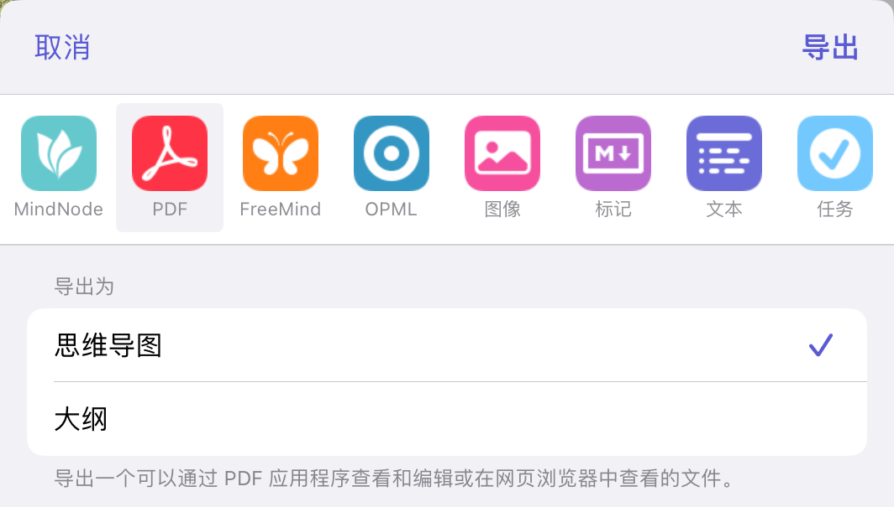
   4. Mindmaster（10m以下）
   5. 百度脑图
   6. Xmind（非移动端版）

### 1.4.3 导出到Evernote（api）

1. 点击该项，登陆Exernote（印象笔记），选择目标文件夹，点击导入。

   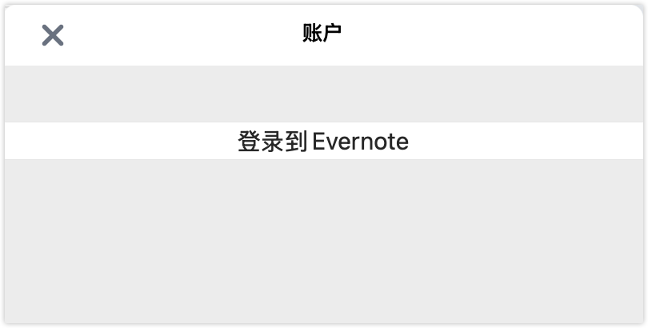
2. 选择是否附上卡片关联的文档。
3. 选择是否附上脑图。
4. 学习集将在后台导出，结束后学习者将收到提示信息。

### 1.4.4 导出到MS Word（docx）

1. 点击该项，选择是否想在导出大纲时附带摘录颜色。
2. 生成docx文件，选择支持docx的软件导入。

> 💡tips：该文件位于MarginNote4本地文件夹。

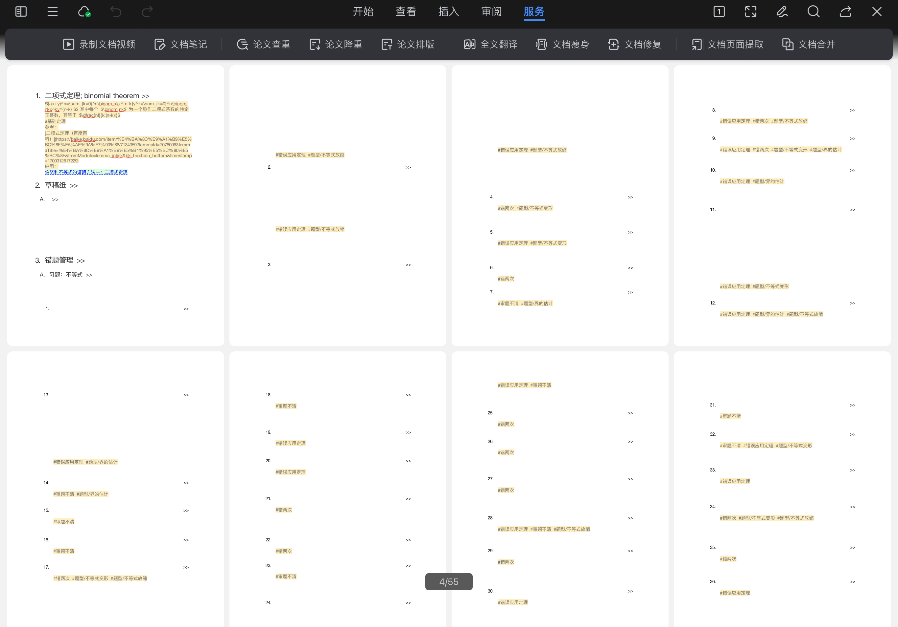

### 1.4.5 导出到Anki（apkg）

点击该项后出现如图选框，默认模板除了可以导出卡片,还有如下导出设置

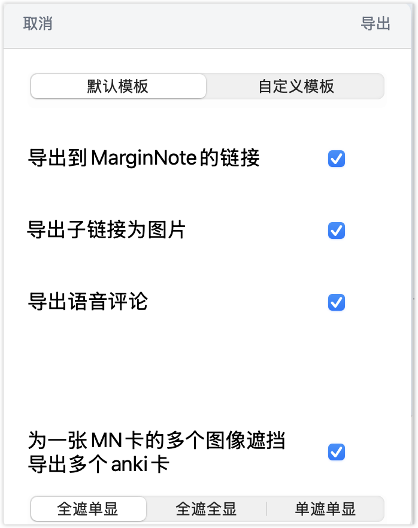

1. `导出到MarginNote的链接`

   
2. `导出子链接为图片`

1. `导出语音评论`

`为一张MN卡的多个图像遮挡导出多个anki卡片`：当一张复习有多个填空遮挡，将生成对应数目的多张Anki卡片

1. `全遮单显`

   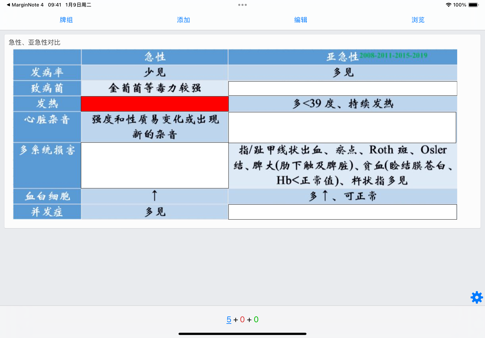

   
2. `全遮全显`

   

   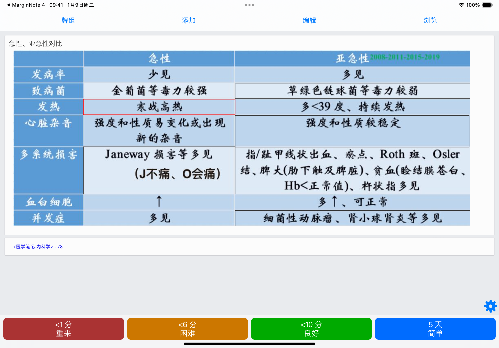
3. `单遮单显`

   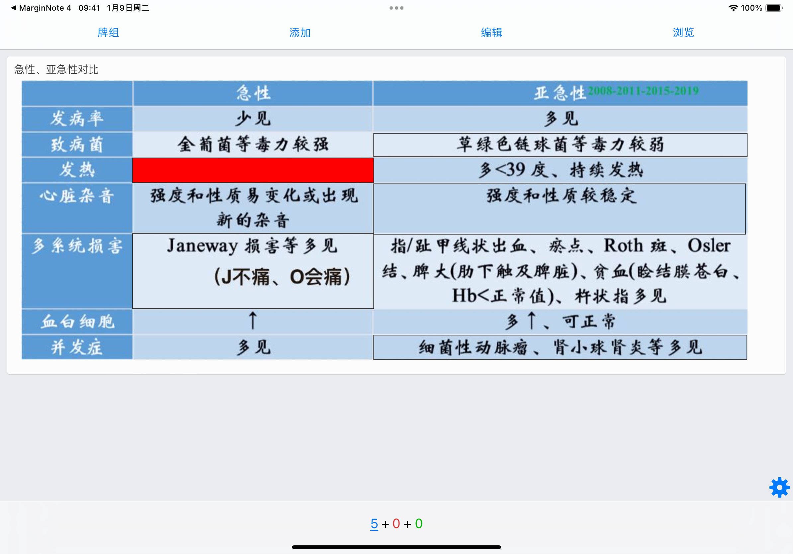

   

> 💡关于自定义模板的进阶使用方法详见[闪卡复习③：导出到Anki &模板配置](https://www.wolai.com/4zZ4C4Y4jgfdszohqSE4Zm "闪卡复习③：导出到Anki &模板配置")

# 2 其他笔记导出插件

> 💡Marginnote论坛中的插件还支持学习集导出到更多第三方app，例如obsidian和flomo，可进入论坛进一步学习。

[第三方应用联动②：Obsidian+MN4](https://www.wolai.com/hTKcNyLnc362NvwEvMbt2e "第三方应用联动②：Obsidian+MN4")

[ 【第三方MN插件】Obsidian-Bridge（Markdown动态导出）——连接两个知识星球 #Ver.3.0.0 已获官方签名# - #162，来自 Deanlzy - 插件发布区｜允许不受限制地编辑更新主帖 - MarginNote 中文社区 Obsidian BridgeObsidian Bridge 插件架起了 MarginNote 通往 Obsidian 的桥梁，通过它，我们可以把在 MarginNote 中积累的写作素材/创作灵感导入到 Obsidian 中，使用 Ma\&hellip; https://bbs.marginnote.com.cn/t/topic/21235/162](https://bbs.marginnote.com.cn/t/topic/21235/162 " 【第三方MN插件】Obsidian-Bridge（Markdown动态导出）——连接两个知识星球 #Ver.3.0.0 已获官方签名# - #162，来自 Deanlzy - 插件发布区｜允许不受限制地编辑更新主帖 - MarginNote 中文社区 Obsidian BridgeObsidian Bridge 插件架起了 MarginNote 通往 Obsidian 的桥梁，通过它，我们可以把在 MarginNote 中积累的写作素材/创作灵感导入到 Obsidian 中，使用 Ma\&hellip; https://bbs.marginnote.com.cn/t/topic/21235/162")

[ 【第三方MN插件】写了个flomo的插件，有在用flomo的同学吗 #Ver.0.0.2 已获官方签名# - 插件发布区｜允许不受限制地编辑更新主帖 - MarginNote 中文社区 v 0.0.2版本发布做了以下支持 支持切换flomo的位置(主要参考deepl的代码，想请教下怎么直接刷新位置，现在是再次开关插件后生效) 笔记增加了笔记id ,为打开marginNote做准备 预览图    \&hellip; https://bbs.marginnote.com.cn/t/topic/18381](https://bbs.marginnote.com.cn/t/topic/18381 " 【第三方MN插件】写了个flomo的插件，有在用flomo的同学吗 #Ver.0.0.2 已获官方签名# - 插件发布区｜允许不受限制地编辑更新主帖 - MarginNote 中文社区 v 0.0.2版本发布做了以下支持 支持切换flomo的位置(主要参考deepl的代码，想请教下怎么直接刷新位置，现在是再次开关插件后生效) 笔记增加了笔记id ,为打开marginNote做准备 预览图    \&hellip; https://bbs.marginnote.com.cn/t/topic/18381")
