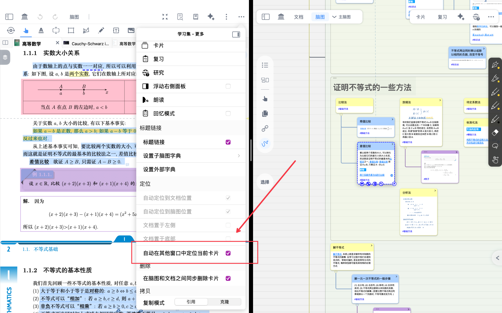
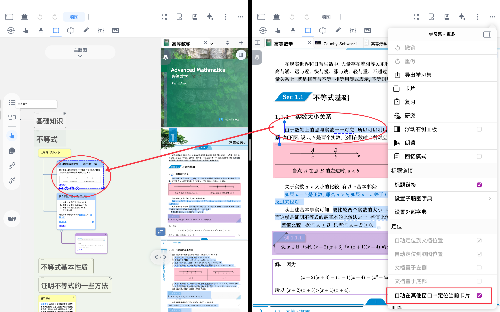
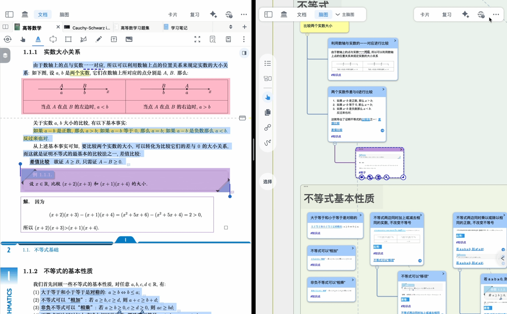

# 多窗口联动①：同一设备多开 MN4窗口

# 1 什么是多开窗口联动笔记

> 💡**多开窗口联动笔记——跨界协作的高效学习空间**：
>
> 多开窗口功能支持在不同界面间同步操作与笔记协作，可实现**多屏或多窗口同时显示不同内容**，如一边查看思维导图，一边阅读原文或编辑笔记。
>
> 各窗口间数据自动协同更新，无需手动同步，保证内容始终一致。无论是教材与导图的并行研读，还是跨应用资料的整合整理，都能在统一系统内高效完成，实现真正意义上的多任务学习体验。
>
> 

> ❗为达到多开窗口联动笔记回源同步效果，请确保**开启**`自动在其他窗口中定位当前卡片`
>
> 相反，若想在不同学习集内作业不受回源干扰，请**关闭**`自动在其他窗口中定位当前卡片`
>
> 

# **如何多开窗口联动笔记**

## 2.1 MarginNote4多开窗口

> 💡Ipad端：长按MN图标 →新建窗口
>
> Mac端：Cmd+N 新建窗口

- &#x20;多开窗口后，点击学习集右上角横排三点
- 开启自动在其他窗口中定位当前卡片，即可在不同窗口溯源定位

## 2.2 MarginNote 4+第三方APP

- 开启MN4与其他app界面下

1. 可将手写批注拖拽至MN4`文档界面`当中，新建图片和手写批注；

- **对支持pencilkit原生笔记的APP**
- 选中手写批注进行拖拽，其内容在MN中支持修改

- **对于非pencilkit原生笔记的APP**
- 选中手写批注/文档内容进行拖拽，则以**不能修改的**图片/手写批注展现

- 选中手写批注/文档内容进行拖拽，则以**不能修改的**图片/手写批注展现

1. 也可拖拽至**摘录区域**，自动添加至卡片评论

