# 文档复习：遮挡挖空与回忆模式

# 1 什么是`回忆模式`？

> 💡**回忆模式——激发长期记忆的沉浸式复习体验**：
>
> 通过在**卡片、矩形区或文本段落**中设置遮挡挖空内容，帮助大脑在回忆中重新检索知识、强化记忆连接。学习者可以**自由选择遮挡范围与样式**，从单个公式到整段论述，都能实现“所问即所忆”的高效训练。
>
> 开启回忆模式后，整个学习集进入**全局遮挡状态**，点击即可揭晓答案，在不断的“回想—验证—巩固”循环中，将知识真正刻入长期记忆。
>
> 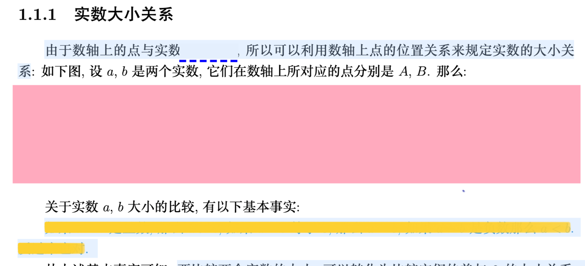

# 2 开启回忆模式

## 2.1 开启沉浸模式下的回忆模式

先进入`沉浸模式`，点击`底部工具栏`上的人像图标，启用`回忆模式`，具体功能详见回忆模式工具栏。

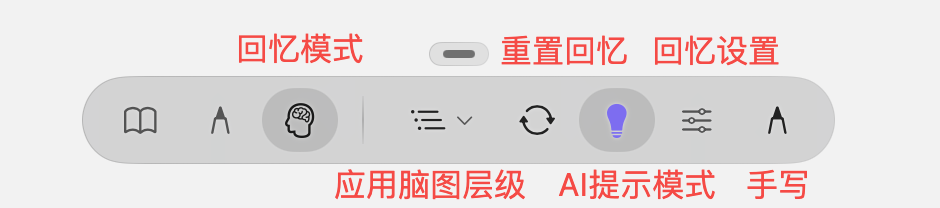

## 2.2 开启旧版回忆模式

- MN`设置` → `旧版功能` → ☑️ `回忆模式（旧版）`

  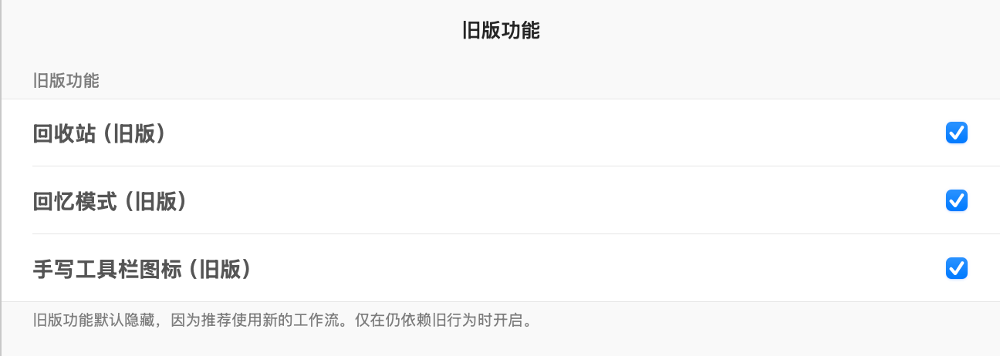
- 点击右上角`学习集-更多`，开启`回忆模式（旧版）`

  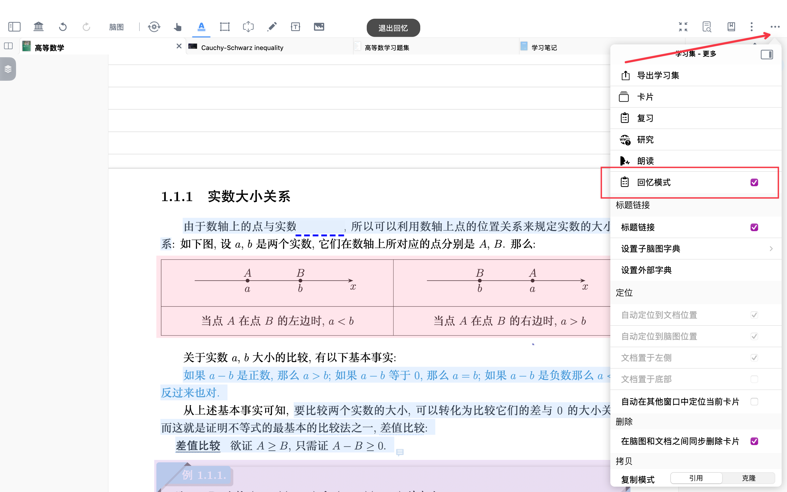
- 开启`回忆模式（旧版）`后，遮挡的内容将不可见
- 此时点击遮挡部分，可进行知识点的主动回忆、复现
- 再次点击遮挡部分，可复原遮挡

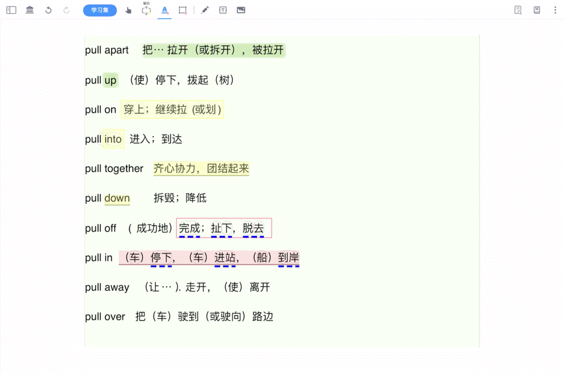

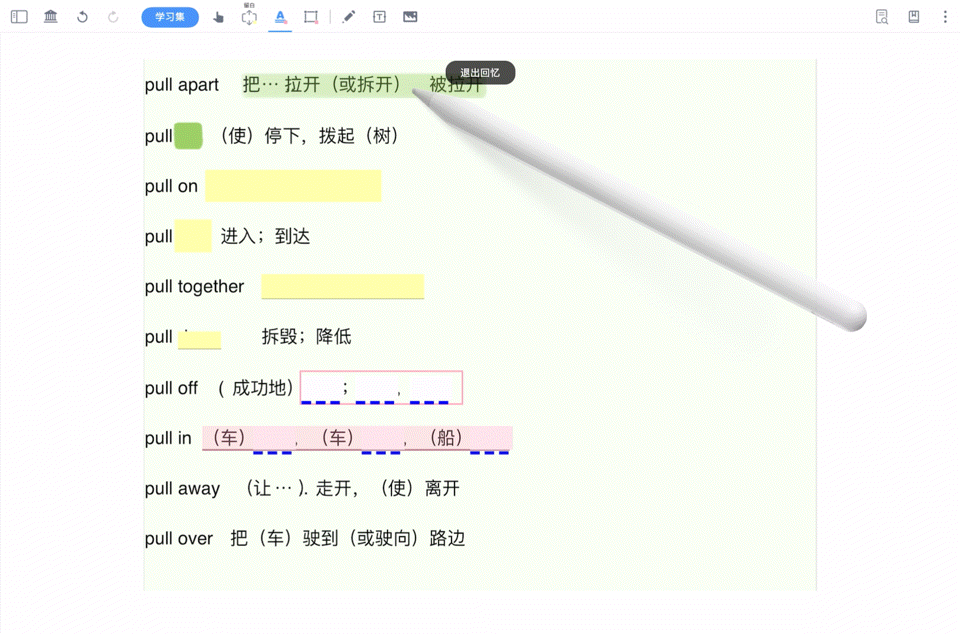

# 3 如何进行遮挡（回忆的具体内容）

## 3.1 整体遮挡

### 3.1.1 开启`摘录遮挡`后，对摘录内容进行整体遮挡

- 单击`文本摘录工具`/`矩形摘录工具`/`套索摘录工具`其一，进行摘录

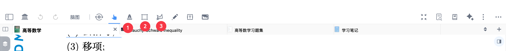

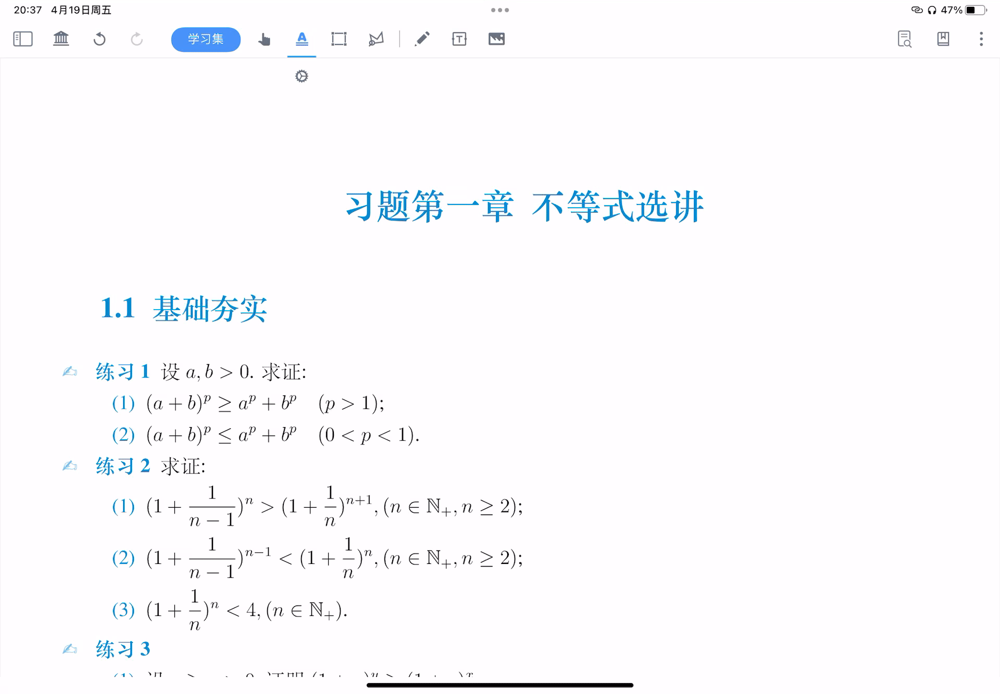

### 3.1.2 开启/关闭摘录遮挡

- 单击已**摘录区域内容**，在上弹菜单栏中单击`基础-更多`，开启/关闭`摘录遮挡`

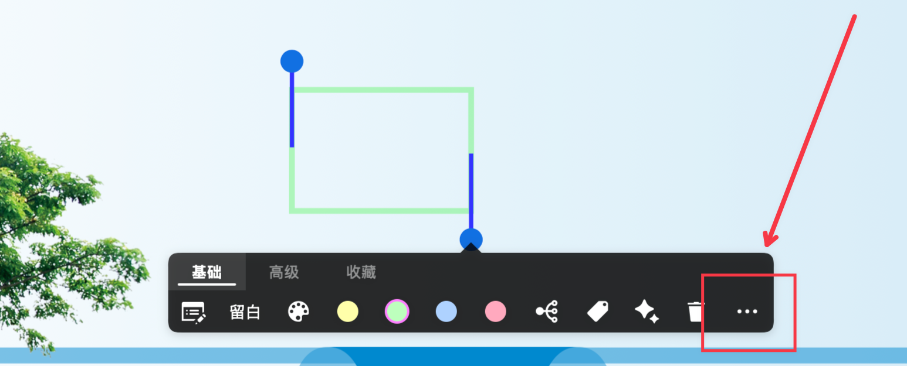

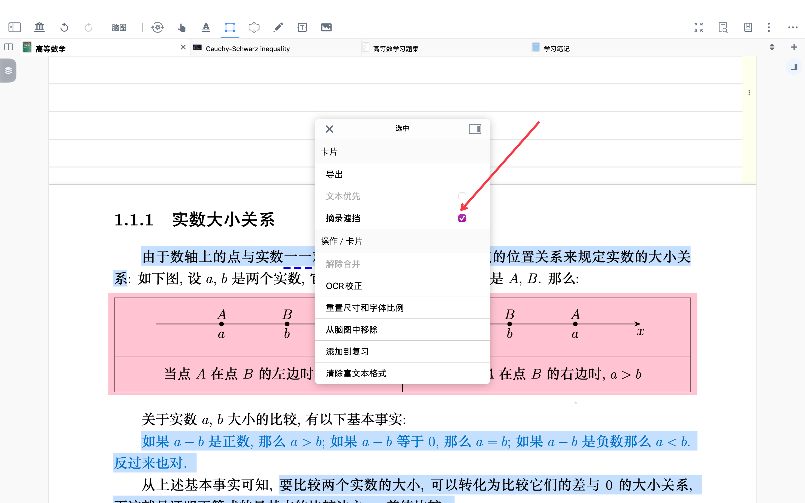

## `3.2 划重点`遮挡

- 点击`矩形摘录工具`/`文本摘录工具`，开启`划重点`后对想要的区域进行摘录，摘录后点击想要遮挡的字符

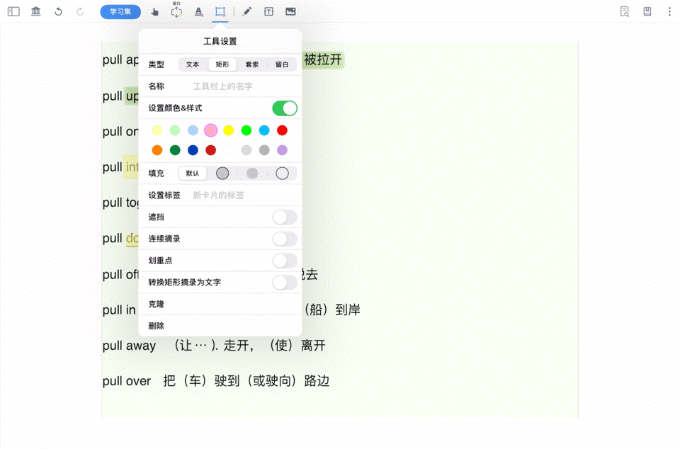

> 💡划重点遮挡与摘录遮挡的区别
>
> 1. **`划重点遮挡`**
>
> - 以摘录内容为基础，通过在摘录内部“划出重点”区域，对重点部分进行遮挡处理。最终呈现的效果是：**重点内容仍处在完整语境中，便于理解前后逻辑。**
> - 在卡片加入复习时，会自动保留上下文，并按“划重点挖空”的方式生成对应的复习卡片。
> - 适用场景：专业课背诵、概念讲解、逻辑性强的知识点学习等**需要依赖上下文**的内容。
>
> \*\*2. \*\***`摘录遮挡`**
>
> - 遮挡作用于摘录的全部内容，可为一小段文字、单个词语、公式、图片等。生成的卡片**仅呈现被摘录的部分**，不包含原文中前后句的语境。
> - **适用场景**：名词解释、术语记忆、独立公式、图示摘录等**不依赖上下文**的内容。

## 3.3 三种挖空遮挡方式

### 3.3.1 手写荧光笔

选中手形工具-文档，切换`荧光笔`后，对想要遮挡的文本/图片区域画写

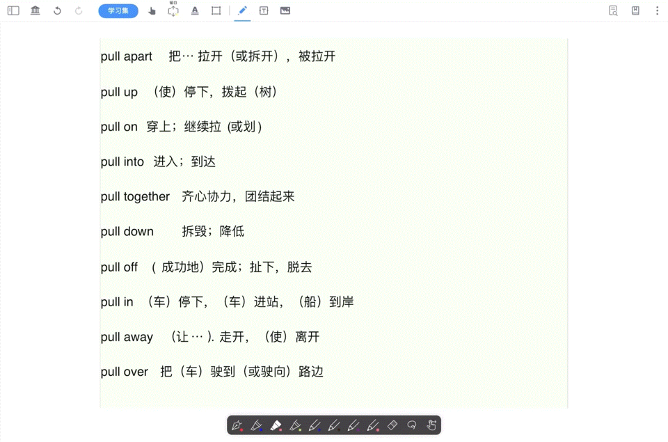

### `3.3.2 矩形摘录`与`套索摘录`

- 点击`矩形摘录工具`/`套索摘录工具`，开启摘录遮挡后，对**文本/图片/手写批注**区域进行遮挡

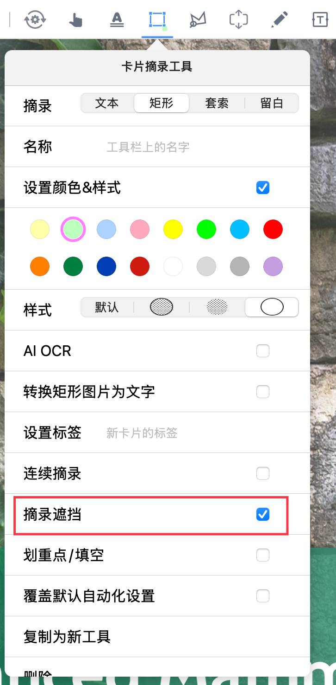

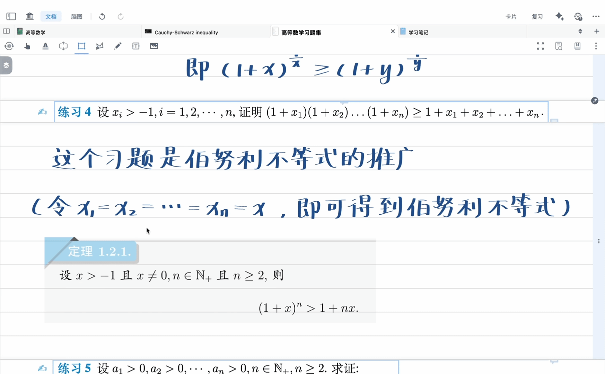

### `3.3.3 文本摘录`

点击`文本摘录工具`，开启`摘录遮挡`后，对想要的文本区域进行遮挡

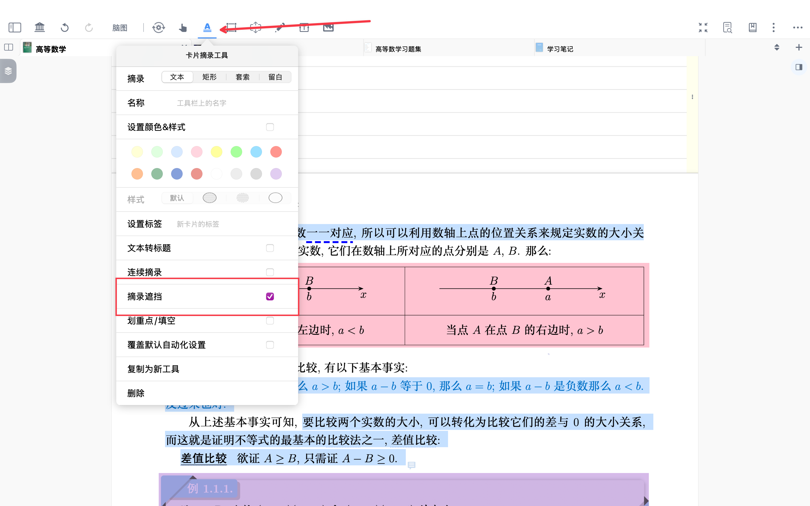

