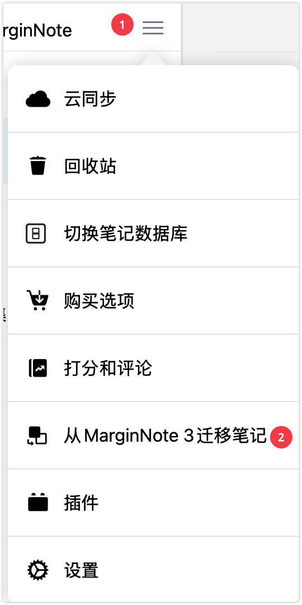

# 从MarginNote 3 迁移笔记

> 💡MarginNote4 支持从MarginNote3 快速迁移笔记。如果数据库较大，建议采取手动迁移的方式进行数据迁移

> 💡**备份数据只能向下兼容**
>
> 4可以完美读取3的笔记备份，但是反之，3在读取4的笔记备份内容时，新的笔记类型不支持显示，且可能导致数据丢失。

# 1 迁移所有笔记（全部笔记数据+文档）

## 1.1 一键迁移

> 💡**前提条件：设备已安装MarginNote 3，且MN3版本为3.7.26或更高**

在满足前提条件的基础上，打开MN4主界面侧边栏，点击菜单按钮-`从MarginNote 3迁移笔记`，即可完成一键迁移。

> 💡迁移前需确保剩余存储空间大于数据库大小的2倍。如果数据库过大，迁移所需要的时间会比较久，此时建议采取[手动迁移](https://www.wolai.com/gaqm2hZ9YMPQSFpWQjLJ9g#qJmK9xbUo49yhh1sU7u1nr "手动迁移")

## 1.2 手动迁移

1. 在MarginNote 3中，点击首页下方的“...”更多按钮
2. 随后在弹出的子页面点击`设置`
3. 点击设置中的`备份与恢复`
4. 选择`备份笔记数据库和全部文档`
5. 将 第4步中的备份文件导入到 MN4
   1. **Mac 端**：点击`在其他应用中打开`，将备份文件保存到本地，使用Marginnote4打开备份文件(右键点击文件，打开方式选择MN4)
   2. **iPad端**：点击`在其他应用中打开`，选择MarginNote 4，数据库建议选择替换（MarginNote4无笔记数据的情况下）。

# 2 迁移指定学习集（该学习集的笔记数据+文档 ）

在MarginNote 3的目标学习集中导出学习集备份（ \*.marginpkg），然后发送到 MarginNote 4。

