# 第三方应用联动②：Obsidian+MN4

***

> 💡使用Obsidian-Bridge插件（MarginNote端）与MarginNote Companion插件（Obsidian）可以实现**笔记在MarginNote到Obsidian之间的传输**。用户可以在Marginnote中创建笔记，然后轻松将其同步到Obsidian中，以便用户在 Obsidian 中利用双向链接、图谱视图深化理解和连接知识，构建统一、互联、可生长的个人知识库。
>
> [ 【第三方MN插件】Obsidian-Bridge（Markdown动态导出）——连接两个知识星球 #Ver.3.0.0 已获官方签名# - #162，来自 Deanlzy - 插件发布区｜允许不受限制地编辑更新主帖 - MarginNote 中文社区 Obsidian BridgeObsidian Bridge 插件架起了 MarginNote 通往 Obsidian 的桥梁，通过它，我们可以把在 MarginNote 中积累的写作素材/创作灵感导入到 Obsidian 中，使用 Ma\&hellip; https://bbs.marginnote.com.cn/t/topic/21235/162](https://bbs.marginnote.com.cn/t/topic/21235/162 " 【第三方MN插件】Obsidian-Bridge（Markdown动态导出）——连接两个知识星球 #Ver.3.0.0 已获官方签名# - #162，来自 Deanlzy - 插件发布区｜允许不受限制地编辑更新主帖 - MarginNote 中文社区 Obsidian BridgeObsidian Bridge 插件架起了 MarginNote 通往 Obsidian 的桥梁，通过它，我们可以把在 MarginNote 中积累的写作素材/创作灵感导入到 Obsidian 中，使用 Ma\&hellip; https://bbs.marginnote.com.cn/t/topic/21235/162")

# 1 插件安装与配置

## 1.1 安装 MarginNote 插件：Obsidian-Bridge

- 插件下载链接：

  [  https://bbs.marginnote.com.cn/uploads/short-url/8IJ9ATwDfjc1gin61T3n0MGcDsa.mnaddon](https://bbs.marginnote.com.cn/uploads/short-url/8IJ9ATwDfjc1gin61T3n0MGcDsa.mnaddon "  https://bbs.marginnote.com.cn/uploads/short-url/8IJ9ATwDfjc1gin61T3n0MGcDsa.mnaddon")
- 安装方式：如何安装一款插件？
- 插件配置：插件安装好后无须配置

## 1.2 安装Obsidian插件：MarginNote Companion

- &#x20;插件下载链接：
  - 适用于MarginNote3

    [  https://github.com/aidenlx/marginnote-companion](https://github.com/aidenlx/marginnote-companion "  https://github.com/aidenlx/marginnote-companion")
  - 适用于MarginNote4

    [   https://github.com/pazerW/marginnote-companion/releases](https://github.com/pazerW/marginnote-companion/releases "   https://github.com/pazerW/marginnote-companion/releases")
- 安装方式：
  1. 打开Obsidian设置
  2. 点击`第三方插件`
  3. 关闭`安全模式`
  4. 打开`插件文件夹`
  5. 将下载好的插件解压缩后连同文件夹移动到打开的插件文件夹
     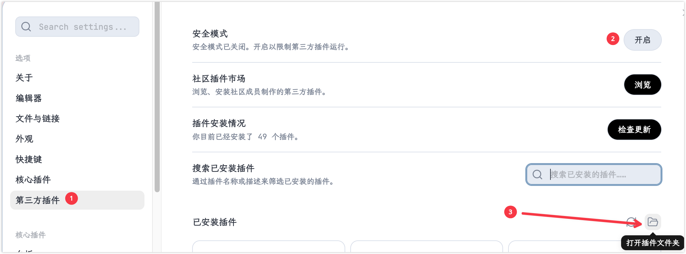
- 插件配置：插件安装好后可以使用默认模板，也可以根据MarginNote companion插件手册根据需要自行配置

  [Templates · aidenlx/marginnote-companion Wiki · GitHub An Obsidian plugin to bridge MarginNote 3 and Obsidian.md - Templates · aidenlx/marginnote-companion Wiki https://github.com/aidenlx/marginnote-companion/wiki/Templates](https://github.com/aidenlx/marginnote-companion/wiki/Templates "Templates · aidenlx/marginnote-companion Wiki · GitHub An Obsidian plugin to bridge MarginNote 3 and Obsidian.md - Templates · aidenlx/marginnote-companion Wiki https://github.com/aidenlx/marginnote-companion/wiki/Templates")

# 2 插件使用

> 💡插件支持两种数据导入方式，可以基础摘录和目录树结构

## 2.1 基础摘录导入

> 💡一次导入支持单张卡片或手形工具选区
>
> - 单张卡片：支持文字、图片，不支持卡片内手写
> - 选区：支持文字，不支持图片，矩形框选会自动OCR

1. 打开MarginNote4，进入学习集后，点击插件图标，启动Obsidian-Bridge插件。

   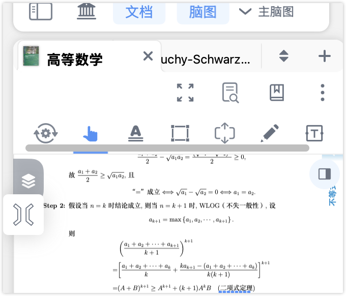
2. 此时点击卡片/使用手型工具框选内容，插件都会复制笔记信息
3. 在Obsidian中导入笔记数据
   - **自动粘贴**：按下自动粘贴功能开关（默认快捷键⌘+R，也可在obsidian的快捷键配置页面自行配置），打开自动粘贴模式后，只需要Obsidian保持在后台，在MarginNote点击或框选的内容会自动导入Obsidian。

> 💡推荐使用自动粘贴模式

## 2.2 目录树导入 (TOC Mode)

> 💡适合想要将整本书的结构快速搬运到Obsidian时使用，仅支持文字，不支持卡片中的图片和手写内容导入。

1. 打开MarginNote4，进入学习集后，点击插件图标，启动Obsidian-Bridge插件，启动后再次点击插件，进入插件模式设置

   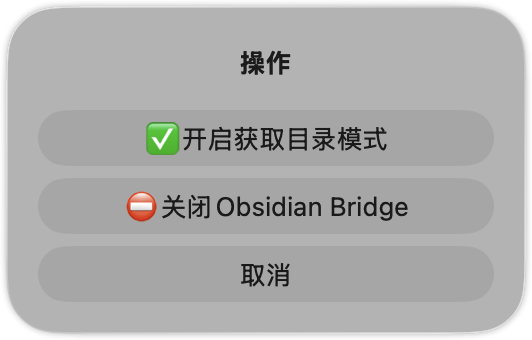
2. 点击`✅开启目录获取模式`
3. 点击想导入的脑图部分最高层级的卡片

   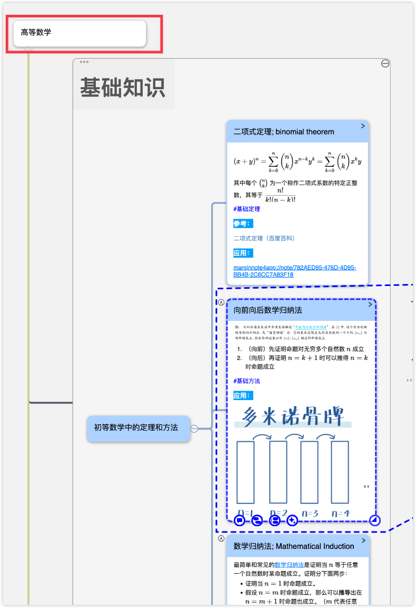
4. 在Obsidian中导入笔记数据
   - **手动粘贴：**   在 Obsidian中按下粘贴键 (⌘+V)。
   - **命令粘贴：** 使用 OB 的命令面板，按下⌘+P（obsidian命令面板默认快捷键）。检索到MarginNote Companion插件命令，选择`目录（default模板）插入当前笔记`

     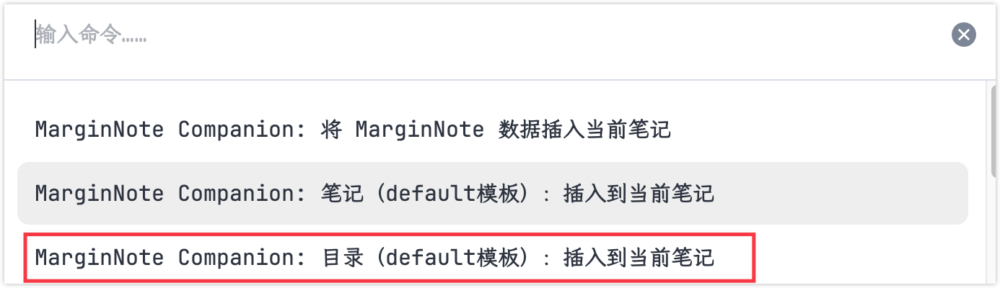
   - **自动粘贴**：按下自动粘贴功能开关（默认快捷键⌘+R，也可在obsidian的快捷键配置页面自行配置），打开自动粘贴模式后，只需要Obsidian在后台，在MarginNote点击或框选的内容会自动导入Obsidian。

# 3 效果展示

> 💡下面效果展示基于自定义模板，相比于默认模板使用Callout进行了样式美化与层级显示优化，欢迎学习者们在论坛分享自己的自定义模板
>
> [MarginNote 中文社区 - 倍化效率，分享经验，传播爱书者的精神 阅读笔记软件MarginNote——产品用户反馈社区   京ICP备17035497号-1 https://bbs.marginnote.com.cn/](https://bbs.marginnote.com.cn/ "MarginNote 中文社区 - 倍化效率，分享经验，传播爱书者的精神 阅读笔记软件MarginNote——产品用户反馈社区   京ICP备17035497号-1 https://bbs.marginnote.com.cn/")

## 3.1 选中文本

```markdown 
> [!QUOTE] 摘录
> {{Selection}}
> 🔖《{{DocTitle}}》

```


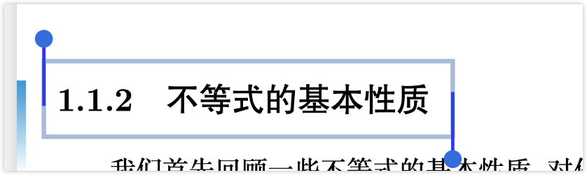

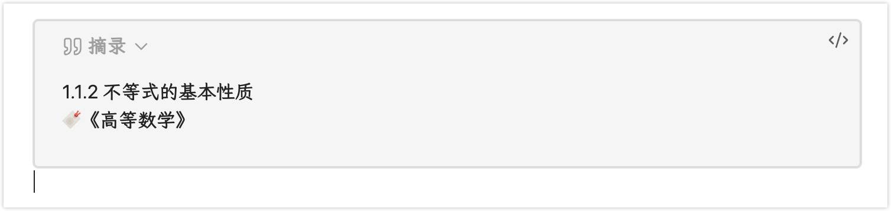

## 3.2 笔记

```markdown title="笔记正文"
# {{#Title}}{{Title}}{{/Title}}{{^Title}}无标题{{/Title}} {{Link}}
> [!NOTE]
{{#Excerpt}}> {{Excerpt}}
{{/Excerpt}}{{> Comments}}
```


```markdown title="注释"
{{#Text}}>
> {{Text}} {{Link}}{{/Text}}
```


```markdown title="合并的笔记"
>
> {{Excerpt}} {{Link}}
```


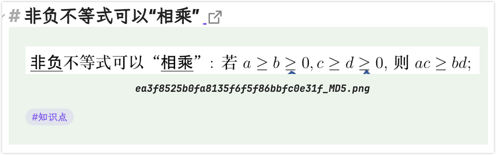

## 3.3 目录

```markdown 
# {{#Summary.Title}}{{Summary.Title}}{{/Summary.Title}}{{^Summary.Title}}原文{{/Summary.Title}} 
{{#Summary.Excerpt}}> [!NOTE] {{Link}}
> {{Summary.Excerpt}}{{#Summary.Comments}}
>
> 📝 **评论**：{{Summary.Comments}}{{/Summary.Comments}}{{/Summary.Excerpt}}{{^Summary.Excerpt}}{{#Summary.Comments}}> [!NOTE] {{Link}}
> 📝 **评论**：{{Summary.Comments}}{{/Summary.Comments}}{{/Summary.Excerpt}}
```


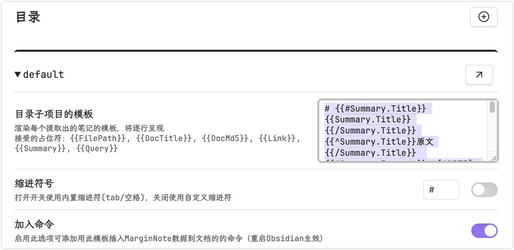

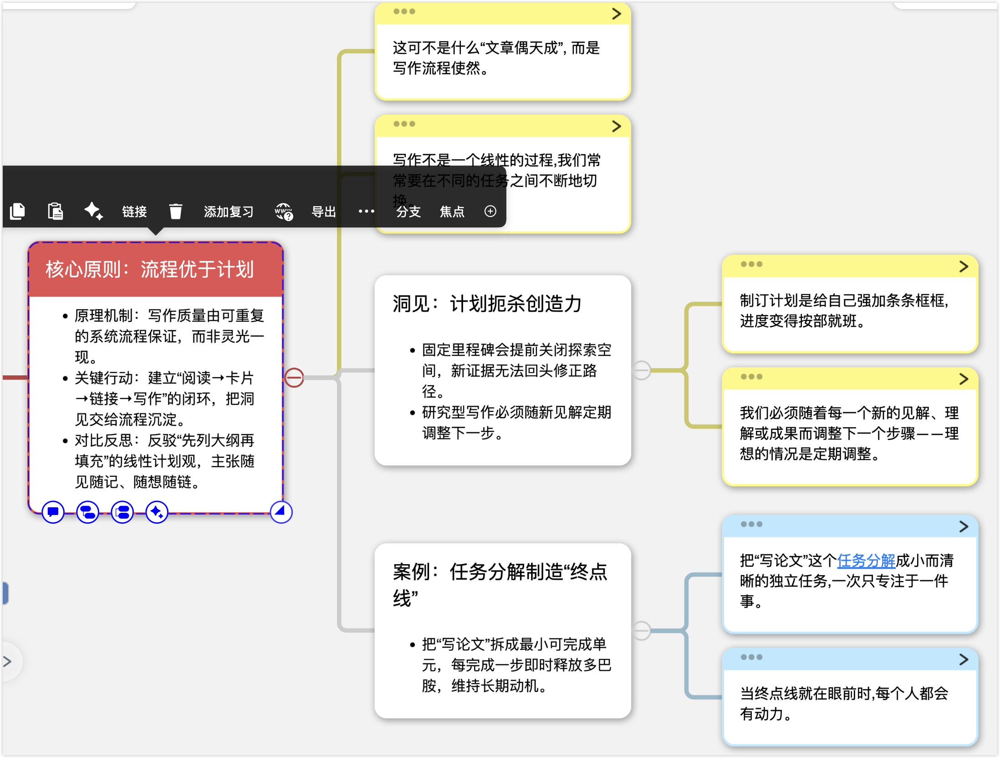

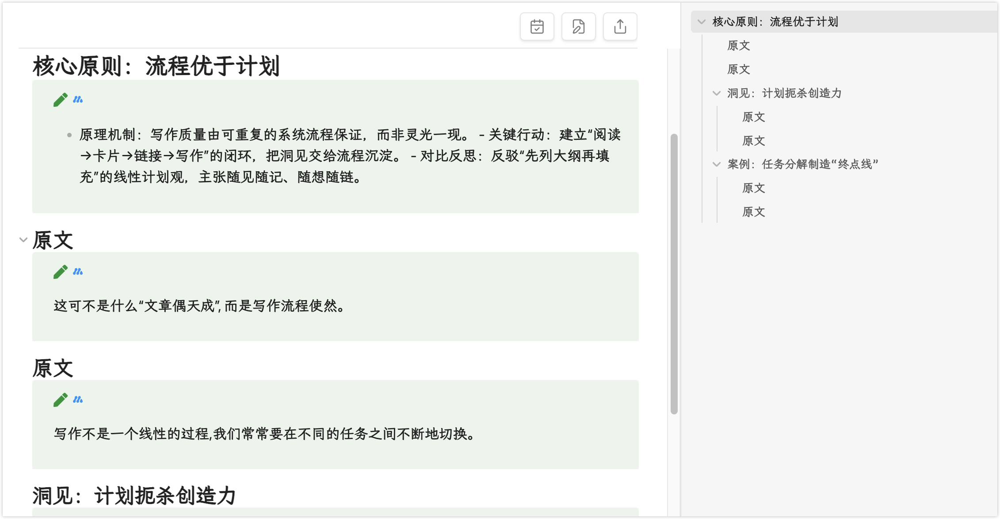
