# 沉浸模式

> 💡**沉浸模式（Immersive Mode）**
>
> 沉浸模式下，工具栏被简化、界面干净整洁，实现最大利用屏幕空间，专为“长时间、连续、专注地处理摘录内容”设计。
>
> 当你不想被无关的按钮、菜单打断、希望稳定推进学习与工作时，就该进入沉浸模式。

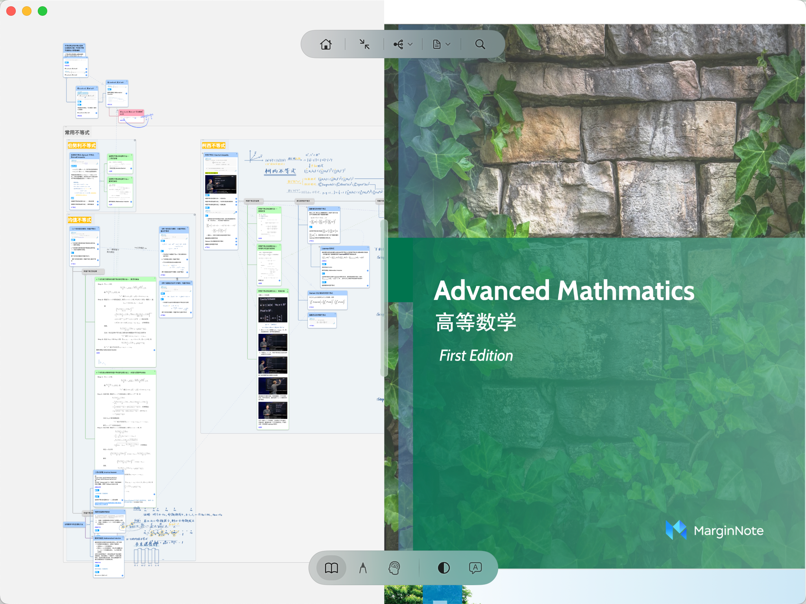

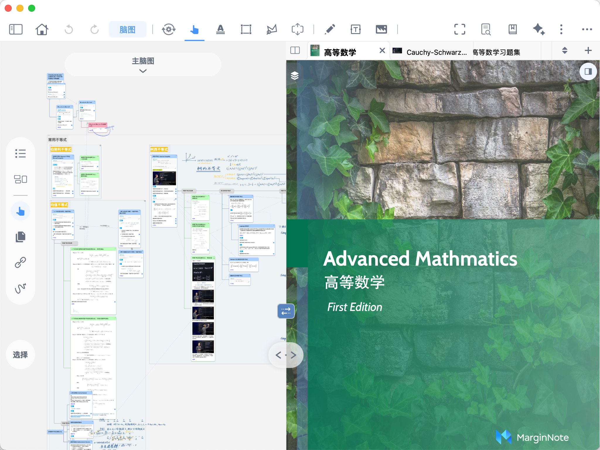

***

# 1 进入沉浸模式

可以通过点击`文档设置区`的`沉浸模式`图标，进入`沉浸模式`。系统状态栏、顶部导航栏、第一标签页栏、文档工具栏+文档设置区、以及文档滚动条等都被隐藏，显著提升了屏幕利用效率。

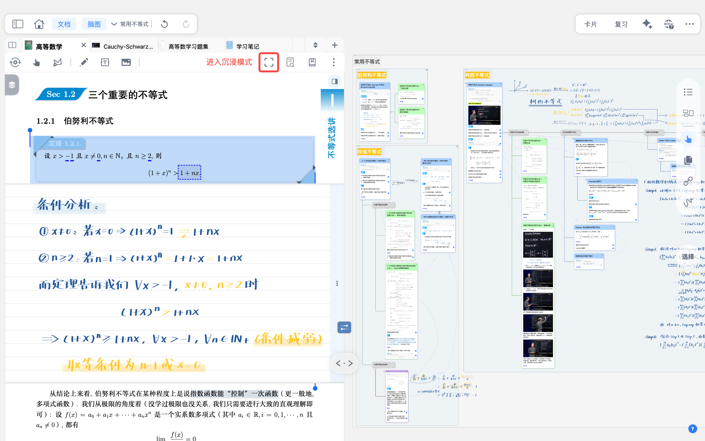

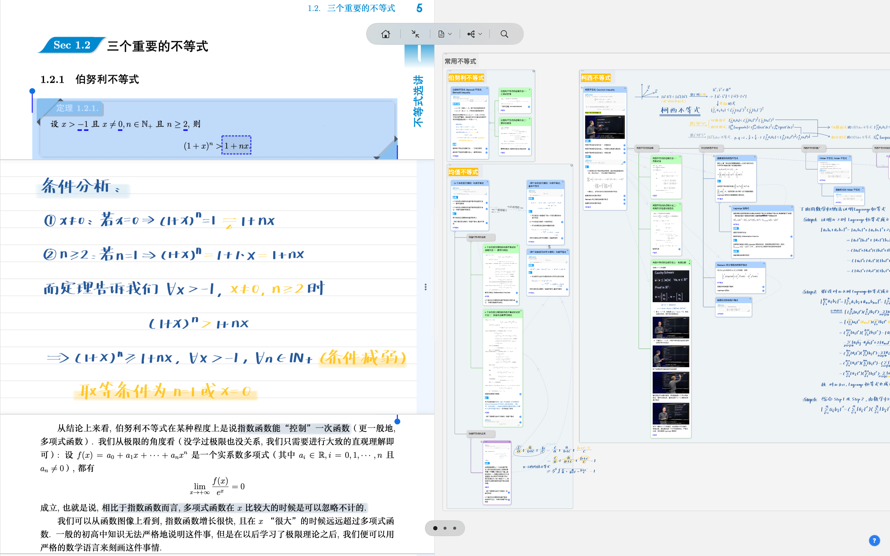

# 2 沉浸模式功能介绍

## 2.1 沉浸模式的工具栏介绍

`沉浸模式`下，工具栏被简化为`顶部工具栏`+`底部工具栏`。

### 2.1.1 顶部工具栏

`书架`：回到MarginNote4 首页。

`退出沉浸模式`：回到经典模式布局。

`文档`：开关/切换当前显示的文档。

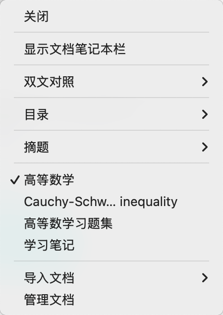

`脑图`：开关/切换当前显示的脑图。

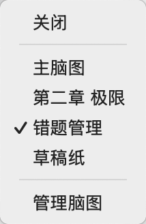

`搜索`：搜索或浏览目录，或在脑图/文档中查找输入的关键词。

### 2.1.2 底部工具栏

`沉浸模式`下，`底部工具栏`会跟据模式不同而有所变化。

#### 2.1.2.1 阅读模式工具栏

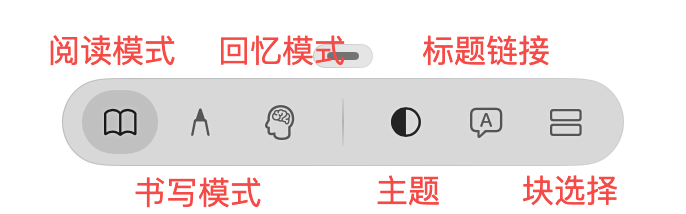

`主题`：通过连续点击主题切换键，可依次在白色、棕褐色、灰色、暗黑色主题间切换，具体效果可参见主题颜色。

`标题链接`：当前学习集开启/关闭标题链接，具体功能介绍详见[卡片链接④|关键词标题链接：打造你的个人字典](https://www.wolai.com/aBEbDgL6oDgDT4CeXotdbS "卡片链接④|关键词标题链接：打造你的个人字典")。

`块选择`：区块选择浓缩（默认开启辅助摘录功能）：识别PDF文本块，支持批量选中多段选区。

#### 2.1.2.2 书写编辑模式工具栏

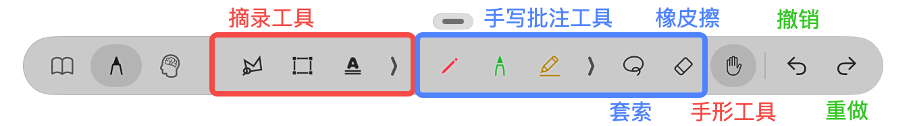

`摘录工具`：各摘录工具的功能介绍详见四大摘录工具，在`>更多摘录工具`里可以调整工具排列顺序。

`手写批注工具`：笔刷 +套索+橡皮擦，各手写批注工具的功能介绍详见[手写： 在文档、脑图、卡片中自由书写](https://www.wolai.com/pYzC5dfXtbC7taLgQC3DFs "手写： 在文档、脑图、卡片中自由书写")。

`手形工具`：拖动脑图画布、浏览文档页面，功能介绍详见[手形工具弹出菜单栏及其自定义](https://www.wolai.com/iLGrRDRMEQepittcNY4Bun "手形工具弹出菜单栏及其自定义")，在`>更多笔刷`里可以调整笔刷排列顺序。

`撤销`与`重做`：退回或者重做上一步骤。

#### 2.1.2.3 回忆模式工具栏

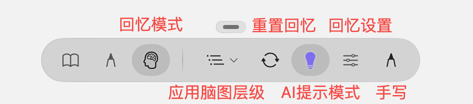

`应用脑图层级`：`回忆模式`下，脑图可按需求显示卡片层级。

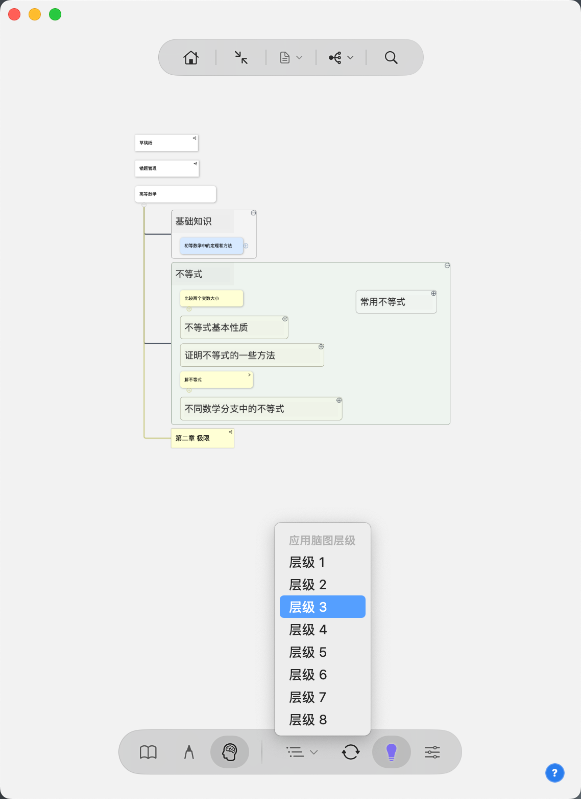

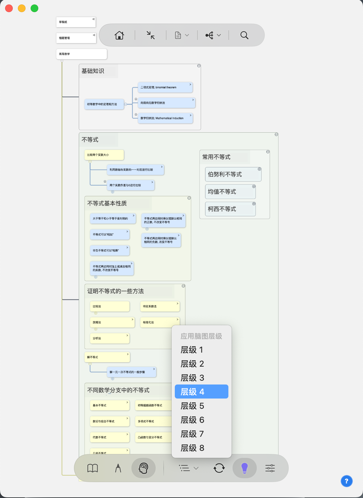

`重置回忆`：在`回忆模式`下，随机揭开遮挡/划重点/脑图卡片后，可通过此按键重置到回忆模式初始状态。

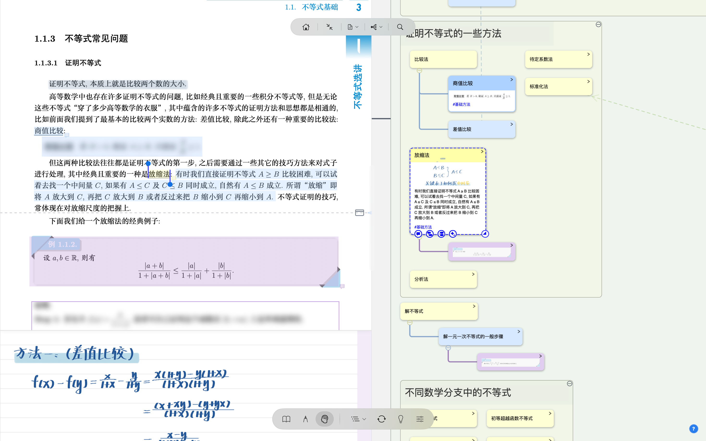

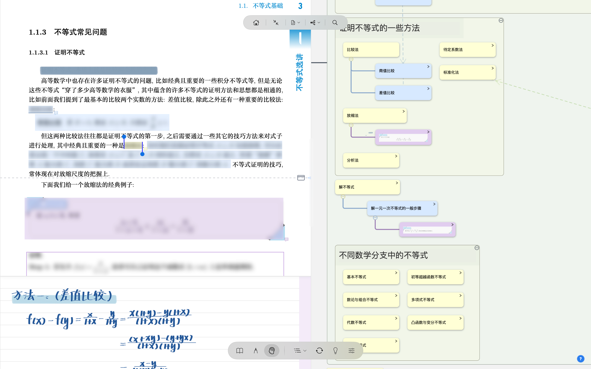

`关闭AI提示`：点遮挡内容会直接揭开。

`启用AI提示`：遮挡内容会先打开AI提示。

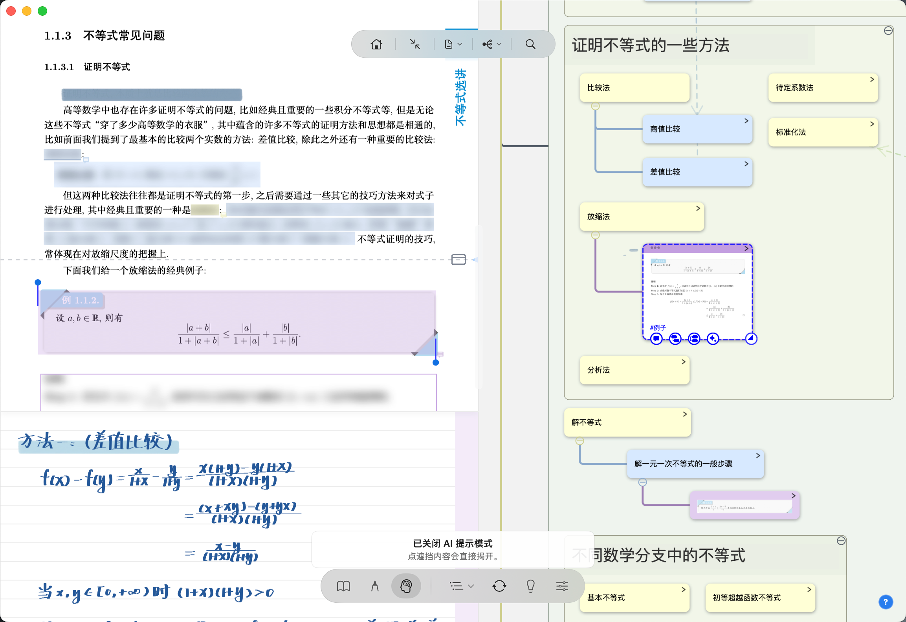

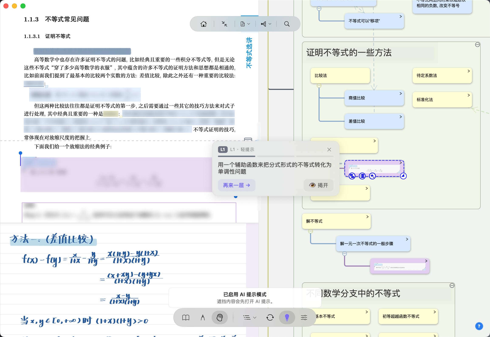

`回忆模式设置`：可对回忆区域、AI提示进行个性化设置。

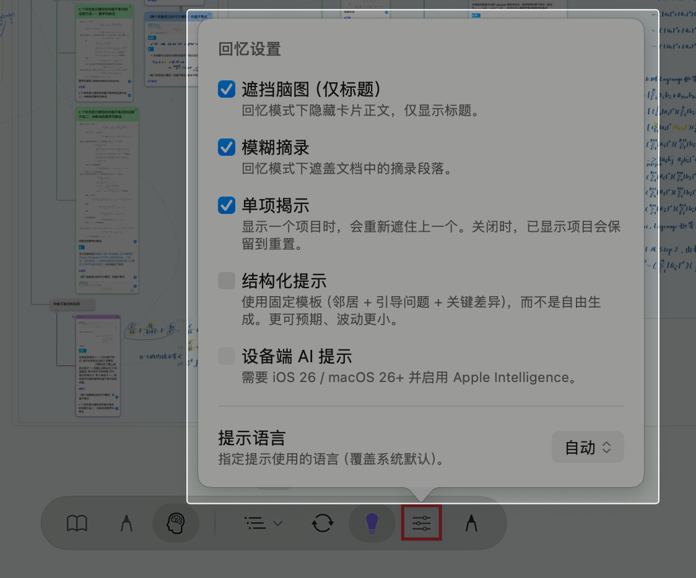

`遮挡脑图（仅标题）`：`回忆模式`下隐藏卡片正文，仅显示标题。

`模糊摘录`：`回忆模式`下遮盖文档中的摘录段落。

`单项揭示`：显示上一项目时，会重新遮住上一个。关闭时，已显示项目会保留到重置。

`结构化提示`：使用固定模板（邻居+引导问题＋关键差异），而不是自由生成。更可预期、波动更小。

`设备端 AI 提示`：需要 iOS 26 / macOS 26 + 并启用 Apple Intelligence。

`提示语言`：指定提示使用的语言（覆盖系统默认），提示语言可在自动（跟随系统）/简中/繁中/英语/英语/日语/韩语/西班牙语/法语/德语间切换。

`手写工具`：支持在`回忆模式`下手写。

#### 2.1.2.4 底部工具栏的简化

`底部工具栏`支持收起为三点小控件，进一步减少界面遮挡。

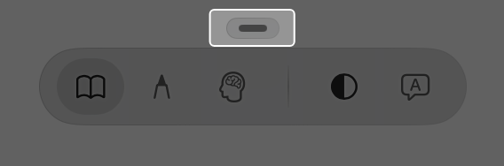

## 2.2 沉浸模式下调整文档/脑图视图比例

按住文档与脑图的分界处，向两边移动，即可快速调整文档/脑图视图比例。

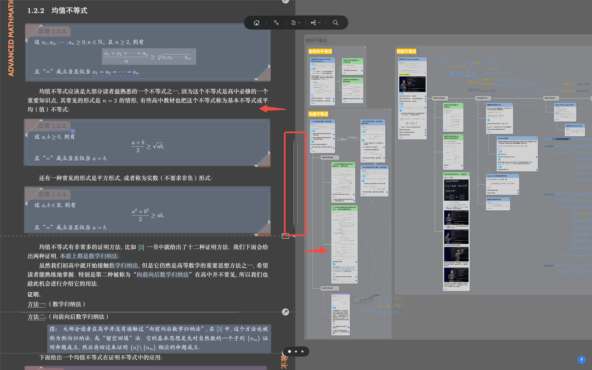

## 2.3 沉浸模式下的研究浏览器

在`沉浸模式`下，为选中文字、文档摘录、脑图卡片打开`研究浏览器`面板，可以浮动窗口形式呈现，窗口大小可调节，方便边阅读边查找资料。`研究浏览器`具体功能可参考[研究浏览器视图](https://www.wolai.com/sSYs886ZU4gfwVhuBgzNaV "研究浏览器视图")。

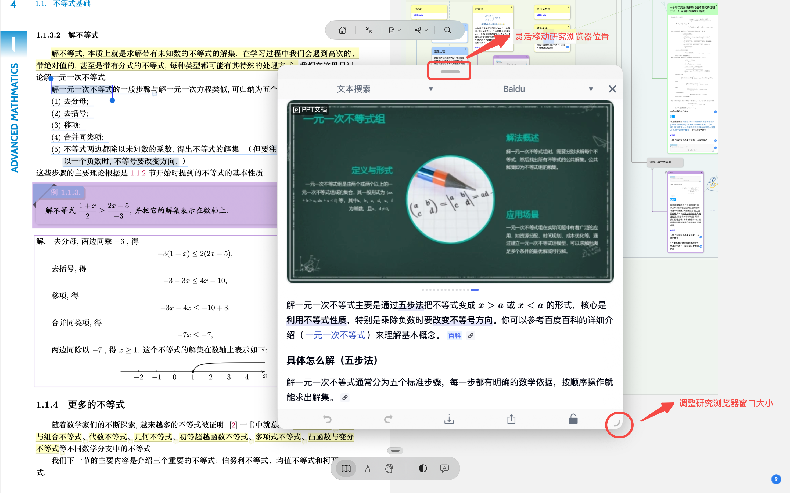

## 2.4 沉浸模式下的文档侧边定位条（竖向翻页）

`竖向翻页`&`沉浸模式`下，通过文档`侧边定位条`，可拖动快速跳页，拖动时显示页码，阅读时自动淡出。

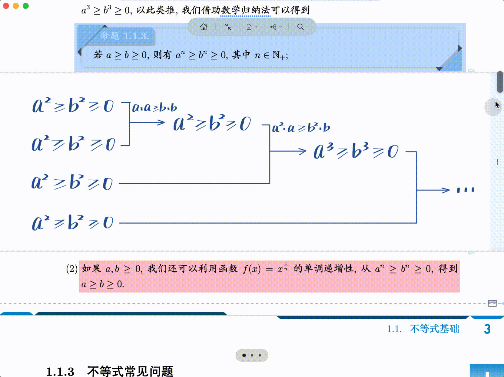

# 3 退出沉浸模式

通过点击`顶部工具栏`的`退出沉浸模式`图标，`退出沉浸模式`，返回经典模式布局。

