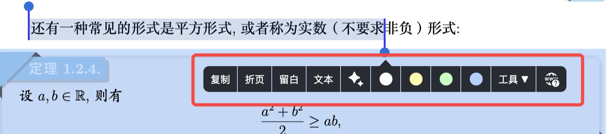
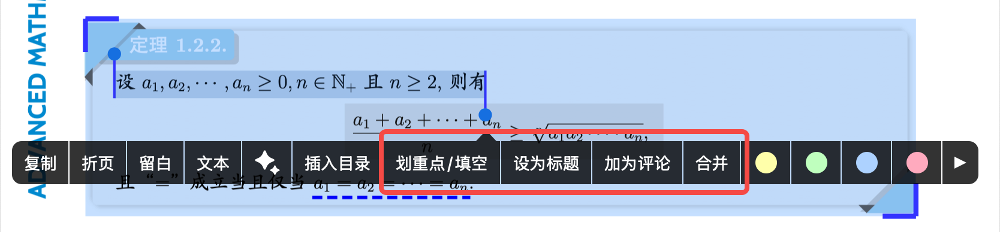
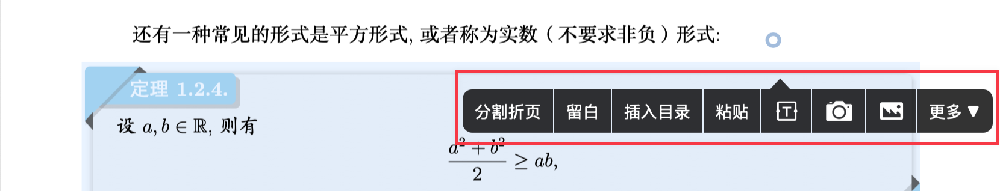
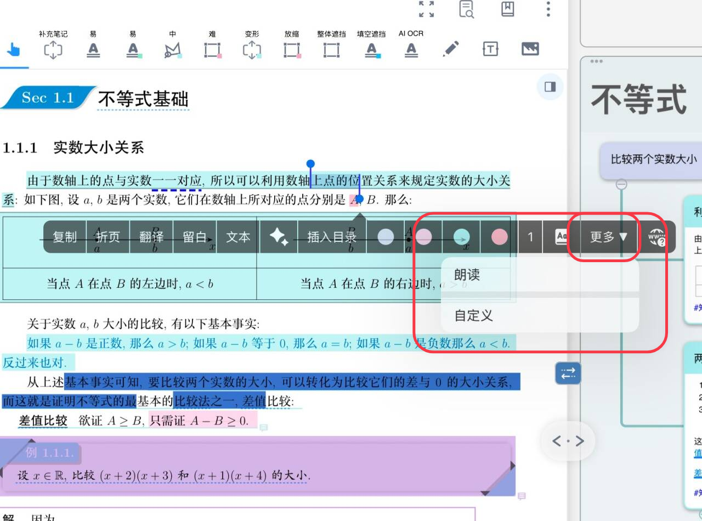
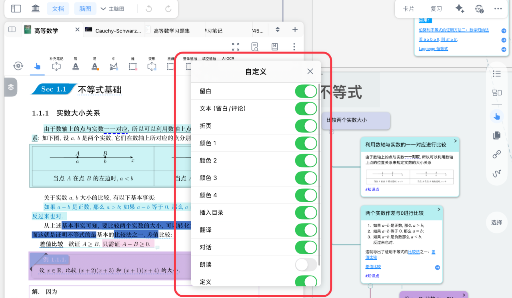
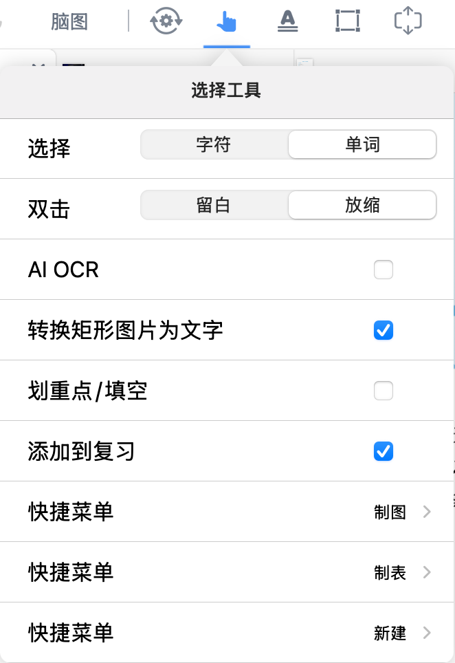
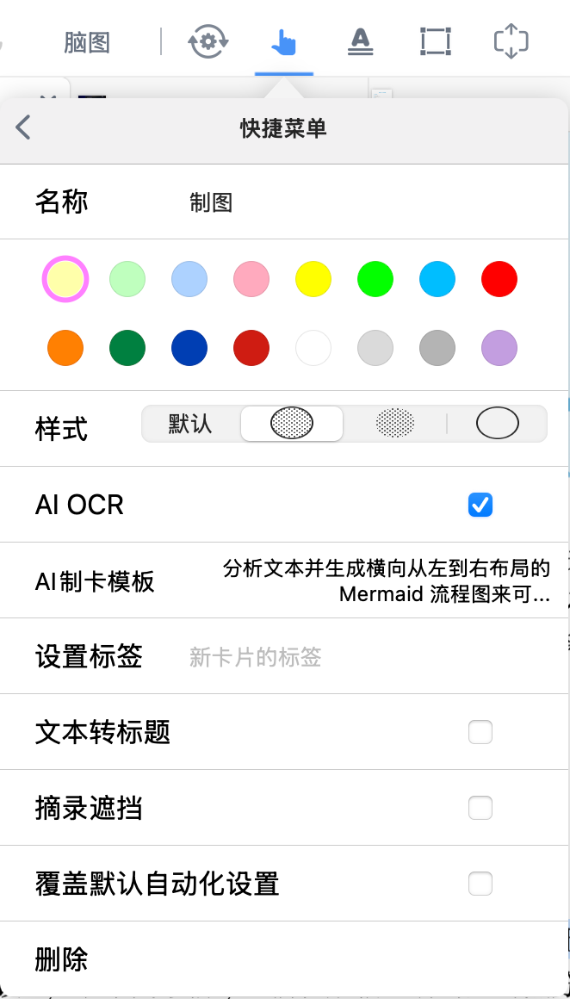
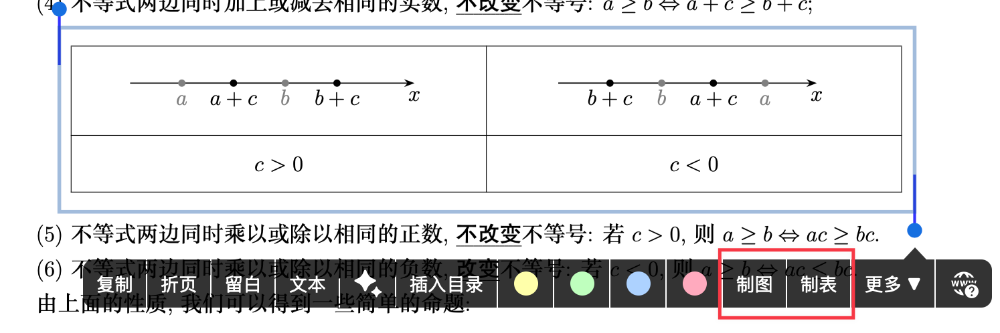

# 手形工具弹出菜单栏及其自定义

> 💡**手形工具：一个菜单栏，搞定所有操作**
>
> [手形工具-文档](https://www.wolai.com/5TZDgoQjGt95vdiTYiXAnD "手形工具-文档")
>
> **核心能力**：当你选中文档中的文字或区域时，手形工具会自动弹出快捷菜单，让你**原地完成**复制、摘录、留白、翻译、提问等操作，无需在工具栏来回切换。
>
> **智能识别**：手形工具能自动区分你选中的是**文字**还是**图片/区域**，并只显示当前可用的功能
>
> **典型场景**：
>
> - 你在阅读PDF时，看到一段重要定义 → 选中文字 → 点击`留白` → 在留白中进行手写批注。
> - 你看到一段摘录，想把摘录中的某段话设为这个摘录的标题 → 先选中已有的摘录卡片 → 再选中那段话 → 点击`设为标题`。
> - 你需要在页面空白处添加图片 → 长按空白处 → 选择`图片`。

# 1 3种方式调出手形工具菜单栏

选中手形工具后，有3种方式调用：

| 操作方式                | 操作步骤                                  | 菜单用途                            | 典型场景          |
| ------------------- | ------------------------------------- | ------------------------------- | ------------- |
| **直接选区**​           | 拖拽选中一段文字或一个矩形区域 → 菜单弹出                | 对选区进行摘录、复制、翻译等                  | 快速摘录教材中的定义或图表 |
| **先选中摘录（卡片），再选区域**​ | ① 单击选中文档中某个已有的摘录卡片② 再选中新的文字/区域 → 菜单弹出 | 将新内容设为摘录（卡片）的标题、评论，或合并到已有摘录（卡片） | 为某道错题添加解析作为评论 |
| **长按空白处**​          | 在页面空白区域长按（直到出现蓝色圆圈）→ 菜单弹出             | 插入留白、文本框、图片、目录等                 | 在章节末尾添加总结性笔记  |

> ⚠️**注意**：菜单中显示的功能选项会根据当前操作对象自动变化。例如：长按空白处时，不会出现“设置颜色”选项（因为没有摘录可设置颜色）。

# 2 手型工具菜单栏功能速查表

## 2.1 对文字/图片选区进行操作（直接选区时出现）

| 功能                                                                | 作用                      | 备注                                                                                                                                  | 是否支持自定义 |
| ----------------------------------------------------------------- | ----------------------- | ----------------------------------------------------------------------------------------------------------------------------------- | ------- |
| 复制                                                                | 将选中的文字或图片复制到剪贴板         | 文字复制为纯文本，图片复制为图片，可粘贴到其他App                                                                                                          |         |
| 折页                                                                | 将选区“折叠”成一条虚线            | 适合隐藏大段原文，保持文档清爽。详情参考：\[书页折叠]\(<https://www.wolai.com/3ceKFREpJyZRZRqk6WgGjM> "书页折叠")                                                | ✅       |
| 留白                                                                | 在此处插入一块空白的笔记空间，可以手写批注。  | 最常用的功能，适合做手写笔记  详情参考\[留白①\|基础操作：字里行间自由开辟笔记空间]\(<https://www.wolai.com/vYi6Yu4oCudNCr2zDuNQkj> "留白①\|基础操作：字里行间自由开辟笔记空间")             | ✅       |
| 文本                                                                | 在此处插入一块空白的笔记空间，可输入文字。   | 最常用的功能，，适合需要打字的批注。  详情参考\[留白①\|基础操作：字里行间自由开辟笔记空间]\(<https://www.wolai.com/vYi6Yu4oCudNCr2zDuNQkj> "留白①\|基础操作：字里行间自由开辟笔记空间")         | ✅       |
| 翻译                                                                | 翻译选区内容，并自动以留白形式贴在旁边     | 阅读外文文献利器                                                                                                                            | ✅       |
| \[向AI提问]\(<https://www.wolai.com/rcKVh1HiKybKzJrNveYMWa> "向AI提问") | 弹出ai 提问浮窗，将选区作为问题发送给 AI | 可让AI解释概念、总结要点。  详情参考\[认识提问浮窗（Ask）：在文档和脑图中就地向 AI 提问]\(<https://www.wolai.com/b2MDrDqhWt8LGrmSQD2JYo> "认识提问浮窗（Ask）：在文档和脑图中就地向 AI 提问") | ✅       |
| 插入目录                                                              | 将选区的文字作为目录标题，插入到文档目录    |                                                                                                                                     | ✅       |
| OCR                                                               | 对图片选区进行文字识别，并复制识别结果     | 仅限框选。  适合扫描版PDF中的图片文字                                                                                                               | ✅       |
| 选择颜色                                                              | 生成摘录（卡片）并选择摘录（卡片）的颜色    | 最常用的功能                                                                                                                              | ✅       |
| \[定义]\(<https://www.wolai.com/4wy1k45k3mtCZDMoxc6F9k> "定义")       | 查询ios内置词典中的定义           | 仅限文本                                                                                                                                | ✅       |
| \[朗读]\(<https://www.wolai.com/m9otTYiGuLUW3YkwewfuWM> "朗读")       | 朗读选区内容（图片会先OCR再朗读）      |                                                                                                                                     | ✅       |
| \[研究]\(<https://www.wolai.com/7AXUEU5B5UUuEGW1m7oZ9z> "研究")       | 在浏览器中搜索选区内容             | 适合快速查资料  详情参考\[检索③：文档与研究浏览器联动]\(<https://www.wolai.com/nfvG3Hah2KmZUXGaD4UJh1> "检索③：文档与研究浏览器联动")                                    |         |

## 2.2 已有摘录卡片+新选区时出现（先选中卡片，再选区）

| 功能   | 作用                    | 是否支持自定义 |
| ---- | --------------------- | ------- |
| 设为标题 | 将新选区的内容设置为当前摘录（卡片）的标题 | ✅       |
| 加为评论 | 将新选区的内容添加为当前摘录（卡片）的评论 | ✅       |
| 合并   | 将新选区合并进当前摘录（卡片）       | ✅       |

## 2.3 长按空白处弹出的菜单栏

| 功能                                                                               | 作用                                    | 备注                                                                                                         | 是否支持自定义 |
| -------------------------------------------------------------------------------- | ------------------------------------- | ---------------------------------------------------------------------------------------------------------- | ------- |
| 分割折页                                                                             | 手动选取一个区域并折叠                           | 详情参考\[书页折叠]\(<https://www.wolai.com/3ceKFREpJyZRZRqk6WgGjM> "书页折叠")                                        | ✅       |
| 留白                                                                               | 在空白处插入留白（手写型或文本型）                     | 详情参考\[留白①\|基础操作：字里行间自由开辟笔记空间]\(<https://www.wolai.com/vYi6Yu4oCudNCr2zDuNQkj> "留白①\|基础操作：字里行间自由开辟笔记空间")    | ✅       |
| 插入目录                                                                             | 在当前位置插入一个目录，支持自定义目录标题                 | 适用于当前页面没有任何文本、或文本难以识别时。  详情参考\[手动&自动生成文档目录]\(<https://www.wolai.com/djV6nMiEdSaxCacjWcptpA> "手动&自动生成文档目录") | ✅       |
| \[文本框]\(<https://www.wolai.com/t9CEniwgb5gqBLSBJnBxUX> "文本框")                    | 在空白处插入文本框                             | 详情参考\[新建文本框/图片/拍照]\(<https://www.wolai.com/3w7coSpmfsLecSW1hxQV24> "新建文本框/图片/拍照")                          | ✅       |
| \[相机]\(<https://www.wolai.com/tN9K5fiLSVpNBGMY8GV6La> "相机")                      | 调用相机拍摄并将照片加插入到此处                      |                                                                                                            | ✅       |
| \[图片]\(<https://www.wolai.com/sujPUshdvjce3pNeqVsyYf> "图片")                      | 将图库中的照片插入到此处                          |                                                                                                            | ✅       |
| \[🖼️ 图片]\(image/966974e5eba860b274d326831847454a\_720\_OfhATkEriX.png "🖼️ 图片") | 点击可选择\*\*在菜单栏中隐藏的其他功能\*\*，或进行自定义弹出菜单栏 |                                                                                                            |         |

# 3 自定义弹出菜单栏

## 3.1 自定义常驻选项

手形工具弹出的菜单栏最多显示一定数量的图标。如果你常用的功能藏在“更多”里，每次都要多点一下，很麻烦。你可以自定义菜单栏，把高频功能直接常驻在菜单栏。

**操作步骤**：

1. 调出手形工具菜单栏（例如选中一段文字）。
2. 点击菜单栏右侧的\*\*`更多`**，在弹出的二级菜单中，选择**`自定义`\*\*。
3. 进入自定义界面，你会看到所有支持自定义的功能列表。
4. 打开功能旁边的开关 → 该功能会直接常驻在菜单栏中；关闭开关 → 该功能会被收纳到“更多”菜单中。

> 💡**小技巧**：
>
> - 建议把“留白”“复制”“翻译”等最常用的功能打开。
> - 不常用的功能（如“研究”“朗读”）可以关闭，保持菜单栏简洁。
> - 有些功能不会出现在自定义列表中，是因为当前操作对象不支持（例如没有选中摘录时，“设为标题”就不会出现）。

## 3.2 增设快捷菜单

手形工具的弹出菜单栏默认只显示固定的功能（复制、留白、翻译等），如果你平时习惯用摘录工具且已经有自己习惯的一套设置（例如文本转标题、摘录遮挡、特定的颜色&样式等等），又不想在手形工具和摘录工具之间来回切换，可以利用`快捷菜单`功能，为手形工具的菜单栏创建新的功能选项，代替你平时用的摘录工具。

例如，在阅读理工科书籍时，可能需要高频用到AI OCR 功能来制作 mermaid 流程图以及 markdown 表格，这需要分别设置2种AI OCR模板（在2种摘录工具直接来回切换），如何才能实现仅用手形工具就能同时满足这2个需求呢？

**操作步骤：**

1. 双击手形工具进入**设置面板** ，找到`快捷菜单`，点击`新建`
2. 新建2个快捷菜单 &#x20;

   输入一个易识别的名称，例如“制图”和“制表”。
3. 配置快捷菜单模板（以AI OCR为例）
   - 在“AI 制卡模板”中，输入或选择你预设的提示词模板，例如： &#x20;

     *“分析选中的文本，生成横向从左到右布局的Mermaid流程图代码。”*
   - 根据需要设置“标签”“文本转标题”“摘录遮挡”等选项。
4. 使用快捷菜单 &#x20;

   下次在文档中选中文字或区域，手形工具菜单栏里就会显示你创建的快捷菜单名称（如“制图”和“制表”），点击即可一键执行。

如果您熟悉摘录工具，会发现[🖼️ 图片](image/image_uwwaeLVpS_.png "🖼️ 图片")和摘录工具的面板几乎一模一样，实际上可以理解为：**快捷菜单 = 把某个摘录工具（含设置），挂载到手形工具的菜单栏中**。

# 4 常见问题

**Q：为什么我选中文字后，弹出的菜单栏和手册上说的不一样？**
A：菜单内容取决于你的操作方式和当前选区类型。请确认你是直接选区（未选中任何卡片），还是先选中了卡片再选区。另外，如果选中的是图片区域，则“翻译”“定义”等文本专属功能不会出现。

**Q：我开启了某个功能的自定义选项，但菜单栏上还是没有显示？**
A：可能是因为当前菜单栏空间有限，或者当前选区不支持此功能。
