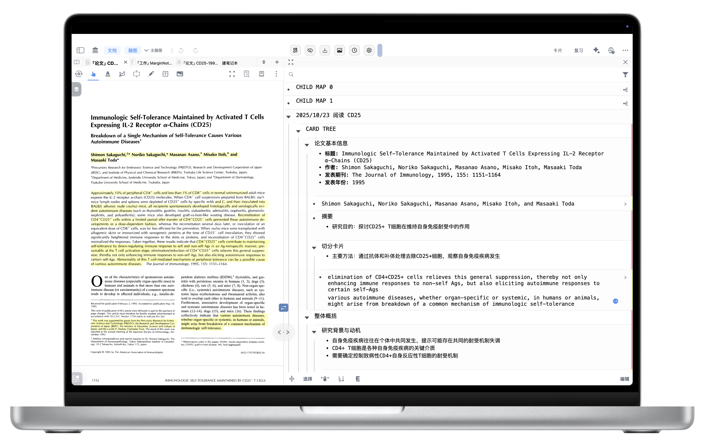
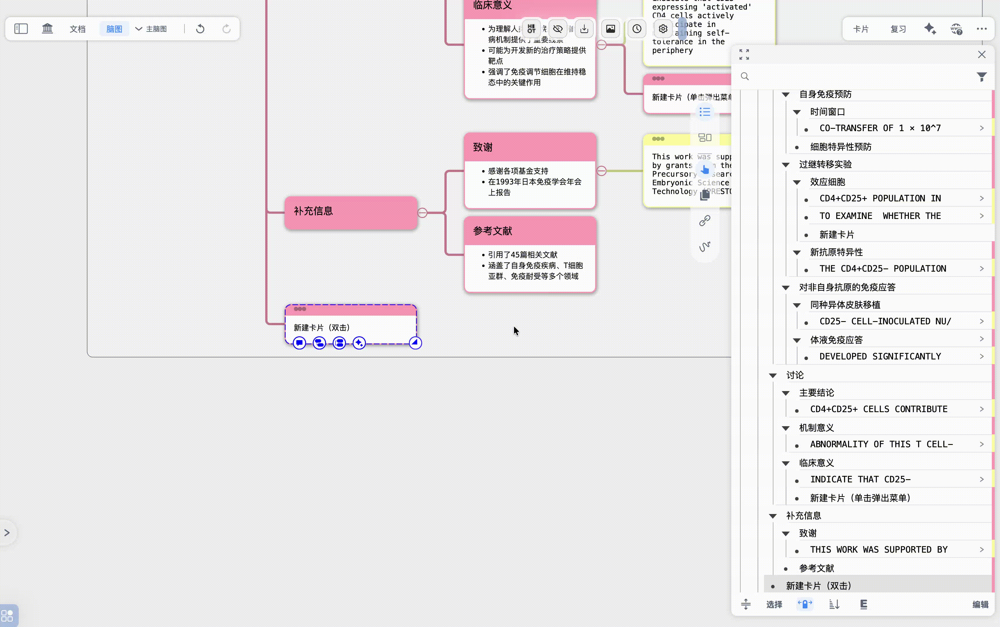

# 大纲编辑和缩进

# 1 如何新建节点（卡片）

> 💡在 MarginNote 4 中，**“节点”的本质就是“卡片”**。任何能将卡片添加到脑图的操作，都可以用来新建大纲节点。

## 1.1 进入大纲编辑视图

在开始创建节点之前，您需要先进入大纲编辑视图：

1. **点击脑图：** 在学习集中，打开脑图界面。
2. **点击“大纲”按钮：** 在脑图界面的右侧工具栏中，找到并点击`大纲`按钮（如下方图标所示）。

   [大纲](https://www.wolai.com/6nh8iGMPB2HsDP3m9ZhF9o "大纲")
3. **进入大纲编辑视图：** 此时，您的脑图将打开大纲面板，显示卡片的层级结构。

## 1.2 创建节点

### 1.2.1 文档界面创建节点

> 💡这是最常见的创建卡片的方式，尤其适合从阅读材料中摘录内容

- **摘录卡片：** 使用 MarginNote 4 的摘录工具（例如，文本、矩形摘录等），选择您想要摘录的文本或图片。
- **添加至脑图：** 完成摘录后，系统会自动将您摘录的内容作为一张新的卡片添加到当前学习集的脑图中，它会以新节点的形式出现在大纲编辑视图中。

### 1.2.2 大纲编辑界面创建节点

> 💡在大纲编辑视图中，您可以更直接地创建和管理节点

- 进入编辑模式 **：** 在大纲编辑视图的底部工具栏中，点击`编辑`按钮。
- 通过回车键Enter新建节点 **：**
  - 点选任意一张已有的卡片，将光标移动到卡片末尾；
  - **按下键盘上的 ****`回车键 (Enter)`****。** 此时，会在当前卡片的下方新建一个同级节点。

- **通过“新增一张卡片”按钮新建节点：**
  - 在`编辑`模式下，滚动到大纲底部。
  - 点击页面底部出现的“新增一张卡片”按钮，即可在末尾新建一个同级节点。

### 1.2.3 脑图界面创建节点

> 💡在普通的脑图视图下，您也可以创建空白节点，它们同样会显示在大纲编辑视图中

1. **双击空白处：** 在脑图界面的空白区域**双击鼠标**，即可直接创建一个新的脑图节点。
2. **通过单击菜单栏添加：**
   - 在脑图界面的空白处**单击鼠标**。
   - 在弹出的菜单栏中，选择\*\*`新建卡片`\*\*选项，即可新建一个节点。

# **大纲缩进**手势：拖拽调整层级

> 💡在大纲中，MarginNote 4为学习者带来了一项新功能——**大纲缩进手势**。该功能开启状态下，允许学习者通过**直接拖动**的方式来改变节点的层级和位置。

除此之外，学习者也可以通过**快捷键**进行脑图节点位置调整。

- **进入大纲编辑页面：** 确保您已处于大纲编辑视图。
- **开启**\*\*`大纲缩进手势`：\*\* 在大纲编辑视图的底部工具栏中，点击\*\*​`大纲缩进手势`\*\*开关（如下方图标所示）。

  [大纲缩进手势](https://www.wolai.com/95RrakZuGRCajKEVn4cYeA "大纲缩进手势")
- **直接拖动节点：**
  - **调整层级：** 按住一个节点，向右拖动可以使其成为上方节点的子节点（缩进）；向左拖动可以减少其缩进，提升层级。
  - **调整顺序：** 上下拖动节点，可以改变其在同层级中的排列顺序。

# 3 大纲层级调整快捷键

> 💡除了拖拽手势，您还可以使用键盘快捷键来精确控制大纲节点的层级，这在快速编辑时尤其高效。

- **进入大纲脑图编辑页面：** 确保您已处于大纲编辑视图。
- \*\*开启“大纲缩进手势”：**在大纲编辑视图的底部工具栏中，找到并点击**`大纲缩进手势`\*\*开关（如下方图标所示）。

  [大纲缩进手势](https://www.wolai.com/95RrakZuGRCajKEVn4cYeA "大纲缩进手势")
- **选中卡片并使用快捷键：**
  - **缩进（成为子节点）：** 选中您想要调整的卡片，然后按下键盘上的 `Tab` 键。该卡片将向右缩进，成为其上方最近一个同级卡片的子节点。
  - **减少缩进（提升层级）：** 选中您想要调整的卡片，然后按下键盘上的 `Shift + Tab`键。该卡片将向左移动，提升一个层级。

> 💡注意：在编辑模式下，可以直接按下快捷键进行大纲层级调整

# 4 切分&合并节点

> 💡在`大纲`中，MarginNote 4为学习者提供了一种全新的切分节点方式：通过快捷键，快速将卡片内容拆分为新卡片。
>
> **切分节点有什么用？**
>
> - 当一张卡片的内容过长，包含多个独立知识点时，切分节点可以将其拆分为多张更聚焦的卡片。
> - 这有助于您更好地组织和复习单个知识点。

快捷键：`回车键Enter`

- **打开大纲编辑视图：** 首先，点击`大纲`按钮，进入大纲编辑视图。

  [大纲](https://www.wolai.com/6nh8iGMPB2HsDP3m9ZhF9o "大纲")
- **点击**\*\*`编辑`****按钮：** 点击右下角的**`编辑`\*\*按钮，进入编辑模式。
- **切分卡片内容：**
  - 将光标移动到您想要切分卡片内容的位置（例如，在两个知识点之间）。
  - **按下键盘上的 ****`回车键 (Enter)`****。** 此时，光标之后的所有内容将自动剪切并创建为一张新的卡片，作为当前卡片的同级节点。
- **合并卡片内容：**
  - 将光标移动到卡片的**起始处**（即卡片内容的开头）。
  - **按下键盘上的 ****`删除键 (Delete)`****。** 该卡片的内容将合并到上一卡片的末尾。

