# 10种分支样式&子脑图坍缩

> 🧩**MarginNote 4支持多种样式的脑图分支，根据内容的结构选择分支样式：**
>
> - **层级型**：主题→子主题→要点
>   - **`树形 0/1/2/3/4`**
>     - 学科知识树、文献综述的主题与子主题
> - **流程/时间轴**：Step 1→2→3或今天→明天
>   - **`直线 0/1/2`**
>     - 学习计划时间轴、项目里程碑、算法/操作步骤序列、实验流程记录
> - **对比型**：方案A vs B、优点vs缺点
>   - **`双向`**
>     - 需求⇄实现、目标⇄指标等，成对的对应关系
> - **打包成一组**：同一模块的卡片放一起
>   - **`框架`**
>     - 将一组节点集中收纳，突出其为一个“框架”单元

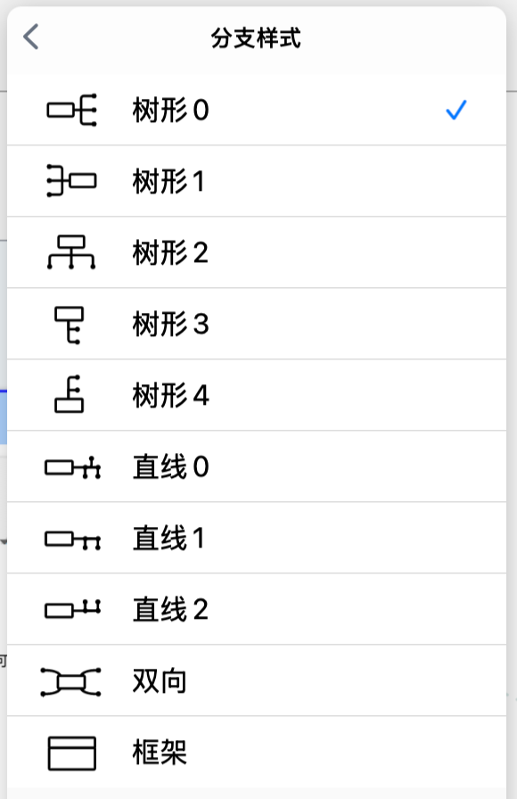

# 1 分支切换方法

> 💡**全局设置**：打开`脑图`视图后，点击[更多](https://www.wolai.com/i9EZnbxforWCdehq37ggK3 "更多")-`脑图`-`分支样式`，修改将影响所有非手动更改的节点‼️。
>
> **单卡设置**：卡片`弹出菜单栏`-`基础`-`...(更多)`，修改仅影响单张卡片。

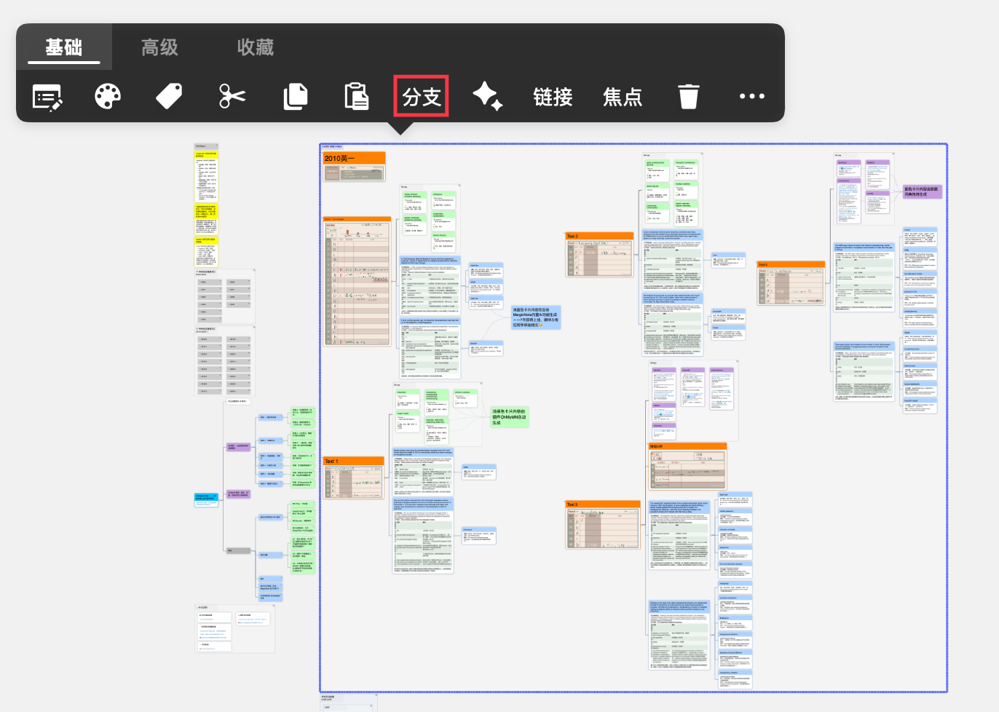

## 1.1 更改全部分支样式

点击`脑图`界面右上角的`...`[更多](https://www.wolai.com/i9EZnbxforWCdehq37ggK3 "更多")-`分支样式`，即可对分支样式进行更改。

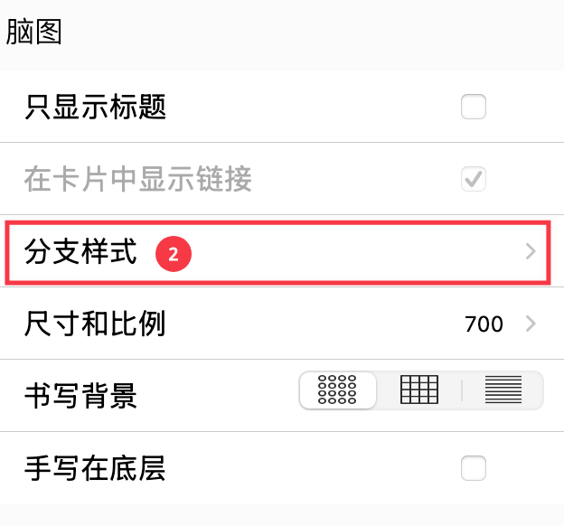

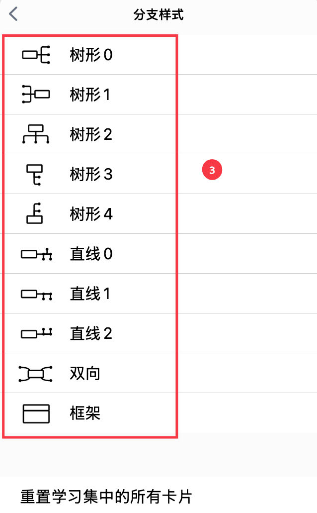

> 💡通过脑图设置面板设置的`分支样式`会改变脑图中**所有非手动更改的节点**。如果只想针对**某一张卡片**及子卡片分支进行修改，可以通过卡片`弹出菜单栏`→ `基础`→  `分支`进行修改。

## 1.2 单选/多选 - 更改部分节点分支样式

- 单选卡片，点击`弹出菜单栏`→ `基础`→  `分支`。

  
- 多选卡片后点击脑图底部菜单栏，选择`...更多` - `分支样式`，对分支样式进行更改。

  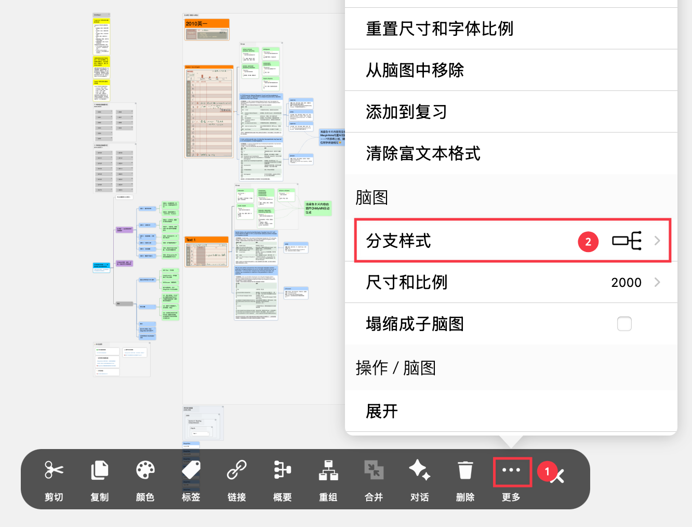

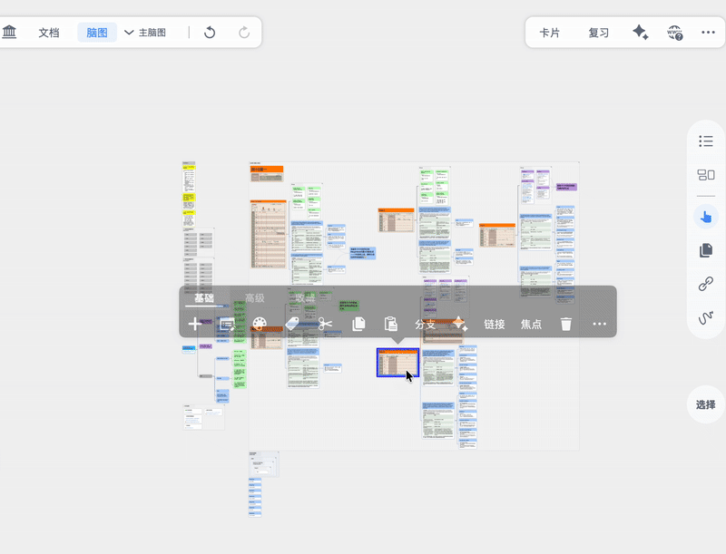

# 2 10种分支效果展示

## 2.1 树形

> 💡**树形适用于层级**结构：主题→子主题→要点
>
> - 例如：学科知识树、文献综述的主题与子主题

### 2.1.1 树形0

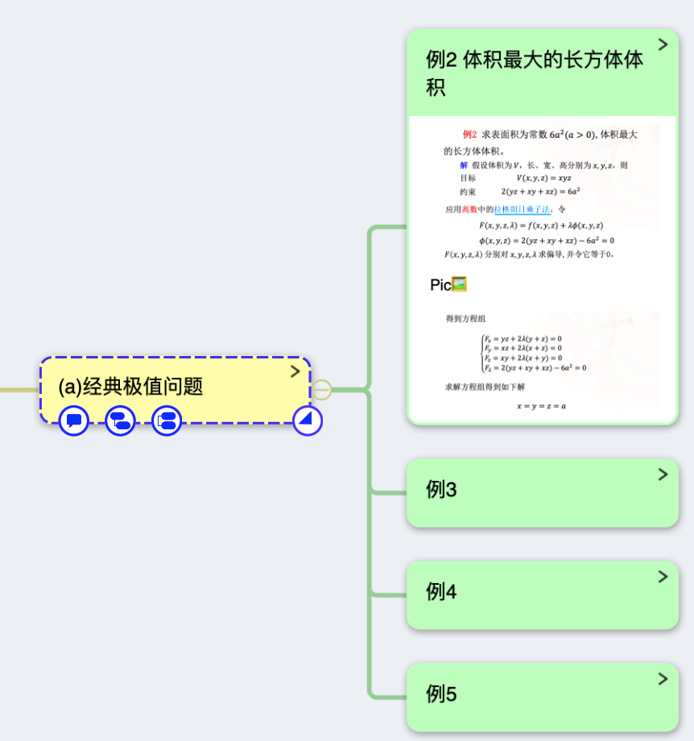

### 2.1.2 树形1

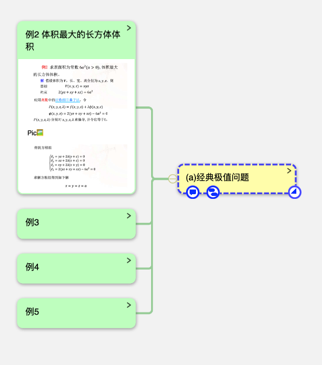

### 2.1.3 树形2

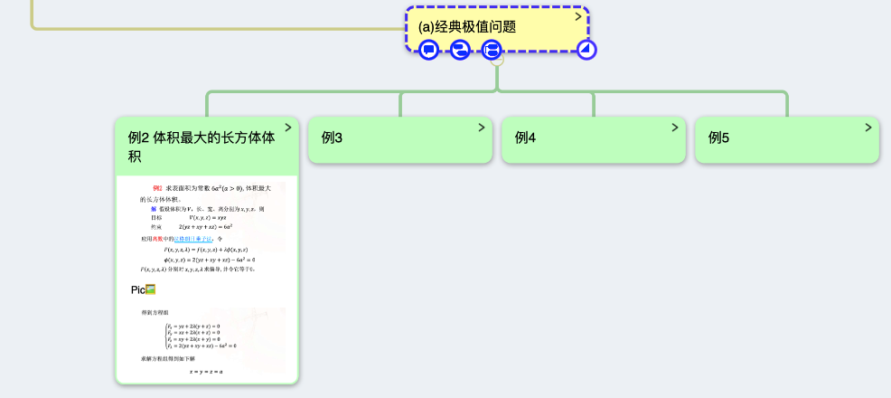

### 2.1.4 树形3

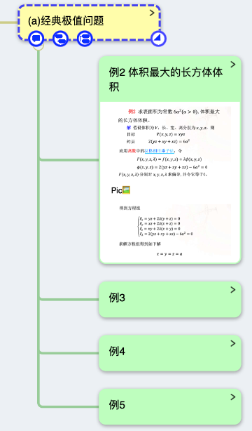

### 2.1.5 树形4

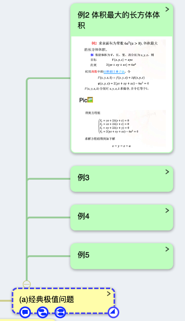

## 2.2 直线

> 💡直线适用于**流程/时间轴**：Step 1→2→3或今天→明天
>
> - 学习计划时间轴、项目里程碑、算法/操作步骤序列、实验流程记录

### 2.2.1 直线 0

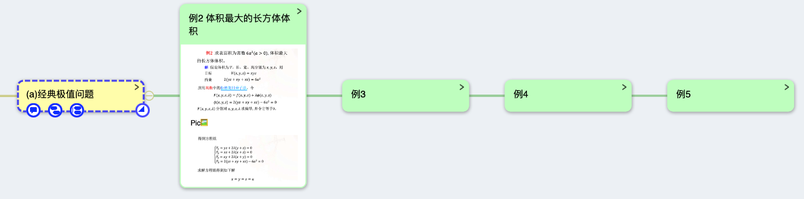

### 2.2.2 直线1

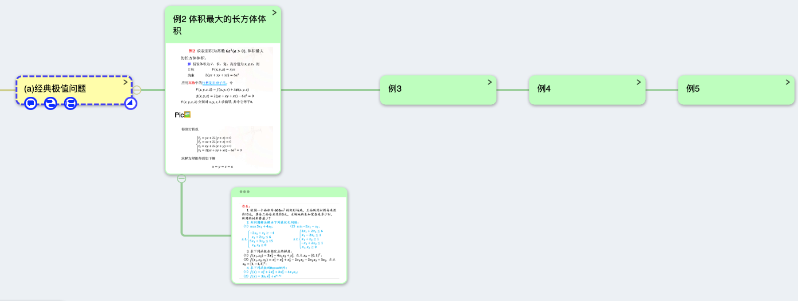

### 2.2.3 直线2

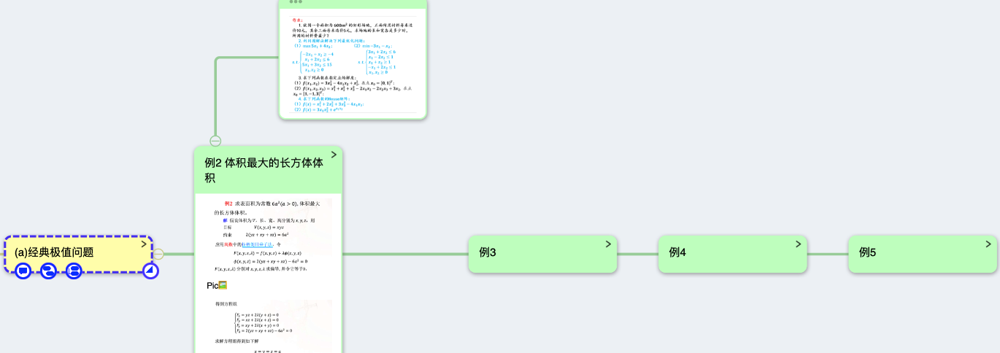

## 2.3 双向

> 💡**双向**适用于**对比型**：方案A vs B、优点vs缺点
>
> - 需求⇄实现、目标⇄指标等，成对的对应关系

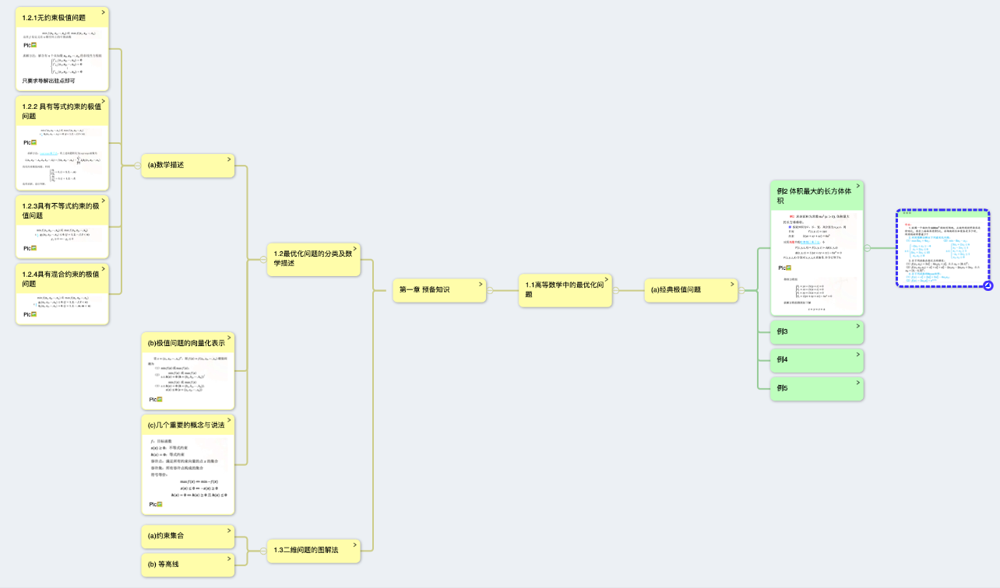

## 2.4 框架

> 💡\*\*`框架`**适用于**打包成一组\*\*的概念：将同一模块的卡片放一起
>
> - 一组节点集中收纳，突出其为一个“框架”单元

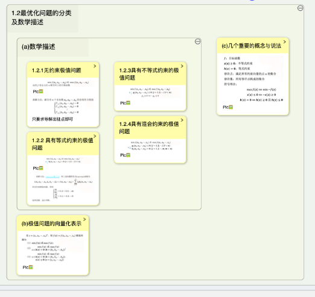

# 3 分支与子脑图无损转换

MarginNote 4不仅支持分支样式无损转换，还支持分支与子脑图的无损转换。

> 💡当某处卡片节点信息过多时，可以将分支`坍缩成子脑图`：，便于信息的整理与阅读。

选中卡片，点击`弹出菜单栏-高级`-`坍缩成子脑图`，原位置生成“子脑图卡片”（由该卡片及其子节点组成）。

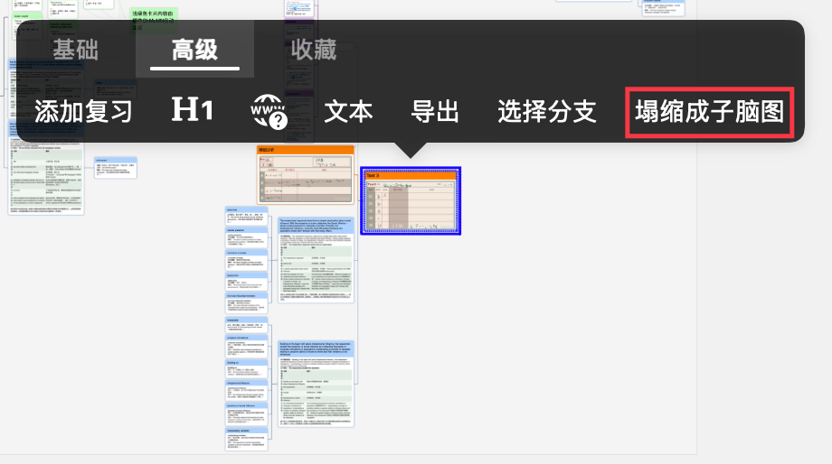

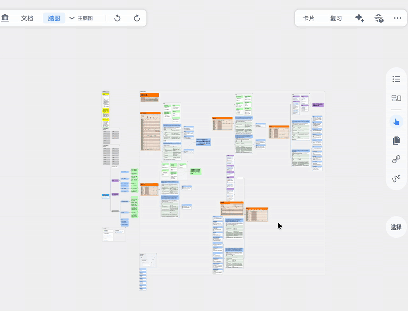

> 💡关于子脑图的更多介绍，详见：[新建和管理子脑图层级](https://www.wolai.com/wAZ8JuGD8M6EZu8qFjFXmD "新建和管理子脑图层级")
