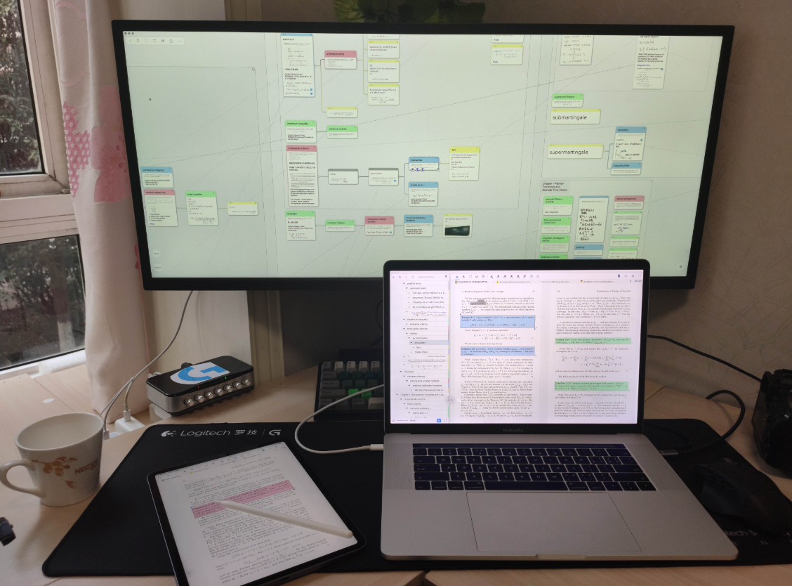
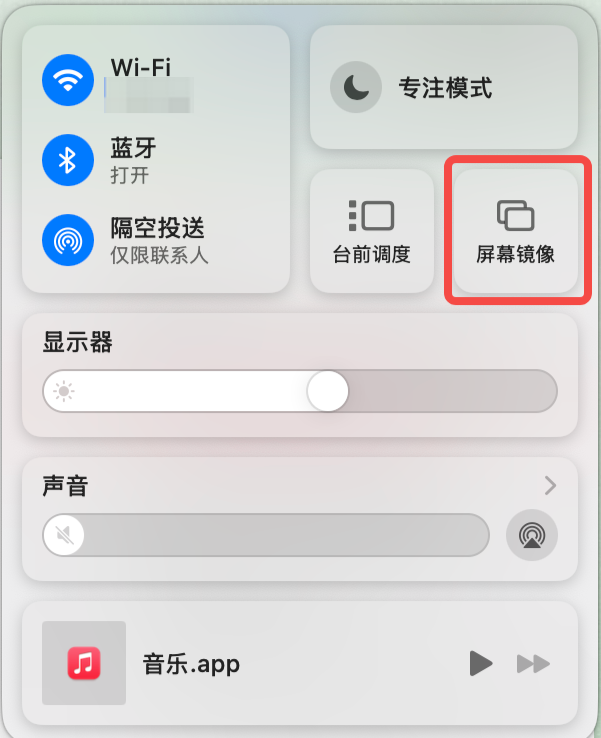
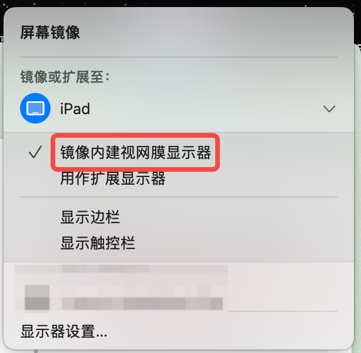
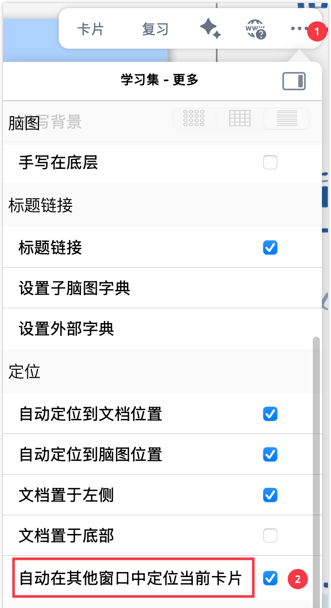
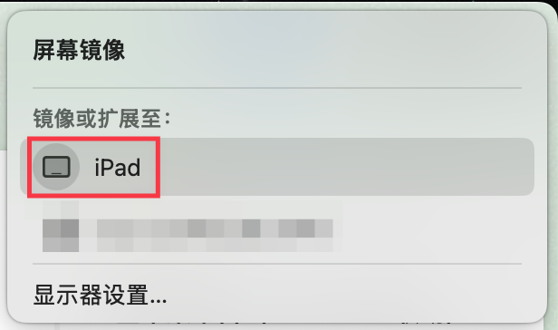

# 多窗口联动②：跨设备、跨平台多开 MN4窗口

> 💡在进行跨设备、跨平台学习或工作时，你可能会遇到这些场景：
>
> - 需要将MarginNote 4的文档视图和脑图视图分别展示在不同的屏幕上，以便同时查看和操作。
> - 希望利用Apple Pencil在iPad上进行精细的笔记标注，同时在Mac上保持主视图。
> - 拥有Windows电脑，但想利用iPad的手写能力或Mac的MarginNote 4处理能力。
> - 需要将iPad作为主机，通过扩展显示器获得更大的脑图视野，并进行手写操作。
> - 只有Mac电脑，但希望通过数位板实现手写输入。
>
> 多窗口联动功能可以帮助你灵活配置和利用不同设备的优势，实现文档、脑图和标注的高效结合。

# 1 全苹果平台（iPad+Mac联动）

苹果生态下的 Mac和iPad可以通过镜像或者屏幕扩展实现联动，Mac负责逻辑构建（脑图、打字、摘录），iPad 负责直觉输入（手写）。

[ 将 iPad 用作 Mac 的第二台显示器 - 官方 Apple 支持 (中国) 在 Mac 上，通过随航将 iPad 用作第二台显示器。 https://support.apple.com/zh-cn/guide/mac-help/mchlf3c6f7ae/mac](https://support.apple.com/zh-cn/guide/mac-help/mchlf3c6f7ae/mac " 将 iPad 用作 Mac 的第二台显示器 - 官方 Apple 支持 (中国) 在 Mac 上，通过随航将 iPad 用作第二台显示器。 https://support.apple.com/zh-cn/guide/mac-help/mchlf3c6f7ae/mac")

[ MarginNote！ - 小红书 在Mac上用Marginnote看文献，还可以直接投屏到iPad上批注，简直不要太方便#marginnote4 #国关 https://www.xiaohongshu.com/explore/691f3ccc000000001e02b70e?app\_platform=ios\&app\_version=9.6\&share\_from\_user\_hidden=true\&xsec\_source=app\_share\&type=normal\&xsec\_token=CBzbgtl7WZXaxpa4dBccVH4uOILwOqkXewiVHaPEBh\_cI%3D\&author\_share=1\&xhsshare=CopyLink\&shareRedId=ODhGRTM7Rk02NzUyOTgwNjdJOTg7RzpN\&apptime=1763655191](https://www.xiaohongshu.com/explore/691f3ccc000000001e02b70e?app_platform=ios\&app_version=9.6\&share_from_user_hidden=true\&xsec_source=app_share\&type=normal\&xsec_token=CBzbgtl7WZXaxpa4dBccVH4uOILwOqkXewiVHaPEBh_cI%3D\&author_share=1\&xhsshare=CopyLink\&shareRedId=ODhGRTM7Rk02NzUyOTgwNjdJOTg7RzpN\&apptime=1763655191 " MarginNote！ - 小红书 在Mac上用Marginnote看文献，还可以直接投屏到iPad上批注，简直不要太方便#marginnote4 #国关 https://www.xiaohongshu.com/explore/691f3ccc000000001e02b70e?app_platform=ios\&app_version=9.6\&share_from_user_hidden=true\&xsec_source=app_share\&type=normal\&xsec_token=CBzbgtl7WZXaxpa4dBccVH4uOILwOqkXewiVHaPEBh_cI%3D\&author_share=1\&xhsshare=CopyLink\&shareRedId=ODhGRTM7Rk02NzUyOTgwNjdJOTg7RzpN\&apptime=1763655191")

## 1.1 开启随航的前置条件

在开始操作前，请确保您的设备满足以下所有要求：

- **相同 Apple ID：** 两台设备必须登录同一个开启了双重认证的 iCloud 账户。
- **距离与连接：** 开启蓝牙、Wi-Fi 及隔空投送 (Handoff)；设备距离需在 10 米以内。
- **系统版本：** macOS Catalina 或更高版本，iPadOS 13 或更高版本。

***

## 1.2 如何开启随航 (连接步骤)

1. 在 Mac 上，点击菜单栏右上角的**控制中心 (Control Center)** 图标。
2. 点击**屏幕镜像 (Screen Mirroring)** 选项。
3. 在设备列表中，点击您的**iPad 名称**。
4. 此时 iPad 屏幕将亮起，并显示 Mac 的桌面。

***

## 1.3 模式区分：扩展 vs 镜像

开启连接后，您可以在控制中心或菜单栏的“屏幕镜像”图标中切换以下两种模式：

| **模式**​                      | **核心逻辑**​                                         | **MarginNote 学习场景应用**​                                              |
| ---------------------------- | ------------------------------------------------- | ------------------------------------------------------------------- |
| 1. \*\*镜像模式 (镜像内建视网膜显示器)\*\* | \*\*两个屏幕，内容一致。\*\* iPad 实时同步显示 Mac 的完整画面。         | \*\*精细标注：\*\* 当你需要在 Mac 版本的 MN4 上利用 Apple Pencil 进行手写，而无需频繁移动窗口时使用。 |
| 1. \*\*扩展模式 (用作扩展显示器)\*\*    | \*\*两个屏幕，内容互补。\*\* iPad 成为 Mac 的第二个独立显示器，鼠标可跨屏移动。 | \*\*最高频使用：\*\* Mac 屏幕放“脑图视图”，iPad 屏幕放“文档视图”。两屏独立操作，互不干扰。            |

***

## 1.4 详细操作指南

> 💡Mac新建窗口的快捷键为`⌘+N`。在随航状态下，手指点击iPad无效，可以使用Apple Pencil点击或者书写。可以使用双指拖动屏幕或者双指缩放屏幕。

### 1.4.1 设置为“扩展显示器” (推荐)

> 💡此模式下建议打开`自动在其他窗口中定位当前卡片`，可以实现文档-卡片双向跳转。

此模式将为您提供更多的操作空间。

- 操作步骤 **：**
- **MN4 联动：** 直接将 MN4 的 PDF 文档窗口向左/右拖出 Mac 屏幕，它会自动出现在 iPad 上。

### 1.4.2 设置为“镜像内建显示器”

此模式适合不需要多窗口操作，只需在iPad上即时标注的用户。

- 操作步骤 **：**
  1. 点击 Mac 菜单栏的“屏幕镜像”图标。

     
  2. 选择要连接的设备

     
  3. 勾选 **“镜像内建 Retina 显示器” (Mirror Built-in Retina Display)**。

     
- **MN4 联动：** 此时 iPad 将显示与 Mac 完全相同的画面。您可以直接在 iPad 上用 Apple Pencil 操作 Mac 端的 MN4 界面，适合在大型脑图上进行手动涂鸦或标记。

***

## 1.5 随航特有的辅助功能

在使用随航时，iPad 屏幕边缘会出现两个关键工具：

- **边栏 (Sidebar)：** 即使没有键盘，也可以在 iPad 上快速使用`Command`、`Shift` 等组合键。
- **触控栏 (Touch Bar)：** 在 iPad 底部显示 Mac 窗口等快捷操作

  [在 Mac 上自定义触控栏 - 官方 Apple 支持 (中国) 如果 Mac 配备了触控栏，你可以更改按钮默认显示的设置并自定义针对特定 App 显示的按钮。 https://support.apple.com/zh-cn/guide/mac-help/mchl5a63b060/mac](https://support.apple.com/zh-cn/guide/mac-help/mchl5a63b060/mac "在 Mac 上自定义触控栏 - 官方 Apple 支持 (中国) 如果 Mac 配备了触控栏，你可以更改按钮默认显示的设置并自定义针对特定 App 显示的按钮。 https://support.apple.com/zh-cn/guide/mac-help/mchl5a63b060/mac")

# 2 跨系统平台

## 2.1 Windows电脑

针对拥有 Windows 电脑，但希望利用 iPad 的手写能力或 Mac 的 MN4 处理能力的场景。

### 2.1.1 Windows电脑仅用作扩展显示器

iPad投屏到显示器用于看文献、看脑图

此场景下，通常是 iPad 作为主机，Windows 屏幕作为“大号看板”。

- **连接方式：**
  - **在 Windows 上安装**Spacedesk或**Duet Display**，使 Windows 屏幕接收 iPad 的投屏。
- **MN4 学习场景：**
  - **iPad 端：** 利用 Apple Pencil 进行核心的摘录、涂鸦和思维导图排布。
  - **显示器端：** 利用 iPadOS 新建多窗口，将 MN4 的文档视图全屏显示在显示器上，实现“看大屏参考、小屏手写”的体验。

### 2.1.2 Windows电脑安装 Mac 虚拟机+MarginNote4

此方案适合只有 Windows 电脑但极度依赖桌面版打字等以逻辑构建为主的用户。

- &#x20;通过 VMware 或 VirtualBox 搭建 macOS 虚拟机环境，并安装 MN4 Mac 版。

<https://www.bilibili.com/video/BV1m2JXz8E8m/>

> 💡缺点：性能受限，对手写支持极差，适合纯键鼠操作。不一定能够正常使用iCloud。

- **替代方案：** 若 iCloud 无法稳定同步，可利用 MN4 的“手动备份与恢复”功能，通过网盘传输`.marginpkg` 文件。参考：[数据同步、备份与恢复](https://www.wolai.com/qU6nwa4s6GCBuTDsjs9oeu "数据同步、备份与恢复")。

## 2.2 iPad+扩展显示器

[   https://support.apple.com/zh-cn/guide/ipad/ipadf1276cde/ipados](https://support.apple.com/zh-cn/guide/ipad/ipadf1276cde/ipados "   https://support.apple.com/zh-cn/guide/ipad/ipadf1276cde/ipados")

[   https://support.apple.com/zh-cn/guide/ipad/ipad8baf19a7/26/ipados/26](https://support.apple.com/zh-cn/guide/ipad/ipad8baf19a7/26/ipados/26 "   https://support.apple.com/zh-cn/guide/ipad/ipad8baf19a7/26/ipados/26")

### 2.2.1 iPad 连接显示器详细教程&#x20;

当 iPad 连接显示器时，可以让 MN4 在大屏上获得极致的脑图视野。

#### 2.2.1.1 前置条件与硬件准备

- **设备要求：**搭载**M1 芯片**及后续型号的 iPad Pro/Air才支持扩展模式 ，非 M 芯片 iPad 仅支持镜像模式 *。*
- **连接线材：**
  - **USB-C 直连：** 显示器需要支持全功能 USB-C 接口
  - **适配器连接：** 使用 USB-C 转HDMI/DP线
- **外设建议：连接**蓝牙鼠标/触控板和**键盘**，否则无法在扩展屏幕上进行复杂操作，尤其建议使用触摸板，不然系统限制下脑图平移无快捷操作（空格+左键拖动）。

#### 2.2.1.2 开启“台前调度”

1. 将 iPad 连接至显示器。
2. 从 iPad 屏幕右上角向下滑动呼出**控制中心**。
3. 点击 **“台前调度”图标**。

## 2.3 Mac+数位板

适合没有 iPad，仅能在 Mac 上学习并希望使用手写输入的用户。

> 💡建议使用带有实体快捷键的数位板，MarginNote4现已支持⇧+E作为橡皮擦快捷键
