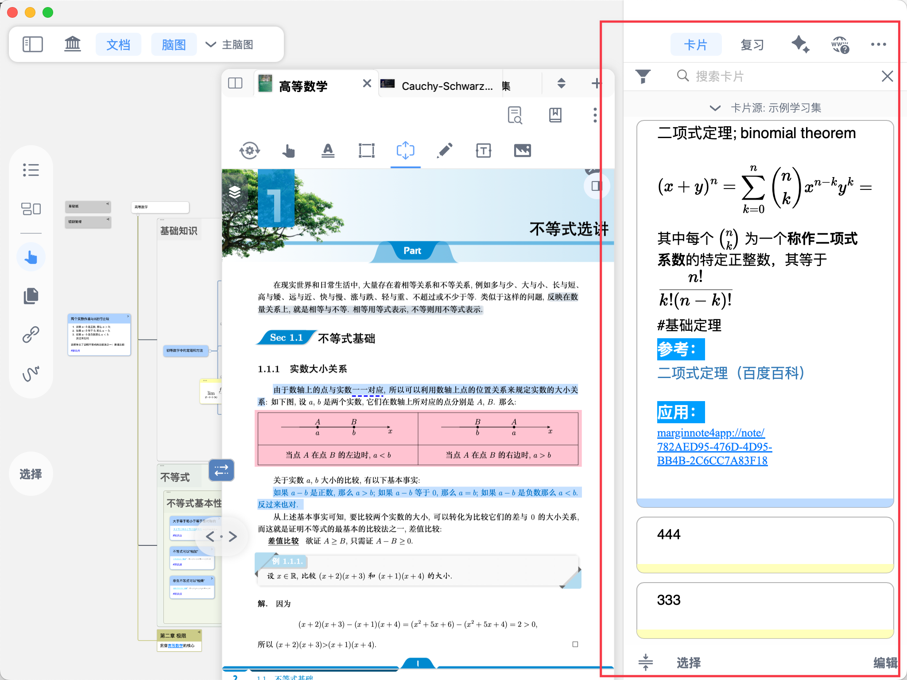
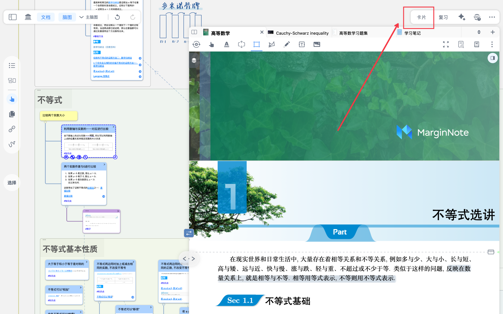
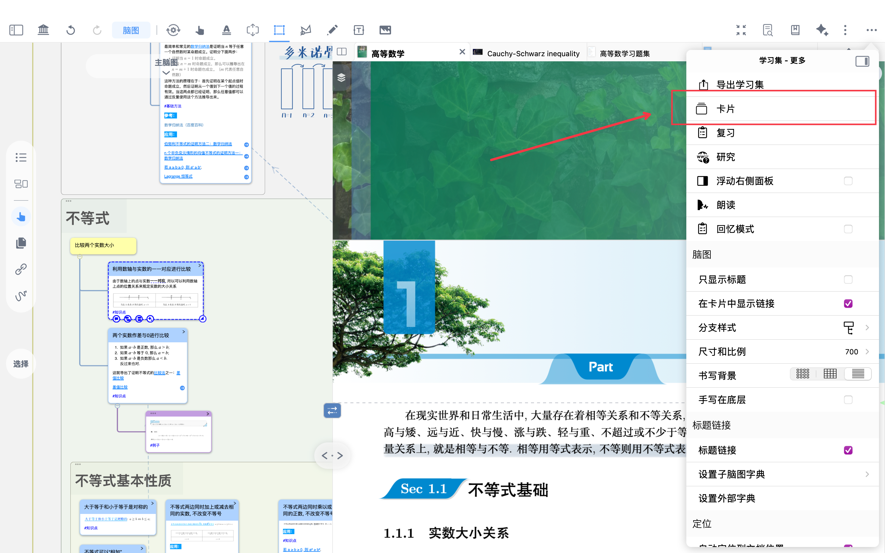
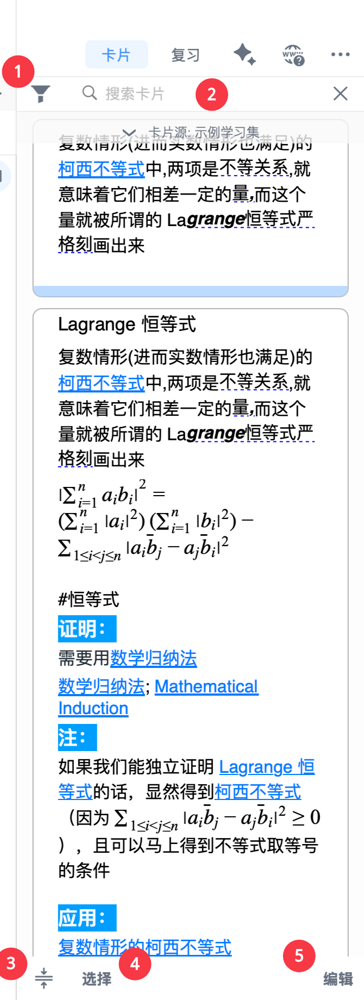
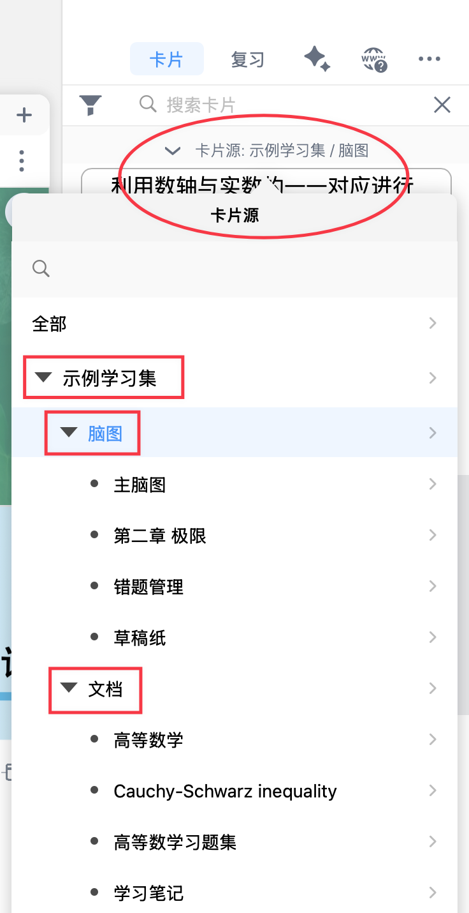
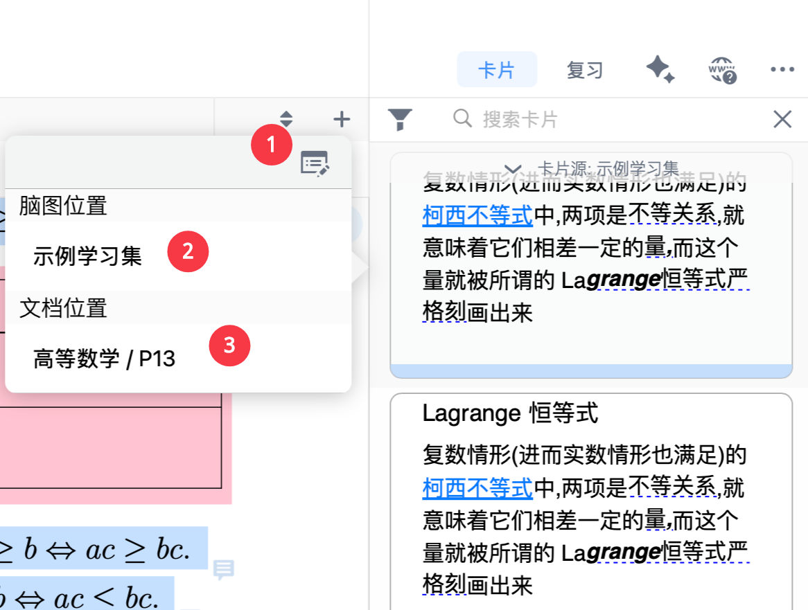
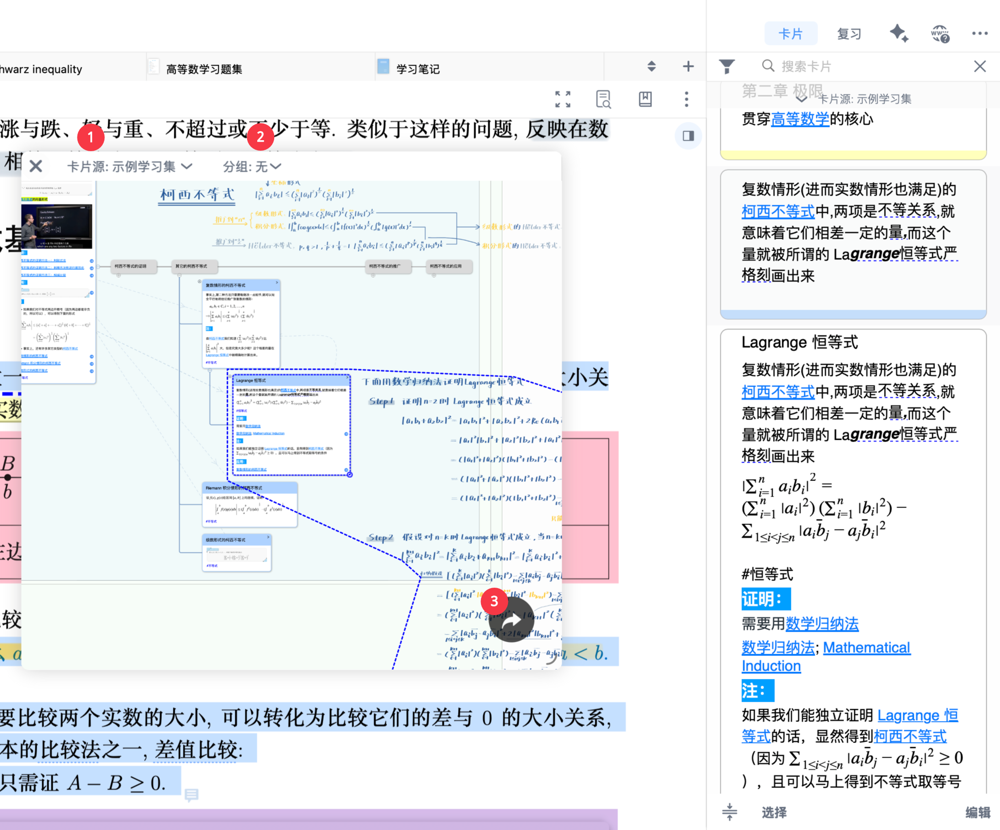
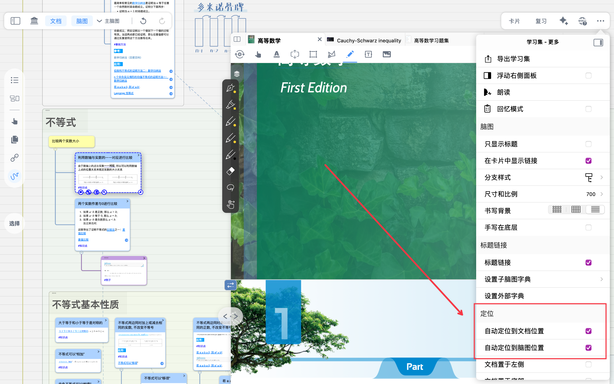

# 卡片盒视图

# 1 什么是卡片盒

> 💡**卡片盒——** 统一管理所有笔记卡片的核心区域：
>
> 学习者可在卡片盒中查看、检索、溯源、编辑每一张笔记卡片。
>
> 更重要的是，卡片盒打通了学习集与多个脑图之间的连接，让笔记、文档和脑图相互联动，实现跨文档、跨学习集的知识整合与复盘，使知识体系在卡片流转中不断生长。
>
> 

# 2 开启卡片盒

- **非全屏模式下**，点击学习集右上角`卡片`按钮，即可打开`卡片盒`
- **全屏模式下**，依次点击学习集右上角`...`（学习集-更多）-`卡片`按钮，即可打开`卡片盒`

# `3 卡片盒`的操作

## `3.1 卡片盒`内部

- `卡片盒`内部按钮如下：

  1筛选标签：

  2切换卡片源：学习集/脑图/文档（如上右图“切换卡片源”所示）

  3“单行显示”按钮（如下方图标所示）

  [单行显示](https://www.wolai.com/mmMx6RUSgjLf9FCAy2dWUv "单行显示")

  4选择卡片（批量操作）

  5编辑卡片内容

## 3.2 对卡片本身的操作（编辑/回源）

- 点击卡片**空白部分，** 弹出操作面板：
  1. 编辑卡片内容。详见：[脑图卡片①：新建和编辑卡片](https://www.wolai.com/67hDfmy3SZi4oXmMb2bvcH "脑图卡片①：新建和编辑卡片")
  2. 点击脑图位置，即开启`卡片分组看板`（详见[卡片分组看板①：从海量卡片中精准筛选](https://www.wolai.com/dJvh1K4GEKaJYtZ14zbfgj "卡片分组看板①：从海量卡片中精准筛选")）
     1. 切换卡片源（可以是学习集/脑图/文档）
     2. 进行一级、二级筛选
     3. 跳转至全屏脑图
        > ❗无法回源定位？查看`学习集-更多`→`定位`→是否开启`自动定位到文档/脑图位置`
        >
        > 
  3. 点击`文档位置`，即可定位至摘录所在文档位置

> ❗对于包含文本内容的卡片，点击卡片文本位置会开启编辑
>
> 要想开启上图**编辑/回源操作**菜单，务必点击卡片**空白/图片部分**
