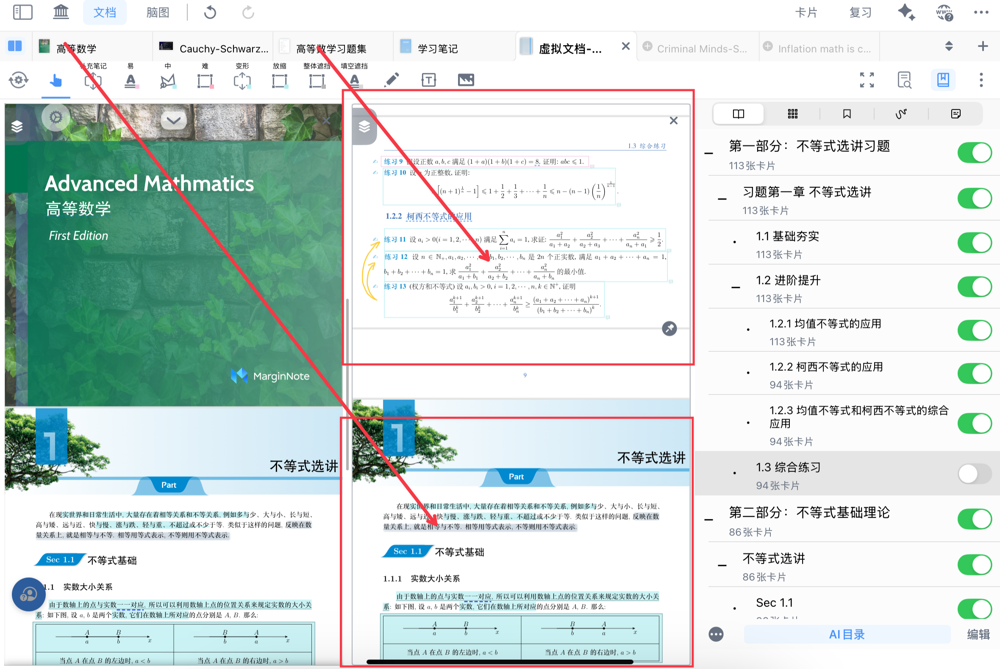
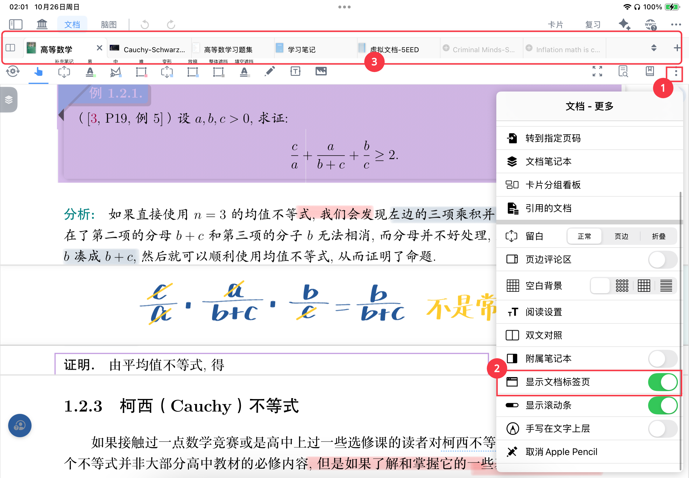
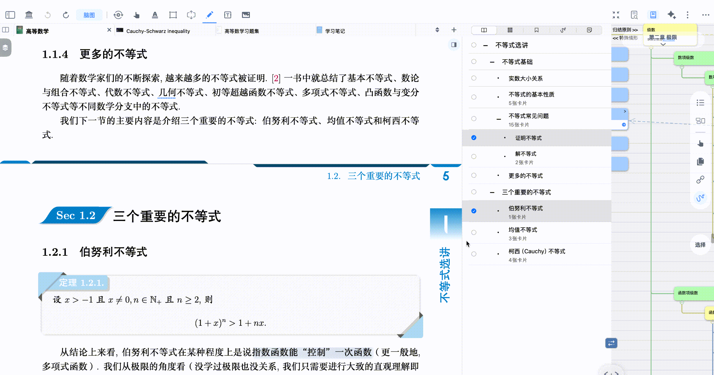

# 书页重组

> 💡MarginNote 支持通过**拖动手势**将文档内容移至虚拟文档，实现文档**以页面为单元**的“拆分与重组”。
>
> 通过几下简单的拖动，你可以将多本书的多个页面集合为一个文档，作为复习资料进行导出
>
> 也可以将数年的考卷中的一个题型，集中到一个文档中进行复盘。

# 1 虚拟文档与书页重组

虚拟文档不改变原始文件存储位置和内容，只是将不同来源、不同页面的内容整合在一起的集合。你可以将其理解为一个 “虚拟书架”，上面摆放的是你从各种文档中选取的页面或内容，这些内容在物理存储上并未发生移动，但在 MarginNote 中却可以作为一个整体被使用。

MN 里新建文档均为虚拟文档，包括书目重组文档、新建的空白笔记本、附属笔记本等。其管理方式与导入文档相同，参考[导入文档及文档管理](https://www.wolai.com/ehTLoD9HictQhkFirV1g9k "导入文档及文档管理")

> 💡书页重组不复制文件，而是"引用"原文件的页面，**所以必须保留原文件**
>
> 不删除原文档的情况下，书页虚拟重组（追加/新建）的两种方式，皆不会影响到源文档与笔记数据。

## 1.1 准备工作：开启标签页栏

[文档-更多](https://www.wolai.com/hFynH8sBLzL5GLmvLK9oMQ "文档-更多")

[显示文档标签页](https://www.wolai.com/ueTArFeZyMghHq5MKT6Zh5 "显示文档标签页")

- 点击`文档-更多`（1）
- 开启`显示文档标签页`或使用快捷键 `↑+H`（2）
- 打开文档界面顶部的`标签页栏`（3）。

## 1.2 可以添加到虚拟文档的内容

在MarginNote4中，[手形工具弹出菜单栏及其自定义](https://www.wolai.com/iLGrRDRMEQepittcNY4Bun "手形工具弹出菜单栏及其自定义")（如文字、图片）以及[检索②：查看文档目录/缩略图/书签/手写标注/卡片](https://www.wolai.com/8PoZfbSRai6owkvzpttZAE "检索②：查看文档目录/缩略图/书签/手写标注/卡片")（如[目录](https://www.wolai.com/jaxFYszwK9eiofzRPxzA1J "目录")、[缩略图](https://www.wolai.com/gxfn1mDtTxaEPNMec1CQaz "缩略图")、[书签](https://www.wolai.com/WWzbE7fyo1Dj8qTPwr5P5 "书签")、[标注](https://www.wolai.com/o5YtLabysvWPWnQF8nuuB7 "标注")和[卡片](https://www.wolai.com/3rHuJ32ozSkoRL4jfFnJtd "卡片")）都可以重组进一个“虚拟文档”，且原内容的变动可以同步进该文档。

# 2 书页重组的几种方式

## 2.1 根据目录进行重组

### 2.1.1 新建：创建一份新的虚拟文档

> 💡新建的虚拟文档，不包含原文档中的摘录和标注，详情见：重组前后内容同步对比

[书页查找](https://www.wolai.com/bQ3HELpfPdH8QZ4sadPLpu "书页查找")

[目录](https://www.wolai.com/jaxFYszwK9eiofzRPxzA1J "目录")

- 打开目录视图(如上图图标所示），**长按并拖拽**需要的目录项目，同时文档`标签栏`右侧出现蓝色`新建按钮`。
- 将目录项目拖拽到标签页的蓝色`新建按钮`上松开，自动新建一份虚拟文档。

> 💡在目录视图，若只长按不拖拽，只会弹出`编辑目录菜单`，不会出现`新建按钮`

### 2.1.2 追加：将页面追加到目标文档末尾

[书页查找](https://www.wolai.com/bQ3HELpfPdH8QZ4sadPLpu "书页查找")

[目录](https://www.wolai.com/jaxFYszwK9eiofzRPxzA1J "目录")

- 打开`目录`，长按选取目录项目
- 将内容拖拽至`标签页栏`的其他文档上并松开，可将**目录项目包含的所有页面**直接添加到该文档中

> 💡追加的虚拟文档，包含原文档中的摘录和标注，**不包含折叠和留白**
>
> 其**摘录**会在两个文档中同步显示，但**标注**不会同步显示
>
> 详情见：重组前后内容同步对比

### 2.1.3 多个目录项目批量添加到虚拟文档

> 💡仅在文档界面全屏`目录`窗口中可以多选后拖动

- 点击`目录视图`右下的`编辑按钮`，同时选择多个目录项目
- 批量拖拽整理至`标签页栏`的蓝色`新建按钮`或者`文档标签`上

## 2.2 根据缩略图/书签/标注进行重组

[缩略图](https://www.wolai.com/gxfn1mDtTxaEPNMec1CQaz "缩略图")

[书签](https://www.wolai.com/WWzbE7fyo1Dj8qTPwr5P5 "书签")

[标注](https://www.wolai.com/o5YtLabysvWPWnQF8nuuB7 "标注")

- 在`缩略图/书签/标注界面`（如上图），长按住需要重组的页面
- 拖拽至`标签页栏`的其他文档/`新建按键`上

## 2.3 根据手形工具选区进行重组

[手形工具-文档](https://www.wolai.com/9ZgrQpKfNxW3HUkKiH6jfS "手形工具-文档")

- 使用`手形工具`，选中文档页面上需要的文本/区域
- 拖拽至`标签页栏`来实现书页的重组（追加/新建）

## 2.4 文档间的重组

如果想在文档间进行虚拟合并，可直接拖拽`文档标签页`至`另一文档标签页上`，会将A文档的所有页面追加到B文档末尾

# 3 重组前后内容同步对比

| 类型   | 从目录新建虚拟文档 | 从目录追加到虚拟文档 | 从选区新建虚拟文档 | 从选区追加虚拟文档 |
| ---- | --------- | ---------- | --------- | --------- |
| 原始页面 | ✓         | ✓          | ✓         | ✓         |
| 摘录   | ✗         | ✓          | ✓         | ✓         |
| 标注   | ✗         | ✓          | ✓         | ✓         |
| 折叠   | ✗         | ✗          | ✓         | ✓         |
| 留白   | ✗         | ✗          | ✓         | ✓         |
