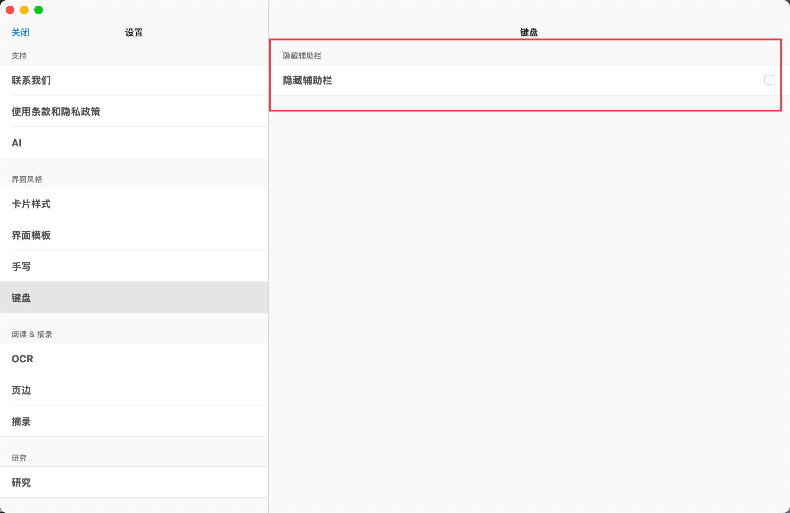
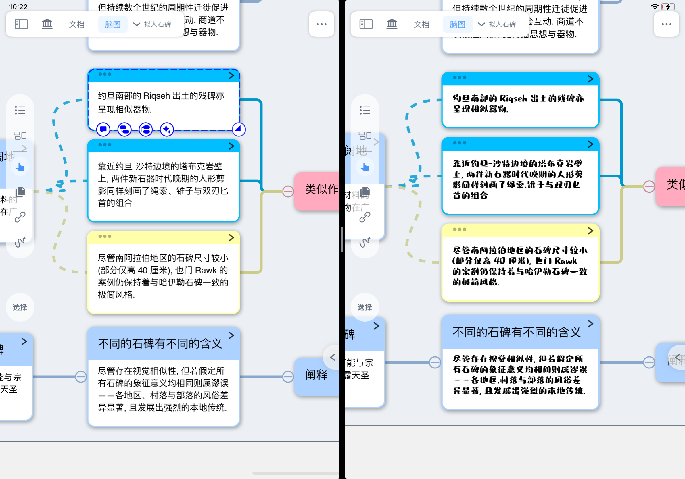
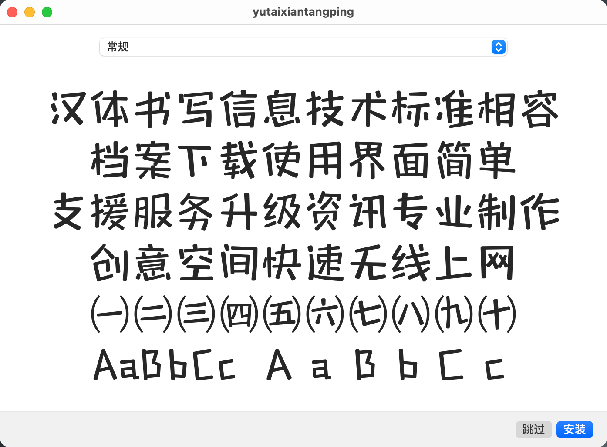
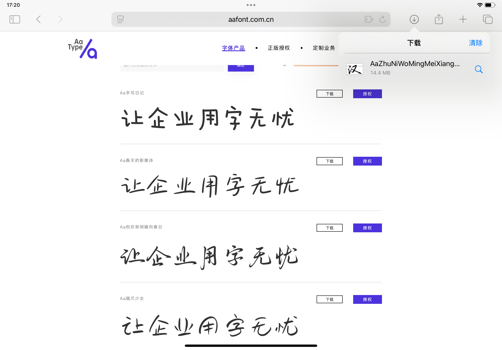
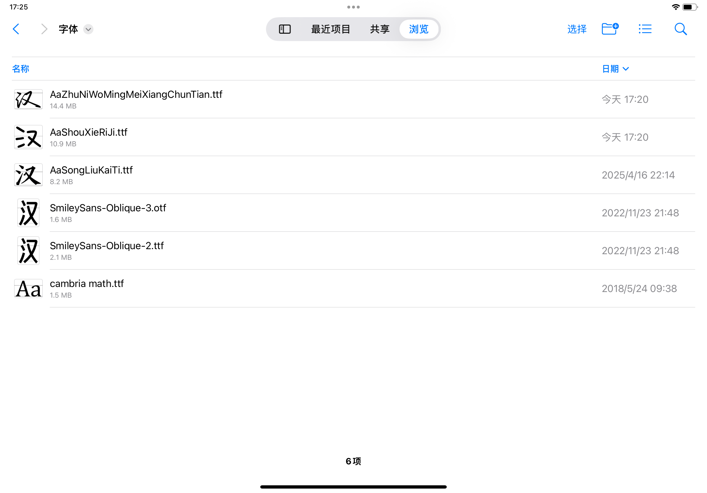
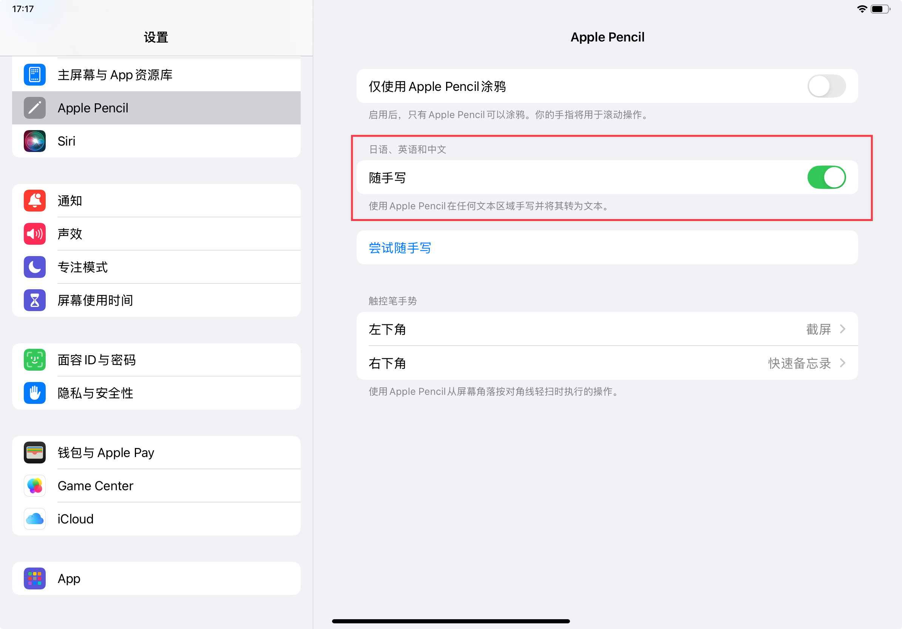
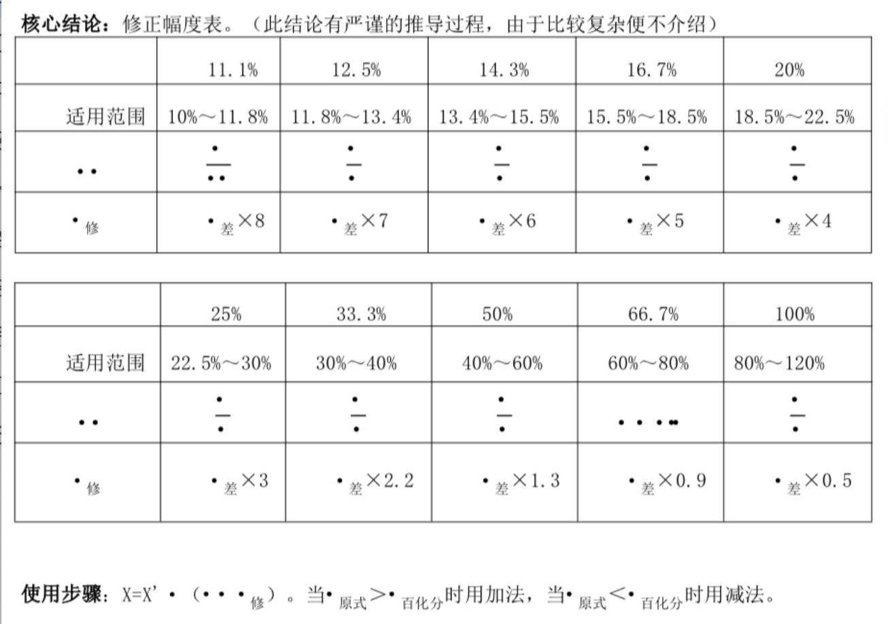
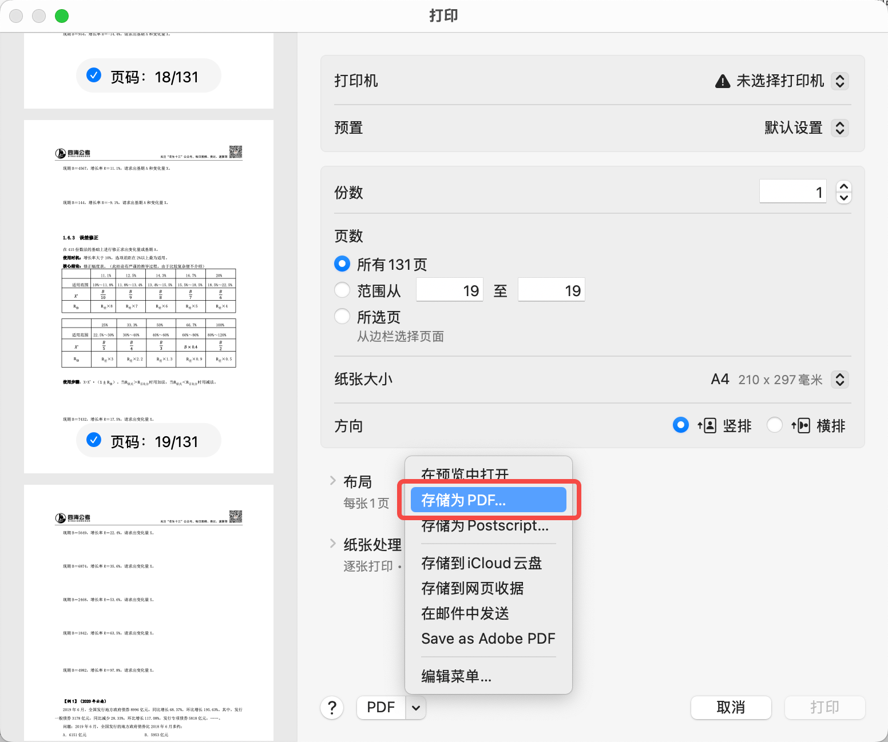
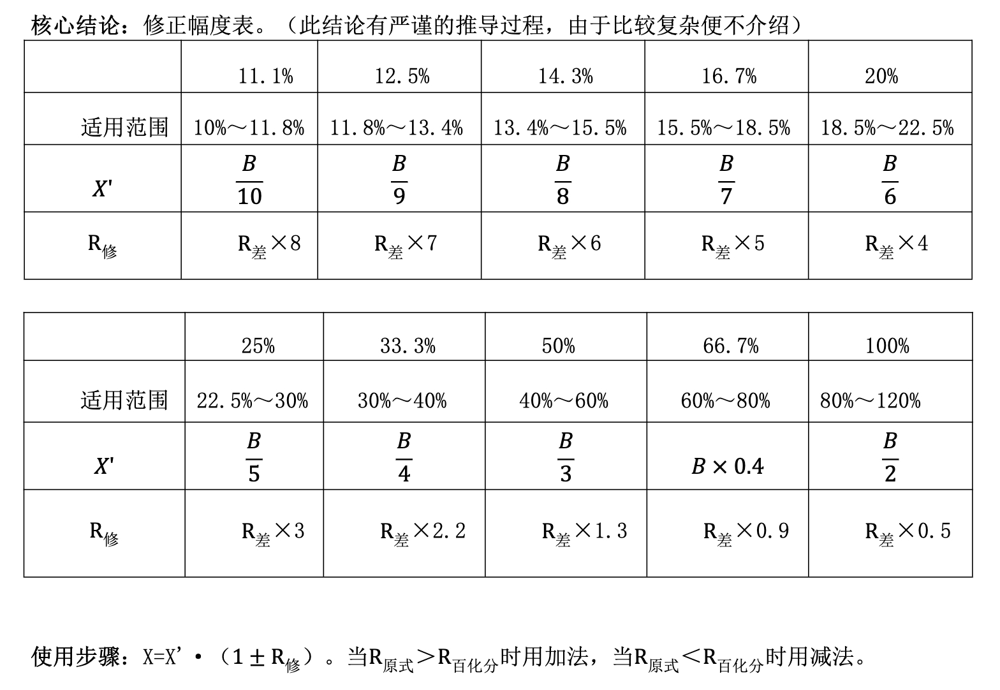

# 自定义卡片字体

> 💡MarginNote支持自定义卡片与文本框字体，打破设备默认字体限制，实现文字显示的个性化美化。可根据自身喜好自由更换字体风格，让笔记、文档等内容的文字呈现更贴合个人审美，打造专属的视觉体验。

# 1 使用和切换字体

## 1.1 在MN 中切换字体

- 选中文本，在键盘辅助栏上，选择所需字体进行切换

> 💡**找不到“键盘辅助栏”，如何打开？**
>
> 打开MN设置 → 键盘 → 关闭“隐藏键盘辅助栏”
>
> 

## 1.2 效果预览

- 字体切换后的笔记对比效果

# 2 Mac端安装自定义字体

## **下载字体文件**

- 打开浏览器，输入字体下载网址（以[http://aafont.com.cn](http://aafont.com.cn "http://aafont.com.cn")为例），选择喜欢的字体，点击下载

## 2.2 安装字体文件

- 打开下载的字体格式文件（.ttf/.otf），选择“安装”，即自动完成字体安装

# 3 iPhone / iPad端安装自定义字体

## **下载字体文件**

- 打开浏览器，输入字体下载网址（以[http://aafont.com.cn](http://aafont.com.cn "http://aafont.com.cn")为例），选择喜欢的字体，点击下载

- 下载的字体格式文件（.ttf/.otf），会存放在“文件 app”中，记住保存位置

> ⚠️字体下载后，若是压缩包（.zip）格式，请先解压缩！

## 3.2 从App Store安装  Fontcase软件 **，导入之前已保存的字体文件**

- Import → 选择保存的字体文件 → 打开 → Install → Download Fonts → 允许下载配置描述文件 → 弹窗显示下载成功

## **安装配置描述文件**

- 在 Fontcase 下载配置描述文件
- 系统设置 → 安装描述文件 → 安装 → 输入密码 → 安装 → 安装描述文件 → 完成

## 3.4 使用自定义字体

启动MarginNote ，便可使用新安装的字体了，步骤参考使用和切换字体

> 💡若字体列表未更新，请重启app 或设备。
>
> 第三方字体常仅提供常规体（Regular），可能无法进行加粗、斜体、下划线操作。

# 4 手写字迹美化：**开启「随手写」秒变美字**

系统设置 → Apple Pencil → 随手写，让手写自动变为印刷体

# 5 字体安装网站推荐

- $Aa字库$
  > 中文手写体大全
  > [Aa字库-让企业用字无忧 Aa字库成立于2015年，致力于创造原创设计风格独树一帜的商用字体。目前版权字体超3000套，包括专业字体、创意字体、书法字体、手写字体、装饰字体等。 https://www.aafont.com.cn](https://www.aafont.com.cn "Aa字库-让企业用字无忧 Aa字库成立于2015年，致力于创造原创设计风格独树一帜的商用字体。目前版权字体超3000套，包括专业字体、创意字体、书法字体、手写字体、装饰字体等。 https://www.aafont.com.cn")
- $DaFont$
  > 设计感英文字体
  > [DaFont - Download fonts Archive of freely downloadable fonts. Browse by alphabetical listing, by style, by author or by popularity. https://www.dafont.com](https://www.dafont.com "DaFont - Download fonts Archive of freely downloadable fonts. Browse by alphabetical listing, by style, by author or by popularity. https://www.dafont.com")
- $100Font$
  > 海量免费字体库
  > [  https://www.100font.com](https://www.100font.com "  https://www.100font.com")
- $字体天下 $
  > 设计字体天花板
  > [字体天下-提供各类字体的免费下载和在线预览服务 字体天下提供中文字体、手写字体、英文字体、图形字体等各种字体的高速免费下载和在线预览服务. https://www.fonts.net.cn](https://www.fonts.net.cn "字体天下-提供各类字体的免费下载和在线预览服务 字体天下提供中文字体、手写字体、英文字体、图形字体等各种字体的高速免费下载和在线预览服务. https://www.fonts.net.cn")

# 6 常见问题

## 6.1 Q1：字体安装失败怎么办？

字体安装失败，可按以下顺序进行排查：

1. 升级系统到 iOS 13+，清理存储空间（至少预留几十MB）；
2. 确认字体文件为 .ttf / .otf格式，且文件完整、未损坏；
3. 用正规字体 App（如 Fontcase / iFont）导入，并按提示安装描述文件；
4. 去 设置 → 通用 → VPN与设备管理 信任描述文件；
5. 重启手机，在 设置 → 通用 → 字体 查看是否安装成功；
6. 仍失败：更换另一个字体文件、更换换字体安装 App、更新 iOS系统。

## 6.2 Q2：字体不显示怎么办？

问题原因：这是OS 26系统的bug，封装时未自带「Cambria Math」字体，而该字体是渲染PDF数学公式的关键。升级后缺少此字体，导致原正常公式无法显示。

解决方式有2种：

1. 压平PDF：将PDF 导出为打印版本，压平PDF 可以解决大多数的PDF兼容性问题。

1. 手动安装「Cambria Math」字体，安装后公式可正常恢复显示。

   [cambria math.ttf](<file/cambria math_11kIgFzVED.ttf> " cambria math.ttf")

## 6.3 Q3：如何删除安装的自定义字体？

- 方法一：删除描述文件
  1. 打开系统设置 → 通用 → VPN与设备管理；
  2. 找到字体对应的描述文件（如 iFont、Fontcase）；
  3. 点 移除描述文件 → 输入密码确认；
  4. 回到系统设置 → 通用 → 字体，字体已被清空。
- 方法三：直接卸载字体 App
  1. &#x20;直接卸载 iFont / Fontcase 等字体 App；
  2. 系统会自动删除该 App 安装的所有字体。
