# 卡片链接①|单双向链接：跨越层级的自由关联

> 💡卡片除了有**上下级**这种“相对固定”的节点结构外，还有一种更“自由”的结构——**链接**。
>
> 链接的优势在于不限制两张卡片的位置：卡片可以来自不同子脑图，甚至是不同学习集，并可以随时跳转查看。

# 1 理解链接

## 1.1 什么是卡片链接

- 卡片链接是 MarginNote 4 中一种突破思维导图固定上下级节点结构的自由关联方式。
- 不同于脑图层级仅能在同一`子脑图`或`学习集`内按层级关联卡片，卡片链接不受卡片所在位置限制，无论是不同子脑图还是不同学习集的卡片，都能建立关联，且支持随时跳转查看，让知识关联更灵活高效。

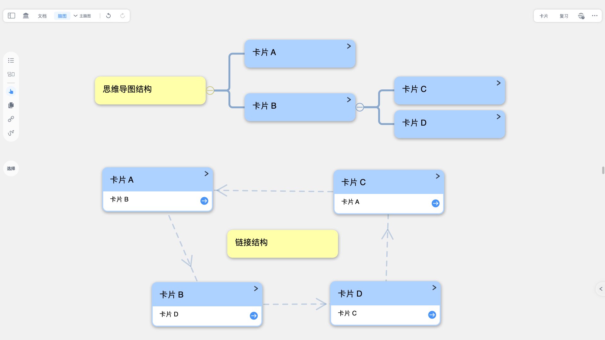

## 1.2 双向链接 vs 单向链接快速对比表

| 类型   | 核心特点                                      | 典型场景                                                                  |
| ---- | ----------------------------------------- | --------------------------------------------------------------------- |
| 双向链接 | - 两张卡片相互关联 - 彼此评论区均显示对方链接 - 有双向带箭头的链接虚线   | !\[  ]\(\<image/截屏2026-01-18 17.58.57\_KY7DVGDBCf.png.mark.png> "  ") |
| 单向链接 | - 仅建立单一方向关联 - 仅目标卡片评论区显示来源卡片链接 - 链接线带单向箭头 | !\[]\(image/image\_0B6cR-XrtZ.png)                                    |

## 1.3 使用场景

卡片链接核心用于实现知识的跨维度关联，除上述对比表中提及的学科场景外，还可应用于：

- 历史事件与相关人物、背景知识的关联；
- 专业知识点与对应的参考资料、文献摘录卡片的关联；
- 读书笔记中观点卡片与佐证案例卡片的关联等。

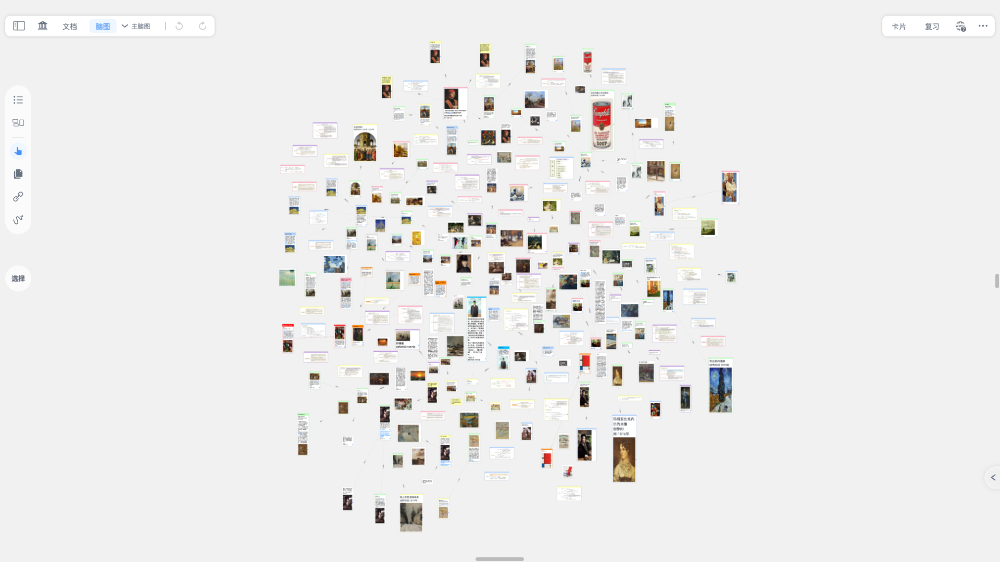

# 2 创建链接

## 2.1 方法一：链接球（仅双向）

- 点击需要建立链接的卡片 A，在弹出的卡片菜单栏中选择`链接`选项；
- 此时卡片 A 中间会出现一个链接球；
- 拖动该链接球至目标卡片 B 上，即可完成两张卡片的双向链接。

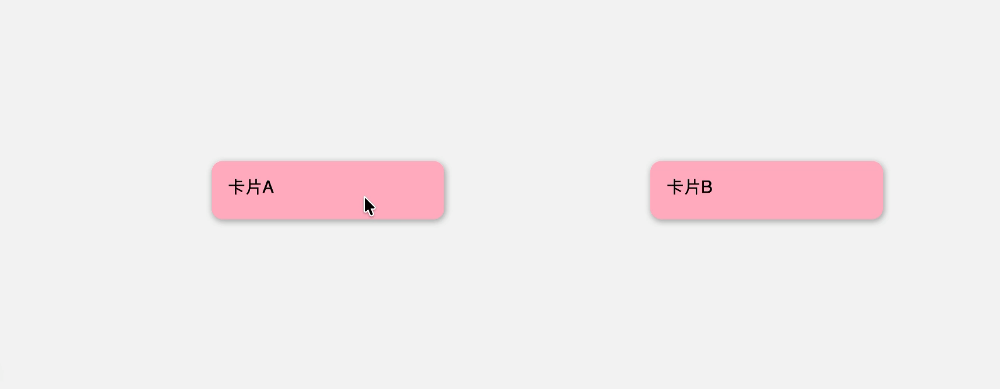

> 📌链接球产生的链接是双向的，因此若点击卡片 B，按照上面的步骤将链接球移动到 A 上同样也可以实现双向链接。

## 2.2 方法二：拖拽卡片（推荐）

1. 首先在脑图中切换到拖拽链接模式（双向/单向）

点击脑图侧边工具栏的链接工具，根据需求选择链接模式：

- `拖拽用于单向链接`
- `拖拽用于双向链接`

1. 按住需要建立链接的源卡片；将其拖拽至目标卡片上；
2. 当目标卡片周围出现蓝色实线边框时，松开源卡片，即可完成链接创建。

> ⚠️注意，和**双向**链接不同，**单向**链接的拖拽效果和初始的卡片有关：从卡片 B 拖拽到卡片 A 的效果，和从卡片 A 拖拽到卡片 B 的效果是相反的。

### 2.2.1 效果对比（双向 vs 单向的区别）

|      | 创建效果                                       | 图示                                                                                                                                    |
| ---- | ------------------------------------------ | ------------------------------------------------------------------------------------------------------------------------------------- |
| 双向链接 | - 源卡片与目标卡片评论区互显对方链接 - 二者间生成双向带箭头的链接虚线      | !\[  ]\(\<image/截屏2026-01-18 16.11.44\_o\_k8Ap6dpc.png> "  ")                                                                         |
| 单向链接 | - 仅目标卡片评论区显示源卡片链接 - 二者间生成带单向箭头（从目标指向源）的链接线 | !\[  ]\(\<image/截屏2026-01-18 16.12.11\_GJEH2HZJ0g.png.mark.png> "  ")  !\[]\(\<image/截屏2026-01-18 16.11.54\_H9GDBtnQQT.png.mark.png>) |

# 3 使用链接

## 3.1 跳转查看（单击浮窗 vs 双击跳转）

链接之后可以通过单击或者双击来访问链接的卡片，只是二者的效果不同。

- **单击链接**：在浮动弹窗中显示对应的卡片
- **双击链接**：跳转到对应的卡片

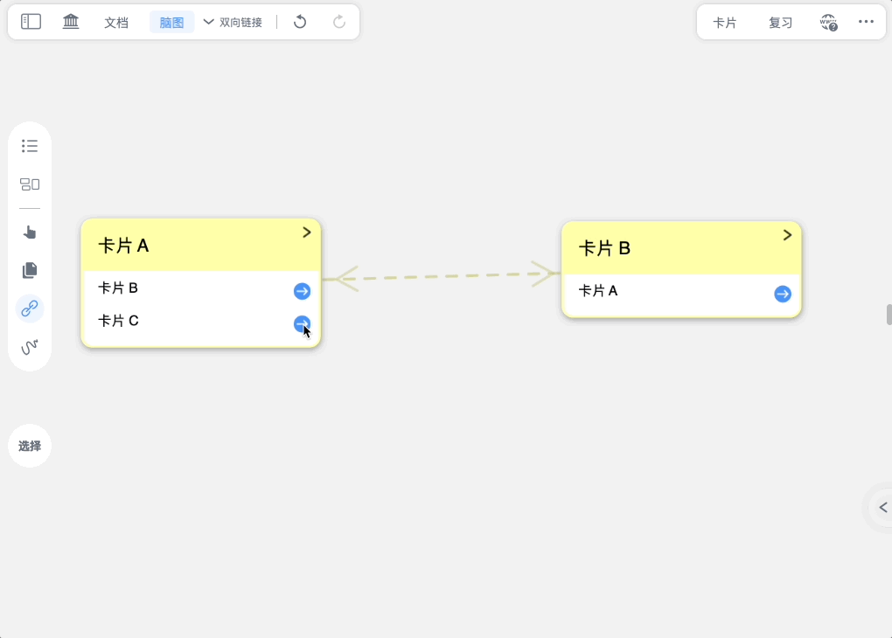

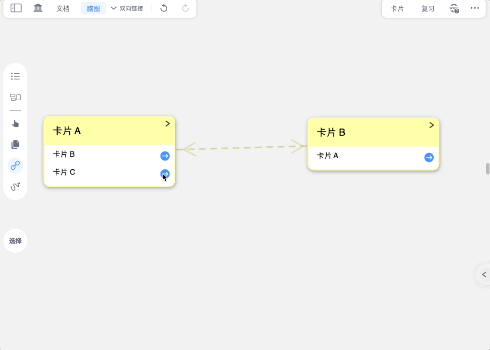

## 3.2 添加注释

链接线上可以增加简短的注释。

1. 点击链接线，在弹出的菜单框中点击`标注`，可选择标注的方向

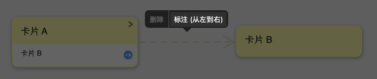

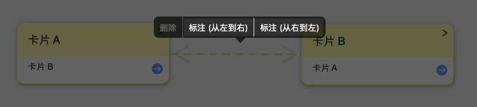

> 💡`标注`的方位一共有四种，取决于两个卡片的相对位置。
>
> | 方位 | \`标注（从左到右）\`                              | \`标注（从右到左）\`                              | \`标注（从下到上）\`                              | \`标注（从上到下）\`                               |
> | -- | ----------------------------------------- | ----------------------------------------- | ----------------------------------------- | ------------------------------------------ |
> | 图示 | !\[  ]\(image/image\_PnQj0RpaS0.png "  ") | !\[  ]\(image/image\_EIHJk003gu.png "  ") | !\[  ]\(image/image\_4FQgCPGBDC.png "  ") | !\[  ]\(image/image\_iJOk\_OAskO.png "  ") |

1. 在弹出的输入框中输入注释，然后点击确定即可。

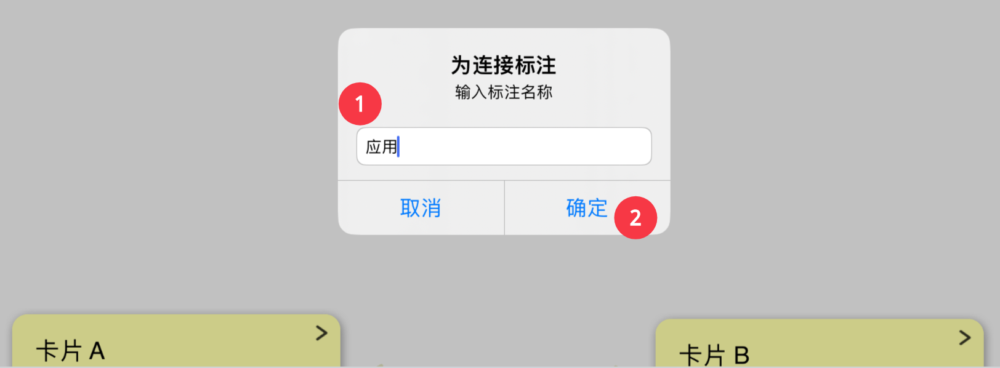

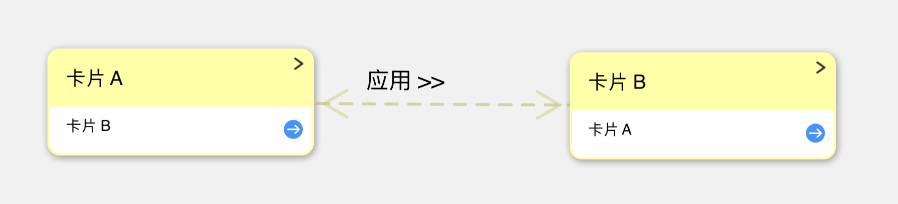

## 3.3 删除链接

有两种方式可以删除卡片链接：

- 通用方法：打开`卡片编辑器 `→ 删除链接文本

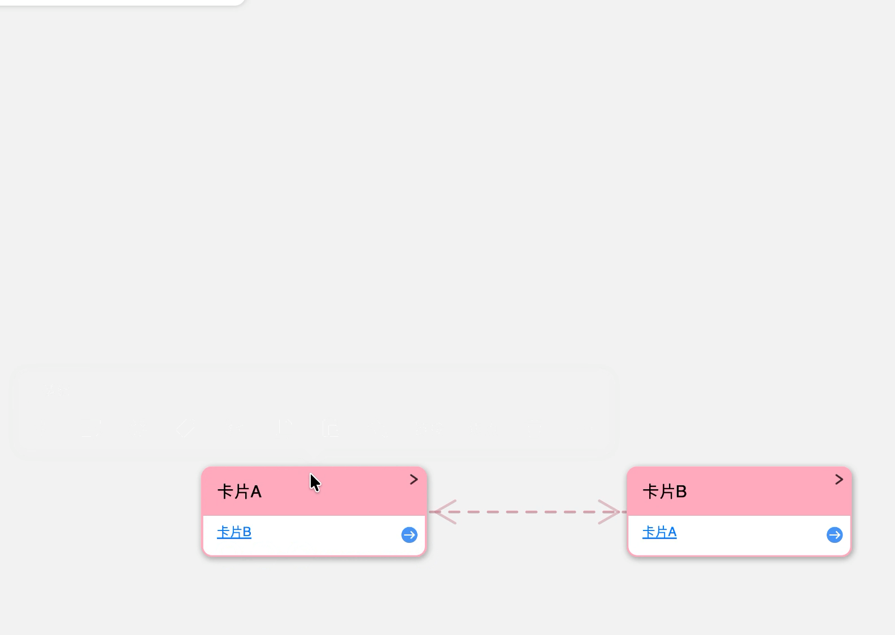

- 快捷方法：点击`链接线` → `删除`
  - 步骤：
    1. 点击链接的链接线
    2. 点击菜单栏中的`删除`，弹出弹窗后，确认删除的链接方向
       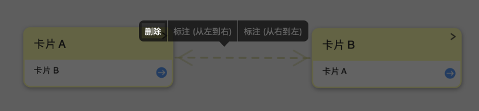
    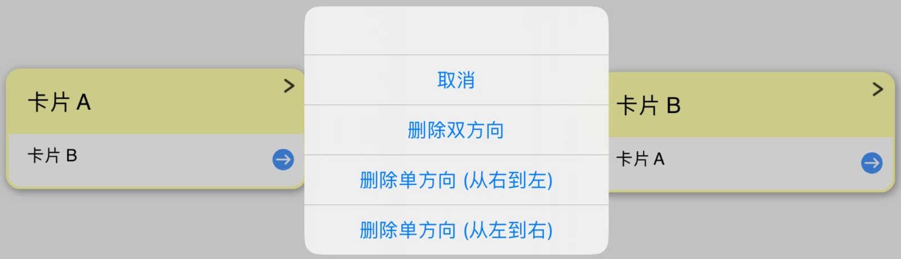
  - 效果：
    - `删除双方向`：删除卡片A 中的B链接和卡片 B 中的A链接

      
    - `删除单方向（从左到右）`：仅删除卡片A 中卡片 B的链接

      
    - `删除单方向（从右到左）`：仅删除卡片 B 中卡片 A 的链接

      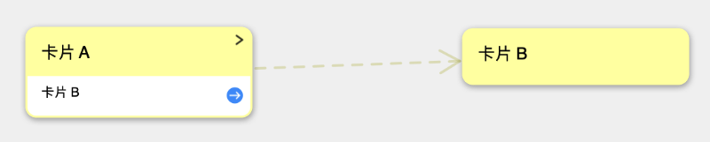

# 4 链接的高级应用

## 4.1 双向链接修改为单向链接

详见3.3 删除链接

## 4.2 生成概念图谱

- MN Network 是 MarginNote 4 专为卡片链接设计的配套插件，可实现卡片关联关系的可视化增强与高效管理。
- 插件安装步骤、使用详见：[用插件高效处理 MN工作](https://www.wolai.com/coBAV38vuTcUbTdHwnNNL5 "用插件高效处理 MN工作")

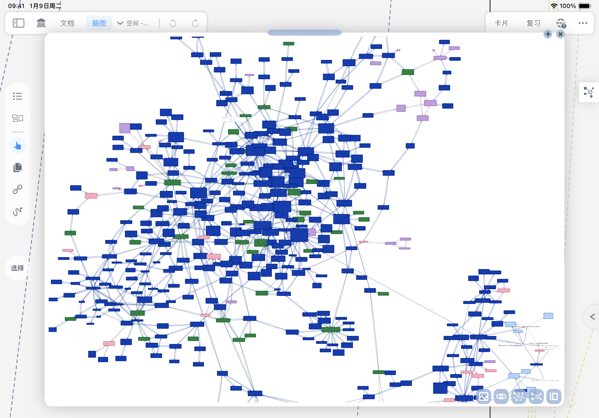

[ 【第三方MN插件】MN Network（0.1.2待签名），展示选中笔记的关系图谱 已获官方签名# - 插件发布区｜允许不受限制地编辑更新主帖 - MarginNote 中文社区 插件反馈如果你对插件有任何反馈，都可以通过以下链接：https://feliks.craft.me/feedback该链接内提供了协作链接，无需登录便可编辑文档注意MN4中所有插件都是未认证状态（即使是在MN3中已认证的插件）也可\&hellip; https://bbs.marginnote.com.cn/t/topic/44639](https://bbs.marginnote.com.cn/t/topic/44639 " 【第三方MN插件】MN Network（0.1.2待签名），展示选中笔记的关系图谱 已获官方签名# - 插件发布区｜允许不受限制地编辑更新主帖 - MarginNote 中文社区 插件反馈如果你对插件有任何反馈，都可以通过以下链接：https://feliks.craft.me/feedback该链接内提供了协作链接，无需登录便可编辑文档注意MN4中所有插件都是未认证状态（即使是在MN3中已认证的插件）也可\&hellip; https://bbs.marginnote.com.cn/t/topic/44639")

## 4.3 与脑图结合使用

脑图的上下级结构和链接结构往往是结合在一起使用。将卡片链接与脑图的层级结构结合，既保留脑图的清晰层级框架，又通过链接突破层级限制，实现跨层级、跨集合的知识关联。

