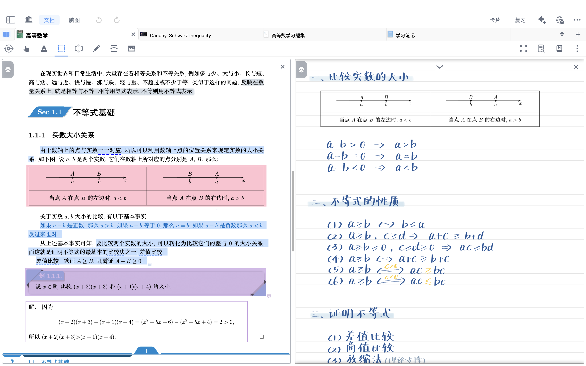
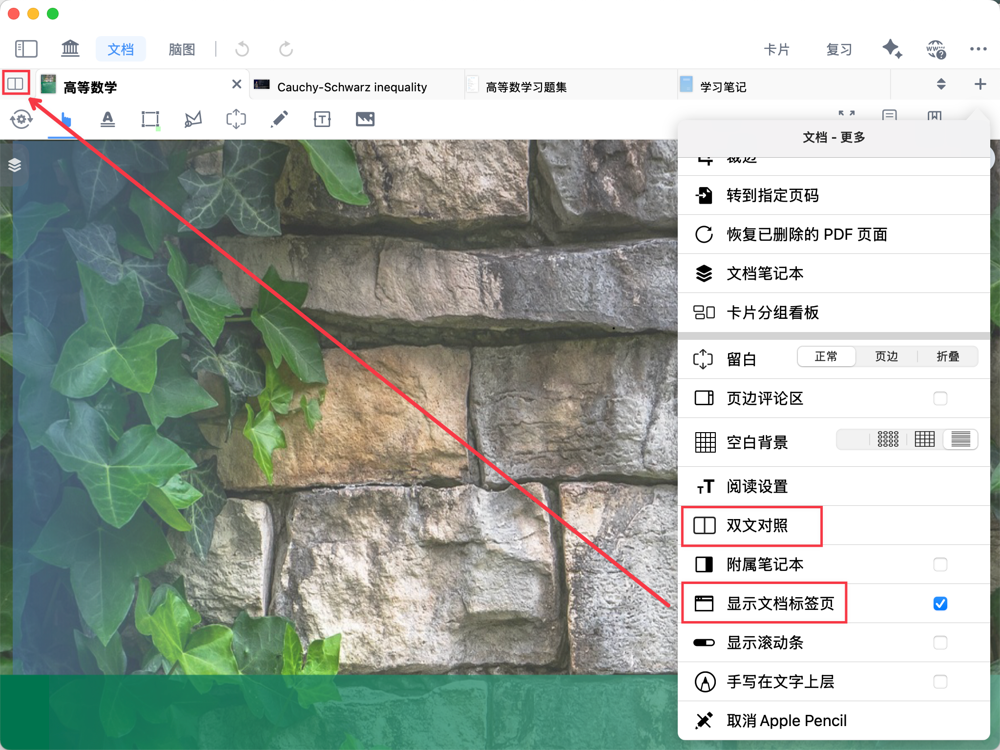
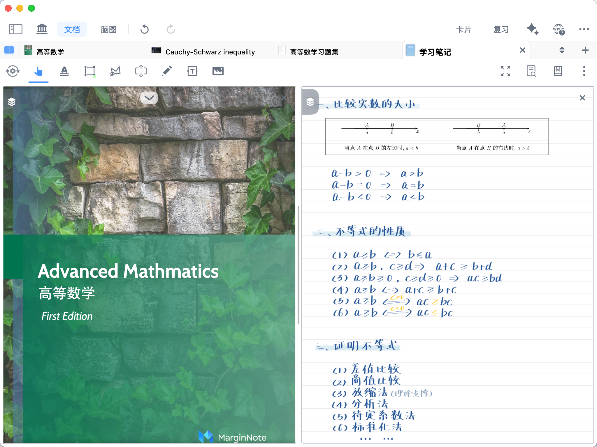
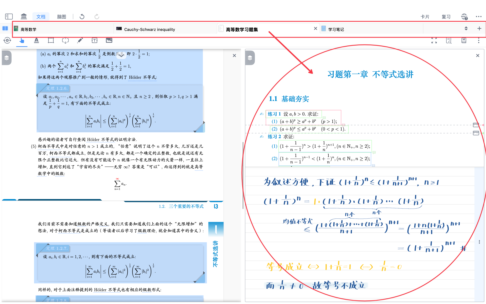
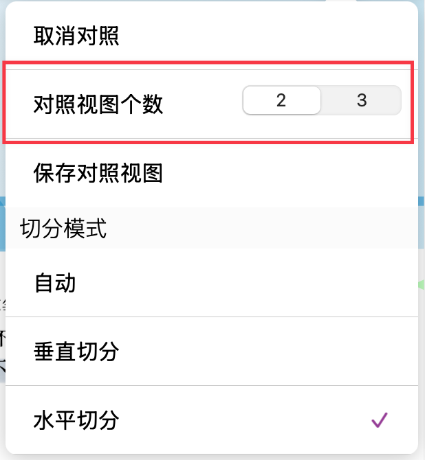
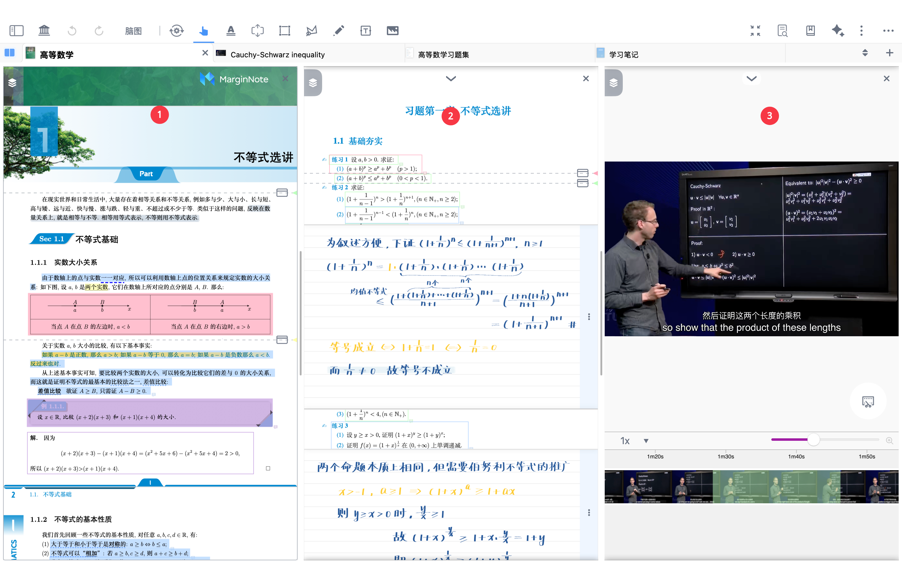
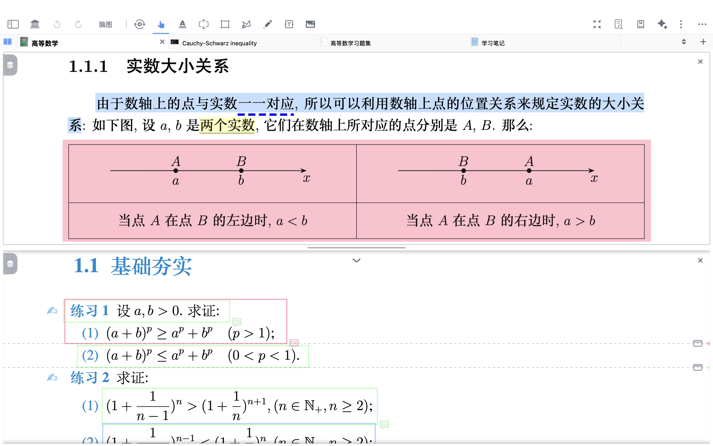
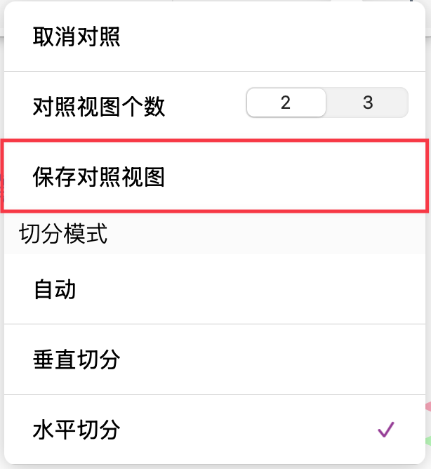
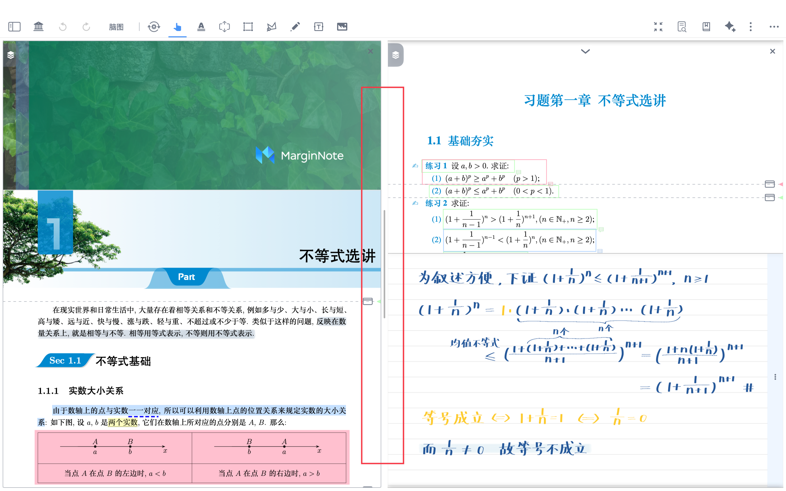
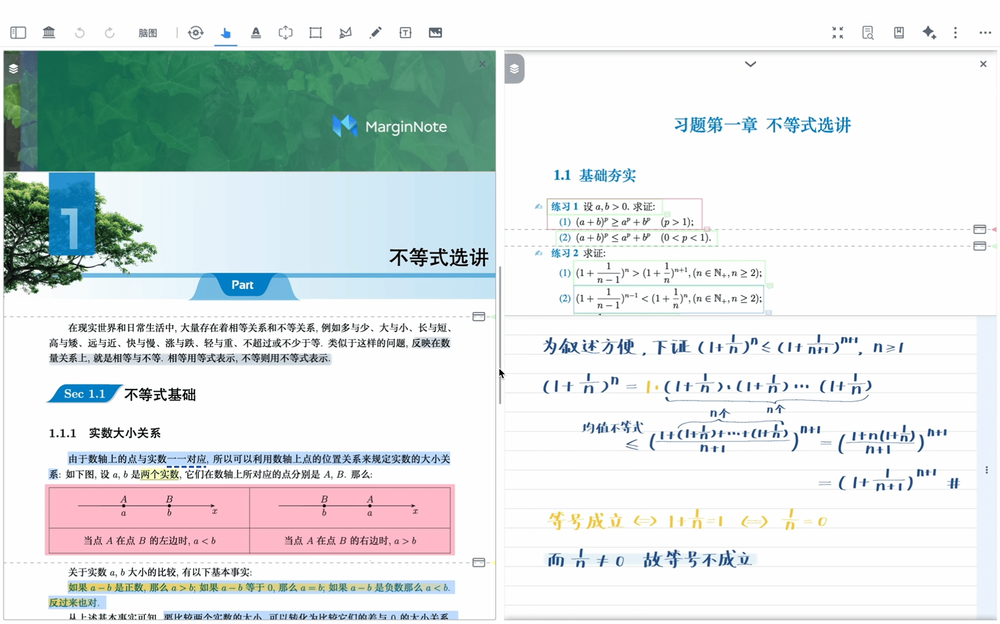

# 对照①：双文对照窗口

# 1 什么是双文对照

> 💡**双文对照——高效对照学习的新方式**：
>
> 双文对照窗口可同时打开两份资料进行对照阅读，实现真正意义上的“一心二用”。无论是教材与视频、习题册与答案册，原文与笔记、还是同一文档不同位置，都能并排呈现，轻松切换视线完成内容比对。
>
> 双栏状态可随时保存，并能通过左上角的 mini 边栏图标快速开启，帮助在复杂资料中高效定位、同步理解与整理知识。
>
> 

# **开启**`双文对照`

## 2.1 开启`双文对照`窗口

> 💡“文档”属于广义概念，包括PDF、MP4视频等资料，均可通过以下方式进行`双文对照`。

- 点击文档界面右上角`文档-更多`（竖排三点）-`双文对照`；或点击文档标签页左侧`双文对照`按钮（需开启文档标签页开关）。
- 默认沿用上次对照的文档进行对照。若当前文档是第一次开启对照，则默认将当前文档作为对照文档（同一文档双开）。

## 2.2 切换对照文档

### 2.2.1 方法一：从标签页选择文档对照

- 从文档标签页长按文档，直接拖动到对照页面形成`双文对照`（如下图所示），操作演示同：[🖼️ 图片](image/GIF_20251128100316182_b1J2zCxBcb.GIF "🖼️ 图片")
- 或点击文档顶部的`下拉列表`，从列表里选择想要对照的文档

### 2.2.2 方法二：从侧边栏选择文档对照

- 点击`边栏`按钮（如下方图标所示），选中文档拖动形成`双文对照`

  [边栏](https://www.wolai.com/i4WDdkL1bT1yWZ8vpy1fve "边栏")

> 💡从边栏拖拽，适用于需要**跨学习集**进行文档对照；

> 关于边栏的更多用法，详见[边栏快速切换与全局检索](https://www.wolai.com/4BL4PgiF2rLSyuL9AwXyP7 "边栏快速切换与全局检索")

# `3 双文对照`窗口的操作

- 已开启`双文对照`窗口状态下，有以下两种方法开启`双文对照`操作栏

  方法一：通过`文档-更多`（竖排三点）→选择`显示文档标签页`→点击最左上侧`双文对照`按钮

  方法二：通过`文档-更多`（竖排三点）→选择`双文对照`按钮

## 3.1 对照视图个数

- 通过上述两种方式开启`双文对照`操作栏

- 选择`对照视图个数`，支持两个文档/三个文档进行对照

## 3.2 切分模式

- 可根据文档内容选择自动/垂直/水平切分模式

### 3.2.1 保存对照视图

> 💡关于附属笔记本内容，详见[对照③：附属笔记本](https://www.wolai.com/3RP4xfuiFKc6SAF8r1BHfK "对照③：附属笔记本")

- 在完成`双文对照`布局后，点击`保存对照视图 `即可生成两个文档之间的绑定关系。
- 保存后，该对照视图会作为独立入口`附属笔记本`呈现，可在文档界面中直接点击并快速恢复此前的对照布局，无需重新选择或排列文档。

> ❗注意：三个对照视图的情况下无法`保存对照视图`

## 3.3 调整`双文对照`窗口比例

- 长按拖动`双文对照`窗口分割栏调整`双文对照`窗口比例

