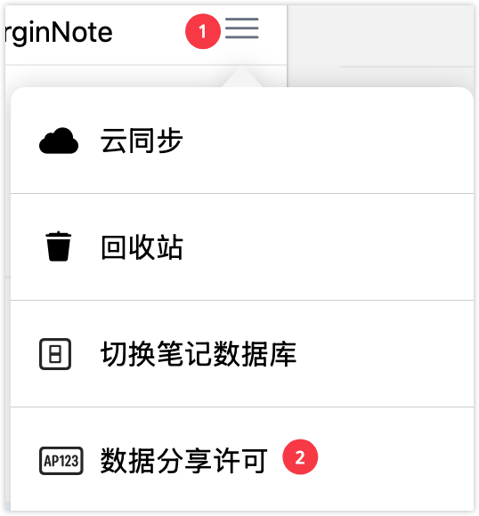
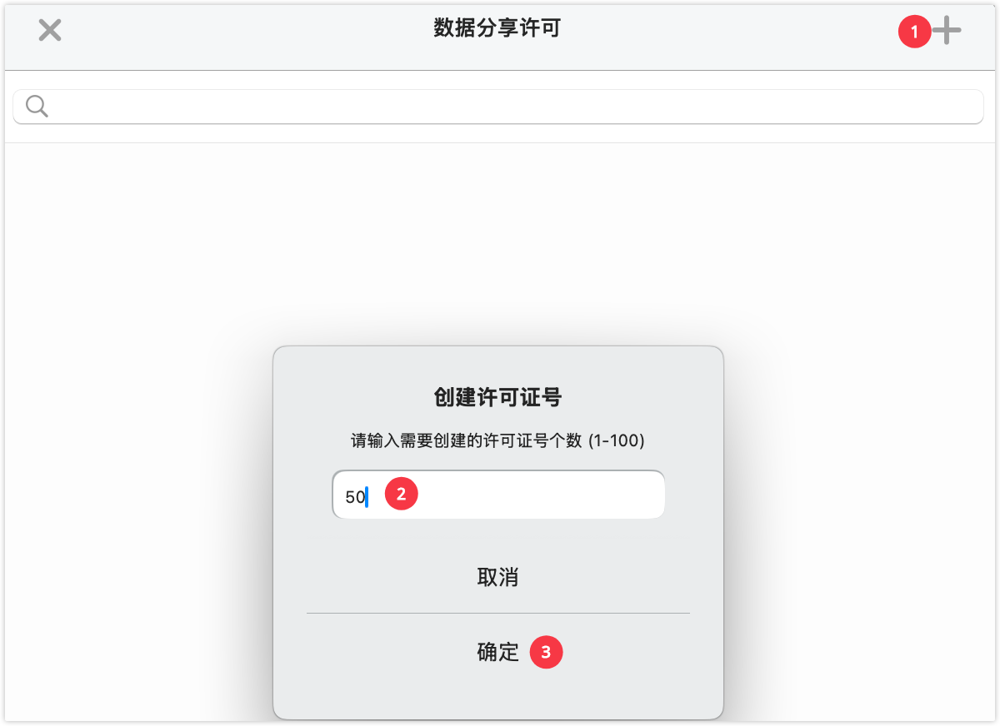
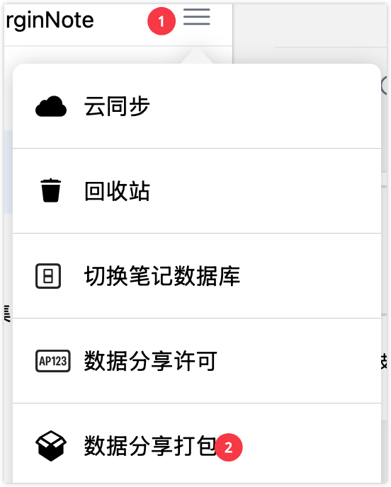
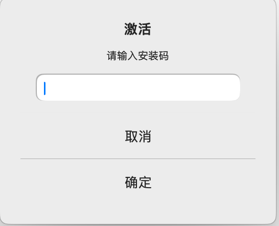
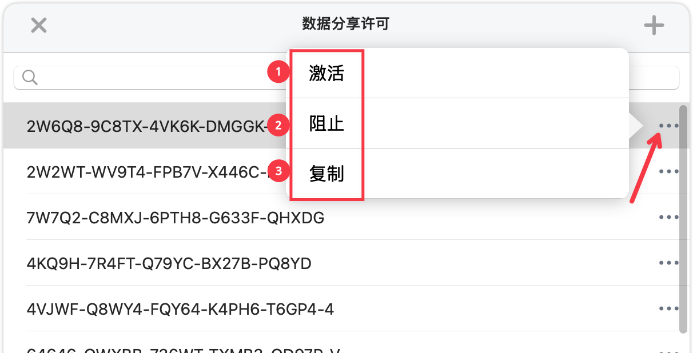

# 笔记数据库②：加密分享

📖**笔记数据库系列导航**

本系列帮助你掌握 MN4 的笔记数据库功能。

① [笔记数据库①：新建和管理数据库](https://www.wolai.com/wVmpipXpgJM4ZicKDvV6A7 "笔记数据库①：新建和管理数据库")

② 加密分享（本页）

> 💡**为什么需要加密分享**？
>
> 在以下场景中，你可能需要控制谁能访问你的笔记：
>
> - 分享付费笔记，只允许购买者访问
> - 在小范围内分享学习资料，避免传播
> - 保护你的知识产权和劳动成果
> - 精确控制每个用户的访问权限
>
> 加密数据库功能使用公私钥加密技术，让你可以安全地分享笔记，每个用户都需要你授权的许可证才能访问。

# 1 理解加密数据库和许可证系统

## 1.1 什么是加密数据库

**加密数据库**是一种特殊的笔记数据库，具有以下特点：

- 使用公私钥加密技术
- 需要许可证才能访问
- 分享者可以控制访问权限
- 可以随时阻止某个用户的访问

> 💡**类比：** 加密数据库就像带锁的保险箱，你可以复制很多钥匙（许可证）分发给他人，也可以随时更换锁芯让某把钥匙失效。

## 1.2 许可证系统的工作原理

- **许可证拥有者（你）**：创建数据库、生成许可证、控制访问权限
- **用户（接收者）**：导入数据库、输入许可证、访问笔记内容

# 2 完整的加密分享流程

## 2.1 流程概览

整个加密分享流程分为三个阶段：

**阶段一：准备工作（许可证拥有者）**

1. 创建加密数据库
2. 生成许可证

**阶段二：分享数据（许可证拥有者 → 用户）**

1. 打包数据库
2. 分享数据库文件 + 激活码给用户

**阶段三：激活使用（用户）**

1. 用户导入数据库
2. 用户输入激活码
3. 完成激活，开始使用

## 2.2 角色和操作清单

**许可证拥有者需要做：**

- ✅ 创建加密数据库（如果还没有）
- ✅ 生成足够数量的许可证
- ✅ 打包并分享数据库文件
- ✅ 将激活码发送给用户
- ✅ （离线激活时）为用户生成离线激活码

**接收数据库的用户需要做：**

- ✅ 接收并导入数据库文件
- ✅ 输入激活码
- ✅ （仅离线激活时）将安装码发送给许可证拥有者
- ✅ （仅离线激活时）输入离线激活码

***

# 3 创建和分享加密数据库

## 3.1 创建许可证

**操作步骤：**

1. 在首页打开**侧边栏**，点击**菜单按钮**
2. 点击 **`数据分享许可`**
3. 点击右上角 **`➕`** 按钮
4. 输入需要的许可证数量（最多 100 个）
5. 点击确认

> 💡**提示：** 创建许可证后，每个许可证都会生成一个唯一的激活码。

> ⚠️**注意：** 一个许可证只能授权一个用户。如果需要授权 10 个用户，需要创建 10 个许可证。

## 3.2 打包数据库

**操作步骤：**

1. 在首页打开**侧边栏**，点击**菜单按钮**
2. 点击 **`数据分享打包`**
3. 打包完成后，点击 **`用其他应用打开`**
4. 选择分享方式（微信、邮件、网盘等）或保存到本地

> ⚠️**重要说明：**
>
> - 打包的文件包含整个加密数据库
> - 接收方导入后仍然需要激活码才能访问
> - 接收到的加密数据库默认不支持云同步（保护隐私）

## 3.3 分享给用户

**需要发送给用户的内容：**

1. **数据库文件**（通过[ 3.2 ](https://www.wolai.com/oVbmHKiwfNETVYEapEWctk#9wY3F3LnevLFmBFLyGh3CJ " 3.2 ")打包的文件）
2. **激活码**（从许可证列表中复制）

# 4 激活许可证

## 4.1 两种激活方式对比

| 激活方式      | 条件    | 优点                           | 缺点                 | 推荐度        |
| --------- | ----- | ---------------------------- | ------------------ | ---------- |
| **在线激活**​ | 用户需联网 | \\- 操作简单 \\- 即时激活 \\- 无需额外沟通 | 必须联网               | ⭐⭐⭐⭐⭐ 强烈推荐 |
| **离线激活**​ | 用户离线  | 可离线使用                        | \\- 操作复杂 \\- 需多次沟通 | ⭐仅特殊情况     |

> 💡**推荐：** 除非用户确实无法联网，否则强烈推荐使用在线激活。

## 4.2  在线激活（推荐）

### 4.2.1 接收数据库的用户操作步骤

> ⚠️**前提条件：** 用户设备已联网

1. 接收许可证拥有者分享的数据库文件
2. 导入数据库文件到 MarginNote 4
   - iPad端：使用"文件"app 打开数据库文件，选择"用 MarginNote 4 打开"
   - Mac端：双击数据库文件，或拖拽到 MarginNote 4
3. 导入时会弹出提示：**`该数据需授权才能使用`**
4. 输入许可证拥有者提供的**激活码**
5. 点击 **`激活`** 按钮，系统自动验证，激活成功

✅ **激活成功后：**

- 可以正常访问笔记数据库的所有内容
- 可以进行学习、复习等操作
- 无法云同步、导出数据库（保护隐私）

## 4.3 离线激活（仅特殊情况）

> ⚠️ **注意：** 离线激活流程较为复杂，涉及用户和许可证拥有者的多次交互。**仅在用户确实无法联网时使用**。

### 4.3.1 接收数据库的用户操作步骤

1. 接收并导入数据库文件
   - iPad端：使用"文件"app 打开数据库文件，选择"用 MarginNote 4 打开"
   - Mac端：双击数据库文件，或拖拽到 MarginNote 4
2. 导入时弹出：**`该数据需授权才能使用`**
3. 输入许可证拥有者提供的**激活码**
4. 因离线状态，弹出提示：**`需要许可证拥有者激活`**
5. 记录或截图弹窗中显示的**安装码**（一串数字/字符）
6. 将**安装码**发送给许可证拥有者
7. 等待许可证拥有者返回**离线激活码**
8. 在离线激活页面输入**离线激活码**
9. 点击确认，完成激活

### 4.3.2 许可证拥有者操作步骤

> 💡**前提条件：** 已为用户创建许可证并告知激活码

1. 在首页打开**侧边栏**，点击**菜单按钮**
2. 点击 **`数据分享许可`**，进入许可证管理页面
3. 找到对应的许可证，点击 **`激活`** 按钮
4. 在弹出页面输入用户发送的**安装码**
5. 点击 **`确定`**，系统生成**离线激活码**
6. 复制**离线激活码**并发送给用户，**用户**在[🖼️ 图片](<image/截屏 2026-01-06 下午9.30.23_JEuI0JFgFf.png> "🖼️ 图片")可以完成离线激活。

> 💡**提示：** 一个安装码对应一个离线激活码，不同用户的安装码不同。

# 5 管理和控制许可证

## 5.1 许可证操作

对于每个许可证，你可以执行以下操作：

| 功能           | 操作                   | 用途 / 效果                    | 使用场景                                      |
| ------------ | -------------------- | -------------------------- | ----------------------------------------- |
| **激活（离线）** ​ | 点击 \*\*\`激活\`\*\* 按钮 | 为离线用户生成离线激活码               | 用户无法联网，需要离线激活（详见4.3）                      |
| **阻止访问**​    | 点击 \*\*\`阻止\`\*\* 按钮 | 用户将无法继续访问数据库 用户端提示“许可证已失效” | 用户违反使用协议 用户退款或终止订阅 发现许可证被盗用 需要限制某个用户的访问权限 |
| **复制激活码**​   | 点击 \*\*\`复制\`\*\* 按钮 | 将激活码复制到剪贴板，发送给用户           | 为新用户提供激活码                                 |

## 5.2 许可证数量管理

**如何知道还有多少可用许可证？**

在许可证管理页面可以看到：

- 总共创建的许可证数量
- 已激活的许可证数量
- 未使用的许可证数量

**许可证用完了怎么办？**

1. 点击右上角 **`➕`** 按钮
2. 输入需要新增的许可证数量，点击确认

> ⚠️**限制：** 单次最多创建 100 个许可证。如需更多，可以多次创建。

# 6 常见问题

**Q1：加密数据库和普通数据库有什么区别？**

A：主要区别在于访问控制：

- 普通数据库：任何人都可以访问分享的数据
- 加密数据库：需要许可证才能访问

创建方式完全相同，差别在于是否启用许可证系统。

**Q2：一个许可证可以给多个人用吗？**

A：不建议。一个许可证理论上可以生成多个离线激活码，但这会导致无法准确控制访问权限。建议一个用户对应一个许可证。

**Q3：用户激活后可以再分享给别人吗？**

A：不可以。激活后的数据库绑定到用户设备，用户导出的数据无法被其他人再次导入使用。

**Q4：如何收回已发出的激活码？**

A：无法收回激活码本身，但可以"阻止"对应的许可证，使激活码失效。

**Q5：用户换设备了怎么办？**

A：需要重新激活。用户在新设备上导入数据库，使用相同的激活码即可（在线激活），或者你为新设备生成新的离线激活码。

**Q6：忘记给哪个用户发了哪个激活码怎么办？**

A：建议在分发激活码时做好记录，比如在备忘录中记录"用户A - 激活码XXX - 2026-01-13"。许可证管理页面无法查看用户信息。

**Q7：可以设置许可证过期时间吗？**

A：目前不支持自动过期。如需限制使用时间，需要手动在到期后"阻止"许可证。

**Q8：阻止许可证后可以恢复吗？**

A：可以。阻止后在对应许可证右侧的`...`里选择`取消阻止`

**Q9：离线激活生成的离线激活码可以重复使用吗？**

A：不可以。每个离线激活码只能使用一次，且绑定到特定设备（安装码）。

**Q10：如何统计有多少人在使用我的数据库？**

A：查看许可证管理页面中"已激活"的许可证数量即可。
